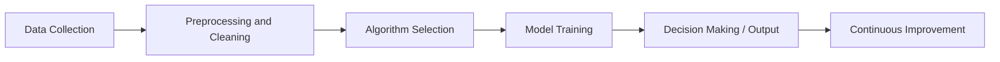

# Artificial Intelligence (AI) - Notes

## Table of Contents

- Introduction
- Key Concepts
- Applications
- [AI Leading Companies](#ai-leading-companies)
- Architecture Pipeline
- Description
- Framework / Key Theories or Models
- How Artificial Intelligence Works
- Methods, Types & Variations
- Self-Practice / Hands-On Examples
- Pitfalls & Challenges
- Feedback & Evaluation
- Tools, Libraries & Frameworks
- Hello World! (Practical Example)
- [Weak (Narrow) vs Strong AI](#weak-narrow-vs-strong-ai)
- [Artificial General Intelligence (AGI)](#artificial-general-intelligence-agi)
- Advanced Exploration
- Zero to Hero Lab Projects
- [How to Build AI from Zero to Hero](#how-to-build-ai-from-zero-to-hero)
- Continuous Learning Strategy
- References

## Introduction
- **Artificial Intelligence (AI)** refers to machines and systems that simulate human intelligence to perform tasks such as reasoning, learning, and problem-solving.

### Key Concepts
- **Narrow AI**: AI systems designed to perform a specific task (e.g., speech recognition, recommendation systems).
- **General AI**: Hypothetical AI with the ability to understand and perform any intellectual task that a human can.
- **Machine Learning (ML)**: A subset of AI where systems learn from data to improve their performance without explicit programming.
- **Deep Learning (DL)**: A subset of ML that uses neural networks with many layers to model complex patterns in data.
- **Common Misconception**: AI is not always about robots—it’s a much broader field that includes natural language processing (NLP), decision-making, and more.

### Applications
- **Healthcare**: AI is used for diagnosing diseases, personalized medicine, and drug discovery.
- **Transportation**: Autonomous vehicles rely on AI for real-time decision-making and navigation.
- **Finance**: AI powers fraud detection systems, algorithmic trading, and customer service chatbots.
- **Education**: AI enables personalized learning experiences through adaptive tutoring systems.
- **Entertainment**: AI drives recommendation systems on platforms like Netflix, YouTube, and Spotify.
- **Robotics**: General Purpose Humanoid Robots
- **Games**: strategic game systems (such as chess and Go).
- Advanced web search engines (Google, Bing..), 
- Recommendation systems (used by YouTube, Amazon and Netflix), 
- Understanding human speech (such as Siri and Alexa), 
- Computer Vision: Image generation & synthesis ...
- ...

### AI Leading Companies

- OpenAI
- DeepMind
- Google
- MS
- Meta
- NVIDIA
- AMD
- Intel
- ...

## Architecture Pipeline


### Description

- **Data Collection**: AI systems rely on vast amounts of data to learn.
- **Preprocessing**: Cleaning, organizing, and preparing the data for analysis.
- **Algorithm Selection**: Choosing the right algorithm (e.g., neural networks, decision trees) based on the task.
- **Model Training**: Teaching the AI system using historical data to recognize patterns and make predictions.
- **Decision Making**: AI models generate insights, decisions, or predictions based on new inputs.
- **Continuous Improvement**: AI systems learn and adapt from feedback or new data.


## Framework / Key Theories or Models
- **Turing Test**: A measure of a machine's ability to exhibit intelligent behavior equivalent to or indistinguishable from a human.
- **Neural Networks**: Models that mimic the human brain to recognize patterns and solve problems in complex datasets.
- **Reinforcement Learning**: A model where agents learn through rewards and penalties in an environment (e.g., AlphaGo).
- **Natural Language Processing (NLP)**: Enables machines to understand, interpret, and respond to human language (e.g., GPT models).
- **Historical Framework**: Early AI focused on rule-based systems, evolving into more data-driven approaches like machine learning and deep learning.

## How Artificial Intelligence Works
- **Step 1**: Data is gathered, labeled, and preprocessed.
- **Step 2**: An AI algorithm (e.g., neural networks, decision trees) is selected based on the nature of the task (e.g., image recognition, NLP).
- **Step 3**: The algorithm is trained by feeding it data and adjusting parameters to reduce errors.
- **Step 4**: The trained model is deployed to make decisions or predictions based on new data.
- **Step 5**: The system continues learning from new inputs, feedback, and experiences to improve accuracy.

## Methods, Types & Variations
- **Rule-based AI**: Early AI systems that rely on predefined rules for decision-making.
- **Machine Learning**: AI models that learn from data rather than being explicitly programmed.
- **Deep Learning**: AI models using deep neural networks to understand complex patterns in data.
- **Reinforcement Learning**: AI agents learn by interacting with environments and receiving rewards.
- **Contrasting Example**: Rule-based systems use fixed instructions, while machine learning models adapt and improve over time.

## Weak (Narrow) vs Strong AI 

- [Research Work - Strong AI - 2016](https://github.com/afondiel/computer-science-notebook/blob/master/ai/docs/strong-ai-technical-presentation-ensea-2016/strong-ai-research-work-afonso-diela-full-ensea-2016-FR.pdf)

## Artificial General Intelligence (AGI)

General topic: check out the [AGI note](./agi-notes/agi-notes.md)

- [@OpenAI Planning for AGI and beyond](https://openai.com/blog/planning-for-agi-and-beyond)
- [@DeepMind AGI](http://deepmindagi.com/)
  - [@DeepMind Vision on AGI](https://deepmind.google/about/)
- [Richard Feynman on Artificial General Intelligence](https://www.cantorsparadise.com/richard-feynman-on-artificial-general-intelligence-2c1b9d8aae31)


## Embodied-AI Agents

Some Embodied-AI for General-Purpose-Humanoid-Robots:

- 1X: NEO
- Figure: 01,
- Tesla: Optimus,
- SanctuaryAI: Phoenix,
- BostonDynamics: Atlas.

Some Embodied-AI for Autonomous Vehicles

- [Wayve Driver](https://wayve.ai/technology/wayve-ai-driver/)

Embodied AI Workshop - CVPR 2023: 
- [embodied-ai.org](https://embodied-ai.org/) 


## Self-Practice / Hands-On Examples
1. **Create a chatbot** using natural language processing libraries like NLTK or spaCy.
2. **Build an image classifier** using TensorFlow or PyTorch to classify images from a dataset (e.g., CIFAR-10).
3. **Train a reinforcement learning agent** in OpenAI Gym to play a simple game like CartPole.
4. **Develop a recommendation system** using collaborative filtering on user data (e.g., movie recommendations).
5. **Explore AI ethics** by analyzing the biases in different AI models and algorithms.

## Pitfalls & Challenges
- **Data Quality**: AI models are only as good as the data they’re trained on; poor-quality data leads to inaccurate predictions.
- **Bias**: AI models can inherit biases from their training data, leading to unfair or discriminatory outcomes.
- **Interpretability**: Complex AI models, especially deep learning, can be difficult to interpret or explain.
- **Suggestion**: Use explainable AI techniques and ensure diverse and balanced training datasets to reduce bias.


## Tools, Libraries & Frameworks
- **TensorFlow**: An open-source platform for machine learning and deep learning.
- **PyTorch**: A deep learning framework popular for research and experimentation.
- **Keras**: A high-level API for building and training deep learning models, built on top of TensorFlow.
- **OpenAI Gym**: A toolkit for developing and comparing reinforcement learning algorithms.
- **Pros & Cons**: TensorFlow is highly scalable but has a steep learning curve; PyTorch is more user-friendly for experimentation but may not scale as well in production.


## Hello World! (Practical Example)

This code defines a simple feedforward neural network using TensorFlow and Keras to classify images (e.g., MNIST dataset).

```python
import tensorflow as tf
from tensorflow.keras.models import Sequential
from tensorflow.keras.layers import Dense

# Create a simple neural network model
model = Sequential()
model.add(Dense(32, input_shape=(784,), activation='relu'))
model.add(Dense(10, activation='softmax'))

# Compile the model
model.compile(optimizer='adam', loss='categorical_crossentropy', metrics=['accuracy'])

# Summary of the model
model.summary()
```

## Feedback & Evaluation
1. **Feynman Test**: Explain how neural networks work to a beginner using simple, non-technical language.
2. **Peer Review**: Share your AI model results with a colleague for feedback on potential biases or performance issues.
3. **Real-world Simulation**: Test your AI model in a simulated environment (e.g., a chatbot interacting with live users).

## Advanced Exploration
- **Research Paper**: "Playing Atari with Deep Reinforcement Learning" – explores how deep learning can be combined with reinforcement learning.
- **Video**: "Artificial Intelligence and the Future" by MIT – a lecture on the broader impacts of AI on society.
- **Article**: "Explainable AI: Interpreting and Explaining Black-Box Models" – a deep dive into techniques for understanding AI decision-making.

## Zero to Hero Lab Projects
- **Beginner**: Build a simple spam filter using logistic regression to classify emails as spam or not spam.
- **Intermediate**: Develop a face recognition system using deep learning and OpenCV.
- **Advanced**: Create a reinforcement learning agent that learns to solve complex environments in OpenAI Gym (e.g., robotic tasks).
- [Build Artificial Intelligence from A to Z using reinforcement learning](https://github.com/afondiel/AI-a-Z-Learn-How-To-Build-An-AI-certificate-Udemy)

## Continuous Learning Strategy
- Explore **ethics in AI** to understand the social implications of AI technologies.
- Study **transfer learning** to leverage pre-trained models for your own tasks.
- Dive into **natural language processing (NLP)** and learn how AI models like GPT-4 generate human-like text.


## References

Wikipedia resources
  - [What's AI ?](https://en.wikipedia.org/wiki/Artificial_intelligence)
  - [Category](https://en.wikipedia.org/wiki/Category:Artificial_intelligence)
  - [path finding](https://en.wikipedia.org/wiki/Pathfinding)
  - [odemetry](https://en.wikipedia.org/wiki/Odometry)
  - [Turing machine](https://en.wikipedia.org/wiki/Turing_machine)

Cognitive Science Tree Wikipedia
  - https://en.wikipedia.org/wiki/Cognitive_science
  - https://en.wikipedia.org/wiki/Artificial_intelligence
  - https://en.wikipedia.org/wiki/Cognitive_psychology#Neisser
  - https://en.wikipedia.org/wiki/Philosophy
  - https://en.wikipedia.org/wiki/Linguistics
  - https://en.wikipedia.org/wiki/Anthropology
  - https://en.wikipedia.org/wiki/Neuroscience
  
Neural Nets
  - https://en.wikipedia.org/wiki/Brain
  - https://en.wikipedia.org/wiki/Neuron
  - https://en.wikipedia.org/wiki/Machine_learning
  - https://en.wikipedia.org/wiki/Deep_learning
  - https://en.wikipedia.org/wiki/Neural_network

Maths:
- [Stochastic process](https://en.wikipedia.org/wiki/Stochastic_process)
- [Quantum computing](https://en.wikipedia.org/wiki/Quantum_computing)


Research Notes
- [Machine Learning](https://github.com/afondiel/computer-science-notebook/tree/master/datascience-notes/ml-notes)
- [Neural Network](https://github.com/afondiel/computer-science-notebook/tree/master/datascience-notes/deep-learning-notes)
- [NLP](https://github.com/afondiel/computer-science-notebook/tree/master/datascience-notes/nlp-notes)
- [Computer Vision ](https://github.com/afondiel/computer-science-notebook/tree/master/computer-vision-notes)
- [robotics](https://github.com/afondiel/computer-science-notebook/tree/master/robotics)

Projects : 
- https://github.com/afondiel/my-lab/tree/master/projects/ai 
- https://github.com/afondiel/my-lab/tree/master/projects


Games: 
  - https://en.wikipedia.org/wiki/Chess
  - https://en.wikipedia.org/wiki/Go_(game)
  - https://en.wikipedia.org/wiki/Xiangqi
  - ayo-olopon : https://scorum.com/en-us/other/@jotmax/ayo-olopon-the-game-of-the-intellectual-an-african-board-game

Mythology : 
  - https://en.wikipedia.org/wiki/Egyptian_mythology
  - https://en.wikipedia.org/wiki/Roman_mythology

Lectures & Tutorial & Online Free Courses:

  - [UC Berkeley - CS188 Intro to AI -- Course Materials](http://ai.berkeley.edu/lecture_slides.html) 
  - [Stanford CS221 - Overview Artificial Intelligence Course | Stanford CS221: Learn AI (Autumn 2019)](https://www.youtube.com/watch?v=J8Eh7RqggsU&list=PLoROMvodv4rO1NB9TD4iUZ3qghGEGtqNX)

  - [AI Esssentials - IBM youtube videos](https://www.youtube.com/watch?v=9gGnTQTYNaE&list=PLOspHqNVtKADfxkuDuHduUkDExBpEt3DF)

Great AI Blog: [Jürgen Schmidhuber's AI Blog](https://people.idsia.ch/~juergen/blog.html) 

- Online Courses: 
	- Code Spaces: https://www.codespaces.com/best-artificial-intelligence-courses-certifications.html

	- Geektonight: https://www.geektonight.com/best-artificial-intelligence-courses/
	- Javin Paul medium article : https://medium.com/javarevisited/10-best-coursera-certifications-courses-for-machine-learning-and-artificial-intelligence-256d9a125822
 
My research on strong AI (AGI) survey from 1st grade of engineering degree @ [ENSEA](https://www.ensea.fr/en) - 2016: 
  - [Strong AI (AGI) survey  - ENSEA 2016](https://github.com/afondiel/computer-science-notebook/blob/master/ai/doc/strong-ai-technical-presentation-ensea-2016/strong-ai-research-work-afonso-diela-full-ensea-2016-FR.pdf) 

Books
- [FREE AI BOOKs](https://github.com/afondiel/cs-books/tree/main/ai)

Papers
- [Research Papers](./research-papers/)
- "Mastering Chess and Shogi by Self-Play with a General Reinforcement Learning Algorithm" by DeepMind (AlphaZero paper).
