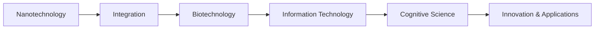

# NBIC (Nanotechnology, Biotechnology, Information technology, and Cognitive Science) - Notes

## Table of Contents (ToC)
  - [Introduction](#introduction)
  - [Key Concepts](#key-concepts)
  - [Why It Matters / Relevance](#why-it-matters--relevance)
  - [Learning Map (Architecture Pipeline)](#learning-map-architecture-pipeline)
  - [Framework / Key Theories or Models](#framework--key-theories-or-models)
  - [How NBIC Works](#how-nbic-works)
  - [Methods, Types \& Variations](#methods-types--variations)
  - [Self-Practice / Hands-On Examples](#self-practice--hands-on-examples)
  - [Pitfalls \& Challenges](#pitfalls--challenges)
  - [Feedback \& Evaluation](#feedback--evaluation)
  - [Tools, Libraries \& Frameworks](#tools-libraries--frameworks)
  - [Hello World! (Practical Example)](#hello-world-practical-example)
  - [Advanced Exploration](#advanced-exploration)
  - [Zero to Hero Lab Projects](#zero-to-hero-lab-projects)
  - [Continuous Learning Strategy](#continuous-learning-strategy)
  - [References](#references)

## Introduction
- **NBIC** is the convergence of four rapidly advancing fields—**Nanotechnology**, **Biotechnology**, **Information technology**, and **Cognitive science**—to drive innovations in science, engineering, and medicine.

## Key Concepts
- **Nanotechnology**: Manipulating matter at the atomic or molecular scale for advanced materials, electronics, or medicine.
- **Biotechnology**: Using biological systems or living organisms to develop products or solutions, including genetic engineering, bioinformatics, and medical technologies.
- **Information Technology (IT)**: Leveraging computing and data-driven technologies to store, process, and transmit information.
- **Cognitive Science**: The interdisciplinary study of mind and intelligence, including psychology, neuroscience, and artificial intelligence.
- **Feynman Principle**: Imagine NBIC convergence as combining advanced tools from multiple fields to create powerful new solutions, like integrating nanotechnology and biotech for precision medicine.
- **Misconception**: Some believe NBIC is only theoretical, but it's already driving advancements in fields like AI, personalized medicine, and material science.

## Why It Matters / Relevance
- **Medical Innovation**: NBIC convergence can lead to personalized treatments using nanomedicine and bioinformatics.
- **Human Enhancement**: The combination of cognitive science, IT, and biotech could enable human augmentation through brain-computer interfaces or gene editing.
- **Sustainable Technology**: Nanotechnology and biotech can produce more efficient, eco-friendly materials and energy solutions.
- **Importance**: Mastering NBIC concepts is crucial for innovating in areas like healthcare, AI, sustainable technology, and human cognition.

## Learning Map (Architecture Pipeline)

- The pipeline starts with developments in nanotechnology and biotechnology, followed by integration with information technology and cognitive science to create cutting-edge innovations.

## Framework / Key Theories or Models
- **Molecular Nanotechnology**: Design and creation of molecular structures with atomic precision, enabling developments in fields like drug delivery and materials science.
- **CRISPR/Cas9**: A biotechnology tool for precise gene editing, potentially revolutionizing medicine and agriculture.
- **Artificial Intelligence**: Cognitive and IT integration, applying machine learning to biology and cognitive processes.
- **Historical Context**: The convergence of NBIC was first introduced in the early 2000s, emphasizing the synergistic potential of these fields to transform society.

## How NBIC Works
- **Step 1**: Nanotechnology creates materials or devices that interface with biological systems (e.g., nanomedicine).
- **Step 2**: Biotechnology applies these devices to manipulate biological processes (e.g., targeted drug delivery).
- **Step 3**: Information technology processes biological data (e.g., bioinformatics), optimizing applications.
- **Step 4**: Cognitive science helps interpret the data or improve the human-machine interaction through AI or brain-computer interfaces.

## Methods, Types & Variations
- **Nanomedicine**: The application of nanotechnology for diagnosing or treating diseases, including drug delivery systems.
- **Brain-Computer Interface (BCI)**: Combines cognitive science and IT to create direct communication between the brain and external devices.
- **Contrasting Example**: Nanotechnology focuses on material manipulation, while cognitive science explores thought processes; NBIC brings them together, using nanotech to enhance cognitive performance.

## Self-Practice / Hands-On Examples
1. **Exercise 1**: Research a case study of nanotechnology in medicine (e.g., nanoparticles for cancer treatment) and summarize the key technologies used.
2. **Exercise 2**: Explore a cognitive science application that integrates IT, such as a brain-computer interface, and break down its components.

## Pitfalls & Challenges
- **Ethical Concerns**: Genetic engineering and human augmentation raise questions about the ethical limits of altering biological and cognitive systems.
- **Integration Complexity**: Combining knowledge across disciplines like nanotech, biotech, and cognitive science can be technically demanding.
- **Suggestions**: Address ethical concerns through regulatory frameworks. Encourage interdisciplinary education and collaboration for smoother integration.

## Feedback & Evaluation
- **Self-explanation test**: Explain how nanotechnology enhances biotechnology and provide a real-world example (e.g., nanodrugs).
- **Peer Review**: Share a research topic on NBIC (e.g., human enhancement through BCIs) and ask peers for feedback on ethical implications.
- **Real-world Simulation**: Simulate a system where AI is used to analyze biological data from a cognitive or neurological study.

## Tools, Libraries & Frameworks
- **Nanotechnology Tools**: Scanning Electron Microscopes (SEMs) and Atomic Force Microscopes (AFMs) for studying nanomaterials.
- **Bioinformatics Libraries**: Tools like Bioconductor and PyBio for processing biological data.
- **AI Frameworks**: TensorFlow or PyTorch for building AI models to interpret cognitive science data.
- **Pros and Cons**: Nanotech tools offer precision but are costly; bioinformatics libraries allow data analysis but require expertise in biology.

## Hello World! (Practical Example)
Here’s an example where **nanotechnology** meets **biotechnology** for medical purposes:
- **Task**: Design a nanoparticle system to deliver drugs to specific cancer cells.
- **Steps**:
  - Use nanotechnology to create a nanoparticle capable of binding to cancerous cells.
  - Apply biotechnology techniques to test the effectiveness in living tissues.
  - Use AI models to analyze bioinformatics data on the drug's impact.
  
## Advanced Exploration
- **Papers**: "NBIC Convergence: Shaping the Future of Innovation" explores futuristic applications of NBIC in human augmentation and AI.
- **Videos**: TED Talks on **Cognitive Augmentation** through brain-computer interfaces.
- **Articles**: Overview of cutting-edge nanomedicine and its potential to revolutionize healthcare.

## Zero to Hero Lab Projects
- **Beginner**: Research and write a short report on a recent application of nanotechnology in medicine.
- **Intermediate**: Develop a small bioinformatics pipeline using Python libraries to analyze genetic data.
- **Expert**: Build a simple brain-computer interface (BCI) model using EEG data and an AI framework.

## Continuous Learning Strategy
- **Nanotechnology**: Study advanced materials and molecular assembly.
- **Biotechnology**: Deepen your understanding of genetic engineering techniques like CRISPR.
- **Information Technology & AI**: Explore applications of machine learning in biological data analysis.
- **Cognitive Science**: Dive into neuroscience and the development of brain-machine interfaces.

## References
- "NBIC Convergence: A Strategic Report" – A comprehensive report on how these fields interconnect.
- "Nanotechnology in Medicine" (Research Paper).
- Bioinformatics for Beginners – A guide to processing biological data with IT tools.

