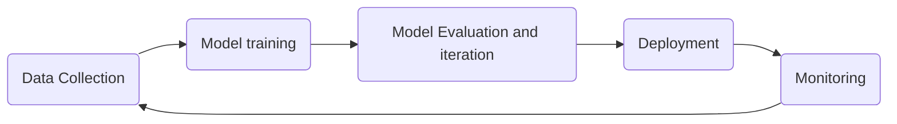
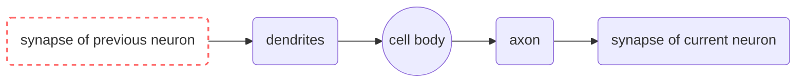

# Deep Learning (DL) -  Notes

## Table of Contents
  - [Overview](#overview)
  - [Introduction](#introduction)
    - [What's Deep Learning?](#whats-deep-learning)
    - [Key Concepts and Terminology](#key-concepts-and-terminology)
    - [Applications](#applications)
  - [Fundamentals](#fundamentals)
    - [Deep Learning Architecture Pipeline](#deep-learning-architecture-pipeline)
    - [How Deep Learning works?](#how-deep-learning-works)
    - [Some hands-on examples](#some-hands-on-examples)
    - [What's Artificial Neural Networks (Neural Nets)?](#whats-artificial-neural-networks-neural-nets)
      - [Biological Neuron vs Artificial Neuron](#biological-neuron-vs-artificial-neuron)
    - [The perceptron (A Linear Unit)](#the-perceptron-a-linear-unit)
    - [Deep Neural Nets](#deep-neural-nets)
    - [Deep learning algorithms/model](#deep-learning-algorithmsmodel)
    - [Model Evaluation](#model-evaluation)
    - [DL Model Fine-tuning](#dl-model-fine-tuning)
  - [Tools \& Frameworks](#tools--frameworks)
  - [Hello World!](#hello-world)
    - [PyTorch Version:](#pytorch-version)
    - [TensorFlow Version:](#tensorflow-version)
    - [Explanation:](#explanation)
  - [Lab: Zero to Hero Projects](#lab-zero-to-hero-projects)
  - [References](#references)

## Overview

Deep learning is a [machine learning](../ml-notes/ml-notes.md) subset based on artificial **neural networks** that performs sophisticated computations on large amounts of data.

## Introduction
Deep learning is a subset of machine learning that utilizes neural networks with multiple layers to model and understand complex patterns in data.

### What's Deep Learning?
- A branch of machine learning focused on neural networks.
- Employs layers of algorithms to interpret data.
- Mimics human brain structure for pattern recognition.

### Key Concepts and Terminology
- **Neural Networks**: The foundational structure consisting of layers.
- **Layers**: Different levels in a neural network, such as input, hidden, and output layers.
- **Activation Functions**: Functions that determine the output of a neural network node.
- **Backpropagation**: The process used to train neural networks.

### Applications
- Image and speech recognition.
- Natural language processing.
- Autonomous vehicles.
- Healthcare diagnostics.
- Computer vision 
- Object detection 
- NLP 
- Virtual assistant 
- Face recognition 
- Chatbots
- Sound addition to silent films
- Colorization of black and white images ...
 ...
- eveywhere since data is everywhere in modern world and taking part of daily life ...


## Fundamentals

### Deep Learning Architecture Pipeline


- Data Collection
- Data Preprocessing
- Model Building
- Model Training
- Model Evaluation
- Deployment

### How Deep Learning works?
- Data is fed into the input layer.
- The data is processed through hidden layers using weights and biases.
- Activation functions determine the output at each node.
- Output layer produces the final prediction or classification.
- Backpropagation adjusts weights to minimize error.

### Some hands-on examples
- Building a simple neural network for image classification.
- Implementing a speech recognition model.
- Developing a text classification system using recurrent neural networks (RNNs).

### What's Artificial Neural Networks (Neural Nets)?

Neural Nets (NN) are a stack of algorithms that simulates the way humans learn. Neural Nets are composed of artificial neurons inspired biological neuron. 
  


#### Biological Neuron vs Artificial Neuron  


| Neuron | Perceptron|
|--|--|
| electrical signals|   data samples     |
|   synapse(node)   | input node(x, w, b)|
|     dendrite      |      summation     |
|  cell-body(soma)  |      activation    |
|       axon        |    output node     |

*New connexion : axon + synapse => next dendrite 


### The perceptron (A Linear Unit)

- **The perceptron:** first model invented by Mc Culloch-Pitts 
  - 1 input layer: x1, x2, ... ,xn
  - Neuron: `x1*w1 + x2*w2 ... + b` 
    - Summation function
    - Activation function (step: 0/1) 
  - 1 output layer 

Where: `x`: input signals, `b`: bias, `w`: weights

### Deep Neural Nets

- The **Multilayer Perceptron (MLP)** forms fully connected Neural Nets
    - 1 input layer 
    - Multiple hidden layers
    - Neuron 
        - Summation function
        - Activation functions (step, tanh, sigmoid, RELU...)
    - 1 output layer
     


### Popular Deep Learning Models & Algorithms

- Perceptron = biological neuron 
- Deep Neural Network 
- MNIST Image Recognition 
- Recurrent Neural Network (RNN) 
- [Transformers Family](../nlp-notes/models/transformer-notes.md) 
  - BERTs
  - GPTs
  - T5 ...
- Convolution Neural Network (CNN)
- Long Short Term Memory Networks (LSTMs)
- Recurrent Neural Networks (RNNs)
- Generative Adversarial Networks (GANs)
- Radial Basis Function Networks (RBFNs)
- Multilayer Perceptrons (MLPs)
- Self Organizing Maps (SOMs)
- Deep Belief Networks (DBNs)
- Restricted Boltzmann Machines(RBMs)

For full list and description, please checkout the [Neural Networks architecture notes](./neural-nets/neural-nets-architecture-notes.md).


**Problem Definition**

WHAT? (the problem)
- A "loss function" that measures how good the network's predictions are.

HOW? (to solve it)
  - An "optimizer" that can tell the network how to change its weights.

**Data collection**

Dataset: 
- Dataset is split into:
  - `Training set`:  new dataset (generalization)
  - `Validation set`: evaluate the performance of the model based on diffrent 
  - `Test set`: final evaluation

**Training Process**
- Error/cost function: 
    - R^2

- Backpropagation: allows NeuralNet figure out patterns that are convoluted(complex) for human to extract

- Optimizer functions: 
  - gradient descent ... 
 
- Prediction 
  - Activation function:      
    - Heaveside
    - Sigmoid       
    - SoftMAx
    - Tanh
    - relu
    - GLU
    - SwiGLU

More: https://deepgram.com/ai-glossary/activation-functions


**Model Tuning/Configuration**

Hyperparameters: are used to control the behavior of the learning algorithm
- Learning Rate (LR): the speed the model learning
- Epoch: when the model is trained on the entire dataset (forward + backpropagation)  
- Batch size: process of splitting the dataset into small chuncks
- iteration: number of batch size in entire dataset

We can configure the the capacity (complexity) of the model by tuning its hyperparameters 
- learning rate
- number of layers 
- numbers of hidden layers
- the depth of NeuralNet

### Model Evaluation

**Evaluation:** 

Condition of good model: `test error > train error` 
- `underfitting`: simple model or low capacity with larger dataset leading to poor performance
- `overfitting`: complex model or high capacity with smaller dataset leading to poor generalization


||Underfitting | Overfitting|
|--|--|--|
|Bias|high|low|
|Variance ( $\sigma^2$ ) |low|high|
|Train data|bad|good|
|Unseen data|bad|bad|
|Accuracy|train + val/test: Bad|train: OK , Val/test: NOK|
|Cause|less data|noisy data|
|Solution|more data can't help| more data can help|

**Error vs Capacity** 
- capacity: the complexity of the model
  - the deeper the NeuralNet the higher the capacity to learn
- error: ? 
  - train error:? 
  - test error: 
- Generalization gap: the gap btw train error and test error 
- Bias
- Variance
- Early Stopping (optimal solution)
  - it's not bad if the accuracy ok (train + test) => bias + variance: ok
  - Otherwise [Regularization](https://www.ibm.com/topics/regularization#:~:text=Regularization%20is%20a%20set%20of,overfitting%20in%20machine%20learning%20models) is the way to go!!!

**Error vs Accuracy**
- Error
  - training
  - test 
- Prediction: 
  - y_pred = model.pred(X_train or X_test) 
- Accuracy:
  - Sum(Corrected pred)/all_predition

```Python
import numpy as np

# Assuming you have a trained model, training data (X_train, y_train), and test data (X_test, y_test)

# Prediction on the training set
y_pred_train = model.predict(X_train)

# Prediction on the test set
y_pred_test = model.predict(X_test)

# Accuracy on the training set
accuracy_train = np.mean(y_pred_train == y_train)

# Accuracy on the test set
accuracy_test = np.mean(y_pred_test == y_test)
```

### DL Model Fine-tuning

- Check the Fine-tuning section of [Neural Nets Hacker Notes](./neural-nets/neural-nets-hacker-notes.md).

## Tools & Frameworks

| Low-Level Library | High-Level Framework |
|---|---|
| [PyTorch (Facebook)](https://pytorch.org/) | [Fastai](https://www.fast.ai/) |
| [TensorFlow (Google)](https://www.tensorflow.org/) | [Keras](https://keras.io/) |
| [CNTK (Microsoft Cognitive Toolkit)](https://github.com/microsoft/CNTK) | [Keras](https://keras.io/) |
| [Jax](https://jax.readthedocs.io/en/latest/quickstart.html) | [Haiku](https://github.com/google-deepmind/dm-haiku) |
| [MXNet (Apache)](https://mxnet.apache.org/versions/1.9.1/) | [Gluon](https://mxnet.apache.org/versions/1.3.1/gluon/index.html) |
| [PaddlePaddle](https://www.paddlepaddle.org.cn/en) | [Paddle2.0 ](https://pgl.readthedocs.io/en/latest/)|
| [Theano (LISA Lab - Mila institute - University of Montreal)](https://github.com/Theano/Theano) | [Lasagne](https://github.com/Lasagne/Lasagne), [Keras](https://keras.io/) |
| [Chainer](https://chainer.org/) | [ChainerCV](https://github.com/chainer/chainercv) |
| [Caffe (Berkeley Artificial Intelligence Research (BAIR))](https://caffe.berkeleyvision.org/) | - |

## Hello World! 

A simple "Hello World" deep learning program that trains a basic neural network on the classic MNIST dataset of handwritten digits.

### PyTorch Version:

```python
import torch
import torch.nn as nn
import torch.optim as optim
from torchvision import datasets, transforms

# Define the network architecture
class SimpleNN(nn.Module):
    def __init__(self):
        super(SimpleNN, self).__init__()
        self.fc1 = nn.Linear(28 * 28, 128)
        self.fc2 = nn.Linear(128, 10)

    def forward(self, x):
        x = x.view(-1, 28 * 28)  # Flatten the image
        x = torch.relu(self.fc1(x))
        x = self.fc2(x)
        return x

# Training function
def train(model, device, train_loader, optimizer, criterion, epoch):
    model.train()
    for batch_idx, (data, target) in enumerate(train_loader):
        data, target = data.to(device), target.to(device)
        optimizer.zero_grad()
        output = model(data)
        loss = criterion(output, target)
        loss.backward()
        optimizer.step()
        if batch_idx % 100 == 0:
            print(f'Train Epoch: {epoch} [{batch_idx * len(data)}/{len(train_loader.dataset)}]\tLoss: {loss.item():.6f}')

# Set up training
device = torch.device("cuda" if torch.cuda.is_available() else "cpu")
train_loader = torch.utils.data.DataLoader(datasets.MNIST('./data', train=True, download=True,
                                                          transform=transforms.ToTensor()), 
                                           batch_size=64, shuffle=True)

model = SimpleNN().to(device)
optimizer = optim.Adam(model.parameters(), lr=0.001)
criterion = nn.CrossEntropyLoss()

# Train for one epoch
for epoch in range(1, 2):
    train(model, device, train_loader, optimizer, criterion, epoch)
```

### TensorFlow Version:

```python
import tensorflow as tf
from tensorflow.keras import layers, models
from tensorflow.keras.datasets import mnist

# Load and preprocess data
(x_train, y_train), (_, _) = mnist.load_data()
x_train = x_train.reshape(-1, 28 * 28).astype('float32') / 255
y_train = tf.keras.utils.to_categorical(y_train, 10)

# Define the network architecture
model = models.Sequential([
    layers.Dense(128, activation='relu', input_shape=(28 * 28,)),
    layers.Dense(10, activation='softmax')
])

# Compile the model
model.compile(optimizer='adam', loss='categorical_crossentropy', metrics=['accuracy'])

# Train the model
model.fit(x_train, y_train, epochs=1, batch_size=64, verbose=1)
```

### Explanation:
- **Model**: Both versions create a simple neural network with two fully connected layers.
  - The first layer has 128 neurons and uses ReLU activation.
  - The second layer has 10 neurons (for 10 classes in MNIST) and uses softmax activation.
- **Dataset**: The MNIST dataset is used in both cases.
- **Training**: Both codes train the network for one epoch. You can easily extend it for more epochs.

## Lab: Zero to Hero Projects

- **Project 1**: Image Classification with Convolutional Neural Networks (CNNs).
- **Project 2**: Sentiment Analysis using Long Short-Term Memory networks (LSTMs).
- **Project 3**: Developing a Chatbot with Deep Learning techniques.
- **Project 4**: Time Series Forecasting with Recurrent Neural Networks (RNNs).

## References

- [Deep Learning (DL) - Wikipedia](https://en.wikipedia.org/wiki/Deep_learning)
- [Artificial Neural Network (NeuralNets) - Wikipedia](https://en.wikipedia.org/wiki/Artificial_neural_network)

Types of Machine Learning:
- [Supervised Learning](https://en.wikipedia.org/wiki/Supervised_learning)
- [Semi-supervised Learning](https://en.wikipedia.org/wiki/Weak_supervision#Semi-supervised_learning)
- [Unsupervised Learning](https://en.wikipedia.org/wiki/Unsupervised_learning)
- [Reinforcement Learning](https://en.wikipedia.org/wiki/Reinforcement_learning)
  
Lectures & Tutorials:
- **[Neural Network Playlist - 3Blue1Brown](https://www.youtube.com/watch?v=aircAruvnKk&list=PLZHQObOWTQDNU6R1_67000Dx_ZCJB-3pi)**
- **[Deep Learning School - Sept 24/25 2016, Lex Frimad](https://www.youtube.com/watch?v=zij_FTbJHsk&t=0s)**
- karpathy.ai: 
  - [Neural Networks: Zero to Hero - karpathy.ai](https://karpathy.ai/zero-to-hero.html) 
  - [Hacker's guide to Neural Networks -  karpathy.ai](https://karpathy.github.io/neuralnets/)
- FreebootCamp:  
  - [Deep Learning Crash Course for Beginners - FreebootCamp](https://www.youtube.com/watch?v=VyWAvY2CF9c)
- NVIDIA:
  - [NVIDIA Deep Learning Institute](https://www.nvidia.com/en-us/training/)
- [Learn to use Deep Learning, Computer Vision and Machine Learning techniques to Build an Autonomous Car with Python](https://www.udemy.com/course/applied-deep-learningtm-the-complete-self-driving-car-course/learn/lecture/11294836#overview)

- IBM
  - [What is regularization?](https://www.ibm.com/topics/regularization#:~:text=Regularization%20is%20a%20set%20of,overfitting%20in%20machine%20learning%20models)

Forums & Discussions:
- [Neural Networks: Zero to Hero - YC News](https://news.ycombinator.com/item?id=35459031)


Research Paper/Works
- Goodfellow, I., Bengio, Y., & Courville, A. (2016). Deep Learning. MIT Press.
- LeCun, Y., Bengio, Y., & Hinton, G. (2015). Deep learning. Nature, 521(7553), 436-444.
- Chollet, F. (2017). Deep Learning with Python. Manning Publications.