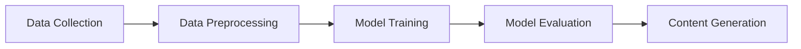

# Generative AI - Notes

## Table of Contents (ToC)

  - [Introduction](#introduction)
    - [What's Generative AI?](#whats-generative-ai)
    - [Key Concepts and Terminology](#key-concepts-and-terminology)
    - [Applications](#applications)
  - [Fundamentals](#fundamentals)
    - [Generative AI Architecture Pipeline](#generative-ai-architecture-pipeline)
    - [How Generative AI works?](#how-generative-ai-works)
    - [Types of Generative AI Models](#types-of-generative-ai-models)
    - [Some hands-on examples](#some-hands-on-examples)
  - [Tools \& Frameworks](#tools--frameworks)
  - [Hello World!](#hello-world)
  - [Lab: Zero to Hero Projects](#lab-zero-to-hero-projects)
  - [References](#references)

## Introduction

Generative AI is a subset of artificial intelligence that focuses on creating new content based on existing data.

### What's Generative AI?
- A field of AI that generates text, images, audio, and other content.
- Uses algorithms to produce new data similar to training data.
- Commonly employs neural networks, especially GANs and VAEs.

### Key Concepts and Terminology
- **GANs (Generative Adversarial Networks):** Two neural networks contesting with each other to improve output.
- **VAEs (Variational Autoencoders):** Encodes data to latent space and decodes to generate new data.
- **Latent Space:** Abstract representation used by generative models to produce variations.
- **Training Data:** The dataset used to train generative models.

### Applications
- **Art and Design:** Generating paintings, music, and other artistic works.
- **Content Creation:** Automated text, video generation, and virtual environments.
- **Healthcare:** Drug discovery, creating synthetic medical data for research.
- **Gaming:** Procedural generation of game levels, characters, and narratives.

## Fundamentals

### Generative AI Architecture Pipeline


### How Generative AI works?

- **Data Collection:** Gathering relevant data sets for training.
- **Data Preprocessing:** Cleaning and preparing data for model training.
- **Model Training:** Using algorithms like GANs and VAEs to train models.
- **Model Evaluation:** Assessing model performance and refining as needed.
- **Content Generation:** Producing new data based on the trained model.

### Types of Generative AI Models

The table below provides a comprehensive overview of the various types of generative AI models, their techniques, descriptions, and application examples/interests.

| Name | Techniques | Description | Application examples/interests |
|------|------------|-------------|--------------------------------|
| **GANs (Generative Adversarial Networks)** | Two neural networks (generator and discriminator) contesting with each other | Used for generating realistic images, videos, and more by having a generator create data and a discriminator evaluate it | Image generation, video synthesis, data augmentation |
|**VAEs (Variational Autoencoders)** | Encodes input data into a probabilistic latent space and decodes it to generate new data | Generates new data that is similar to input data by learning the distribution of the data | Image and data reconstruction, anomaly detection |
| **Autoregressive Models** | Predicts the next data point in a sequence based on previous points | Generates data sequentially by predicting the next element in a series | Text generation (e.g., GPT), speech synthesis |
| **Flow-based Models** | Uses invertible transformations to generate data | Models the data distribution directly and provides exact likelihood estimation | Image synthesis, density estimation |
| **Diffusion Models** | Models data generation as a gradual transformation process | Generates high-quality data by denoising a corrupted version of the data | High-quality image synthesis, video generation |
| **Recurrent Neural Networks (RNNs)** | Uses sequential data to learn temporal dependencies | Captures dependencies in sequential data such as time series or text | Language modeling, music composition, speech synthesis |
| **LSTMs (Long Short-Term Memory Networks)** | Type of RNN that can learn long-term dependencies | Overcomes the vanishing gradient problem in standard RNNs | Text generation, sequence prediction, time series forecasting |
| **GRUs (Gated Recurrent Units)** | Similar to LSTMs but with a simpler architecture | Efficiently captures dependencies in sequential data | Similar applications as LSTMs but often faster to train |
| **Transformer Models** | Uses self-attention mechanisms to process input data in parallel | Captures dependencies in data without regard to position | Text generation (e.g., BERT, GPT), translation, summarization |
| **Energy-Based Models (EBMs)** | Associates lower energy with correct data configurations | Learns the distribution of data by mapping it to an energy value | Image generation, unsupervised learning |
| **PixelCNN/PixelRNN** | Generates images one pixel at a time conditioned on previous pixels | Sequentially models image pixels to generate high-quality images | Image synthesis, inpainting |
|**Neural ODEs (Ordinary Differential Equations)** | Provides a continuous-time generative model approach | Uses differential equations to model the data generation process | High-resolution data generation, continuous-time modeling |
|**Boltzmann Machines** | Network of symmetrically connected nodes that learn to represent the probability distribution of a dataset | Captures complex dependencies in data by modeling energy-based probabilities | Feature learning, dimensionality reduction |


### Some hands-on examples
- **Text Generation:** Using GPT-3 to create articles, stories.
- **Image Generation:** Using GANs to create realistic images from scratch.
- **Music Generation:** Training models to compose music in various styles.

## Tools & Frameworks
- **TensorFlow:** Open-source library for machine learning and AI.
- **PyTorch:** Deep learning framework known for flexibility and ease of use.
- **Keras:** High-level neural networks API, running on top of TensorFlow.
- **OpenAI GPT:** A powerful tool for natural language processing and text generation.

## Hello World!
```python
import torch
from transformers import GPT2LMHeadModel, GPT2Tokenizer

# Load pre-trained model and tokenizer
model_name = 'gpt2'
model = GPT2LMHeadModel.from_pretrained(model_name)
tokenizer = GPT2Tokenizer.from_pretrained(model_name)

# Encode input text
input_text = "Once upon a time"
input_ids = tokenizer.encode(input_text, return_tensors='pt')

# Generate text
output = model.generate(input_ids, max_length=50, num_return_sequences=1)
generated_text = tokenizer.decode(output[0], skip_special_tokens=True)

print(generated_text)
```

## Lab: Zero to Hero Projects
- **Create a Text Generator:** Build a model to generate coherent paragraphs.
- **Generate Artwork:** Use GANs to create original digital art.
- **Compose Music:** Develop a system to compose music in different genres.
- **AI Chatbot:** Construct a conversational agent using generative models.

## References

- [Generative Artificial Intelligence](https://en.wikipedia.org/wiki/Generative_artificial_intelligence)
- [Large language model](https://en.wikipedia.org/wiki/Large_language_model)
- [Generative pre-trained transformer](https://en.wikipedia.org/wiki/Generative_pre-trained_transformer)
- [Generative adversarial network](https://en.wikipedia.org/wiki/Generative_adversarial_network)
- [Introduction to Generative AI](https://www.youtube.com/watch?v=G2fqAlgmoPo)
- [What is generative ai](https://www.mckinsey.com/featured-insights/mckinsey-explainers/what-is-generative-ai)
- [Foundation models](https://en.wikipedia.org/wiki/Foundation_models)

OpenAI : 
- Generative Pre-trained Transformer (GPT) Models :
  - GPT models : https://platform.openai.com/docs/guides/gpt
  - GPT Best Practices - openai : https://platform.openai.com/docs/guides/gpt-best-practices
  - GPT Family Models : 
    - GPT-1 : https://en.wikipedia.org/wiki/Generative_pre-trained_transformer
    - GPT-2 : https://en.wikipedia.org/wiki/GPT-2
      - paper : https://arxiv.org/ftp/arxiv/papers/1908/1908.09203.pdf
    - GPT-3 : https://en.wikipedia.org/wiki/GPT-3
      - paper : https://arxiv.org/pdf/2005.14165.pdf
    - GPT-4 : https://en.wikipedia.org/wiki/GPT-4
      - paper : https://arxiv.org/pdf/2303.08774.pdf
- Codex :
  - paper : https://arxiv.org/pdf/2107.03374.pdf
- InstructGPT (ChatGPT ancestor) :
  - paper : https://arxiv.org/pdf/2203.02155.pdf

Google : 
- [Generative AI on Vertex AI Documentation](https://cloud.google.com/vertex-ai/generative-ai/docs/multimodal/overview)
- [Generative AI  on Vertex AI Studio](https://cloud.google.com/generative-ai-studio?hl=en)
- [Generative AI Search Engine](https://blog.google/products/search/generative-ai-search/)
- [Google's T5](https://ai.googleblog.com/2020/02/exploring-transfer-learning-with-t5.html) 
- [Microsoft DialoGPT](https://github.com/microsoft/DialoGPT)

NVIDIA : 

- https://www.nvidia.com/en-us/ai-data-science/generative-ai/
- Generative AI - Technical Blog: https://developer.nvidia.com/blog/category/generative-ai/
- https://www.nvidia.com/en-us/glossary/data-science/generative-ai/
- https://www.nvidia.com/en-us/ai-data-science/generative-ai/news/
- Nvidia Reveals Grace Hopper Generative AI Chip (Computex 2023) : https://www.youtube.com/watch?v=_SloSMr-gFI&t=5s


IBM - AI Essentials: 
- https://www.youtube.com/watch?v=9gGnTQTYNaE&list=PLOspHqNVtKADfxkuDuHduUkDExBpEt3DF

Oracle
- [What Is Generative AI? How Does It Work?](https://www.oracle.com/artificial-intelligence/generative-ai/what-is-generative-ai/)


Lectures & Online course: 
  - [Lecture 13 | Generative Models - Fei-Fei Li & Justin Johnson & Serena Yeung - 2017](http://cs231n.stanford.edu/slides/2017/cs231n_2017_lecture13.pdf)
  - Google:
    - [Introduction to Generative AI Path](https://www.youtube.com/watch?v=G2fqAlgmoPo&list=PLIivdWyY5sqIlLF9JHbyiqzZbib9pFt4x&index=1)
    - NEW: https://medium.com/@rajputgajanan50/master-ai-in-2024-with-these-8-free-google-courses-257d9982a3e0
    - Google ML Education: https://developers.google.com/machine-learning
    - https://www.cloudskillsboost.google/catalog
    - https://opportunitiescorners.com/google-artificial-intelligence-course-2023/
    - [Google AI Essentials - Coursera](https://www.coursera.org/google-learn/ai-essentials?utm_source=google&utm_medium=institutions&utm_campaign=sou--google__med--organicsearch__cam--gwgsite__con--null__ter--null)

Papers and books: 

- Goodfellow, I., Pouget-Abadie, J., Mirza, M., Xu, B., Warde-Farley, D., Ozair, S., ... & Bengio, Y. (2014). Generative adversarial nets. Advances in neural information processing systems, 27.
- Kingma, D. P., & Welling, M. (2013). Auto-encoding variational bayes. arXiv preprint arXiv:1312.6114.
- Radford, A., Wu, J., Child, R., Luan, D., Amodei, D., & Sutskever, I. (2019). Language models are unsupervised multitask learners. OpenAI.
- Chollet, F. (2017). Deep learning with Python. Manning Publications.

