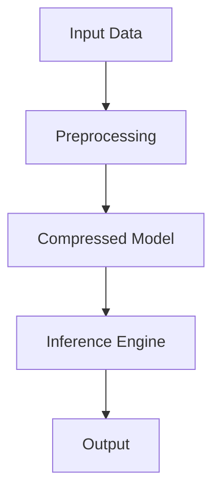

# Small Language Models (SLMs) - Notes

## Table of Contents (ToC)
  - [Introduction](#introduction)
    - [What's Small Language Models?](#whats-small-language-models)
    - [Key Concepts and Terminology](#key-concepts-and-terminology)
    - [Applications](#applications)
  - [Fundamentals](#fundamentals)
    - [Small Language Models Architecture Pipeline](#small-language-models-architecture-pipeline)
    - [How Small Language Models Work](#how-small-language-models-work)
    - [Types of Small Language Models](#types-of-small-language-models)
    - [Some Hands-On Examples](#some-hands-on-examples)
  - [Tools \& Frameworks](#tools--frameworks)
  - [Hello World!](#hello-world)
  - [Lab: Zero to Hero Projects](#lab-zero-to-hero-projects)
  - [References](#references)


## Introduction
Small language models provide advanced natural language processing capabilities within resource-constrained environments like mobile devices.

### What's Small Language Models?
- Language models designed to operate efficiently on limited hardware resources.
- Focus on maintaining performance with reduced computational requirements.
- Utilized in various applications for on-device AI tasks.

### Key Concepts and Terminology
- **Model Compression**: Techniques to reduce model size (e.g., pruning, quantization).
- **Inference**: The process of running a model to make predictions.
- **Latency**: The time it takes for a model to process input and generate output.

### Applications
- Mobile virtual assistants.
- Real-time language translation on smartphones.
- On-device text completion and suggestions.
- Enhanced accessibility features.

## Fundamentals

### Small Language Models Architecture Pipeline


### How Small Language Models Work
- **Preprocessing**: Input data is cleaned and tokenized.
- **Model Compression**: Techniques like pruning and quantization reduce model size.
- **Inference**: Compressed model processes input data to generate predictions.
- **Optimization**: Further fine-tuning to balance performance and efficiency.

### Types of Small Language Models
- **DistilBERT**: A smaller, faster, and lighter version of BERT.
- **TinyBERT**: A compact version of BERT for resource-constrained devices.
- **MobileBERT**: Specifically designed for mobile device applications.
- **ALBERT**: A model that uses parameter reduction techniques to lower memory consumption and increase the training speed.

### Some Hands-On Examples
- Deploying a small language model on a smartphone for voice recognition.
- Using a compressed model for real-time translation in a mobile app.
- Implementing a text suggestion feature using a small language model.

## Tools & Frameworks
- TensorFlow Lite: Framework for deploying models on mobile and edge devices.
- ONNX (Open Neural Network Exchange): Interchange format for AI models.
- Hugging Face Transformers: Library providing pre-trained models and tools.

## Hello World!
```python
from transformers import AutoTokenizer, AutoModelForSequenceClassification

tokenizer = AutoTokenizer.from_pretrained("distilbert-base-uncased")
model = AutoModelForSequenceClassification.from_pretrained("distilbert-base-uncased")

inputs = tokenizer("Hello, world!", return_tensors="pt")
outputs = model(**inputs)
print(outputs.logits)
```

## Lab: Zero to Hero Projects
- **Project 1**: Develop a mobile app that uses a small language model for real-time translation.
- **Project 2**: Create a voice assistant application using a compressed language model.
- **Project 3**: Implement an on-device text prediction feature in a messaging app.

## References
- Devlin, J., Chang, M. W., Lee, K., & Toutanova, K. (2019). BERT: Pre-training of Deep Bidirectional Transformers for Language Understanding.
- Howard, J., & Ruder, S. (2018). Universal Language Model Fine-tuning for Text Classification.
- Raffel, C., Shazeer, N., Roberts, A., et al. (2020). Exploring the Limits of Transfer Learning with a Unified Text-to-Text Transformer.