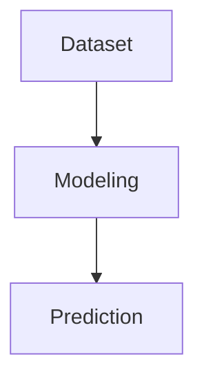

# Deep Learning (DL) -  Notes

## Introduction

Deep learning : is Machine Learning (ML) subset based on artificial *neural networks* to perform sophisticated computations on large amounts of data

Neural Network (NN) simulates the way humans learn. 
- NN allows to build model/algorithms 
  - inspired from biological neuron : 
      
        synapse => (dendrite) => (cell body) ==> axon  .... (next synapse => ... )

biological neuron  vs artificial neuron 

    (neuron)               (perceptron)
    --------------------+--------------------+
    | electrical signals|   data samples     |
    --------------------+---------------------
    |   synapse(node)   | input node(x, w, b)|
    --------------------+---------------------
    |     dendrite      |      summation     |
    |-------------------+---------------------
    |  cell-body(soma)  |      activation    |
    --------------------+---------------------
    |       axon        |    output node     |
    --------------------+--------------------+

*new connexion : axon + synapse => next dendrite 

## The perceptron

- The perceptron: first model invented by Mc Culloch-Pitts 
  - `1 input layer`
    - input nodes : `x1*w1 + x2*w2 ...+ b`
      - where : 
        - x : input signals
        - b : bias 
        - w : weights
    - Neuron 
        - Summation function
        - activation function (step : 0/1) 
  - `1 output layer` 

- The multilayer perceptron forms fully connected NN 
    - 1 input layer 
    - multiple hidden layers
    - Neuron 
        - Summation function
        - activation functions (step, tanh, sigmoid, RELU...)

    - 1 output layer
     

## Application

- computer vision 
- Object detection 
- nlp 
- Virtual assistant 
- Autonomous vehicles 
- Face recognition 
- Chatbots
- Sound addition to silent films
- colorization of black and white images ...
 ...
- eveywhere since data is everywhere in modern world and taking part of daily life ...

### Deep learning algorithms/model

- Perceptron = biological neuron 
- Deep Neural Network 
- MNIST Image Recognition 
- Recurrent Neural Network (RNN) 
- Transformer 
- BERT 
- Convolution Neural Network (CNN)
- Long Short Term Memory Networks (LSTMs)
- Recurrent Neural Networks (RNNs)
- Generative Adversarial Networks (GANs)
- Radial Basis Function Networks (RBFNs)
- Multilayer Perceptrons (MLPs)
- Self Organizing Maps (SOMs)
- Deep Belief Networks (DBNs)
- Restricted Boltzmann Machines(RBMs)

Check the [Neural Networks architecture notes](neural-nets-architecture-notes.mdneura) for more.

### Deep Learning Modeling Pipeline

### Model configuration / Parameters 
- learning rate (lr)
- epoch : 
- batch size :

- backpropagation : allows NN figure out patterns that are convoluted(complex) for human to extract
  - Error/cost function : 
      - R^2
  - Optimizer functions : 
    - hyperparameters tuning ? 
    - gradient descent ... 
 
- Prediction 
  - accuracy ? 
  - function: 
      - SoftMAx
      - Sigmoid 
      - Heaveside

### Model Evaluation & fitting Metrics

Evaluation : 
- condition of good model : test error > train error ? 
  - `underfitting` : small model high capacity (larger dataset) 
  - `overfitting` : big model low capacity (smalller dataset)
    - by tuning the hyperparameters we can configure the the complexity of the model
      - learning rate
      - number of layers 
      - numbers of hidden layers
      - the depth of NN

## Tools / frameworks

- TensoFlow (Google)
- Microsoft Cognitive Toolkit (CNTK) 
- Theano (LISA Lab - Mila institute - University of Montreal)
- torch (Facebook)
- Keras : deeplearning tool running on the top of TF, CNTK and Theano ... 
- MXNet (Apache)
- Caffe (Berkeley Artificial Intelligence Research (BAIR))

## DL Glossary

dataset : 
- training data : dataset
- training set :  new dataset (generalization)
- validation set: evaluate the performance of the model based on diffrent hyperparameters
- test set : final evaluation

error vs capacity 
- capacity : ? 
  - the deeper the NN the higher the capacity to learn
- error : ? 
  - train error : ? 
  - test error : ? 
- generalization gap : he gap btw train error and test error 
  

# References : 

- https://en.wikipedia.org/wiki/Deep_learning
- https://en.wikipedia.org/wiki/Supervised_learning
- https://en.wikipedia.org/wiki/Weak_supervision#Semi-supervised_learning
- https://en.wikipedia.org/wiki/Unsupervised_learning
- https://en.wikipedia.org/wiki/Reinforcement_learning
- https://en.wikipedia.org/wiki/Artificial_neural_network
- https://en.wikipedia.org/wiki/Transformer_(machine_learning_model)

- dl crash course : 
  - https://www.youtube.com/watch?v=VyWAvY2CF9c
- Neural Network(3Blue1Brown) :
  - https://www.youtube.com/watch?v=aircAruvnKk&list=PLZHQObOWTQDNU6R1_67000Dx_ZCJB-3pi
- How machine learns : 
  - https://www.youtube.com/watch?v=IHZwWFHWa-w

- NVIDIA Deep Learning Institute : 
  - https://www.nvidia.com/en-us/training/