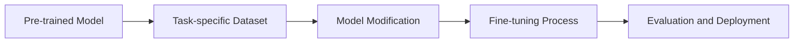

# Fine-tuning - Notes

## Table of Contents (ToC)

- [Fine-tuning - Notes](#fine-tuning---notes)
  - [Table of Contents (ToC)](#table-of-contents-toc)
  - [Introduction](#introduction)
    - [What's Fine-tuning?](#whats-fine-tuning)
    - [Key Concepts and Terminology](#key-concepts-and-terminology)
    - [Applications](#applications)
  - [Fundamentals](#fundamentals)
    - [Fine-tuning Architecture Pipeline](#fine-tuning-architecture-pipeline)
    - [How Fine-tuning works?](#how-fine-tuning-works)
    - [Types of Fine-tuning](#types-of-fine-tuning)
    - [Some hands-on examples](#some-hands-on-examples)
  - [Tools \& Frameworks](#tools--frameworks)
  - [Hello World!](#hello-world)
  - [Lab: Zero to Hero Projects](#lab-zero-to-hero-projects)
  - [References](#references)

## Introduction
Fine-tuning is a process in machine learning where a pre-trained model is adapted to a specific task or dataset.

### What's Fine-tuning?
- Adapting a pre-trained model to a specific task.
- Involves additional training on a smaller, task-specific dataset.
- Enhances model performance on the target task without training from scratch.

### Key Concepts and Terminology
- **Pre-trained Model:** A model initially trained on a large, generic dataset.
- **Transfer Learning:** Using knowledge from one task to improve learning in another task.
- **Learning Rate:** The speed at which the model learns during training.
- **Epochs:** Number of times the entire training dataset is passed through the model.

### Applications
- **Natural Language Processing (NLP):** Adapting language models for specific text classification or translation tasks.
- **Computer Vision:** Fine-tuning image recognition models for specific object detection or classification tasks.
- **Speech Recognition:** Tailoring models for specific languages or dialects.
- **Healthcare:** Adapting models for specific medical image analysis tasks.

## Fundamentals

### Fine-tuning Architecture Pipeline


### How Fine-tuning works?
- **Pre-trained Model:** Start with a model trained on a large, generic dataset.
- **Task-specific Dataset:** Collect a smaller dataset related to the specific task.
- **Model Modification:** Adjust the model architecture if needed (e.g., change the output layer).
- **Fine-tuning Process:** Train the model on the task-specific dataset with a smaller learning rate.
- **Evaluation and Deployment:** Evaluate model performance and deploy for use.

### Types of Fine-tuning
- **Feature Extraction:** Freeze earlier layers and only train the last few layers on the new dataset.
- **Full Fine-tuning:** Train all layers with a lower learning rate.
- **Layer-wise Fine-tuning:** Sequentially unfreeze and train layers from last to first.

### Some hands-on examples
- **Text Classification:** Fine-tuning BERT for sentiment analysis.
- **Image Classification:** Fine-tuning ResNet on a new image dataset.
- **Speech Recognition:** Fine-tuning Wav2Vec on a new language dataset.

## Tools & Frameworks
- **TensorFlow:** Framework for fine-tuning models with extensive support for pre-trained models.
- **PyTorch:** Popular for flexibility in model fine-tuning and transfer learning.
- **Hugging Face Transformers:** Library providing pre-trained models for NLP tasks.
- **Keras:** High-level API for fine-tuning models built on TensorFlow.

## Hello World!
```python
from transformers import BertTokenizer, BertForSequenceClassification, Trainer, TrainingArguments

# Load pre-trained model and tokenizer
model_name = 'bert-base-uncased'
tokenizer = BertTokenizer.from_pretrained(model_name)
model = BertForSequenceClassification.from_pretrained(model_name, num_labels=2)

# Prepare dataset
texts = ["I love this!", "I hate this..."]
labels = [1, 0]
encodings = tokenizer(texts, truncation=True, padding=True, return_tensors='pt')
dataset = torch.utils.data.TensorDataset(encodings['input_ids'], encodings['attention_mask'], torch.tensor(labels))

# Fine-tuning
training_args = TrainingArguments(output_dir='./results', num_train_epochs=3, per_device_train_batch_size=4)
trainer = Trainer(model=model, args=training_args, train_dataset=dataset)
trainer.train()
```

## Lab: Zero to Hero Projects
- **Sentiment Analysis:** Fine-tune a BERT model on a custom sentiment analysis dataset.
- **Custom Object Detection:** Fine-tune YOLO on a new object detection dataset.
- **Language Translation:** Fine-tune a transformer model for a specific language pair.
- **Medical Image Classification:** Fine-tune a convolutional neural network for classifying medical images.

## References
- Howard, J., & Ruder, S. (2018). Universal Language Model Fine-tuning for Text Classification. arXiv preprint arXiv:1801.06146.
- Devlin, J., Chang, M. W., Lee, K., & Toutanova, K. (2018). BERT: Pre-training of Deep Bidirectional Transformers for Language Understanding. arXiv preprint arXiv:1810.04805.
- He, K., Zhang, X., Ren, S., & Sun, J. (2016). Deep Residual Learning for Image Recognition. In Proceedings of the IEEE Conference on Computer Vision and Pattern Recognition (CVPR).
- Baevski, A., Zhou, H., Mohamed, A., & Auli, M. (2020). wav2vec 2.0: A Framework for Self-Supervised Learning of Speech Representations. arXiv preprint arXiv:2006.11477.