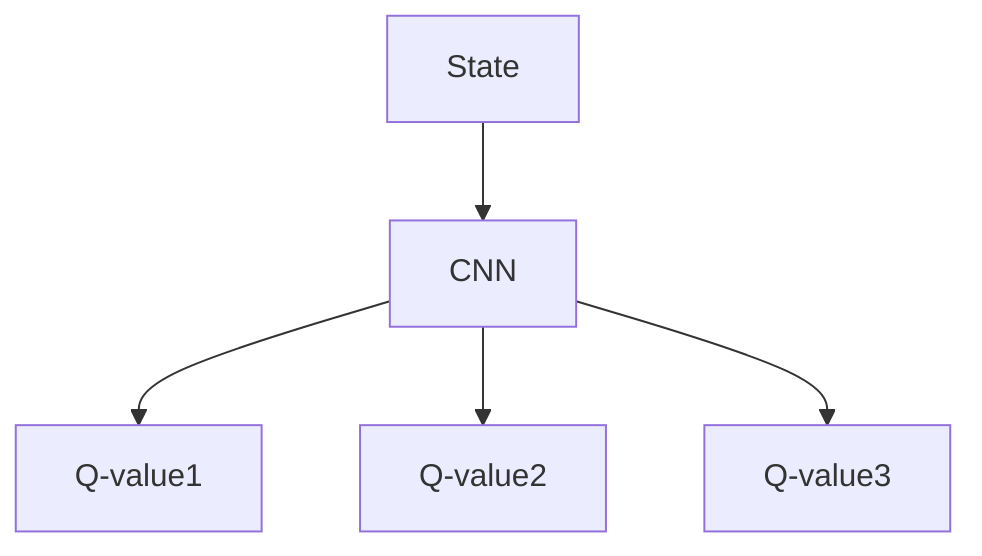

# Reinforcement learning (RL) - notes :robot:

## Agenda

- [Intro](#intro)
- [RL characteristics](#rl-characteristics)
- [Applications - RL](#applications---rl)
- [Tools / frameworks](#tools--frameworks)
- [A simple RL is modeled by Markov Decision Process (MDP)](#a-simple-rl-is-modeled-by-markov-decision-process-mdp)
- [The limit of Q-learning](#the-limit-of-q-learning)
    - [DQN Techniques :](#dqn-techniques-)
    - [DQN approaches/Process](#dqn-approachesprocess)
- [Models/Algorithms](#modelsalgorithms)
- [Implementation](#implementation)
- [References](#references)

  
## Intro 

A machine learning approach/paradigm which enables a model to learning patterns from data with/without labels based on reward (if the model correctly learns a pattern) or a penalty otherwise.

## RL characteristics
- No supervision, only *reward* signal
- Feedback can be delayed, non instantaneous
- Time matters
- Earlier decisions affect later interactions

## Applications - RL 

- Robotics 
- Self-driving cars 
- Strategy games : chess/Go/FrozenLake/Atari ...

## Tools & Frameworks 
- OpenAI Gym
- DeepMind Lab
- TensorFlow
- Keras
- Pytorch
- Markov Chain/Markov Decision Process (MDP)

### A simple RL is modeled by Markov Decision Process (MDP)

Src : [perfectial.com/rl-applications](https://perfectial.com/blog/reinforcement-learning-applications/)

RL provides a statistical framework based on two components : 

- **Agent(a)** : takes actions that changes an existing state(S) of the environment
- **Environment (b)** : transites to a new/future state based on changes taken by the agent and provides feedback to the agent
    - feedback : can either be positive(+) or negative(-), after set of feedbacks or iterations the agent tries to learn and optimize the future actions in order to get a maxime of (+) feedbacks => reward (function)
    - Quality/Q-function : a given action that produces a future reward based on current state

 **Q-function** : uses Bellman equation Q(s,a)
 
 

Q-funtion/Q-Learning strategy : 
1. Value-based RL : Optimizes the maximum value function for a given action-state pair
2. Policy search-based RL : search for an optimal policy that's able to ach ieve a maximum future reward
3. Actor-critic-based RL: hybrid strategy which combines value-based + policy-based to solve RL learning problems

### The limit of Q-learning 
- Curse of dimensionality : when dealing with a large number of samples
- Sample correlation : successive samples are often correlated whe it comes to online updates.

**Solution : deep reinforcement learning (DRL)**

DRL : increases performance of model and solves Curse fo dimensionality and Sample Correlation. 

Model Deep Q-Network (DQN) : 

*Deep Q-Network (DQN) high level architecture*

| Layer | Input Size | Filter Size| Number of Filter| Stride Length |Activation Unit | Output Size |
|------ |------ | ------ | ------  | ------ | ------| ------|
| Conv-1 |84x84x4 | 8x8 | 32  | 4 | Rectified Linear | 20 x 20 x 32|
| Conv-2 |20x20x32 | 4x4 | 64  | 2 | Rectified Linear | 9 x 9 x 64|
| Conv-3 |9x9x64 | 3x3 | 64  | 1 | Rectified Linear | 7 x 7 x 64|
| fc4 |7x7x64 | N/A | 512  | N/A | Rectified Linear | 512|
| fc5 |512 | N/A | 18  | N/A | Linear | 18|

Where CNN has: 
- 3 cnn layers
- 2 fcs (fully connected layers) 

Convolution Neural Network(CNN) - DQN solves curse dimensionality but not the unstable learning issues due to high correlation in the input sequence data.

    Ex: In case of Atari Games supporting iteractive actions coming from Joysticks

#### DQN Techniques : 
- Experience replay :  stores past experience in memory and use these samples during the learning stage or every time step *t* (iteration) to reduce correlation of sequence of data and avoiding overffiting  
- Target network : fixes the parameter of the target function Q(s,a, teta*t*) 
- reward clipping : allows to normalize the rewards, if they are not in the same scale 

#### DQN approaches/Process
- Single-DQN : Recursive target Q(s,a, teta*t*) => Overestimate the values, can be costful if working with large sample => accumulate lots of errors!!!
- Double-DQN : to avoid the previous approach we divide the Q(s,a, teta*t*) into 2 functions : Q1 and Q2.
- Dueling-DQN : splits Q(s,a ) = V(s) + A(a) => for robustness modeling

## Models/Algorithms

 

[Source : OpenAI - A non-exhaustive, but useful taxonomy of algorithms in modern RL](https://spinningup.openai.com/en/latest/spinningup/rl_intro2.html)

## Implementation

List of a NON-exaustive RL algorithms : 
- [Notes](https://github.com/afondiel/computer-science-notes/commit/ae02f5c76a268f708615755ca7fa9a2555f80868)
- [Implementations](#)
  - [RL application for self-driving cars](https://github.com/afondiel/my-lab/tree/master/automotive/self-driving-cars/project/self-driving-car-rl-a-z)
## References 
- [DeepMind - course by Hado Van Hasselt - 2018](https://www.youtube.com/watch?v=ISk80iLhdfU&list=RDCMUCP7jMXSY2xbc3KCAE0MHQ-A)
- [Deep Learning Essentials - Wei Di, Anurag Bhardwaj, Jianing Wei](https://github.com/afondiel/computer-science-notes/blob/d81a21daac22c624722bba1557d56cc328f79814/books/ai/Deep%20Learning%20Essentials%20-%20Wei%20Di,%20Anurag%20Bhardwaj,%20Jianing%20Wei.pdf)
- [Welcome to Spinning Up in Deep RL](https://spinningup.openai.com/en/latest/index.html)
- [Reinforcement learning wiki](https://en.wikipedia.org/wiki/Reinforcement_learning)
- [Markov Chain](https://en.wikipedia.org/wiki/Markov_chain)
- [MDP](https://en.wikipedia.org/wiki/Markov_decision_process)
- [Stochastic Model](https://en.wikipedia.org/wiki/Stochastic_process)
- [Proba Theory](https://en.wikipedia.org/wiki/Probability_theory)
- [Bellman equation](https://en.wikipedia.org/wiki/Bellman_equation)
- [Sequential logic](https://en.wikipedia.org/wiki/Sequential_logic)
- [Finite-state machine](https://en.wikipedia.org/wiki/Finite-state_machine)
- [Dynamical_system](https://en.wikipedia.org/wiki/Dynamical_system)
- [implementing the a3c algorithm](https://medium.com/@shagunm1210/implementing-the-a3c-algorithm-to-train-an-agent-to-play-breakout-c0b5ce3b3405)
- for a high dimensinal environment a [Deep Reinforcement Learning](https://www.youtube.com/watch?v=zR11FLZ-O9M) is required

> ### "It is difficult to free fools from the chains they revere." ~ Voltaire

