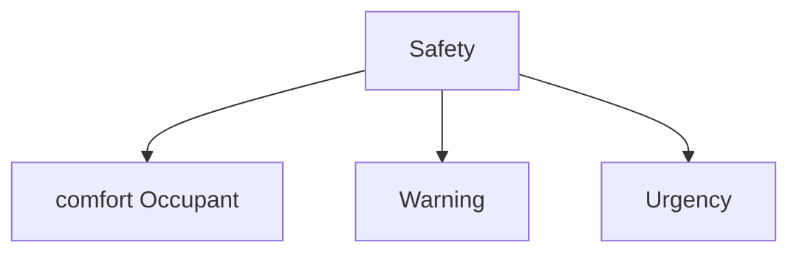

# Automotive safety Notes

Study and practice of design, construction, equipment and regulation to minimize the occurrence and consequences of traffic collisions involving motor vehicles. 

Road traffic safety more broadly includes roadway design.

## Automotive Safety Functions

# Standards : 
- IEC 61508
- ISO 26262

# Companies working on safety : 

- Velodyne
- Aurora
- Waymo
- Autoliv
- Nuro
- Cyngn, Faction
- Mobileye
- Beep
- ElectraMeccanica
- Black Sesame
- Tesla
- nvidia

# References 

- [Automotive safety](https://en.wikipedia.org/wiki/Automotive_safety)
  
- [IEC 61508](https://en.wikipedia.org/wiki/IEC_61508)
  
- [Safety integrity level](https://en.wikipedia.org/wiki/Safety_integrity_level)
  
- [ASIL LEVEL](https://en.wikipedia.org/wiki/Automotive_Safety_Integrity_Level)
  
- [ISO 26262](https://en.wikipedia.org/wiki/ISO_26262)
  
- [FMECA/AMDEC](https://en.wikipedia.org/wiki/Failure_mode,_effects_and_criticality_analysis)
  
- [EuroNCAP](https://www.euroncap.com/en)
  
- [australianNCAP](https://www.ancap.com.au/)
  
- [Autoliv](https://www.autoliv.com/safety-solutions)
  
- [volvo & autoliv & nvidia](https://www.media.volvocars.com/ch/fr-ch/media/pressreleases/207309/volvo-cars-and-autoliv-autonomous-driving-joint-venture-zenuity-starts-operations)

