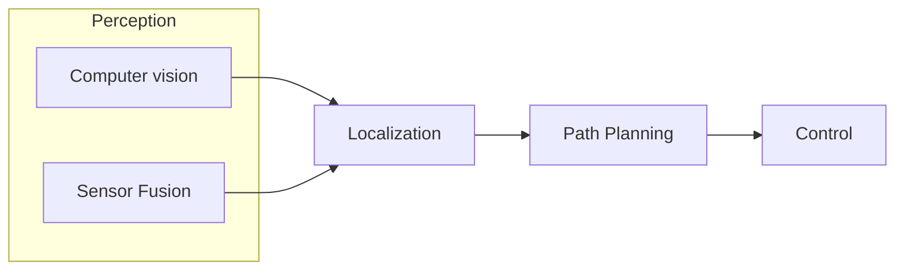
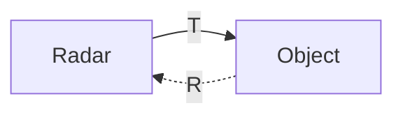
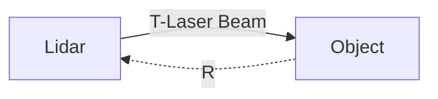

# Self-driving - notes

## Table of Contents
- [Overview](#overview)
- [How a self-driving car works ?](#how-a-self-driving-car-works-)
- [Applications](#applications)
- [HW and SW Architecture](#hw-and-sw-architecture)
  - [Hardware](#hardware)
    - [Sensors](#sensors)
      - [`Cameras`](#cameras)
      - [`Radar (Radio Detection and Ranging)`](#radar-radio-detection-and-ranging)
      - [`Lidar` (Light Detection and Ranging)](#lidar-light-detection-and-ranging)
      - [`Sonar`: Sound Waves](#sonar-sound-waves)
      - [GPS (Global Positioning System : lat, log)](#gps-global-positioning-system--lat-log)
      - [GNSS(Global Navigation Satellite System )](#gnssglobal-navigation-satellite-system-)
      - [Odometry](#odometry)
      - [InfraRed (IR)](#infrared-ir)
    - [Sensors strenght and weakness](#sensors-strenght-and-weakness)
    - [Computing](#computing)
  - [Software](#software)
    - [High Level SW Archictecture](#high-level-sw-archictecture)
- [Companies building self-driving car](#companies-building-self-driving-car)
  - [OEMS:](#oems)
  - [Suppilers](#suppilers)
- [Startups](#startups)
- [Tools \& Frameworks](#tools--frameworks)
- [References](#references)


## Overview

A self-driving car, also known as an autonomous car, driver-less car, or "robotic car" (robo-car),is a car incorporating vehicular automation, 
that is, a ground vehicle that is capable of sensing its environment and moving safely with little or no human input.

## How a self-driving car works ?


- Computer vision : how the car sees the world and its environement
- Sensor Fusion : how the car understands the world and its environement
- Localization : how the car figure it out where it is in the world(its location)
- Path Planning : how the car decides to navige the world(its brain/decision making)
- Control (drive) : how the car turns the steering wheel/accelates/brakes based on the planning phase


## Applications
- Increase road Safety 
- Vehicle automation in different fields
- Landmark assistance in local positioning systems
- Control of the automated vehicle
- Automated vehicle path planning
- Obstacle avoidance
- autonomous taxis (waymo, uber ...)
- ...


## HW and SW Architecture

There are currently two software architecture approaches commonly used in the autonomous industry: Modular and [End-to-End](https://images.nvidia.com/content/tegra/automotive/images/2016/solutions/pdf/end-to-end-dl-using-px.pdf) approach.


Self-Driving Car Modular Architecture. Src : [An Overview about Emerging Technologies of Autonomous Driving - 2023 paper](https://arxiv.org/ftp/arxiv/papers/2306/2306.13302.pdf) 


### Hardware

#### Sensors


- There are two categories of sensors: `active sensors` and `passive sensors`
- Each sensor operates in a different frequency range based on electromagnetic spectrum or radiation.


The electromagnetic radiation (EMR) consists of a `frequency` ( $f$ ) and a `wavelength` ( $\lambda$ ).

$$
f = 
\frac{c}{\lambda}
$$

```
Where, c is the speed of light ( $3.10^8$ m/s)
```

**Sensors types** 


##### `Cameras`

Passive & light-collecting sensors that are used for capturing rich detailed information about a scene. Also essential for correctly perceiving.
- Comparison metrics:
  - `Resolution` (quality of the image) : number of pixels that create the image (l x w)
  - `Field of view (FOV)` : the horizontal and vertical angular extent that is *visible* to the camera (depending lens selection and zoom)
  - `Dynamic Range` : the difference btw the **darkest** and **lightest** tones in an image
    - High Dynamic range (HDR) is essential for self-driving vehicles to navigate in variable lighting conditions, particularly at night.
- Trade-off btw resolution and FOV ?
  - Wilder `field of view` allows a larger viewing region in the environment but fewer pixels that absorb light from one particular object
  - FOV increases, the resolution needs to be increases as well, to still be able to perceive with the same quality
  - other properties that affect perception : 
    - focal length, depth of field and frame rate
    - further explanation **on course 3 : visual perception**
- **Cameras types** :
  - `Stereo Camera`: the combination of two cameras with overlapping FOVs and aligned image planes.
    - enables depth estimation from image data (synchronized image pairs)
    - Pixel values from image can be matched to the other image producing a disparity map of the scene then be used to estimate depth at each pixel
  - `Monocular camera`
  - `fisheye camera (360)`
  - [Thermal Cameras](https://www.flir.com/oem/adas/)


##### `Radar (Radio Detection and Ranging)`

Radar : detects Macro and moving objects
    - Long range
    - Short range
  - Metrics :
    - Range : 
      - F : < 300GHz
      - $\lambda$ : >= 1mm



##### `Lidar` (Light Detection and Ranging) 

Lidar detects small objects, more precise than radars, and good for bad weahter


  - Based on laser detector
  - Rotational and optical system
  - Great electronic timing (detection speed)
  - 3D mapping
  - Scan of the environment

$$
\displaystyle D_{L} = 
\frac{c*t}{2}
$$

    where  : 
    - D : the distance btw the sensor and the Object
    - c : the speed of light
    - t : time

##### `Sonar`: Sound Waves 
  


$$
D_{S} = 
\frac{V*T}{2}
$$
```
where  : 
- D : the distance btw the sensor and the Object
- V : the speed of sound
- T : time
```

##### [GPS (Global Positioning System : lat, log)](https://en.wikipedia.org/wiki/Global_Positioning_System)

##### [GNSS(Global Navigation Satellite System )](https://en.wikipedia.org/wiki/Satellite_navigation)

##### [Odometry](https://en.wikipedia.org/wiki/Odometry)

##### InfraRed (IR)
#### Sensors strenght and weakness  


`RADAR vs LIDAR`
  - Radar : the detection of the object increases as the size of this one
    - Range  : < 1 mm*
    - very good in case of bad wheather
    - Radar wavelength is three times greater than Lidar : 
    - better for macro-dimension detection or bigger objects 
$$
\displaystyle \lambda_{R} > 3*\lambda_{L}
$$

- Lidar : detect objects in the dimensions more smaller 
    - Range : 1 nm < wavelenght < 1um 
    - not very good in bad wheather


#### Computing Hardware

- NVIDIA DRIVE PX, AGX ... 
- Intel & Mobileye EyeQ
- ...

### Software
#### High Level SW Architecture


- [NVIDIA Software for Self-Driving Cars](https://www.nvidia.com/en-us/self-driving-cars/drive-platform/software/)

#### AI Solution for self-driving

- Sensing
- Perception
- Mapping and Localization
- Motion Planning
- Control

## Companies building self-driving car

### OEMS: 
- Tesla 
- Mercedes-Benz
- Toyota
- Ford
- GM

### Suppilers
- NVIDIA : [NVIDIA DRIVE End-to-End Platform for Software-Defined Vehicles](https://www.nvidia.com/en-us/self-driving-cars/) 
- DENSO 
- CONTINENTAL
- DELPHI
- [VALEO.AI](https://www.valeo.com/en/valeo-ai/)
- Autoliv/Veoner
- Velodyne

## Startups & Tech Companies
- Waymo (Google/Alphabet) 
- Cruise (former Voyage - GM)
- Zoox (Amazon)
- Motional (JV Hyundai + Aptiv)
- Mobileye
- Aurora (former Uber Advanced Technologies, ATG)
- Nuro
- Apple 
- Samsung 
- Cyngn, Faction
- Beep
- ElectraMeccanica
- Black Sesame
- Nvidia
- Wayve (Microsoft backed startup)

## Tools & Frameworks 

- [The open NVIDIA DRIVE Software stack](https://www.nvidia.com/en-us/self-driving-cars/drive-platform/software/)
- Automotive Data and Time-Triggered Framework (ADTF) audi 
- [Tesla FSD (Full Self-Driving)](https://www.youtube.com/watch?v=FwT4TSRsiVw)

- Self-Driving Car Simulators : 
  - [CARLA Simulator - Unreal Engine4 (UE4)](https://carla.org/)
  - [Udacity self-driving car simulator NDP - Unity](https://github.com/udacity/self-driving-car-sim)
  - [Gazebo Simulator by Autoware](https://github.com/autowarefoundation/autoware) 
  - [Microsoft AirSim - UE4 & Unity](https://microsoft.github.io/AirSim/using_car/) 
  - [TORCS (The Open Racing Car Simulator) - OpenGL](https://en.wikipedia.org/wiki/TORCS)
  - [OpenAI Gym for RL training](https://gymnasium.farama.org/)
    - [Deep Reinforcement Learning for autonomous vehicles with OpenAI Gym, Keras-RL in AirSim simulator](https://medium.com/analytics-vidhya/deep-reinforcement-learning-for-autonomous-vehicles-with-openai-gym-keras-rl-in-airsim-simulator-196b51f148e4)
    - [Donkey Simulator - Unity](https://docs.donkeycar.com/guide/deep_learning/simulator/)
    - [Kivy - Drawing Your Own Map](https://kivy.org/doc/stable/gettingstarted/drawing.html)
      - [Example, Self-driving car - based on reinforcement learning](https://github.com/diesimo-ai/reinforced-self-driving-car)
  - [NVIDIA DRIVE Sim - Powered ](https://www.youtube.com/watch?v=UoPXzzK_g1Q&embeds_euri=https%3A%2F%2Fdeveloper.nvidia.com%2F&feature=emb_title) - [Omniverse](https://www.nvidia.com/en-us/omniverse/)

## References

- Wikipedia : 
  - [Self-driving_car](https://en.wikipedia.org/wiki/Self-driving_car)
  - [Robotaxi](https://en.wikipedia.org/wiki/Robotaxi)

- [self-driving car engineer roadmap from thinkautonomous](https://courses.thinkautonomous.ai/self-driving-cars)
- [Applications & technologies self-driving vehicles](http://www.freelancerobotics.com.au/technological-articles/overview-techniques-applications-autonomous-vehicles/)

- [Autonomous Driving Software in Europe](https://sourceforge.net/software/autonomous-driving/europe/)

- [Online ressources to get started](https://analyticsindiamag.com/top-8-online-resources-to-get-started-with-self-driving-vehicles-in-2021/)

- [An intro to self-driving cars with David Silver](https://www.youtube.com/watch?v=lz8nrj44ifk)

- [ADAS dev env elektrobit](https://www.elektrobit.com/products/automated-driving/eb-assist/adtf/)

- [Solutions for Self-Driving Cars and Autonomous Vehicles](https://www.nvidia.com/en-us/self-driving-cars/)

- [NVDIA parteners](https://www.nvidia.com/en-us/self-driving-cars/partners/)

- [Standard-j3016](https://www.sae.org/blog/sae-j3016-update)

- [Udacity sensor systems](https://www.udacity.com/blog/2021/03/how-self-driving-cars-work-sensor-systems.html)

- [Applying of Reinforcement Learning for Self-Driving Cars](https://towardsdatascience.com/applying-of-reinforcement-learning-for-self-driving-cars-8fd87b255b81)

- [CARLA Simulator](https://carla.org/) 

- [Opencv](https://www.youtube.com/channel/UC1llP9ekCwt8nEJzMJBQekg)

- [Udacity online program](https://www.youtube.com/watch?v=ICKBWIkfeJ8&list=PLAwxTw4SYaPkQXg8TkVdIvYv4HfLG7SiH)

- [deepmind and Waymo](https://www.deepmind.com/blog/how-evolutionary-selection-can-train-more-capable-self-driving-cars)

- [How DeepMind and Waymo Train Self-Driving Car Models](https://medium.com/dataseries/how-deepmind-and-waymo-train-self-driving-car-models-bad071a4f64f)

Sensors : 
- [Maxbotix - Understanding How Ultrasonic Sensors Work](https://www.maxbotix.com/articles/how-ultrasonic-sensors-work.htm#:~:text=Ultrasonic%20sensors%20work%20by%20sending,and%20to%20receive%20the%20echo.)
- [Self-Driving Hardware and Software Architectures](https://github.com/afondiel/Self-Driving-Cars-Specialization-Coursera/blob/main/Course1-Introduction-to-Self-Driving-Cars/course1-w2-notes.md)
- [Thermal Cameras Gain Acceptance For ADAS And Autonomous Cars](https://www.forbes.com/sites/sabbirrangwala/2022/10/28/thermal-cameras-gain-acceptance-for-adas-and-autonomous-cars/)

Research papers: 

- [Self-driving papers](https://www.semanticscholar.org/paper/DARPA-Urban-Challenge-Technical-Paper-Reinholtz-Alberi/c10acd8c64790f7d040ea6f01d7b26b1d9a442db?p2df#related-papers)

- [Autonomous Driving from paperwithcode](https://paperswithcode.com/task/autonomous-driving)

- [Highway Environment Model for Reinforcement Learning](https://www.sciencedirect.com/science/article/pii/S2405896318333032)

- [Comparing driving behavior of humans and autonomous driving in a professional racing simulator](https://www.ncbi.nlm.nih.gov/pmc/articles/PMC7857611/pdf/pone.0245320.pdf)
  