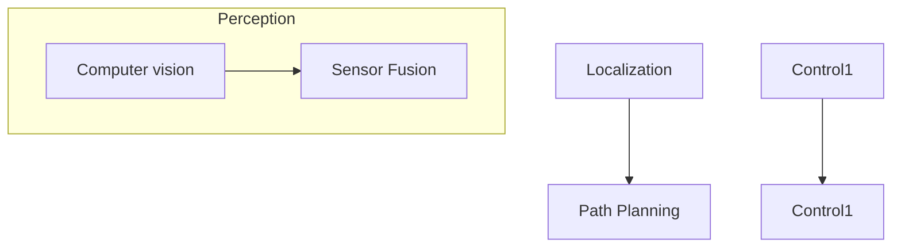

# Self-driving - notes

## Table of Contents

- [Overview](#overview)
- [How a self-driving car works ?](#how-a-self-driving-car-works-)
- [Applications](#applications)
- [Architecture](#architecture)
- [Companies building self-driving car](#companies-building-self-driving-car)
- [Tools / Frame works](#tools--frame-works)
- [Reference](#reference)

## Overview

A self-driving car, also known as an autonomous car, driver-less car, or "robotic car" (robo-car),is a car incorporating vehicular automation, 
that is, a ground vehicle that is capable of sensing its environment and moving safely with little or no human input.

## How a self-driving car works ?

- Computer vision : how the car sees the world and its environement
- Sensor Fusion : how the car understands the world and its environement
- Localization : how the car figure it out where it is in the world(its location)
- Path Planning : how the car decides to navige the world(its brain/decision making)
- Control (drive) : how the car turns the steering wheel/accelates/brakes based on the planning phase

## Applications
- increase road Safety 
- Vehicle automation in different fields
- Landmark assistance in local positioning systems
- Control of the automated vehicle
- Automated vehicle path planning
- Obstacle avoidance
- autonomous taxis (waymo, uber ...)
...

## Architecture 

### **Hardware**
- Sensors : each sensor operates in a different frequency based on EM spectrum.
    - There are two categories of sensors: `active sensors` and `passive sensors`

EM spectrum

The electromagnetic wave is characterized by its `frequency` (F) and its `wavelength` ($\lambda$).

  >## F = $\frac{1}{T}$ = $\frac{\omega}{2 * pi}$ = $\frac{c}{\lambda}$

Where : 
- **c** : the speed of light ( $3.10^8$ m/s)

**Sensors family** : 

- Thermo-Cameras
- `Radar`(radio detection and ranging) : Macro objects
    - Long range
    - Short range
  - Range : 
    - F : < 300GHz
    - $\lambda$ : >= 1mm

- `Lidar`(light detection and ranging) : Micro objects (more precision)

(sensor) ----------- Laser beam ----------------> (Object)

  - based on laser
  - detector
  - rotational and optical system
  - timing electronic (detection speed)
  - 3D mapping
  - scan of the environment

>## D = $\frac{c*t}{2}$
    where  : 
    - D : the distance btw the sensor and the Object
    - c : the speed of light
    - t : time
  
    `RADAR vs LIDAR`
    - Radar : the detection of the object increases as the size of this one
      - Range  : 10^-3m
      - good for bad wheather
    - Lidar : detect objects in the dimensions more smaller 
      - Range : 10^-3m
      - bad for bad wheather
> ## Range : $\lambda$R > 3*$\lambda$L (three times less than the wavelength of Radar sensor )

- `Sonar` (Sound waves) 
  
  (sensor) ----------- Laser beam ----------------> (Object)

> ## D = $\frac{V*T}{2}$
    where  : 
    - D : the distance btw the sensor and the Object
    - V : the speed of sound
    - T : time

- `GPS` (Global Positioning System : lat, log)
- `Odometry`

### **Software**
  - Computer vision
  - Deep learning (CNN ...)
  - NVIDIA 
    - [self-driving platform software](https://www.nvidia.com/en-us/self-driving-cars/drive-platform/software/)

## **Suppilers** 
  - NVIDIA : ECU/GPUs
  - DENSO 
  - CONTINENTAL
  - DELPHI

## **OEMS** : 
  - Tesla 
  - Mercedes-Benz
  - Toyota
  - Ford 
  - Ford 

## **Tech**
  - waymo 
  - Apple 
  - Samsung
  - ... 

## Companies building self-driving car

- Velodyne
- Aurora
- Waymo
- Autoliv
- Nuro
- Cyngn, Faction
- Mobileye
- Beep
- ElectraMeccanica
- Black Sesame
- Tesla
- nvidia

## Tools / Frame works 
- The open NVIDIA DRIVE Software stack
- Automotive Data and Time-Triggered Framework(ADTF) audi 
- Tesla FSD Chip (full self-driving)
- CARLA Simulator

# Reference

- Wikipedia : 
  - [Self-driving_car](https://en.wikipedia.org/wiki/Self-driving_car)
  - [Robotaxi](https://en.wikipedia.org/wiki/Robotaxi)

- [Applications & technologies self-driving vehicles](http://www.freelancerobotics.com.au/technological-articles/overview-techniques-applications-autonomous-vehicles/)

- [Autonomous Driving Software in Europe](https://sourceforge.net/software/autonomous-driving/europe/)

- [Online ressources to get started](https://analyticsindiamag.com/top-8-online-resources-to-get-started-with-self-driving-vehicles-in-2021/)

- [An intro to self-driving cars with David Silver](https://www.youtube.com/watch?v=lz8nrj44ifk)

- [ADAS dev env elektrobit](https://www.elektrobit.com/products/automated-driving/eb-assist/adtf/)

- [Solutions for Self-Driving Cars and Autonomous Vehicles](https://www.nvidia.com/en-us/self-driving-cars/)

- [NVDIA parteners](https://www.nvidia.com/en-us/self-driving-cars/partners/)

- [Standard-j3016](https://www.sae.org/blog/sae-j3016-update)

- [Udacity sensor systems](https://www.udacity.com/blog/2021/03/how-self-driving-cars-work-sensor-systems.html)

- [Applying of Reinforcement Learning for Self-Driving Cars](https://towardsdatascience.com/applying-of-reinforcement-learning-for-self-driving-cars-8fd87b255b81)

- [CARLA Simulator](https://carla.org/) 

- [Opencv](https://www.youtube.com/channel/UC1llP9ekCwt8nEJzMJBQekg)

- [Udacity online program](https://www.youtube.com/watch?v=ICKBWIkfeJ8&list=PLAwxTw4SYaPkQXg8TkVdIvYv4HfLG7SiH)

- [deepmind and Waymo](https://www.deepmind.com/blog/how-evolutionary-selection-can-train-more-capable-self-driving-cars)

- [How DeepMind and Waymo Train Self-Driving Car Models](https://medium.com/dataseries/how-deepmind-and-waymo-train-self-driving-car-models-bad071a4f64f)

Sensors : 
- [Maxbotix - Understanding How Ultrasonic Sensors Work](https://www.maxbotix.com/articles/how-ultrasonic-sensors-work.htm#:~:text=Ultrasonic%20sensors%20work%20by%20sending,and%20to%20receive%20the%20echo.)

research papers

- [Autonomous Driving from paperwithcode](https://paperswithcode.com/task/autonomous-driving)

- [Highway Environment Model for Reinforcement Learning](https://www.sciencedirect.com/science/article/pii/S2405896318333032)

- [Comparing driving behavior of humans and autonomous driving in a professional racing simulator](https://www.ncbi.nlm.nih.gov/pmc/articles/PMC7857611/pdf/pone.0245320.pdf)
  