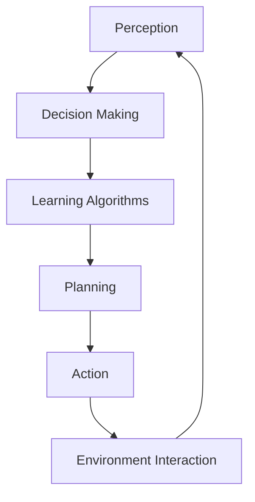
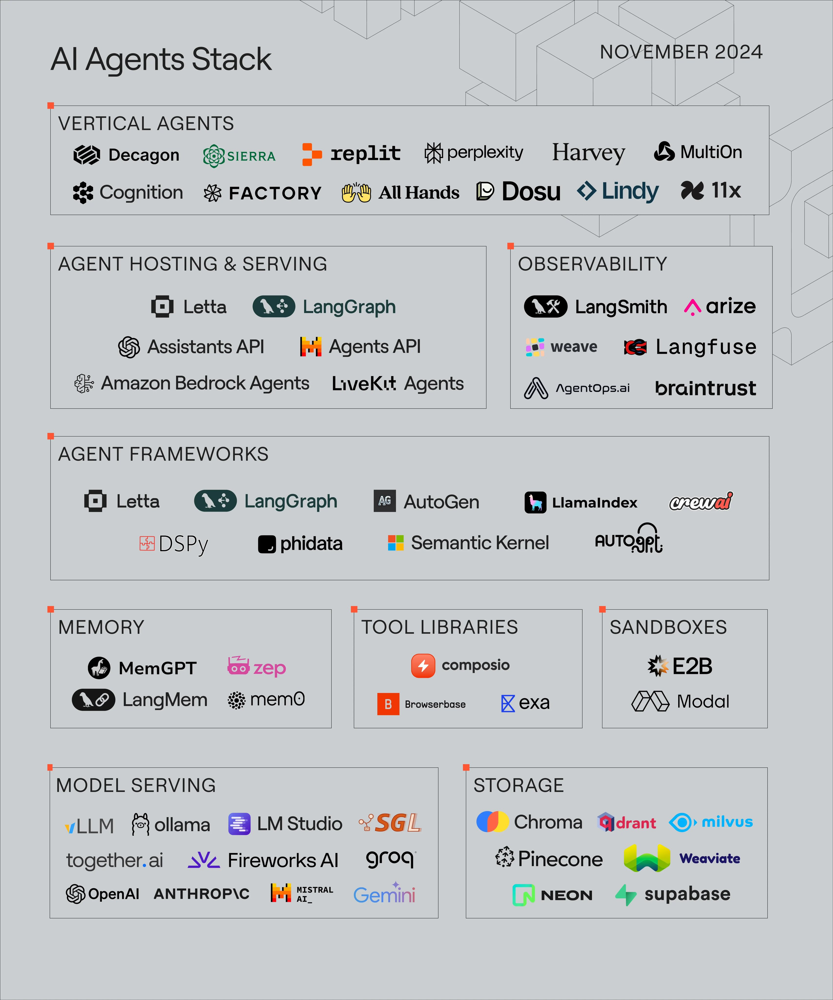

# Autonomous (AI) Agents - Notes


## Table of Contents (ToC)
- [Introduction](#introduction)
- [Key Concepts](#key-concepts)
- [Applications](#applications)
- [Architecture Pipeline](#architecture-pipeline)
- [Framework / Key Theories or Models](#framework-key-theories-or-models)
- [How Autonomous Agents Work](#how-autonomous-agents-work)
- [Methods, Types & Variations](#methods-types--variations)
- [Self-Practice / Hands-On Examples](#self-practice-hands-on-examples)
- [Pitfalls & Challenges](#pitfalls--challenges)
- [Feedback & Evaluation](#feedback--evaluation)
- [Tools, Libraries & Frameworks](#tools-libraries--frameworks)
- [Hello World! (Practical Example)](#hello-world-practical-example)
- [Advanced Exploration](#advanced-exploration)
- [Zero to Hero Lab Projects](#zero-to-hero-lab-projects)
- [Continuous Learning Strategy](#continuous-learning-strategy)
- [References](#references)

---

## Introduction
**Autonomous agents** are systems or software entities that perform tasks or make decisions independently, often in dynamic environments, without continuous human intervention.

## Key Concepts
- **Autonomy**: The ability of an agent to operate independently without external control.
- **Agent**: A software entity that can perceive its environment, reason about it, and take actions to achieve its goals.
- **Multi-agent Systems (MAS)**: Systems in which multiple agents interact and cooperate to achieve a collective objective.

**Misconception**: Autonomous agents are often confused with automation. While automation follows a predefined script, autonomous agents adapt and learn from their environment.

## Applications

- **Robotics**: Autonomous robots like self-driving cars or drones navigate and make decisions without human control.
- **Virtual Assistants**: Software agents like Siri and Alexa can autonomously perform tasks and respond to user commands.
- **Finance**: Autonomous trading agents make real-time decisions in stock markets.
- **Healthcare**: Agents assist with diagnostic tools and optimize workflows in medical environments.
- **Gaming**: Non-player characters (NPCs) in video games act autonomously to create more immersive experiences.

Mastering autonomous agents is critical for the development of systems that can handle complex tasks in real-time, such as in robotics, finance, and AI-driven services.

## Architecture Pipeline

- **Perception**: Agents perceive their environment through sensors or data input.
- **Decision Making**: Based on the perceived data, agents make decisions about actions.
- **Learning**: Agents can adapt over time through learning mechanisms like reinforcement learning.
- **Planning**: Agents develop strategies or sequences of actions to achieve a goal.
- **Action**: The agent takes action in the environment, which alters the state for future decisions.

## Framework / Key Theories or Models
1. **Reactive Agents**: These agents respond directly to stimuli in their environment, often using rule-based systems.
2. **Deliberative Agents**: These agents maintain an internal model of the world and plan actions based on goals.
3. **Hybrid Agents**: Combine reactive and deliberative approaches to create flexible agents.
4. **Reinforcement Learning (RL)**: Agents learn optimal actions through trial and error in a reward-based environment.
5. **Markov Decision Process (MDP)**: A mathematical model used for decision making in environments where outcomes are partly random.

These models are essential in creating agents that can learn, plan, and act effectively in dynamic environments.

## How Autonomous Agents Work
1. **Sensing the Environment**: Agents gather data from sensors or input streams.
2. **Processing Data**: Data is analyzed, and the agent decides on actions using decision-making algorithms or models.
3. **Learning from Feedback**: Through interactions with the environment, agents receive feedback, often in the form of rewards or penalties.
4. **Action Execution**: The agent executes the chosen action, which changes the environment or the state of the system.
5. **Continuous Adaptation**: The cycle repeats, allowing the agent to adapt and improve its decision-making over time.

## Methods, Types & Variations
- **Single-agent Systems**: Focuses on one agent acting independently.
- **Multi-agent Systems (MAS)**: Multiple agents collaborate or compete within an environment.
- **Collaborative Agents**: Work together to achieve common goals.
- **Competitive Agents**: Operate in adversarial settings, often found in game theory.

### Example:
- **Single-agent Autonomous Robot** vs. **Multi-agent Autonomous Fleet**: A single robot navigates an environment based on sensor data, whereas a multi-agent fleet communicates and coordinates to achieve a shared goal like warehouse management.

## Self-Practice / Hands-On Examples
1. **Basic Exercise**: Create a simple autonomous agent that navigates a maze using decision-making algorithms.
2. **Intermediate Exercise**: Develop an agent using reinforcement learning that learns to play a simple game like Tic-Tac-Toe.
3. **Advanced Experimentation**: Build a multi-agent system where agents compete or cooperate to achieve goals in a simulated environment (e.g., traffic management).

## Pitfalls & Challenges
- **Complexity of Environments**: Dynamic or unpredictable environments require more sophisticated learning and decision-making models.
- **Coordination in Multi-agent Systems**: Ensuring agents in MAS can communicate and collaborate effectively can be a challenge.
- **Computational Cost**: Learning and adaptation processes, especially in real-time environments, can require significant computational resources.

## Feedback & Evaluation
- **Feynman Technique**: Explain how autonomous agents work to a non-expert.
- **Peer Review**: Share your agent's decision-making process and get feedback on the effectiveness.
- **Real-world Simulation**: Test your agent in a simulated environment (e.g., in a game or robot simulator) and analyze its performance.

## AI Agents Stack



( Src: [AgentOps](https://www.agentops.ai/))

## Tools, Libraries & Frameworks
- **Gym**: A toolkit for developing and comparing reinforcement learning algorithms.
- **ROS (Robot Operating System)**: A framework for robot development, commonly used for building autonomous agents in robotics.
- **TensorFlow Agents**: A library for building reinforcement learning agents using TensorFlow.
- **JADE**: A Java-based platform for developing multi-agent systems.
- [crewAI](https://www.crewai.com/)
- [Cradle](https://github.com/BAAI-Agents/Cradle)

### Comparison:
- **Gym**: Great for developing RL agents with easy access to environments, but not specific to robotics.
- **ROS**: Specifically designed for robotic systems but requires knowledge of hardware interaction.
- **JADE**: Ideal for multi-agent system simulations, but lacks machine learning tools like Gym or TensorFlow.

## Hello World! (Practical Example)
```python
import gym

# Create an environment (e.g., a cart-pole balancing task)
env = gym.make('CartPole-v1')

# Reset the environment
state = env.reset()

# Basic loop for agent-environment interaction
for _ in range(1000):
    env.render()  # Visualize environment
    action = env.action_space.sample()  # Take random action
    next_state, reward, done, info = env.step(action)  # Execute action
    if done:
        state = env.reset()

env.close()
```
This simple code sets up an autonomous agent that interacts with a simulated environment (CartPole), taking random actions.

## Advanced Exploration
1. **"Autonomous Agents and Multi-Agent Systems"** (Book)
2. **"Reinforcement Learning: An Introduction"** by Sutton and Barto (Paper)
3. **AI Agents in Games and Simulations** (Article)

## Zero to Hero Lab Projects
- **Beginner**: Create a simple autonomous agent that solves a maze using rule-based logic.
- **Intermediate**: Implement a reinforcement learning agent to play a classic video game like Pong.
- **Expert**: Develop a multi-agent system where agents collaborate to optimize traffic flow in a smart city simulation.

## Continuous Learning Strategy
- **Deep Dive into Reinforcement Learning**: Study advanced RL algorithms like Deep Q-Networks (DQN) or Proximal Policy Optimization (PPO).
- **Explore Applications in Robotics**: Learn how autonomous agents are being used in real-world robotics applications like drones or autonomous vehicles.
- **Participate in Competitions**: Try entering agent-based competitions like OpenAI’s Gym Challenges or Kaggle RL contests.

## References
- **Book**: "Autonomous Agents: From Self-Control to Autonomy" by Daniel G. Amen
- **Website**: OpenAI Gym Documentation (gym.openai.com)
- **Research Paper**: "A Survey of Multi-Agent Systems" by IEEE
- [Intelligent Robotics and Autonomous Agents series - MIT](https://mitpress.mit.edu/series/intelligent-robotics-and-autonomous-agents-series/)

Lecture & Crash-courses:
- [Multi AI Agent Systems with crewAI Instructors by João Moura from crewAI](https://www.deeplearning.ai/short-courses/multi-ai-agent-systems-with-crewai/)


