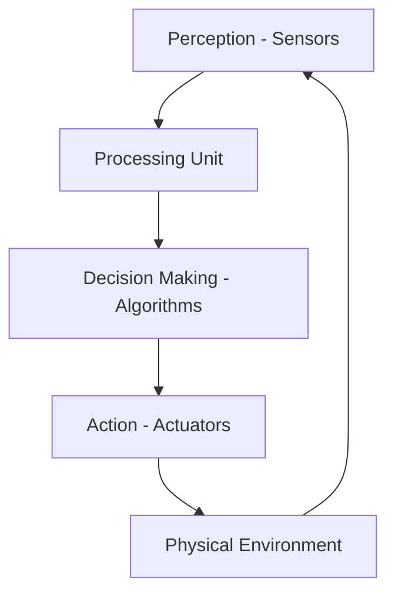

# Embodied Agents - Notes

## Table of Contents (ToC)
- [Introduction](#introduction)
- [Key Concepts](#key-concepts)
- [Applications](#applications)
- [Architecture Pipeline](#learning-map-architecture-pipeline)
- [Framework / Key Theories or Models](#framework-key-theories-or-models)
- [How Embodied Agents Work](#how-embodied-agents-work)
- [Methods, Types & Variations](#methods-types--variations)
- [Self-Practice / Hands-On Examples](#self-practice--hands-on-examples)
- [Pitfalls & Challenges](#pitfalls--challenges)
- [Feedback & Evaluation](#feedback--evaluation)
- [Tools, Libraries & Frameworks](#tools-libraries--frameworks)
- [Hello World! (Practical Example)](#hello-world-practical-example)
- [Advanced Exploration](#advanced-exploration)
- [Zero to Hero Lab Projects](#zero-to-hero-lab-projects)
- [Continuous Learning Strategy](#continuous-learning-strategy)
- [References](#references)

---
- Related Notes: [AI Notes](../ai-notes.md), [Embodied-AI Notes](./core/ai-ml/ai-agents-notes/embodied-agents-notes.md), [AI Agents](../ai-agents-notes/ai-agents-notes.md), [Robotics Notes](../../robotics/robotics-notes.md)

## Introduction
**Embodied agents** are autonomous systems or entities equipped with physical bodies, enabling them to interact with the physical world through sensors and actuators, mimicking human-like behavior and perception.

## Key Concepts
- **Embodiment**: The concept that an agent's intelligence and decision-making processes are grounded in its ability to physically interact with the environment.
- **Perception-Action Loop**: The continuous cycle where agents sense their environment, process information, and take action based on that input.
- **Sensors & Actuators**: Devices used to perceive the environment (sensors) and execute physical actions (actuators).
  
**Misconception**: Embodied agents are often confused with purely virtual agents (like virtual assistants). However, embodied agents have physical bodies and interact directly with their environment.

## Why It Matters / Relevance
- **Robotics**: Embodied agents like robots can physically manipulate objects, explore environments, or assist humans in tasks.
- **Healthcare**: Embodied agents can assist with surgeries, physical rehabilitation, or elder care, making healthcare more effective and accessible.
- **Human-Computer Interaction**: In fields like VR/AR, embodied agents provide more natural and human-like interactions.
- **Autonomous Vehicles**: These are a prominent example of embodied agents navigating and interacting with the physical world.
- **Warehouse Automation**: Agents like robotic arms and mobile robots in logistics environments make processes more efficient.

Mastering embodied agents is vital for advancing fields like robotics, healthcare, and autonomous systems, where interaction with the real world is essential.

## Architecture Pipeline

- **Perception**: Sensors capture data from the physical world.
- **Processing**: Data is processed by the agent’s algorithms (e.g., reinforcement learning).
- **Decision Making**: The agent decides on actions based on its goals and environment.
- **Action**: Actuators are triggered to perform physical actions in the environment.

## Framework / Key Theories or Models
1. **Reactive Agents**: Simple embodied agents that react to environmental stimuli without memory or learning (e.g., robotic vacuum cleaners).
2. **Cognitive Agents**: More advanced agents that maintain a model of the world and plan actions based on goals (e.g., humanoid robots like ASIMO).
3. **Embodied Cognition**: A theory suggesting that an agent's intelligence emerges from its interactions with the world.
4. **Reinforcement Learning**: Embodied agents learn to act in physical environments through trial and error, receiving rewards or penalties.
5. **Behavior-based Robotics**: Focuses on using simple, sensor-driven behaviors to achieve complex tasks in robotics.

## How Embodied Agents Work
1. **Perception of Environment**: Sensors like cameras, LiDAR, and tactile sensors gather information about the agent’s surroundings.
2. **Data Processing and Decision Making**: Algorithms analyze the sensory data, often using neural networks or decision-making frameworks like MDPs (Markov Decision Processes).
3. **Action Execution**: Based on the decision-making process, the agent uses actuators like motors or robotic arms to perform actions.
4. **Feedback Loop**: The agent continuously senses the outcome of its actions and adjusts behavior accordingly, learning from the environment.

## Methods, Types & Variations
- **Humanoid Robots**: Agents designed with a human-like structure to perform tasks in human environments (e.g., social robots).
- **Mobile Robots**: Agents that navigate and move in environments, such as drones or autonomous vehicles.
- **Robotic Arms**: Stationary agents designed for manipulation tasks, commonly used in factories or surgical applications.
- **Bio-inspired Robots**: Agents designed to mimic biological organisms, such as quadruped robots or snake-like robots.

### Contrasting Example:
- **Reactive Robotic Vacuum** vs. **Cognitive Autonomous Vehicle**: The vacuum reacts to obstacles and cleans randomly, whereas the vehicle maps and plans routes based on its surroundings.

## Self-Practice / Hands-On Examples
1. **Basic Exercise**: Program a simple robot (e.g., using LEGO Mindstorms or a simulated robot) to navigate a maze.
2. **Intermediate Exercise**: Build an agent with sensors and actuators that interacts with a physical object (e.g., pick-and-place robot).
3. **Advanced Experimentation**: Create a reinforcement learning agent that learns to walk or balance a robot.

## Pitfalls & Challenges
- **Sensor Reliability**: Inaccurate or faulty sensors can lead to incorrect decisions and failure in tasks.
- **Complex Environments**: Unpredictable or dynamic environments make it challenging for embodied agents to adapt in real-time.
- **Energy Consumption**: Physical tasks often require substantial energy, limiting the autonomy of mobile or robotic agents.

## Feedback & Evaluation
- **Feynman Technique**: Explain how an embodied agent perceives and interacts with its environment to a beginner.
- **Peer Review**: Present your agent’s decision-making logic and physical actions to a peer for critique.
- **Simulation**: Test your embodied agent in a simulated environment (e.g., robotics simulator like Gazebo) before deploying it in the real world.

## Tools, Libraries & Frameworks
- **ROS (Robot Operating System)**: A popular framework for programming embodied agents, especially in robotics.
- **Gazebo**: A simulator for testing robots and embodied agents in virtual environments.
- **PyBullet**: A physics engine for simulating robotics and object interaction.
- **V-REP**: A versatile robotics simulator with extensive support for embodied agents.

### Comparison:
- **ROS**: Ideal for real-world robots with physical sensors and actuators.
- **Gazebo**: Used for simulation but integrates seamlessly with ROS for hardware testing.
- **PyBullet**: Great for reinforcement learning in robotics, with fast simulations of physical interactions.

## Hello World! (Practical Example)
```python
import pybullet as p
import time

# Connect to physics engine (use DIRECT for simulation, GUI for visualization)
physicsClient = p.connect(p.DIRECT)

# Load a basic plane and a robot model
planeId = p.loadURDF("plane.urdf")
robotId = p.loadURDF("r2d2.urdf")

# Basic loop to apply forces and observe agent behavior
for i in range(1000):
    p.stepSimulation()  # Simulate physical environment
    robotPosition, robotOrientation = p.getBasePositionAndOrientation(robotId)
    time.sleep(1./240.)  # Run at 240 Hz

p.disconnect()
```
This example creates a basic simulation of an embodied robot using PyBullet, allowing it to move in a simulated environment.

## Advanced Exploration
1. **"Embodied Cognition: A Field Guide"** (Book)
2. **"Behavior-based Robotics"** by Ronald C. Arkin (Paper)
3. **DeepMind's AlphaGo**: Explore how embodied learning applies in gaming AI and strategic decision making.

## Zero to Hero Lab Projects
- **Beginner**: Program a mobile robot to navigate a room and avoid obstacles using basic sensors.
- **Intermediate**: Build an agent that can autonomously pick and place objects using a robotic arm and visual feedback.
- **Expert**: Develop an embodied agent capable of learning locomotion using reinforcement learning in a physics simulator like PyBullet.

## Continuous Learning Strategy
- **Deep Dive into Robotics**: Study advanced control systems and robot kinematics for more complex embodied agents.
- **Explore Embodied AI**: Research how AI models like reinforcement learning can be applied to physical agents.
- **Join Robotics Competitions**: Engage in robotics competitions like RoboCup or FIRST Robotics to refine your skills in embodied agents.

## References
- **Book**: "Robot Programming: A Guide to Controlling Autonomous Robots" by Cameron Hughes
- **Website**: Robot Operating System (www.ros.org)
- **Research Paper**: "Embodied Cognition and the Origins of Human Experience" by MIT 

- [Intelligent Robotics and Autonomous Agents series - MIT](https://mitpress.mit.edu/series/intelligent-robotics-and-autonomous-agents-series/)

CVPR Embodied AI Workshop: 
- https://www.youtube.com/@embodiedai9326/playlists