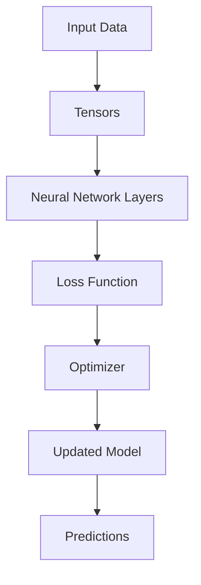

# PyTorch Technical Notes
<!-- [Illustration showing a high-level overview of PyTorch, including tensors, neural network layers, and the training loop.] -->

## Quick Reference
- One-sentence definition: PyTorch is an open-source deep learning framework that provides a flexible and intuitive interface for building and training neural networks.
- Key use cases: Image classification, natural language processing, time series forecasting, and reinforcement learning.
- Prerequisites:  
  - Intermediate: Familiarity with Python, neural networks, and basic PyTorch usage.

## Table of Contents
1. Introduction  
2. Core Concepts  
   - Fundamental Understanding  
   - Visual Architecture  
3. Implementation Details  
   - Intermediate Patterns  
4. Real-World Applications  
   - Industry Examples  
   - Hands-On Project  
5. Tools & Resources  
6. References  
7. Appendix  

---

## Introduction
### What: Core Definition and Purpose
PyTorch is an open-source deep learning framework developed by Facebook's AI Research lab. It provides a flexible and intuitive interface for building and training neural networks, making it popular among researchers and practitioners.

### Why: Problem It Solves/Value Proposition
PyTorch simplifies the process of building and training neural networks by providing a dynamic computation graph, which allows for more intuitive debugging and faster experimentation compared to static graph frameworks.

### Where: Application Domains
PyTorch is widely used in:
- Image Classification: Identifying objects in images.
- Natural Language Processing: Sentiment analysis, text generation.
- Time Series Forecasting: Predicting future values based on historical data.
- Reinforcement Learning: Training agents to make decisions in environments.

---

## Core Concepts
### Fundamental Understanding
- **Basic Principles**:  
  - Tensors: The fundamental data structure in PyTorch, similar to NumPy arrays but with GPU acceleration.  
  - Autograd: Automatic differentiation library that computes gradients for optimization.  
  - Neural Network Modules: Predefined layers and loss functions for building models.  

- **Key Components**:  
  - Tensors: Multi-dimensional arrays used to store and manipulate data.  
  - Models: Collections of layers that define the architecture of a neural network.  
  - Optimizers: Algorithms used to update model parameters during training (e.g., SGD, Adam).  

- **Common Misconceptions**:  
  - PyTorch is only for research: While popular in research, PyTorch is also used in production.  
  - PyTorch is harder to learn than other frameworks: PyTorch's dynamic nature makes it more intuitive for many users.  

### Visual Architecture


---

## Implementation Details
### Intermediate Patterns [Intermediate]
```python
import torch
import torch.nn as nn
import torch.optim as optim
from torch.utils.data import DataLoader, TensorDataset

# Define a more complex neural network
class IntermediateNet(nn.Module):
    def __init__(self):
        super(IntermediateNet, self).__init__()
        self.fc1 = nn.Linear(10, 50)
        self.fc2 = nn.Linear(50, 50)
        self.fc3 = nn.Linear(50, 1)
        self.dropout = nn.Dropout(0.5)

    def forward(self, x):
        x = torch.relu(self.fc1(x))
        x = self.dropout(x)
        x = torch.relu(self.fc2(x))
        x = self.dropout(x)
        x = self.fc3(x)
        return x

# Initialize the model, loss function, and optimizer
model = IntermediateNet()
criterion = nn.MSELoss()
optimizer = optim.Adam(model.parameters(), lr=0.001)

# Example training data
x_train = torch.randn(100, 10)
y_train = torch.randn(100, 1)

# Create DataLoader
dataset = TensorDataset(x_train, y_train)
dataloader = DataLoader(dataset, batch_size=32, shuffle=True)

# Training loop
for epoch in range(10):
    for batch_x, batch_y in dataloader:
        optimizer.zero_grad()
        outputs = model(batch_x)
        loss = criterion(outputs, batch_y)
        loss.backward()
        optimizer.step()
    print(f'Epoch {epoch+1}, Loss: {loss.item()}')

# Make predictions
x_test = torch.randn(10, 10)
predictions = model(x_test)
print(predictions)
```

- **Design Patterns**:  
  - Dropout: A regularization technique to prevent overfitting.  
  - DataLoader: Efficiently handles batching and shuffling of data.  

- **Best Practices**:  
  - Use dropout and other regularization techniques to improve generalization.  
  - Monitor training and validation loss to detect overfitting.  

- **Performance Considerations**:  
  - Use batch normalization to stabilize training.  
  - Experiment with different learning rates and optimizers.  

---

## Real-World Applications
### Industry Examples
- **Image Classification**: Classifying images into categories (e.g., cats vs. dogs).  
- **Text Analysis**: Sentiment analysis on customer reviews.  
- **Time Series Forecasting**: Predicting stock prices or weather patterns.  

### Hands-On Project
- **Project Goals**: Build a PyTorch model to classify handwritten digits using the MNIST dataset.  
- **Implementation Steps**:  
  1. Load and preprocess the MNIST dataset.  
  2. Define a convolutional neural network (CNN) using PyTorch.  
  3. Train the model and evaluate its performance.  
- **Validation Methods**: Use accuracy as the evaluation metric.  

---

## Tools & Resources
### Essential Tools
- **Development Environment**: Python, Jupyter Notebook, PyTorch.  
- **Key Frameworks**: PyTorch, torchvision.  
- **Testing Tools**: pytest, unittest.  

### Learning Resources
- **Documentation**: [PyTorch Documentation](https://pytorch.org/docs/stable/index.html).  
- **Tutorials**: "Deep Learning with PyTorch: A 60 Minute Blitz" by PyTorch.  
- **Community Resources**: Stack Overflow, GitHub repositories.  

---

## References
- Official documentation: [PyTorch Documentation](https://pytorch.org/docs/stable/index.html).  
- Technical papers: "PyTorch: An Imperative Style, High-Performance Deep Learning Library" by Paszke et al.  
- Industry standards: PyTorch applications in image classification and text analysis.  

---

## Appendix
### Glossary
- **Tensor**: A multi-dimensional array used in PyTorch.  
- **Autograd**: Automatic differentiation library in PyTorch.  
- **Optimizer**: An algorithm used to update model parameters during training.  

### Setup Guides
- Install PyTorch: `pip install torch`.  

### Code Templates
- Intermediate PyTorch model template available on GitHub.  
