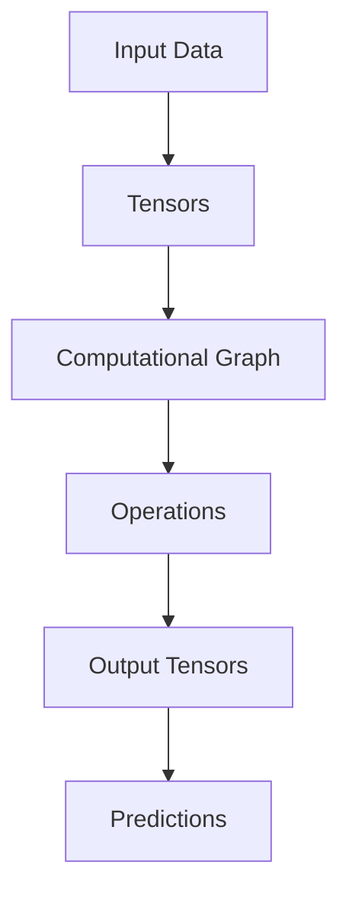

# TensorFlow Technical Notes
<!-- [Illustration showing a high-level overview of TensorFlow, including tensors, computational graphs, and neural network layers.] -->

## Quick Reference
- One-sentence definition: TensorFlow is an open-source deep learning framework that provides a comprehensive ecosystem for building and training machine learning models.
- Key use cases: Image classification, natural language processing, time series forecasting, and recommendation systems.
- Prerequisites:  
  - Beginner: Basic understanding of Python and machine learning concepts.

## Table of Contents
1. Introduction  
2. Core Concepts  
   - Fundamental Understanding  
   - Visual Architecture  
3. Implementation Details  
   - Basic Implementation  
4. Real-World Applications  
   - Industry Examples  
   - Hands-On Project  
5. Tools & Resources  
6. References  
7. Appendix  

---

## Introduction
### What: Core Definition and Purpose
TensorFlow is an open-source deep learning framework developed by Google. It provides a comprehensive ecosystem for building and training machine learning models, from simple linear regression to complex neural networks.

### Why: Problem It Solves/Value Proposition
TensorFlow simplifies the process of building and training machine learning models by providing a flexible and scalable platform. It supports a wide range of hardware, from CPUs to GPUs and TPUs, making it suitable for both research and production.

### Where: Application Domains
TensorFlow is widely used in:
- Image Classification: Identifying objects in images.
- Natural Language Processing: Sentiment analysis, text generation.
- Time Series Forecasting: Predicting future values based on historical data.
- Recommendation Systems: Personalizing user recommendations.

---

## Core Concepts
### Fundamental Understanding
- **Basic Principles**:  
  - Tensors: The fundamental data structure in TensorFlow, similar to multi-dimensional arrays.  
  - Computational Graph: A directed acyclic graph (DAG) that represents the flow of data and operations.  
  - Sessions: Contexts in which computational graphs are executed.  

- **Key Components**:  
  - Tensors: Multi-dimensional arrays used to store and manipulate data.  
  - Layers: Predefined building blocks for constructing neural networks (e.g., Dense, Conv2D).  
  - Optimizers: Algorithms used to update model parameters during training (e.g., SGD, Adam).  

- **Common Misconceptions**:  
  - TensorFlow is only for deep learning: TensorFlow supports a wide range of machine learning algorithms, not just deep learning.  
  - TensorFlow is hard to learn: TensorFlow's high-level APIs like Keras make it accessible to beginners.  

### Visual Architecture


---

## Implementation Details
### Basic Implementation [Beginner]
```python
import tensorflow as tf
from tensorflow.keras import layers, models

# Define a simple neural network
model = models.Sequential([
    layers.Dense(64, activation='relu', input_shape=(10,)),  # Input layer
    layers.Dense(64, activation='relu'),  # Hidden layer
    layers.Dense(1)  # Output layer
])

# Compile the model
model.compile(optimizer='adam',
              loss='mean_squared_error',
              metrics=['accuracy'])

# Example training data
import numpy as np
x_train = np.random.rand(100, 10)
y_train = np.random.rand(100, 1)

# Train the model
model.fit(x_train, y_train, epochs=10, batch_size=32)

# Make predictions
x_test = np.random.rand(10, 10)
predictions = model.predict(x_test)
print(predictions)
```

- **Step-by-Step Setup**:  
  1. Define the model architecture using the `Sequential` API.  
  2. Compile the model by specifying the optimizer, loss function, and metrics.  
  3. Train the model using the `fit` method.  
  4. Make predictions using the `predict` method.  

- **Code Walkthrough**:  
  - The `Sequential` model is a linear stack of layers.  
  - The `Dense` layer is a fully connected layer with 64 units and ReLU activation.  
  - The model is trained using the Adam optimizer and Mean Squared Error loss.  

- **Common Pitfalls**:  
  - Overfitting: Use techniques like dropout or regularization to prevent overfitting.  
  - Data Preprocessing: Ensure input data is properly scaled and formatted.  

---

## Real-World Applications
### Industry Examples
- **Image Classification**: Classifying images into categories (e.g., cats vs. dogs).  
- **Text Analysis**: Sentiment analysis on customer reviews.  
- **Time Series Forecasting**: Predicting stock prices or weather patterns.  

### Hands-On Project
- **Project Goals**: Build a TensorFlow model to classify handwritten digits using the MNIST dataset.  
- **Implementation Steps**:  
  1. Load and preprocess the MNIST dataset.  
  2. Define a simple neural network using TensorFlow.  
  3. Train the model and evaluate its performance.  
- **Validation Methods**: Use accuracy as the evaluation metric.  

---

## Tools & Resources
### Essential Tools
- **Development Environment**: Python, Jupyter Notebook, TensorFlow.  
- **Key Frameworks**: TensorFlow, Keras.  
- **Testing Tools**: pytest, unittest.  

### Learning Resources
- **Documentation**: [TensorFlow Documentation](https://www.tensorflow.org/api_docs).  
- **Tutorials**: "Getting Started with TensorFlow" by TensorFlow.  
- **Community Resources**: Stack Overflow, GitHub repositories.  

---

## References
- Official documentation: [TensorFlow Documentation](https://www.tensorflow.org/api_docs).  
- Technical papers: "TensorFlow: Large-Scale Machine Learning on Heterogeneous Distributed Systems" by Abadi et al.  
- Industry standards: TensorFlow applications in image classification and text analysis.  

---

## Appendix
### Glossary
- **Tensor**: A multi-dimensional array used in TensorFlow.  
- **Computational Graph**: A directed acyclic graph (DAG) that represents the flow of data and operations.  
- **Session**: A context in which computational graphs are executed.  

### Setup Guides
- Install TensorFlow: `pip install tensorflow`.  

### Code Templates
- Basic TensorFlow model template available on GitHub.  
