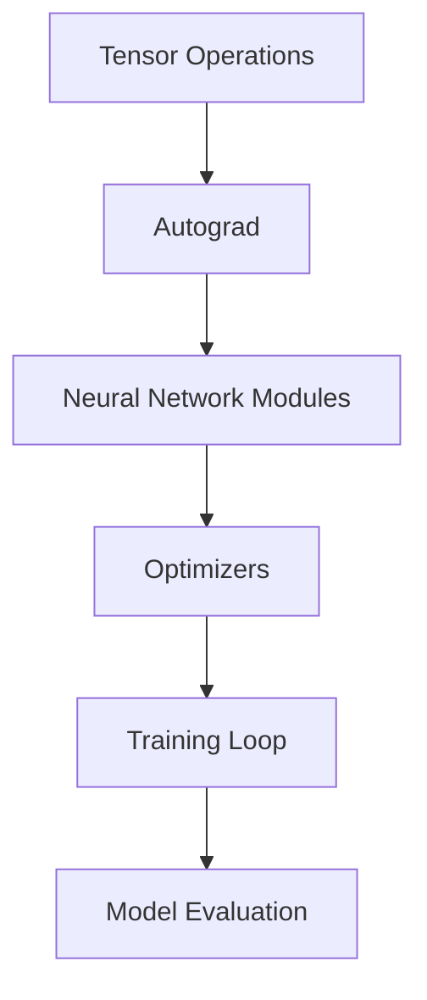

# PyTorch Technical Notes
<!-- [A rectangular image showing the PyTorch logo, a tensor visualization, and code snippets on a dark background, representing the core concepts of PyTorch for beginners] -->

## Quick Reference
- PyTorch is a powerful deep learning library for Python, focusing on tensor computations and neural networks[1][5].
- Key use cases: Computer vision, natural language processing, and machine learning tasks[2][6].
- Prerequisites: Basic Python knowledge and understanding of fundamental machine learning concepts[4].

## Introduction
PyTorch is an open-source machine learning library developed by Facebook's AI Research Group, now managed by the PyTorch Foundation[9]. It provides a flexible and efficient framework for building and training neural networks, with a focus on ease of use and dynamic computation graphs[8].

## Core Concepts

### Fundamental Understanding
- Tensors: The basic building blocks of PyTorch, similar to NumPy arrays but capable of running on GPUs[1][3].
- Autograd: Automatic differentiation engine for computing gradients[7].
- Neural Network Modules: Pre-built layers and functions for constructing complex models[6].

### Visual Architecture


## Implementation Details

### Basic Implementation
```python
import torch

# Create a tensor
x = torch.tensor([[1, 2], [3, 4]])
print(x)

# Define a simple neural network
class SimpleNet(torch.nn.Module):
    def __init__(self, input_size, hidden_size, output_size):
        super(SimpleNet, self).__init__()
        self.fc1 = torch.nn.Linear(input_size, hidden_size)
        self.fc2 = torch.nn.Linear(hidden_size, output_size)

    def forward(self, x):
        x = torch.nn.functional.relu(self.fc1(x))
        x = self.fc2(x)
        return x

# Create an instance of the model
model = SimpleNet(10, 5, 2)
print(model)
```

This basic implementation demonstrates tensor creation and a simple neural network definition using PyTorch[3].

## Real-World Applications

### Industry Examples
- Image classification in computer vision tasks[2].
- Natural language processing for text analysis and generation[2].
- Time series forecasting in finance and weather prediction[6].

### Hands-On Project
Let's create a simple project to classify handwritten digits using the MNIST dataset:

1. Import required libraries
2. Load and preprocess the MNIST dataset
3. Define a convolutional neural network
4. Train the model on the dataset
5. Evaluate the model's performance

## Tools & Resources

### Essential Tools
- PyTorch installation: `pip3 install torch torchvision torchaudio`[1][3].
- Integrated Development Environments (IDEs) like PyCharm or Jupyter Notebooks[4].
- Version control systems like Git for code management[4].

### Learning Resources
- Official PyTorch documentation and tutorials[5].
- Online courses on platforms like Coursera[4].
- Community forums and GitHub repositories for examples and discussions[2][5].

By following this guide, beginners can gain a solid foundation in PyTorch's core concepts and start building their own deep learning models.

## References

- [1] https://www.geeksforgeeks.org/start-learning-pytorch-for-beginners/
- [2] https://github.com/mrdbourke/pytorch-deep-learning/
- [3] https://www.kdnuggets.com/a-beginners-guide-to-pytorch
- [4] https://www.coursera.org/learn/packt-foundations-and-core-concepts-of-pytorch-jmkne
- [5] https://pytorch.org/tutorials/
- [6] https://www.restack.io/p/pytorch-answer-tutorial-pdf
- [7] https://pytorch.org/tutorials/beginner/pytorch_with_examples.html
- [8] https://www.techtarget.com/searchenterpriseai/definition/PyTorch
- [9] https://www.dataquest.io/blog/pytorch-for-beginners/