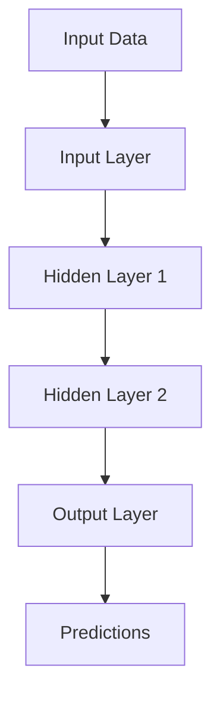

# Keras Technical Notes
<!-- [Illustration showing a high-level overview of Keras, including input data flowing through layers, activation functions, and output predictions.] -->

## Quick Reference
- One-sentence definition: Keras is a high-level deep learning framework that provides an intuitive API for building and training neural networks.
- Key use cases: Image classification, text analysis, time series forecasting, and recommendation systems.
- Prerequisites:  
  - Beginner: Basic understanding of Python and machine learning concepts.

## Table of Contents
1. [Introduction](#introduction)  
2. [Core Concepts](#core-concepts)  
  - [Fundamental Understanding](#fundamental-understanding)  
  - [Visual Architecture](#visual-architecture)  
3. [Implementation Details](#implementation-details)  
  - [Basic Implementation](#basic-implementation)  
4. [Real-World Applications](#real-world-applications)  
  - [Industry Examples](#industry-examples)  
  - [Hands-On Project](#hands-on-project)  
5. [Tools & Resources](#tools--resources)  
6. [References](#references)  
7. [Appendix](#appendix)  

## Introduction
### What: Core Definition and Purpose
Keras is an open-source deep learning framework designed to enable fast experimentation with neural networks. It provides a user-friendly interface for building and training models, making it ideal for beginners and researchers.

### Why: Problem It Solves/Value Proposition
Keras simplifies the process of building and training neural networks by abstracting away much of the complexity. It allows users to focus on designing models rather than dealing with low-level implementation details.

### Where: Application Domains
Keras is widely used in:
- Image Classification: Identifying objects in images.
- Text Analysis: Sentiment analysis, text generation.
- Time Series Forecasting: Predicting future values based on historical data.
- Recommendation Systems: Personalizing user recommendations.

## Core Concepts
### Fundamental Understanding
- **Basic Principles**:  
  - Layers: The building blocks of neural networks (e.g., Dense, Conv2D, LSTM).  
  - Models: A collection of layers that define the architecture of a neural network.  
  - Optimizers: Algorithms used to update model parameters during training (e.g., Adam, SGD).  
  - Loss Functions: Measures of how well the model is performing (e.g., Mean Squared Error, Cross-Entropy).  

- **Key Components**:  
  - Input Layer: The starting point of the model where data is fed in.  
  - Hidden Layers: Intermediate layers that transform the input data.  
  - Output Layer: The final layer that produces the model's predictions.  

- **Common Misconceptions**:  
  - Keras is a standalone framework: Keras is now part of TensorFlow and is often referred to as TensorFlow Keras.  
  - Keras is only for beginners: While Keras is beginner-friendly, it is also powerful enough for advanced use cases.  

### Visual Architecture


## Implementation Details
### Basic Implementation [Beginner]
```python
import tensorflow as tf
from tensorflow.keras import layers, models

# Define a simple sequential model
model = models.Sequential([
    layers.Dense(64, activation='relu', input_shape=(10,)),  # Input layer
    layers.Dense(64, activation='relu'),  # Hidden layer
    layers.Dense(1)  # Output layer
])

# Compile the model
model.compile(optimizer='adam',
              loss='mean_squared_error',
              metrics=['accuracy'])

# Example training data
import numpy as np
x_train = np.random.rand(100, 10)
y_train = np.random.rand(100, 1)

# Train the model
model.fit(x_train, y_train, epochs=10, batch_size=32)

# Make predictions
x_test = np.random.rand(10, 10)
predictions = model.predict(x_test)
print(predictions)
```

- **Step-by-Step Setup**:  
  1. Define the model architecture using the `Sequential` API.  
  2. Compile the model by specifying the optimizer, loss function, and metrics.  
  3. Train the model using the `fit` method.  
  4. Make predictions using the `predict` method.  

- **Code Walkthrough**:  
  - The `Sequential` model is a linear stack of layers.  
  - The `Dense` layer is a fully connected layer with 64 units and ReLU activation.  
  - The model is trained using the Adam optimizer and Mean Squared Error loss.  

- **Common Pitfalls**:  
  - Overfitting: Use techniques like dropout or regularization to prevent overfitting.  
  - Data Preprocessing: Ensure input data is properly scaled and formatted.  

## Real-World Applications
### Industry Examples
- **Image Classification**: Classifying images into categories (e.g., cats vs. dogs).  
- **Text Analysis**: Sentiment analysis on customer reviews.  
- **Time Series Forecasting**: Predicting stock prices or weather patterns.  

### Hands-On Project
- **Project Goals**: Build a Keras model to classify handwritten digits using the MNIST dataset.  
- **Implementation Steps**:  
  1. Load and preprocess the MNIST dataset.  
  2. Define a simple neural network using Keras.  
  3. Train the model and evaluate its performance.  
- **Validation Methods**: Use accuracy as the evaluation metric.  

## Tools & Resources
### Essential Tools
- **Development Environment**: Python, Jupyter Notebook, TensorFlow.  
- **Key Frameworks**: TensorFlow Keras.  
- **Testing Tools**: pytest, unittest.  

### Learning Resources
- **Documentation**: [Keras Documentation](https://keras.io).  
- **Tutorials**: "Getting Started with Keras" by TensorFlow.  
- **Community Resources**: Stack Overflow, GitHub repositories.  

## References
- Official documentation: [Keras Documentation](https://keras.io).  
- Technical papers: "Deep Learning with Keras" by François Chollet.  
- Industry standards: Keras applications in image classification and text analysis.  

## Appendix
### Glossary
- **Layer**: A building block of a neural network.  
- **Model**: A collection of layers that define the architecture of a neural network.  
- **Optimizer**: An algorithm used to update model parameters during training.  

### Setup Guides
- Install TensorFlow: `pip install tensorflow`.  

### Code Templates
- Basic Keras model template available on GitHub.  
