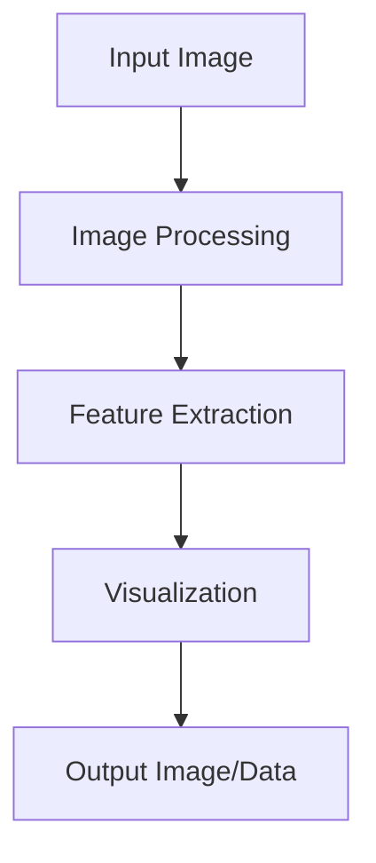

# scikit-image Technical Notes
<!-- [Illustration showing a high-level overview of scikit-image, including image processing, feature extraction, and visualization.] -->

## Quick Reference
- One-sentence definition: scikit-image is an open-source image processing library for Python that provides a comprehensive set of algorithms for image manipulation, analysis, and visualization.
- Key use cases: Image filtering, segmentation, feature extraction, and visualization.
- Prerequisites:  
  - Intermediate: Familiarity with Python, image processing concepts, and basic scikit-image usage.

## Table of Contents
1. Introduction  
2. Core Concepts  
   - Fundamental Understanding  
   - Visual Architecture  
3. Implementation Details  
   - Intermediate Patterns  
4. Real-World Applications  
   - Industry Examples  
   - Hands-On Project  
5. Tools & Resources  
6. References  
7. Appendix  

---

## Introduction
### What: Core Definition and Purpose
scikit-image is an open-source image processing library for Python. It provides a wide range of algorithms for image manipulation, analysis, and visualization, making it a popular choice for scientific and industrial applications.

### Why: Problem It Solves/Value Proposition
scikit-image simplifies the process of developing image processing applications by providing a comprehensive set of functions and algorithms. It is designed to be easy to use and integrates well with other scientific Python libraries.

### Where: Application Domains
scikit-image is widely used in:
- Medical Imaging: Enhancing and analyzing medical images.
- Remote Sensing: Processing satellite and aerial imagery.
- Industrial Inspection: Detecting defects in manufactured products.
- Scientific Research: Analyzing microscopy images.

---

## Core Concepts
### Fundamental Understanding
- **Basic Principles**:  
  - Image Representation: Images are represented as NumPy arrays.  
  - Image Processing: Techniques for manipulating images to extract useful information.  
  - Feature Extraction: Identifying key points and features in images.  

- **Key Components**:  
  - Image I/O: Reading and writing images.  
  - Image Processing: Functions for filtering, transformation, and enhancement.  
  - Feature Extraction: Algorithms for detecting edges, corners, and other features.  

- **Common Misconceptions**:  
  - scikit-image is only for scientific research: scikit-image is also used in industrial applications.  
  - scikit-image is hard to learn: scikit-image's API is designed to be intuitive and easy to use.  

### Visual Architecture


---

## Implementation Details
### Intermediate Patterns [Intermediate]
```python
import numpy as np
import matplotlib.pyplot as plt
from skimage import io, filters, segmentation, color

# Read an image from file
image = io.imread('image.jpg')

# Convert the image to grayscale
gray_image = color.rgb2gray(image)

# Apply Gaussian blur to the image
blurred_image = filters.gaussian(gray_image, sigma=1)

# Detect edges in the image using the Sobel filter
edges = filters.sobel(blurred_image)

# Perform image segmentation using Felzenszwalb's algorithm
segments = segmentation.felzenszwalb(image, scale=100, sigma=0.5, min_size=50)

# Display the original and processed images
fig, axes = plt.subplots(1, 4, figsize=(20, 5))
axes[0].imshow(image)
axes[0].set_title('Original Image')
axes[1].imshow(blurred_image, cmap='gray')
axes[1].set_title('Blurred Image')
axes[2].imshow(edges, cmap='gray')
axes[2].set_title('Edges')
axes[3].imshow(segments, cmap='nipy_spectral')
axes[3].set_title('Segments')
plt.show()
```

- **Design Patterns**:  
  - Image Segmentation: Dividing an image into multiple regions or objects.  
  - Edge Detection: Using the Sobel filter to identify edges.  

- **Best Practices**:  
  - Use appropriate parameters for segmentation to balance detail and noise.  
  - Visualize intermediate results to debug and optimize processing steps.  

- **Performance Considerations**:  
  - Optimize image processing steps to reduce computational load.  
  - Use efficient algorithms for feature detection and segmentation.  

---

## Real-World Applications
### Industry Examples
- **Medical Imaging**: Enhancing and analyzing medical images for better diagnosis.  
- **Remote Sensing**: Processing satellite and aerial imagery for environmental monitoring.  
- **Industrial Inspection**: Detecting defects in manufactured products.  
- **Scientific Research**: Analyzing microscopy images in biological research.  

### Hands-On Project
- **Project Goals**: Build a scikit-image application to segment an image into regions.  
- **Implementation Steps**:  
  1. Load an image and convert it to grayscale.  
  2. Apply Gaussian blur to the image.  
  3. Perform image segmentation using Felzenszwalb's algorithm.  
  4. Display the original and processed images.  
- **Validation Methods**: Visual inspection of the output image.  

---

## Tools & Resources
### Essential Tools
- **Development Environment**: Python, Jupyter Notebook, scikit-image.  
- **Key Frameworks**: scikit-image, NumPy, matplotlib.  
- **Testing Tools**: pytest, unittest.  

### Learning Resources
- **Documentation**: [scikit-image Documentation](https://scikit-image.org/docs/stable/).  
- **Tutorials**: "Getting Started with scikit-image" by scikit-image.  
- **Community Resources**: Stack Overflow, GitHub repositories.  

---

## References
- Official documentation: [scikit-image Documentation](https://scikit-image.org/docs/stable/).  
- Technical papers: "scikit-image: Image processing in Python" by van der Walt et al.  
- Industry standards: scikit-image applications in medical imaging and remote sensing.  

---

## Appendix
### Glossary
- **Image I/O**: Reading and writing images.  
- **Image Processing**: Techniques for manipulating images to extract useful information.  
- **Feature Extraction**: Identifying key points and features in images.  

### Setup Guides
- Install scikit-image: `pip install scikit-image`.  

### Code Templates
- Intermediate scikit-image image processing template available on GitHub.  
