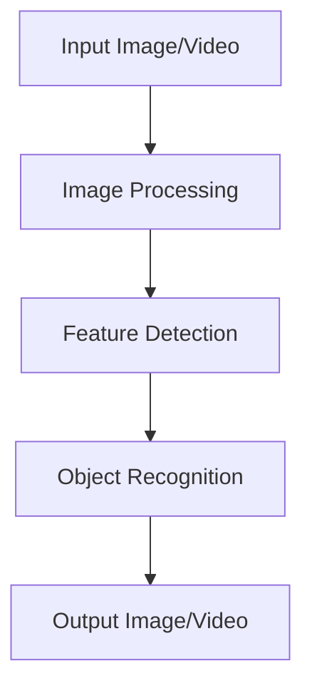

# OpenCV Technical Notes
<!-- [Illustration showing a high-level overview of OpenCV, including image processing, feature detection, and object recognition.] -->

## Quick Reference
- One-sentence definition: OpenCV (Open Source Computer Vision Library) is an open-source computer vision and machine learning software library designed to provide a common infrastructure for computer vision applications.
- Key use cases: Image processing, video analysis, object detection, and facial recognition.
- Prerequisites:  
  - Beginner: Basic understanding of Python and image processing concepts.

## Table of Contents
1. Introduction  
2. Core Concepts  
   - Fundamental Understanding  
   - Visual Architecture  
3. Implementation Details  
   - Basic Implementation  
4. Real-World Applications  
   - Industry Examples  
   - Hands-On Project  
5. Tools & Resources  
6. References  
7. Appendix  

---

## Introduction
### What: Core Definition and Purpose
OpenCV is an open-source computer vision and machine learning software library. It provides a wide range of tools and functions for image and video processing, making it a popular choice for computer vision tasks.

### Why: Problem It Solves/Value Proposition
OpenCV simplifies the process of developing computer vision applications by providing a comprehensive set of functions and algorithms. It is optimized for performance and supports a wide range of platforms, making it suitable for both research and production.

### Where: Application Domains
OpenCV is widely used in:
- Image Processing: Filtering, transformation, and enhancement.
- Video Analysis: Motion detection, object tracking.
- Object Detection: Identifying objects in images and videos.
- Facial Recognition: Detecting and recognizing faces.

---

## Core Concepts
### Fundamental Understanding
- **Basic Principles**:  
  - Image Representation: Images are represented as multi-dimensional arrays (e.g., NumPy arrays in Python).  
  - Image Processing: Techniques for manipulating images to extract useful information.  
  - Feature Detection: Identifying key points and features in images.  

- **Key Components**:  
  - Image I/O: Reading and writing images and videos.  
  - Image Processing: Functions for filtering, transformation, and enhancement.  
  - Feature Detection: Algorithms for detecting edges, corners, and other features.  

- **Common Misconceptions**:  
  - OpenCV is only for image processing: OpenCV also supports video processing, machine learning, and more.  
  - OpenCV is hard to learn: OpenCV's Python bindings make it accessible to beginners.  

### Visual Architecture


---

## Implementation Details
### Basic Implementation [Beginner]
```python
import cv2

# Read an image from file
image = cv2.imread('image.jpg')

# Convert the image to grayscale
gray_image = cv2.cvtColor(image, cv2.COLOR_BGR2GRAY)

# Apply Gaussian blur to the image
blurred_image = cv2.GaussianBlur(gray_image, (5, 5), 0)

# Detect edges in the image using Canny edge detection
edges = cv2.Canny(blurred_image, 100, 200)

# Display the original and processed images
cv2.imshow('Original Image', image)
cv2.imshow('Edges', edges)

# Wait for a key press and close the windows
cv2.waitKey(0)
cv2.destroyAllWindows()
```

- **Step-by-Step Setup**:  
  1. Read an image from a file using `cv2.imread`.  
  2. Convert the image to grayscale using `cv2.cvtColor`.  
  3. Apply Gaussian blur to the image using `cv2.GaussianBlur`.  
  4. Detect edges in the image using `cv2.Canny`.  
  5. Display the original and processed images using `cv2.imshow`.  

- **Code Walkthrough**:  
  - The image is read and converted to grayscale to simplify processing.  
  - Gaussian blur is applied to reduce noise and smooth the image.  
  - Canny edge detection is used to identify edges in the image.  

- **Common Pitfalls**:  
  - File Path Issues: Ensure the correct file path is provided when reading images.  
  - Image Display: Use `cv2.waitKey` and `cv2.destroyAllWindows` to properly display and close image windows.  

---

## Real-World Applications
### Industry Examples
- **Image Processing**: Enhancing medical images for better diagnosis.  
- **Video Analysis**: Detecting motion in surveillance videos.  
- **Object Detection**: Identifying objects in autonomous vehicles.  
- **Facial Recognition**: Unlocking smartphones using facial recognition.  

### Hands-On Project
- **Project Goals**: Build a simple OpenCV application to detect faces in an image.  
- **Implementation Steps**:  
  1. Load a pre-trained Haar cascade classifier for face detection.  
  2. Read an image and convert it to grayscale.  
  3. Detect faces in the image using the classifier.  
  4. Draw rectangles around the detected faces.  
- **Validation Methods**: Visual inspection of the output image.  

---

## Tools & Resources
### Essential Tools
- **Development Environment**: Python, Jupyter Notebook, OpenCV.  
- **Key Frameworks**: OpenCV, NumPy.  
- **Testing Tools**: pytest, unittest.  

### Learning Resources
- **Documentation**: [OpenCV Documentation](https://docs.opencv.org/).  
- **Tutorials**: "OpenCV Python Tutorials" by OpenCV.  
- **Community Resources**: Stack Overflow, GitHub repositories.  

---

## References
- Official documentation: [OpenCV Documentation](https://docs.opencv.org/).  
- Technical papers: "Learning OpenCV: Computer Vision with the OpenCV Library" by Bradski and Kaehler.  
- Industry standards: OpenCV applications in image processing and object detection.  

---

## Appendix
### Glossary
- **Image I/O**: Reading and writing images and videos.  
- **Image Processing**: Techniques for manipulating images to extract useful information.  
- **Feature Detection**: Identifying key points and features in images.  

### Setup Guides
- Install OpenCV: `pip install opencv-python`.  

### Code Templates
- Basic OpenCV image processing template available on GitHub.  
