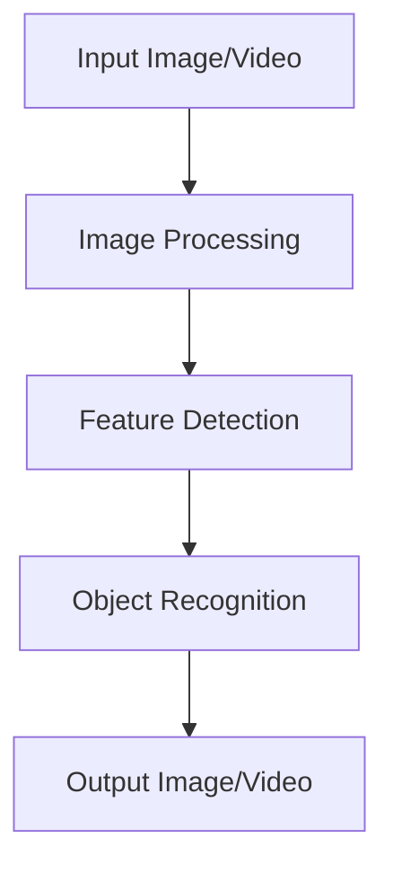

# OpenCV Technical Notes
<!-- [Illustration showing a high-level overview of OpenCV, including image processing, feature detection, and object recognition.] -->

## Quick Reference
- One-sentence definition: OpenCV (Open Source Computer Vision Library) is an open-source computer vision and machine learning software library designed to provide a common infrastructure for computer vision applications.
- Key use cases: Image processing, video analysis, object detection, and facial recognition.
- Prerequisites:  
  - Intermediate: Familiarity with Python, image processing concepts, and basic OpenCV usage.

## Table of Contents
1. Introduction  
2. Core Concepts  
   - Fundamental Understanding  
   - Visual Architecture  
3. Implementation Details  
   - Intermediate Patterns  
4. Real-World Applications  
   - Industry Examples  
   - Hands-On Project  
5. Tools & Resources  
6. References  
7. Appendix  

---

## Introduction
### What: Core Definition and Purpose
OpenCV is an open-source computer vision and machine learning software library. It provides a wide range of tools and functions for image and video processing, making it a popular choice for computer vision tasks.

### Why: Problem It Solves/Value Proposition
OpenCV simplifies the process of developing computer vision applications by providing a comprehensive set of functions and algorithms. It is optimized for performance and supports a wide range of platforms, making it suitable for both research and production.

### Where: Application Domains
OpenCV is widely used in:
- Image Processing: Filtering, transformation, and enhancement.
- Video Analysis: Motion detection, object tracking.
- Object Detection: Identifying objects in images and videos.
- Facial Recognition: Detecting and recognizing faces.

---

## Core Concepts
### Fundamental Understanding
- **Basic Principles**:  
  - Image Representation: Images are represented as multi-dimensional arrays (e.g., NumPy arrays in Python).  
  - Image Processing: Techniques for manipulating images to extract useful information.  
  - Feature Detection: Identifying key points and features in images.  

- **Key Components**:  
  - Image I/O: Reading and writing images and videos.  
  - Image Processing: Functions for filtering, transformation, and enhancement.  
  - Feature Detection: Algorithms for detecting edges, corners, and other features.  

- **Common Misconceptions**:  
  - OpenCV is only for image processing: OpenCV also supports video processing, machine learning, and more.  
  - OpenCV is hard to learn: OpenCV's Python bindings make it accessible to beginners.  

### Visual Architecture


---

## Implementation Details
### Intermediate Patterns [Intermediate]
```python
import cv2
import numpy as np

# Read an image from file
image = cv2.imread('image.jpg')

# Convert the image to grayscale
gray_image = cv2.cvtColor(image, cv2.COLOR_BGR2GRAY)

# Apply Gaussian blur to the image
blurred_image = cv2.GaussianBlur(gray_image, (5, 5), 0)

# Detect edges in the image using Canny edge detection
edges = cv2.Canny(blurred_image, 100, 200)

# Find contours in the edges image
contours, _ = cv2.findContours(edges, cv2.RETR_TREE, cv2.CHAIN_APPROX_SIMPLE)

# Draw contours on the original image
contour_image = cv2.drawContours(image.copy(), contours, -1, (0, 255, 0), 2)

# Display the original and processed images
cv2.imshow('Original Image', image)
cv2.imshow('Edges', edges)
cv2.imshow('Contours', contour_image)

# Wait for a key press and close the windows
cv2.waitKey(0)
cv2.destroyAllWindows()
```

- **Design Patterns**:  
  - Contour Detection: Identifying and drawing contours around objects in an image.  
  - Edge Detection: Using Canny edge detection to identify edges.  

- **Best Practices**:  
  - Use Gaussian blur to reduce noise before edge detection.  
  - Draw contours on a copy of the original image to preserve the original.  

- **Performance Considerations**:  
  - Optimize image processing steps to reduce computational load.  
  - Use appropriate threshold values for edge detection to balance detail and noise.  

---

## Real-World Applications
### Industry Examples
- **Image Processing**: Enhancing medical images for better diagnosis.  
- **Video Analysis**: Detecting motion in surveillance videos.  
- **Object Detection**: Identifying objects in autonomous vehicles.  
- **Facial Recognition**: Unlocking smartphones using facial recognition.  

### Hands-On Project
- **Project Goals**: Build an OpenCV application to detect and track objects in a video stream.  
- **Implementation Steps**:  
  1. Capture video from a webcam or video file.  
  2. Apply background subtraction to detect moving objects.  
  3. Track detected objects across frames.  
- **Validation Methods**: Visual inspection of the output video.  

---

## Tools & Resources
### Essential Tools
- **Development Environment**: Python, Jupyter Notebook, OpenCV.  
- **Key Frameworks**: OpenCV, NumPy.  
- **Testing Tools**: pytest, unittest.  

### Learning Resources
- **Documentation**: [OpenCV Documentation](https://docs.opencv.org/).  
- **Tutorials**: "OpenCV Python Tutorials" by OpenCV.  
- **Community Resources**: Stack Overflow, GitHub repositories.  

---

## References
- Official documentation: [OpenCV Documentation](https://docs.opencv.org/).  
- Technical papers: "Learning OpenCV: Computer Vision with the OpenCV Library" by Bradski and Kaehler.  
- Industry standards: OpenCV applications in image processing and object detection.  

---

## Appendix
### Glossary
- **Image I/O**: Reading and writing images and videos.  
- **Image Processing**: Techniques for manipulating images to extract useful information.  
- **Feature Detection**: Identifying key points and features in images.  

### Setup Guides
- Install OpenCV: `pip install opencv-python`.  

### Code Templates
- Intermediate OpenCV image processing template available on GitHub.  
