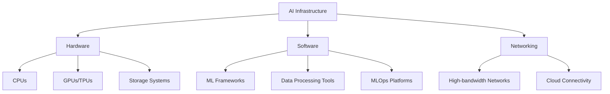

# AI Infrastructure Technical Notes

<!--  -->

## Quick Reference
- AI infrastructure is the integrated hardware and software environment that supports artificial intelligence and machine learning workloads.
- Key use cases: Developing AI applications, training machine learning models, and deploying AI solutions.
- Prerequisites: Basic understanding of computer hardware, software, and networking concepts.

## Introduction

AI infrastructure refers to the combination of hardware, software, and networking components that enable the development, deployment, and management of artificial intelligence and machine learning applications[1][5]. It serves as the foundation for processing large amounts of data, training complex models, and running AI-powered solutions efficiently.

## Core Concepts

### Fundamental Understanding

AI infrastructure differs from traditional IT setups in several key aspects:

1. **Specialized Hardware**: AI infrastructure relies heavily on high-performance computing components like GPUs (Graphics Processing Units) and TPUs (Tensor Processing Units) for accelerated parallel processing[7][8].

2. **Cloud-Based Deployment**: Many AI infrastructures leverage cloud computing environments for scalability and flexibility[8].

3. **Specialized Software Stack**: AI infrastructure incorporates machine learning libraries, frameworks, and programming languages tailored for AI/ML tasks[8].

### Visual Architecture



## Implementation Details

### Basic Implementation

To set up a basic AI infrastructure:

1. Choose appropriate hardware (CPUs, GPUs) based on your AI workload requirements.
2. Set up a data storage solution (e.g., cloud storage or on-premises servers).
3. Install necessary software frameworks (e.g., TensorFlow, PyTorch).
4. Establish networking connections for data transfer and model deployment.

```python
# Example: Setting up a basic ML environment
import tensorflow as tf

# Check if GPU is available
print("GPU Available: ", tf.test.is_gpu_available())

# Create a simple neural network
model = tf.keras.Sequential([
    tf.keras.layers.Dense(64, activation='relu', input_shape=(10,)),
    tf.keras.layers.Dense(64, activation='relu'),
    tf.keras.layers.Dense(1)
])

model.compile(optimizer='adam', loss='mse')
```

This code snippet demonstrates how to check for GPU availability and create a simple neural network using TensorFlow, a popular machine learning framework in AI infrastructure.

## Real-World Applications

### Industry Examples

AI infrastructure is used across various industries:

- **Healthcare**: For medical image analysis and drug discovery.
- **Finance**: In fraud detection and algorithmic trading.
- **E-commerce**: For personalized recommendations and customer service chatbots.

### Hands-On Project

**Project: Setting up a basic image classification system**

1. Collect a dataset of labeled images.
2. Preprocess the images and split into training and testing sets.
3. Choose a pre-trained model (e.g., ResNet) and fine-tune it on your dataset.
4. Evaluate the model's performance on the test set.
5. Deploy the model for inference on new images.

## Tools & Resources

### Essential Tools

- Development environments: Jupyter Notebooks, Google Colab
- Key frameworks: TensorFlow, PyTorch, Scikit-learn
- Cloud platforms: AWS SageMaker, Google Cloud AI Platform, Azure Machine Learning

### Learning Resources

- Online courses: Coursera's "AI for Everyone", Fast.ai's "Practical Deep Learning for Coders"
- Books: "Deep Learning" by Ian Goodfellow, Yoshua Bengio, and Aaron Courville
- Community forums: Stack Overflow, Reddit's r/MachineLearning

## Appendix

### Glossary

- **GPU**: Graphics Processing Unit, specialized for parallel processing
- **TPU**: Tensor Processing Unit, custom-built AI accelerator
- **MLOps**: Machine Learning Operations, practices for deploying and maintaining ML models in production

## References

- [1] https://pandio.com/the-basics-of-adding-ai-infrastructure-to-your-company-in-2021/
- [2] https://www.ibm.com/think/topics/ai-infrastructure
- [3] https://www.future-processing.com/blog/ai-infrastructure/
- [4] https://smartcontactai.com/ai-infrastructure-and-operations-fundamentals/
- [5] https://nexla.com/ai-infrastructure/
- [6] https://www.run.ai/guides/machine-learning-engineering/ai-infrastructure
- [7] https://revolt.digital/blog/artificial-intelligence-ai-infrastructure-essential-guide-best-practices/
- [8] https://theaitrack.com/ai-infrastructure-guide/
- [9] https://aisera.com/blog/ai-infrastructure/
