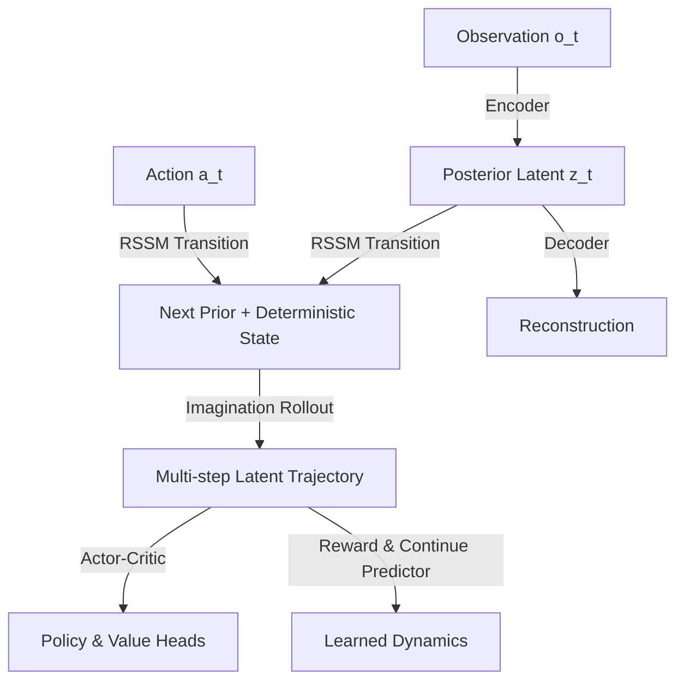

# World Models Technical Notes
<!-- A rectangular image illustrating an advanced world model architecture: a high-dimensional observation encoder feeding into a stochastic recurrent state-space model (RSSM), multi-step imagined rollouts with actor-critic planning, latent imagination for policy optimization, and integration with large-scale distributed training, showing DreamerV3-style components and performance scaling curves. -->

## Quick Reference
- **Definition**: World Models are sophisticated learned simulators of the environment that combine variational inference, recurrent state-space dynamics, and model-based reinforcement learning to enable efficient, scalable, and safe agent training through latent imagination.
- **Key Use Cases**: Mastering complex continuous-control tasks, sim-to-real transfer in robotics, long-horizon planning in games, and foundation models for generalist agents.
- **Prerequisites**: Strong background in probabilistic modeling, variational inference, recurrent networks, actor-critic methods, and large-scale RL training.

## Table of Contents
1. Introduction
2. Core Concepts
3. Implementation Details
4. Real-World Applications
5. Tools & Resources
6. References
7. Appendix

## Introduction
### What
Advanced World Models, exemplified by the Dreamer series, learn a stochastic recurrent state-space model (RSSM) that enables planning entirely in latent space through imagined trajectories, achieving state-of-the-art performance with extreme sample efficiency.

### Why
They decouple perception, dynamics, and behavior learning, allowing agents to imagine millions of trajectories per real interaction, resulting in unprecedented data efficiency and the ability to solve previously intractable long-horizon tasks.

### Where
World Models power cutting-edge research in generalist agents, robotic manipulation, autonomous driving, and large-scale reinforcement learning benchmarks.

## Core Concepts
### Fundamental Understanding
- **Basic Principles**: A variational recurrent state-space model (RSSM) learns to compress observations into stochastic latents while predicting future latents and rewards, enabling gradient-based planning in imagination.
- **Key Components**:
  - **RSSM (Recurrent State-Space Model)**: Combines deterministic RNN hidden state with stochastic posterior/prior latents.
  - **Latent Imagination**: Multi-step rollouts in latent space for actor-critic training without environment interaction.
  - **Behavior Learning**: Actor-critic or policy optimization performed purely on imagined trajectories.
  - **Representation Learning**: Balancing reconstruction, KL divergence, and prediction objectives.
- **Common Misconceptions**:
  - World Models are just VAEs + RNNs: The key innovation is end-to-end latent imagination for policy gradients.
  - They require perfect reconstruction: Modern versions prioritize predictive power over pixel-perfect decoding.
  - Only useful for pixel observations: They scale to proprioceptive, language, and multimodal inputs.

### Visual Architecture

- **System Overview**: Observations are encoded into latents; the RSSM predicts future latents; imagination generates virtual rollouts used to train the agent entirely in latent space.
- **Component Relationships**: RSSM provides accurate dynamics, imagination enables off-policy-like updates at scale, and representation learning ensures useful latents.

## Implementation Details
### Advanced Topics
```python
import torch
import torch.nn as nn
from torch.distributions import Normal, Independent

class RSSM(nn.Module):
    def __init__(self, obs_embed_dim=1024, action_dim=12, stochastic_dim=32, deterministic_dim=512):
        super().__init__()
        self.deterministic_dim = deterministic_dim
        self.stochastic_dim = stochastic_dim
        
        # Recurrent deterministic path
        self.rnn = nn.GRUCell(obs_embed_dim + action_dim, deterministic_dim)
        
        # Posterior and prior networks
        self.posterior = nn.Linear(deterministic_dim, stochastic_dim * 2)
        self.prior = nn.Linear(deterministic_dim, stochastic_dim * 2)
        
        # Decoder and predictors
        self.decoder = nn.Sequential(
            nn.Linear(deterministic_dim + stochastic_dim, 512),
            nn.SiLU(),
            nn.Linear(512, obs_embed_dim)
        )
        self.reward_head = nn.Linear(deterministic_dim + stochastic_dim, 1)
        self.continue_head = nn.Linear(deterministic_dim + stochastic_dim, 1)
    
    def forward(self, obs_embed, action, prev_deter, prev_stoch):
        # Concatenate previous stochastic and action
        rnn_input = torch.cat([obs_embed, action], dim=-1)
        deter = self.rnn(rnn_input, prev_deter)
        
        # Posterior (from observation)
        post_params = self.posterior(deter)
        post_dist = self.create_dist(post_params)
        
        # Prior (prediction without observation)
        prior_params = self.prior(deter)
        prior_dist = self.create_dist(prior_params)
        
        stoch = post_dist.rsample()  # reparameterized sample
        
        return deter, stoch, post_dist, prior_dist
    
    def create_dist(self, params):
        mean, logvar = params.chunk(2, dim=-1)
        return Independent(Normal(mean, torch.exp(0.5 * logvar)), 1)

# Latent Imagination (core of Dreamer-style training)
def imagine_rollouts(rssm, actor, horizon=15, batch_size=32):
    # Start from real states, then imagine
    imag_deter = torch.zeros(batch_size, horizon, rssm.deterministic_dim)
    imag_stoch = torch.zeros(batch_size, horizon, rssm.stochastic_dim)
    imag_actions = []
    
    for t in range(horizon):
        # Actor predicts action from current latent
        feat = torch.cat([imag_deter[:, t-1], imag_stoch[:, t-1]], dim=-1) if t > 0 else initial_feat
        action = actor(feat).rsample()
        imag_actions.append(action)
        
        # RSSM step (using prior, no observation)
        deter, stoch, _, _ = rssm(None, action, imag_deter[:, t-1] if t > 0 else prev_deter, imag_stoch[:, t-1] if t > 0 else prev_stoch)
        imag_deter[:, t] = deter
        imag_stoch[:, t] = stoch
    
    return imag_deter, imag_stoch, torch.stack(imag_actions, dim=1)
```
- **System Design**:
  - **RSSM with Deterministic + Stochastic Path**: Combines reliable recurrence with uncertainty modeling.
  - **Latent Imagination**: Core loop where the agent learns entirely from imagined trajectories.
  - **Actor-Critic in Imagination**: Policy and value are optimized on predicted futures.
- **Optimization Techniques**:
  - **KL Balancing**: Carefully weight reconstruction vs. regularization.
  - **Slow Updates for Dynamics**: Update world model less frequently than actor-critic.
  - **Multi-Step Prediction Losses**: Train on 10–30 step horizons.
- **Production Considerations**:
  - **Scalability**: Use distributed training across thousands of environments.
  - **Sim-to-Real Gap**: Fine-tune dynamics on real data with domain randomization.
  - **Long-Horizon Stability**: Use lambda-returns and value bootstrapping.

## Real-World Applications
### Industry Examples
- **Use Case**: Google DeepMind's control of physical robots with DreamerV3.
- **Implementation Pattern**: Large-scale latent imagination with RSSM for dexterous manipulation.
- **Success Metrics**: Solves complex robotics tasks with orders of magnitude fewer real interactions.

### Hands-On Project
- **Project Goals**: Implement a Dreamer-style agent for a continuous control task (e.g., DeepMind Control Suite).
- **Implementation Steps**:
  1. Build RSSM with deterministic + stochastic components.
  2. Implement latent imagination and actor-critic training.
  3. Train on pixel or state observations.
  4. Evaluate zero-shot transfer and sample efficiency.
- **Validation Methods**: Compare learning curves against model-free baselines.

## Tools & Resources
### Essential Tools
- **Development Environment**: PyTorch or JAX, distributed RL frameworks.
- **Key Frameworks**: DreamerV3 official implementation, Acme, or CleanRL.
- **Testing Tools**: WandB, TensorBoard for rollout visualization.

### Learning Resources
- **Core Papers**: DreamerV2 (2022), DreamerV3 (2023).
- **Code**: Official Dreamer repositories on GitHub.
- **Tutorials**: "Understanding Dreamer" blog series.

## References
- Hafner et al., "DreamerV2: Mastering Atari with World Models" (2022).
- Hafner et al., "Mastering Diverse Domains through World Models" – DreamerV3 (2023).
- "World Models" (2018) – foundational paper.

## Appendix
### Glossary
- **RSSM**: Recurrent State-Space Model (core of modern world models).
- **Latent Imagination**: Generating virtual trajectories in compressed space.
- **KL Balancing**: Technique to stabilize variational training.

### Setup Guides
- Start with official DreamerV3 code: github.com/google-research/dreamerv3.
- Hardware: Multi-GPU recommended for large-scale imagination.

</xaiArtifact>