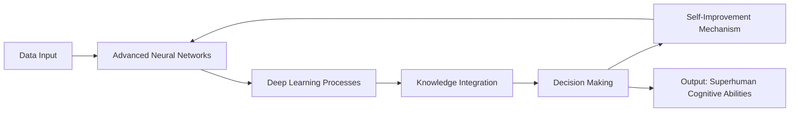

# Artificial Super Intelligence (ASI) Technical Notes


<!--  -->

## Quick Reference
- Artificial Super Intelligence (ASI) is a hypothetical AI system that surpasses human intelligence in all cognitive domains.
- Key use cases: Solving complex global challenges, advancing scientific research, and revolutionizing technology.
- Prerequisites: Basic understanding of AI and machine learning concepts.

## Table of Contents
* [Introduction](#introduction)
    * [What: Core Definition and Purpose](#what-core-definition-and-purpose)
    * [Why: Problem It Solves](#why-problem-it-solves)
    * [Where: Application Domains](#where-application-domains)
* [Core Concepts](#core-concepts)
    * [Fundamental Understanding](#fundamental-understanding)
        * [Basic Principles](#basic-principles)
        * [Key Components](#key-components)
        * [Common Misconceptions](#common-misconceptions)
    * [Visual Architecture](#visual-architecture)
* [Implementation Details](#implementation-details)
    * [High-Level Overview](#high-level-overview)
    * [Specific Implementation Steps](#specific-implementation-steps)
* [Real-World Applications](#real-world-applications)
    * [Potential Use Cases](#potential-use-cases)
    * [Examples of Application](#examples-of-application)
* [Tools & Resources](#tools--resources)
    * [Essential Tools](#essential-tools)
    * [Useful Resources](#useful-resources)

## Introduction

### What: Core Definition and Purpose
Artificial Super Intelligence (ASI) refers to a hypothetical form of AI that exceeds human cognitive abilities across all domains[1]. It represents the pinnacle of AI development, capable of outperforming humans in every intellectual task.

### Why: Problem It Solves
ASI has the potential to solve complex global challenges, revolutionize scientific research, and drive unprecedented technological advancements[2]. Its superior cognitive abilities could lead to breakthroughs in fields like medicine, energy, and space exploration.

### Where: Application Domains
ASI could potentially be applied in various fields, including:

- Scientific research and discovery
- Global problem-solving (e.g., climate change, disease eradication)
- Technological innovation
- Space exploration
- Economic and social policy development

## Core Concepts

### Fundamental Understanding

#### Basic Principles
1. **Superhuman Cognitive Abilities**: ASI possesses intellectual capabilities that surpass human limits in all areas[1].
2. **Self-Improvement**: ASI can autonomously enhance its own algorithms and knowledge base[2].
3. **General Intelligence**: Unlike narrow AI, ASI can apply its intelligence across a wide range of subjects and activities[2].

#### Key Components
- Advanced neural architectures
- Deep learning frameworks
- Vast data integration systems
- Complex algorithmic decision-making mechanisms

#### Common Misconceptions
- ASI is not the same as current AI systems, which are considered narrow or weak AI.
- The development of ASI is still hypothetical and not an immediate reality.

### Visual Architecture


## Implementation Details

### Basic Implementation
```python
# Conceptual representation of ASI (not actual implementation)
class ASI:
    def __init__(self):
        self.knowledge_base = {}
        self.learning_rate = 1.0

    def learn(self, new_information):
        # Simulate rapid learning and integration
        self.knowledge_base.update(new_information)
        self.improve()

    def improve(self):
        # Simulate self-improvement
        self.learning_rate *= 1.1

    def solve_problem(self, problem):
        # Simulate problem-solving beyond human capabilities
        solution = "Advanced solution using integrated knowledge"
        return solution

# Usage
asi = ASI()
asi.learn({"physics": "Advanced quantum theories"})
solution = asi.solve_problem("Complex scientific challenge")
print(solution)
```

This basic implementation illustrates the conceptual components of ASI, including learning, self-improvement, and problem-solving capabilities.

## Real-World Applications

### Industry Examples
While ASI remains theoretical, its potential applications could include:

- Accelerating scientific discoveries in physics and medicine
- Developing advanced solutions for climate change mitigation
- Creating innovative technologies beyond current human imagination

### Hands-On Project
For beginners, a hands-on project could involve simulating a basic AI system that attempts to improve its performance over time, helping to understand the concept of self-improvement in AI.

## Tools & Resources

### Essential Tools
- Python programming language
- TensorFlow or PyTorch for deep learning
- Jupyter Notebooks for experimentation

### Learning Resources
- "Artificial Intelligence: A Modern Approach" by Stuart Russell and Peter Norvig
- Online courses on AI and machine learning fundamentals
- AI research papers and publications

ASI represents the frontier of AI research, promising capabilities that could revolutionize our world. While its realization remains in the future, understanding its concepts is crucial for grasping the potential and challenges of advanced AI systems[4].

## References :
- [1] https://www.larksuite.com/en_us/topics/ai-glossary/asi-artificial-super-intelligence
- [2] https://kanerika.com/blogs/artificial-superintelligence/
- [3] https://www.spiceworks.com/tech/artificial-intelligence/articles/super-artificial-intelligence/
- [4] https://www.ibm.com/think/topics/artificial-superintelligence
- [5] https://viso.ai/deep-learning/artificial-super-intelligence/
- [6] https://www.linkedin.com/pulse/core-concepts-ai-machine-learning-mohammad-al-khatib-6%CF%83-black-belt-d4rcf
- [7] https://arxiv.org/html/2412.16468v1

**Tools**
- Notes: [Perplexity](https://www.perplexity.ai/) [25/12/2024]
- Image: [grok](https://x.ai/) [25/12/2024]
- Prompt: [CONTRIBUTING.md](../../../../CONTRIBUTING.md)