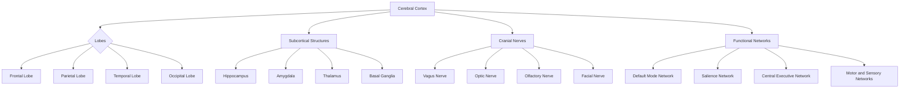

# **Brain Map - Notes**

## **Table of Contents (ToC)**

- [Introduction](#introduction)
- [Key Components](#key-components)
- [Applications](#why-it-matters--relevance)
- [Brain Map Structure](#brain-map-structure)
- [Functional Areas & Key Models](#functional-areas--key-models)
- [Information Processing Pathways](#information-processing-pathways)
- [Types of Brain Maps](#types-of-brain-maps)
- [Self-Practice / Hands-On Examples](#self-practice--hands-on-examples)
- [Challenges in Mapping](#challenges-in-mapping)
- [Tools & Techniques](#tools--techniques)
- [Advanced Exploration](#advanced-exploration)
- [Zero to Hero Lab Projects](#zero-to-hero-lab-projects)
- [Continuous Learning Strategy](#continuous-learning-strategy)
- [References](#references)

---

## **Introduction**
A brain map is a comprehensive representation of the brain's structure and functions, detailing the regions, networks, and pathways that facilitate cognitive and physiological processes.

---

## **Key Components**
- **Cerebral Cortex**: Outer layer responsible for higher cognitive functions, perception, and motor control.
- **Lobes**: Divisions of the cerebral cortex - frontal, parietal, temporal, and occipital lobes, each with specialized functions.
- **Subcortical Structures**: Includes areas like the hippocampus, amygdala, and thalamus, which play roles in memory, emotion, and sensory relay.
- **Neural Pathways**: Networks connecting different brain areas, essential for coordinating complex processes.
- **Cranial Nerves**: Twelve pairs of nerves connecting directly to the brain, responsible for sensory and motor functions in the head and neck.

---

## **Applications**
- **Neuroscience Research**: Brain maps help explore neurodevelopmental and neurodegenerative diseases.
- **Surgical Planning**: Functional maps guide neurosurgeons to avoid critical areas during operations.
- **AI & Cognitive Computing**: Brain maps inspire neural networks and AI structures.
- **Education and Learning**: Understanding brain regions aids in developing effective learning strategies.
- **Mental Health**: Mapping brain function improves understanding of mental disorders and informs treatment.

---

## **Brain Map Structure**

---

## **Functional Areas & Key Models**
1. **Motor Cortex**: Controls voluntary movement; model for understanding motor planning and execution.
2. **Sensory Cortex**: Processes sensory information, with a somatotopic arrangement in the brain.
3. **Default Mode Network (DMN)**: Active during rest and involved in introspection, self-referential thoughts, and memory retrieval.
4. **Language Centers**: Broca's area (speech production) and Wernicke's area (language comprehension).
5. **Visual Cortex**: Processes visual information, organized hierarchically from primary to higher-order visual areas.

---

## **Information Processing Pathways**
1. **Dorsal Stream** ("Where" Pathway): Processes spatial and motion information for visual processing.
2. **Ventral Stream** ("What" Pathway): Identifies objects and processes visual details.
3. **Limbic System Pathways**: Involved in processing emotions and memory through structures like the hippocampus and amygdala.
4. **Motor-Sensory Loops**: Control and feedback loops that coordinate movement and sensory perception.

---

## **Types of Brain Maps**
1. **Structural Maps**: MRI or CT scans provide anatomical details.
2. **Functional Maps**: fMRI or PET scans show areas activated by specific tasks.
3. **Connectivity Maps**: Represent neural pathways and synaptic connections.
4. **Genetic Maps**: Show gene expression in brain regions to understand genetic influences on brain function.

---

## **Self-Practice / Hands-On Examples**
1. **Visualize Brain Networks**: Use software like BrainNet Viewer to create 3D representations of functional networks.
2. **Explore Brain Maps**: Tools like NeuroVault allow for viewing and exploring open-access brain imaging data.
3. **Functional Mapping Simulation**: Use basic neural network models to simulate brain mapping techniques in AI.

---

## **Challenges in Mapping**
- **Complexity of Connections**: Brain maps must account for over 100 trillion synaptic connections.
- **Dynamic Activity**: Brain functions are constantly changing; creating a static map limits accuracy.
- **Ethical Considerations**: Invasive mapping techniques raise ethical concerns in research and clinical settings.
- **Data Volume**: Functional and structural brain mapping generates vast amounts of data, requiring advanced computational tools.

---

## **Tools & Techniques**
- **Imaging Tools**: MRI, fMRI, and DTI (Diffusion Tensor Imaging) are used for anatomical and functional brain mapping.
- **Analysis Software**: SPM, FSL, and BrainVoyager for processing neuroimaging data.
- **Machine Learning**: Algorithms to identify patterns in brain imaging data, aiding in predictive modeling of brain functions.

---

## **Advanced Exploration**
1. **Connectome Project**: Study the Human Connectome Project, which aims to map all neural connections in the human brain.
2. **Neuromodulation Techniques**: Explore how TMS and deep brain stimulation (DBS) alter brain function.
3. **AI Models in Neuroscience**: Review research on AI models like convolutional neural networks (CNNs) for analyzing brain imaging.

---

## **Zero to Hero Lab Projects**
1. **Create a Neural Network Model**: Simulate the visual or motor cortex’s processing patterns using Python and libraries like TensorFlow.
2. **Analyze EEG Data**: Record and analyze brainwave patterns during various cognitive tasks.
3. **Map a Functional Network**: Use fMRI data to visualize activation patterns in the brain during rest and task-based activities.

---

## **Continuous Learning Strategy**
- **Attend Neuroscience Seminars**: Learn about the latest in brain mapping research from experts.
- **Participate in Neuroimaging Workshops**: Gain hands-on experience with imaging tools and software.
- **Explore Related Disciplines**: Fields like cognitive psychology, neurology, and AI intersect with brain mapping and provide new insights.

---

## **References**

- *Principles of Neural Science* by Eric R. Kandel et al.
- *The Brain Atlas* by Thomas A. Woolsey
- Human Connectome Project: [Human Connectome Project](https://www.humanconnectome.org/)

