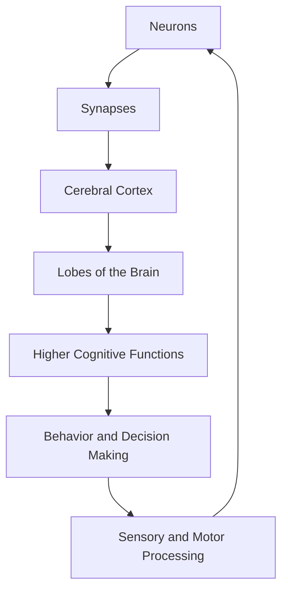

# **Human Brain - Notes**


## **Table of Contents (ToC)**

- [Introduction](#introduction)
- [Key Concepts](#key-concepts)
- [Applications](#applications)
- [Architecture Pipeline](#architecture-pipeline)
- [Framework / Key Theories or Models](#framework--key-theories-or-models)
- [How the Brain Works](#how-the-brain-works)
- [Methods, Types & Variations](#methods-types--variations)
- [Self-Practice / Hands-On Examples](#self-practice--hands-on-examples)
- [Pitfalls & Challenges](#pitfalls--challenges)
- [Feedback & Evaluation](#feedback--evaluation)
- [Tools, Libraries & Frameworks](#tools-libraries--frameworks)
- [Hello World! (Practical Example)](#hello-world-practical-example)
- [Advanced Exploration](#advanced-exploration)
- [Zero to Hero Lab Projects](#zero-to-hero-lab-projects)
- [Continuous Learning Strategy](#continuous-learning-strategy)
- [References](#references)

---

### **Introduction**
The human brain is a highly complex organ responsible for processing sensory information, controlling bodily functions, and enabling higher-level functions like thinking, memory, emotions, and problem-solving.

---

### **Key Concepts**
- **Neurons**: The brain’s fundamental units, neurons communicate through electrical impulses and chemical signals, forming intricate networks.
- **Synapses**: Junctions where neurons connect, allowing for the transmission of signals across chemical or electrical synapses.
- **Cerebral Cortex**: The outermost layer responsible for thought, perception, and memory.
- **Lobes of the Brain**: Divided into four primary lobes – frontal, parietal, temporal, and occipital – each with distinct functions.
- **Neurotransmitters**: Chemicals like dopamine, serotonin, and acetylcholine that facilitate neural communication and influence behavior and mood.
  
---

### **Applications**
Understanding the brain is crucial across fields:
1. **Healthcare**: Advances in brain research enable treatment of neurological diseases like Alzheimer’s, Parkinson’s, and epilepsy.
2. **Artificial Intelligence**: Insights into neural networks have inspired algorithms that mimic human thought, such as deep learning.
3. **Psychology**: Studying the brain helps uncover causes of mental disorders and enables effective treatment.
4. **Education**: Knowledge about cognitive processes informs learning techniques and pedagogical approaches.
5. **Neuroscience and Cognitive Science**: Grounded in studying brain function, these fields explore consciousness, learning, and memory formation.

---

### **Architecture Pipeline**



---

### **Framework / Key Theories or Models**
1. **Hebbian Theory**: "Cells that fire together wire together," emphasizing the strengthening of synaptic connections through repeated activity.
2. **Dual-Process Theory**: Posits two systems for information processing: an automatic, fast, intuitive system (System 1) and a slower, analytical, conscious system (System 2).
3. **Neuroplasticity**: The brain's ability to reorganize and form new connections, especially after injury.
4. **Brainwave Theory**: Suggests that different brainwave patterns (alpha, beta, theta, delta) are associated with different states of consciousness.
5. **Modularity of Mind**: Proposes that the mind consists of specialized modules with distinct functions, such as language and visual processing.

---

### **How the Brain Works**
1. **Sensory Input**: Sensory organs (eyes, ears, skin) send information to the brain.
2. **Processing in the Cortex**: The cerebral cortex interprets and processes this information.
3. **Decision Making**: Prefrontal areas analyze and decide responses, integrating memories and current goals.
4. **Motor Output**: Commands are sent through the nervous system to initiate physical actions.
5. **Feedback Loops**: The brain adjusts actions in response to outcomes, reinforcing learning.

---

### **Methods, Types & Variations**
1. **Structural Brain Imaging**: MRI, CT scans provide detailed images of brain anatomy.
2. **Functional Brain Imaging**: fMRI, PET scans reveal areas of activity during specific tasks.
3. **Brain Stimulation**: TMS (Transcranial Magnetic Stimulation) and tDCS (Transcranial Direct Current Stimulation) modify brain activity.
4. **Electrophysiological Recording**: EEG records electrical activity across the brain, useful for studying states like sleep or focus.
5. **Neuropsychology**: Studies effects of brain injury to map functions and dysfunctions in the brain.

---

### **Self-Practice / Hands-On Examples**
1. **Memory Game**: Use techniques to recall sequences, testing short-term and working memory.
2. **Meditation and Mindfulness**: Practice to observe changes in focus and brain activity.
3. **Attention Control Exercises**: Use focus and distraction methods to observe attention shifts.

---

### **Pitfalls & Challenges**
- **Misunderstanding Brain Plasticity**: Overestimating the brain's ability to fully recover from injuries or adapt instantly.
- **Over-reliance on Neuroimaging**: Imaging shows correlations, not causations, so interpreting results requires caution.
- **Complexity of Consciousness**: Defining and studying consciousness remains a deeply complex and debated challenge.

---

### **Feedback & Evaluation**
1. **Self-Reflection**: Regularly articulate your understanding of brain function to assess gaps.
2. **Peer Discussion**: Compare interpretations of brain studies or findings with others.
3. **Simulations and Models**: Use computational models of neural networks to simulate and understand brain processing.

---

### **Tools, Libraries & Frameworks**
- **Brain Imaging Tools**: AFNI, FSL, and SPM for processing MRI data.
- **Neuroscience Libraries**: NEST, NEURON, and PyNN for simulating neural networks.
- **Data Analysis**: MNE-Python and EEGLAB for EEG and MEG analysis.

---

### **Hello World! (Practical Example)**
```python
import numpy as np

def simulate_neuron_activity(t, frequency=10):
    """
    Simulate firing activity of a neuron over time based on frequency.
    
    Parameters:
    - t: Time array.
    - frequency: Frequency of firing (Hz).
    
    Returns:
    - np.array of simulated neuron firing.
    """
    return np.sin(2 * np.pi * frequency * t)

# Example usage
t = np.linspace(0, 1, 1000)  # 1-second time array
neuron_activity = simulate_neuron_activity(t)
```

---

### **Advanced Exploration**
1. **Principles of Neural Design** by Peter Sterling and Simon Laughlin
2. **Theoretical Neuroscience** by Peter Dayan and L.F. Abbott
3. **Stanford Neurosciences Institute's Online Courses**

---

### **Zero to Hero Lab Projects**
1. **Build a Basic Neural Network**: Use Python and libraries like TensorFlow to mimic neural connections.
2. **EEG Analysis**: Record brainwaves during different activities and study the resulting patterns.
3. **Brain-Computer Interface**: Develop a simple system to control a virtual object using brainwave input.

---

### **Continuous Learning Strategy**
- **Delve into Sub-Disciplines**: Cognitive neuroscience, neuropsychology, and neurophilosophy offer rich insights.
- **Engage with Community**: Attend neuroscience conferences or online forums.
- **Explore Related Topics**: Machine learning, artificial intelligence, and neuroethics can deepen understanding of the brain.

---

### **References**

- *Principles of Neural Science* by Eric R. Kandel et al.
- *The Brain That Changes Itself* by Norman Doidge
- MIT OpenCourseWare: Introduction to Neuroscience


Brain Mappig: 
- https://www.health.qld.gov.au/abios/asp/brain

- Blumenfeld, H. (2010). Neuroanatomy through clinical cases. Sunderland, Mass: Sinauer Associates.
- Kolb, B., & Whishaw, I. Q. (2015). Fundamentals of human neuropsychology (7th ed.). New York: Worth Publishers.
- Lezak, M. D., Howieson, D. B., Bigler, E. D., & Tranel, D. (2012). Neuropsychological assessment (5th ed.). New York: Oxford University Press.
- Mendoza, J. & Foundas, A. (2011). Clinical neuroanatomy: A neurobehavioral approach. New York: Springer-Verlag.
- Von Bartheld, C.S., Bahney J., & Herculano-Houzel, S. (2016).  The search for true numbers of neurons and glial cells in the human brain: A review of 150 years of cell counting. Journal of Computational Neurology, 524(18), 3865-3895.
- University of Washington Digital Anatomist- http://www9.biostr.washington.edu/da.html
