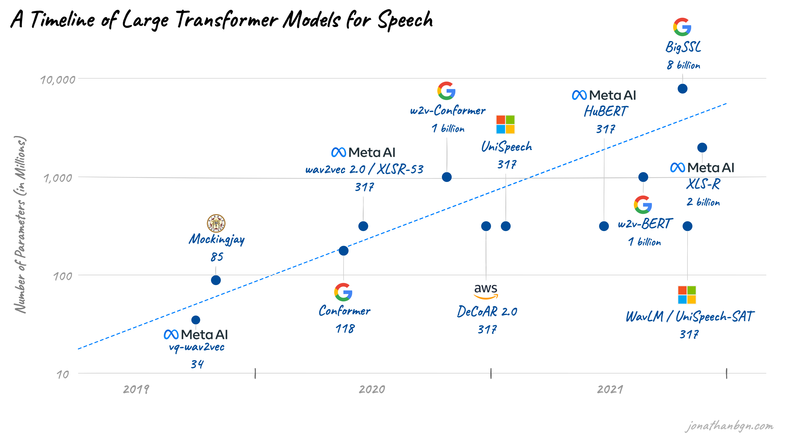

# Audio Models: A Non-Exhaustive List

- [Source](https://jonathanbgn.com/2021/12/31/timeline-transformers-speech.html)

## Table of Contents

- [Classic Audio Deep Learning Models](#classic-audio-deep-learning-models)
- [Speech Foundation Models](#speech-foundation-models)
- [Audio Understanding & Representation Models](#audio-understanding--representation-models)
- [Audio Generation Models (Music & Sound)](#audio-generation-models-music--sound)
- [Text-to-Speech (TTS) Models](#text-to-speech-tts-models)
- [Neural Audio Codec Models](#neural-audio-codec-models)
- [Audio Language Models (ALMs) — Multimodal](#audio-language-models-alms--multimodal)
- [Summary Table](#summary-table)

---

## Classic Audio Deep Learning Models

Foundational CNN and early Transformer models that shaped audio deep learning. These process either spectrograms (treating audio as 2D images) or raw waveforms directly, and remain widely used as baselines and feature extractors.

- **VGGish** (Google, 2017): CNN taking log-Mel spectrograms as input for audio embeddings and classification. One of the first widely adopted pretrained audio models.
- **YAMNet** (Google, 2019): MobileNetV1-based, uses log-Mel spectrograms for event classification and embeddings. Lightweight and widely deployed in edge and mobile applications.
- **OpenL3** (2018): Multimodal self-supervised model accepting spectrograms or raw waveforms for general-purpose audio embeddings. Trained via audio-visual correspondence on videos.
- **Wav2Vec 2.0** (Meta, 2020): Transformer-based self-supervised model operating directly on raw waveforms. Revolutionized low-resource speech recognition via contrastive pretraining + masked prediction.
- **WavLM** (Microsoft, 2022): CNN + Transformer taking raw waveforms. Extends HuBERT with denoising objectives for robust speech embeddings, recognition, separation, and speaker verification.
- **Conformer** (Google, 2020): Convolution-augmented Transformer combining local CNN features with global attention. Became the dominant ASR encoder architecture (used in NeMo, WeNet, and many production systems).

---

## Speech Foundation Models

Large-scale models pretrained on massive speech/audio corpora, serving as general-purpose backbones for ASR, translation, and downstream speech tasks.

- **Whisper / Whisper-v3-Turbo** (OpenAI, 2022–2024): Encoder-decoder Transformer trained on 680k hours of weakly-supervised multilingual data. SOTA for ASR, speech translation, language ID, and voice activity detection. v3-Turbo adds faster inference via distillation.
- **HuBERT** (Meta, 2021): Self-supervised model using offline clustering for masked prediction on raw waveforms. Key baseline for speech recognition, speaker verification, and emotion recognition.
- **USM (Universal Speech Model)** (Google, 2023): 2B-parameter model trained on 12M hours across 300+ languages. SOTA multilingual ASR via multi-stage pretraining.
- **SeamlessM4T v2** (Meta, 2024): Massively multilingual multimodal model supporting speech-to-speech, speech-to-text, text-to-speech, and text-to-text translation across ~100 languages in a single model.
- **MMS (Massively Multilingual Speech)** (Meta, 2023): Wav2Vec 2.0-based model scaled to 1,100+ languages for ASR, language ID, and TTS.
- **Canary / Parakeet** (NVIDIA, 2024): Multilingual multi-task ASR (Canary) and English-optimized CTC-Transducer ASR (Parakeet) families built on the NeMo framework. SOTA on multiple ASR benchmarks.

---

## Audio Understanding & Representation Models

Models for cross-domain audio understanding, representation learning, and multi-task analysis — including self-supervised pretraining and zero-shot capabilities.

- **AST (Audio Spectrogram Transformer)** (MIT, 2021): First pure Transformer for audio classification, directly processing 2D spectrograms. Established Transformer dominance over CNNs for audio tasks.
- **BEATs** (Microsoft, 2023): Audio pretraining via iterative audio tokenizer + masked modeling. SOTA on AudioSet and ESC-50 for audio event classification.
- **CLAP (Contrastive Language-Audio Pretraining)** (LAION/Microsoft, 2023): Joint audio-text embeddings via contrastive learning (CLIP for audio). Enables zero-shot audio classification, retrieval, and is the backbone for AudioLDM and other generative models.
- **EAT (Efficient Audio Transformer)** (2024): Masked autoencoder Transformer achieving SOTA on AudioSet (90.0 mAP) with improved efficiency.
- **AudioLM** (Google, 2023): Hierarchical language model generating realistic speech and music by modeling semantic + acoustic tokens from w2v-BERT and SoundStream. Foundational work bridging understanding and generation.
- **SoundStorm** (Google, 2023): Parallel non-autoregressive audio generation using MaskGIT-style decoding on SoundStream tokens. 100x faster than AudioLM.

---

## Audio Generation Models (Music & Sound)

Models for generating music, sound effects, and general audio from text, audio prompts, or multimodal inputs.

- **MusicGen** (Meta, 2023): Single-stage transformer LM for text-to-music and melody-conditioned generation using EnCodec tokens. Open-source and widely adopted.
- **MusicLM** (Google, 2023): Hierarchical seq2seq model generating high-fidelity music from text via MuLan + SoundStream tokens.
- **AudioLDM 2** (2023): Latent diffusion model for unified text-to-audio generation (speech, music, sound effects) using CLAP embeddings.
- **Stable Audio 2.0** (Stability AI, 2024): Latent diffusion with timing control for text-to-audio/music generation. Supports audio-to-audio style transfer.
- **Suno v4** (Suno, 2025): Full-song generation (vocals + instrumentals + lyrics) from text prompts. Leading consumer music AI for coherent long-form song structure.
- **Fugatto** (NVIDIA, 2024): 2.5B-parameter Foundational Generative Audio Transformer for any audio-to-audio or text-to-audio task — voice design, sound effects, music transformation with compositional instructions.
- **YuE** (2025): Open-source full-song generation model supporting lyrics-to-song with multilingual vocals, genre control, and long-form structure.
- **Dia** (Nari Labs, 2025): 1.6B-parameter open-weights model for dialogue generation with emotion tags and non-verbal sounds (laughter, coughs).

---

## Text-to-Speech (TTS) Models

Models that synthesize natural-sounding speech from text, including zero-shot voice cloning and expressive conversational speech.

- **VALL-E 2** (Microsoft, 2024): Neural codec LM for zero-shot TTS — clones any voice from a 3-second sample. First TTS to achieve human parity on LibriSpeech.
- **StyleTTS 2** (2023): Diffusion-based style TTS achieving human-level naturalness on single-speaker benchmarks via style diffusion and adversarial training.
- **CosyVoice 2** (Alibaba, 2025): Streaming-capable zero-shot TTS with rich prosody control using flow-matching and finite scalar quantization.
- **F5-TTS** (2024): Non-autoregressive flow-matching TTS with diffusion transformer (DiT). Simple architecture with strong zero-shot results and fast inference.
- **Kokoro** (2025): Lightweight 82M-parameter TTS achieving near-SOTA quality. Apache-licensed, multi-language support.
- **Sesame CSM** (2025): 1B-parameter multistream transformer for real-time conversational TTS with natural turn-taking, backchannel responses, and emotional expression.
- **Orpheus-TTS** (2025): LLM-based TTS (LLaMA-3B + SNAC codec) with human-like emotion and intonation for real-time streaming.
- **Spark-TTS** (SparkAudio, 2025): Zero-shot TTS using BiCodec with LLM backbone, independently controlling speaker identity, prosody, and content.
- **Parler-TTS** (HuggingFace, 2024): Text-described TTS — generates speech matching natural language style descriptions (e.g., "a calm female voice in a quiet room"). Open-source.

---

## Neural Audio Codec Models

Models that compress audio into discrete tokens for efficient generation, transmission, and manipulation by downstream models. The tokenization backbone powering most modern audio generation.

- **SoundStream** (Google, 2021): First neural audio codec using RVQ. Foundational architecture for AudioLM and MusicLM.
- **EnCodec** (Meta, 2022): RVQ-based codec at 1.5–24 kbps. Core tokenizer for MusicGen, VALL-E, and AudioLDM.
- **DAC (Descript Audio Codec)** (2023): High-fidelity universal codec with improved quantizer design, superior quality at low bitrates for speech, music, and environmental audio.
- **SNAC** (2024): Multi-scale neural codec producing hierarchical token sequences at different temporal resolutions for efficient LLM-based generation. Used in Orpheus-TTS.
- **WavTokenizer** (2024): Extreme compression — single-codebook quantization at 40–75 tokens/second while maintaining quality. Enables compact audio representations for LLMs.
- **Mimi** (Kyutai, 2024): Streaming codec jointly trained with semantic distillation for real-time conversational AI. Powers Moshi.

---

## Audio Language Models (ALMs) — Multimodal

Models combining audio perception with large language model reasoning for conversational, instruction-following, and cross-modal audio understanding and generation.

- **Gemini** (Google, 2023–2025): Natively multimodal LLM family (Pro, Ultra, Flash) processing audio, video, images, and text jointly. Audio capabilities include transcription, translation, sound understanding, and audio-conditioned reasoning.
- **GPT-4o** (OpenAI, 2024): Omni-modal model with native audio I/O — real-time voice conversations, audio understanding, and expressive speech generation with emotion control.
- **Qwen2-Audio** (Alibaba, 2024): Audio-language model accepting diverse audio types (speech, music, environmental) with text instruction following. SOTA on multiple audio benchmarks without task-specific fine-tuning. 
- **SALMONN** (Tsinghua & ByteDance, 2023): Dual-encoder (Whisper + BEATs) connected to Vicuna LLM via Q-Former. Unified speech, music, and environmental audio understanding.
- **Moshi** (Kyutai, 2024): Full-duplex real-time speech-to-speech dialogue model using Mimi codec + Helium LM. First open model supporting real-time overlapping speech interaction (simultaneous listen + speak).
- **Ultravox** (Fixie AI, 2024–2025): Open-source multimodal LLM that directly processes audio input without a separate ASR stage, enabling low-latency audio understanding and voice agents.
- **Phi-4-multimodal** (Microsoft, 2025): Lightweight multimodal model with native audio understanding via LoRA mixture-of-experts. Handles speech recognition and audio reasoning alongside vision and text.

---

## Summary Table

| Model/Family | Category | Input Type | Main Use Cases |
| --- | --- | --- | --- |
| VGGish | Classic DL | Spectrogram | Embedding, classification |
| YAMNet | Classic DL | Spectrogram | Event classification, embedding |
| OpenL3 | Classic DL | Spectrogram/Raw | Embedding, multimodal analysis |
| Wav2Vec 2.0 | Classic DL | Raw | Self-supervised speech representation |
| WavLM | Classic DL | Raw | Speech embedding, recognition, separation |
| Conformer | Classic DL | Raw/Spectrogram | ASR encoder architecture |
| Whisper / v3-Turbo | Speech Foundation | Raw/Spectrogram | ASR, translation, language ID |
| HuBERT | Speech Foundation | Raw | Self-supervised speech representation |
| USM | Speech Foundation | Raw | Multilingual ASR (300+ languages) |
| SeamlessM4T v2 | Speech Foundation | Raw/Text | Multilingual multimodal translation |
| MMS | Speech Foundation | Raw | Multilingual ASR/TTS (1100+ languages) |
| Canary / Parakeet | Speech Foundation | Raw | SOTA ASR (NeMo) |
| AST | Understanding | Spectrogram | Audio classification |
| BEATs | Understanding | Raw/Spectrogram | Audio event classification |
| CLAP | Understanding | Audio + Text | Zero-shot classification, retrieval |
| EAT | Understanding | Spectrogram | Audio classification (SOTA AudioSet) |
| AudioLM | Understanding | Raw | Speech/music generation |
| SoundStorm | Understanding | Tokens | Fast parallel audio generation |
| MusicGen | Audio Generation | Text/Audio | Text-to-music, melody-conditioned |
| MusicLM | Audio Generation | Text/Audio | Text-to-music |
| AudioLDM 2 | Audio Generation | Text | Unified text-to-audio (speech/music/SFX) |
| Stable Audio 2.0 | Audio Generation | Text/Audio | Text-to-audio/music |
| Suno v4 | Audio Generation | Text | Full-song generation |
| Fugatto | Audio Generation | Text/Audio | Universal audio transformation |
| YuE | Audio Generation | Text/Lyrics | Open-source full-song generation |
| Dia | Audio Generation | Text | Dialogue + emotion generation |
| VALL-E 2 | TTS | Text + 3s clip | Zero-shot voice cloning (human parity) |
| StyleTTS 2 | TTS | Text | Human-level single-speaker TTS |
| CosyVoice 2 | TTS | Text | Streaming zero-shot TTS |
| F5-TTS | TTS | Text | Fast non-autoregressive TTS |
| Kokoro | TTS | Text | Lightweight near-SOTA TTS (82M) |
| Sesame CSM | TTS | Text | Conversational TTS with turn-taking |
| Orpheus-TTS | TTS | Text | Emotional LLM-based TTS |
| Spark-TTS | TTS | Text | Controllable zero-shot TTS |
| Parler-TTS | TTS | Text | Text-described style TTS |
| SoundStream | Neural Codec | Raw | Real-time audio codec (RVQ) |
| EnCodec | Neural Codec | Raw | Audio tokenization (1.5–24 kbps) |
| DAC | Neural Codec | Raw | High-fidelity universal codec |
| SNAC | Neural Codec | Raw | Multi-scale hierarchical codec |
| WavTokenizer | Neural Codec | Raw | Ultra-compact single-codebook codec |
| Mimi | Neural Codec | Raw | Streaming codec for conversational AI |
| Gemini | ALM (Multimodal) | Raw/Multimodal | Audio reasoning, transcription |
| GPT-4o | ALM (Multimodal) | Raw/Multimodal | Voice conversation, audio understanding |
| Qwen2-Audio | ALM (Multimodal) | Raw | Universal audio understanding |
| SALMONN | ALM (Multimodal) | Raw | Speech + audio + music understanding |
| Moshi | ALM (Multimodal) | Raw | Real-time full-duplex voice dialogue |
| Ultravox | ALM (Multimodal) | Raw | Low-latency audio LLM |
| Phi-4-multimodal | ALM (Multimodal) | Raw/Multimodal | Lightweight multimodal audio reasoning |

This list covers the most popular SOTA audio models shaping each category as of early 2026.

## References

1. [https://www.digitalocean.com/community/tutorials/audio-classification-with-deep-learning](https://www.digitalocean.com/community/tutorials/audio-classification-with-deep-learning)
2. [https://zilliz.com/learn/top-10-most-used-embedding-models-for-audio-data](https://zilliz.com/learn/top-10-most-used-embedding-models-for-audio-data)
3. [https://www.kaggle.com/datasets/harshtheman/birdclef-2025-audio-to-spectrogram-dataset](https://www.kaggle.com/datasets/harshtheman/birdclef-2025-audio-to-spectrogram-dataset)
4. [https://www.linkedin.com/pulse/making-sound-visible-how-spectrograms-boost-audio-sergio-sanz-phd-p9j0f](https://www.linkedin.com/pulse/making-sound-visible-how-spectrograms-boost-audio-sergio-sanz-phd-p9j0f)
5. [https://milvus.io/ai-quick-reference/which-neural-network-architectures-are-popular-for-audio-search-tasks](https://milvus.io/ai-quick-reference/which-neural-network-architectures-are-popular-for-audio-search-tasks)
6. [https://arxiv.org/html/2502.18952v1](https://arxiv.org/html/2502.18952v1)
7. [https://www.sciencedirect.com/science/article/abs/pii/S0952197625001307](https://www.sciencedirect.com/science/article/abs/pii/S0952197625001307)
8. [https://neurips.cc/virtual/2023/workshop/66516](https://neurips.cc/virtual/2023/workshop/66516)