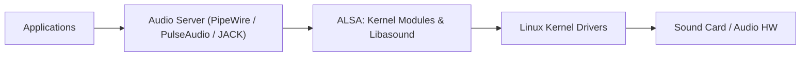
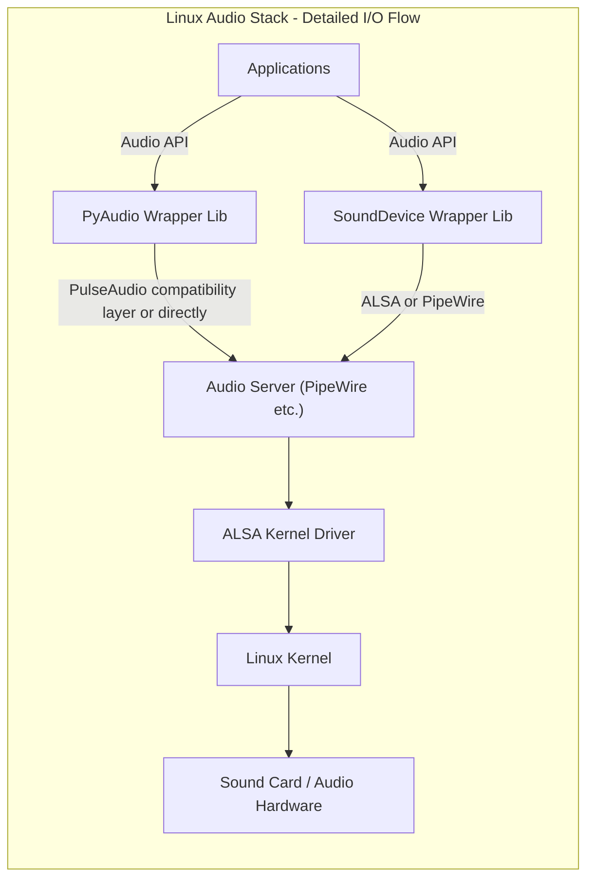

# Comprehensive Technical Guide to the Linux Audio Stack

This guide provides a detailed overview of the Linux audio stack, practical examples, code snippets, and bash scripting techniques for audio device management and audio processing on Linux systems.

## Table of Contents

- [Overview of Linux Audio Stack](#overview-of-linux-audio-stack)
    - [1. Applications](#1-applications)
    - [2. Audio Servers and Sound Systems](#2-audio-servers-and-sound-systems)
    - [3. ALSA (Advanced Linux Sound Architecture)](#3-alsa-advanced-linux-sound-architecture)
    - [4. Kernel Sound Drivers](#4-kernel-sound-drivers)
    - [5. Sound Cards / Audio Hardware](#5-sound-cards--audio-hardware)
- [System Components and Flow Diagram](#system-components-and-flow-diagram)
- [Detailed I/O Flow View](#detailed-io-flow-view)
- [Practical Audio Device Management: Bash Commands](#practical-audio-device-management-bash-commands)
- [ALSA Configuration Files](#alsa-configuration-files)
- [Using PyAudio for Audio Capture and Playback](#using-pyaudio-for-audio-capture-and-playback)
- [Using Python sounddevice Library](#using-python-sounddevice-library)
- [Bash Script to Set Default ALSA Device](#bash-script-to-set-default-alsa-device)
- [Troubleshooting and Useful Tips](#troubleshooting-and-useful-tips)

## Overview of Linux Audio Stack

Linux audio architecture is layered and modular. Key components involved in processing audio from applications to hardware include:

### 1. Applications

Programs generating or capturing sound (e.g., media players, browsers, audio recorders).

### 2. Audio Servers and Sound Systems

Middleware that mixes audio streams, manages routing, and provides APIs:

- **PipeWire** (modern default in many distros including Raspberry Pi OS Bookworm): Low-latency multimedia server.
- **PulseAudio** (legacy): Software mixer, routing, and device manager.
- **JACK**: Low-latency server mostly for professional audio.


### 3. ALSA (Advanced Linux Sound Architecture)

- Core kernel sound subsystem.
- Provides drivers for sound hardware.
- Contains libraries for user access (`libasound`).
- Manages sound cards and audio device nodes.


### 4. Kernel Sound Drivers

- Hardware interface drivers within Linux kernel.
- Communicates with sound cards.


### 5. Sound Cards / Audio Hardware

## System Components and Flow Diagram



## Detailed I/O Flow View



## Practical Audio Device Management: Bash Commands

### List Sound Cards and Devices

```bash
# List sound cards
cat /proc/asound/cards

# List PCM devices for playback or capture
aplay -l   # playback devices
arecord -l # capture devices

# List all PCM device names and aliases
aplay -L
arecord -L
```


### Display ALSA Device Files

```bash
ls -l /dev/snd/
```


### Display PCI Audio Devices

```bash
lspci | grep -i audio
```


### Script: List all Devices with Info

```bash
#!/bin/bash
echo "Sound Cards:"
cat /proc/asound/cards
echo -e "\nPlayback Devices:"
aplay -l
echo -e "\nCapture Devices:"
arecord -l
```

Save as `list_audio_devices.sh`, make executable (`chmod +x list_audio_devices.sh`) and run (`./list_audio_devices.sh`).

***

## ALSA Configuration Files

- **User config:** `~/.asoundrc`
- **System config:** `/etc/asound.conf`


### Example ALSA config snippet: Default device setup

```text
pcm.!default {
    type plug
    slave.pcm "hw:0,0"
}
ctl.!default {
    type hw
    card 0
}
```

This sets the default ALSA PCM and control devices to sound card 0, device 0.

***

## Using PyAudio for Audio Capture and Playback

### Blocking Mode Example

```python
import pyaudio
import wave

def blocking_audio_record_play():
    CHUNK = 1024
    FORMAT = pyaudio.paInt16
    CHANNELS = 2
    RATE = 44100
    RECORD_SECONDS = 5
    WAVE_OUTPUT_FILENAME = "output_blocking.wav"

    p = pyaudio.PyAudio()
    
    stream = p.open(format=FORMAT, channels=CHANNELS,
                    rate=RATE, input=True,
                    frames_per_buffer=CHUNK)
    print("* Recording...")

    frames = []
    for _ in range(0, int(RATE / CHUNK * RECORD_SECONDS)):
        data = stream.read(CHUNK)
        frames.append(data)
    print("* Done recording")

    stream.stop_stream()
    stream.close()
    p.terminate()

    # Write to WAV
    wf = wave.open(WAVE_OUTPUT_FILENAME, 'wb')
    wf.setnchannels(CHANNELS)
    wf.setsampwidth(p.get_sample_size(FORMAT))
    wf.setframerate(RATE)
    wf.writeframes(b''.join(frames))
    wf.close()

if __name__ == "__main__":
    blocking_audio_record_play()
```


***

### Callback Mode Example

```python
import pyaudio
import wave
import time

def callback_audio_record_play():
    CHUNK = 1024
    FORMAT = pyaudio.paInt16
    CHANNELS = 2
    RATE = 44100
    WAVE_OUTPUT_FILENAME = "output_callback.wav"

    p = pyaudio.PyAudio()
    frames = []

    def callback(in_data, frame_count, time_info, status):
        frames.append(in_data)
        return (in_data, pyaudio.paContinue)

    stream = p.open(format=FORMAT, channels=CHANNELS,
                    rate=RATE, input=True, output=True,
                    frames_per_buffer=CHUNK,
                    stream_callback=callback)

    stream.start_stream()
    print("* Recording with callback...")

    try:
        while stream.is_active():
            time.sleep(0.1)
    except KeyboardInterrupt:
        print("\n* Stopped recording.")

    stream.stop_stream()
    stream.close()
    p.terminate()

    wf = wave.open(WAVE_OUTPUT_FILENAME, 'wb')
    wf.setnchannels(CHANNELS)
    wf.setsampwidth(p.get_sample_size(FORMAT))
    wf.setframerate(RATE)
    wf.writeframes(b''.join(frames))
    wf.close()

if __name__ == "__main__":
    callback_audio_record_play()
```


***

## Using Python sounddevice Library

### Blocking Mode Example

```python
import sounddevice as sd
import numpy as np
import wave

def blocking_record():
    RATE = 44100
    CHANNELS = 2
    DURATION = 5
    WAVE_OUTPUT_FILENAME = "sounddevice_blocking.wav"

    print("* Recording blocking...")
    recording = sd.rec(int(DURATION * RATE), samplerate=RATE, channels=CHANNELS, dtype='int16')
    sd.wait()
    print("* Done recording")

    with wave.open(WAVE_OUTPUT_FILENAME, 'wb') as wf:
        wf.setnchannels(CHANNELS)
        wf.setsampwidth(2)  # int16 = 2 bytes
        wf.setframerate(RATE)
        wf.writeframes(recording.tobytes())

if __name__ == "__main__":
    blocking_record()
```


***

### Callback Mode Example

```python
import sounddevice as sd
import numpy as np
import wave
import time

def callback_record_play():
    RATE = 44100
    CHANNELS = 2
    BLOCKSIZE = 1024
    WAVE_OUTPUT_FILENAME = "sounddevice_callback.wav"

    frames = []

    def callback(indata, outdata, frames_count, time_info, status):
        if status:
            print(status)
        outdata[:] = indata
        frames.append(indata.copy())

    with sd.Stream(samplerate=RATE, blocksize=BLOCKSIZE,
                   channels=CHANNELS, dtype='int16',
                   callback=callback):
        print("* Recording and playing (callback mode). Press Ctrl+C to stop.")
        try:
            while True:
                time.sleep(1)
        except KeyboardInterrupt:
            print("\n* Stopped recording.")

    audio_data = np.concatenate(frames, axis=0)
    with wave.open(WAVE_OUTPUT_FILENAME, 'wb') as wf:
        wf.setnchannels(CHANNELS)
        wf.setsampwidth(2)
        wf.setframerate(RATE)
        wf.writeframes(audio_data.tobytes())

if __name__ == "__main__":
    callback_record_play()
```


***

## Bash Script to Set Default ALSA Device

```bash
#!/bin/bash
# Usage: ./set_default_alsa.sh <card_number>

if [ -z "$1" ]; then
    echo "Usage: $0 card_number"
    exit 1
fi

CARD=$1

cat << EOF > ~/.asoundrc
pcm.!default {
    type hw
    card $CARD
}

ctl.!default {
    type hw
    card $CARD
}
EOF

echo "ALSA default device set to card $CARD"
```


***

## Troubleshooting and Useful Tips

- List ALSA devices to verify changes with `aplay -l` or `arecord -l`.
- Verify PipeWire or PulseAudio status with `systemctl --user status pipewire` or `pulseaudio`.
- Use `pactl` or `pw-cli` to query PulseAudio and PipeWire devices.
- Test recording/playback via command line: `arecord -d 5 test.wav` and `aplay test.wav`.
- Use environment variable `AUDIODEV` or ALSA config to override device selection.
- Check `/proc/asound/cards` and `/proc/asound/modules` for hardware info.

***

This guide covers the essentials of Linux audio stack, from kernel to user applications, with practical examples and scripting for daily audio management and development. If more granular or advanced topics are needed (e.g., PipeWire config, JACK usage), those can be expanded separately.

