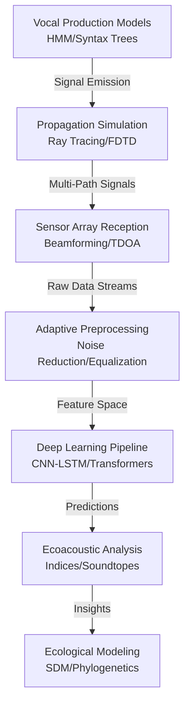

# Bioacoustics Technical Notes
<!-- A rectangular image depicting an advanced bioacoustics workflow: a sensor network with hydrophones and microphones in a marine-terrestrial ecosystem, a dashboard showing real-time spectrograms, beamforming localization maps, deep learning classification outputs, and ecological network graphs, with arrows illustrating multi-sensor fusion, automated annotation, and long-term trend analysis. -->

## Quick Reference
- **Definition**: Bioacoustics is the advanced interdisciplinary field integrating acoustics, biology, signal processing, and machine learning to study sound in biological systems, emphasizing quantitative analysis of vocal repertoires, soundscapes, and ecoacoustic indices.
- **Key Use Cases**: Large-scale biodiversity monitoring using AI-driven passive acoustic networks, phylogeographic analysis of vocal dialects, and predictive modeling of anthropogenic noise impacts on animal communities.
- **Prerequisites**: Advanced proficiency in signal processing, machine learning (deep learning for audio), ecological statistics, and programming for high-performance computing.

## Table of Contents
1. Introduction
2. Core Concepts
3. Implementation Details
4. Real-World Applications
5. Tools & Resources
6. References
7. Appendix

## Introduction
### What
Bioacoustics encompasses the quantitative study of biological sound production, propagation dynamics, sensory reception, and ecological implications, leveraging advanced computational methods for automated analysis and modeling.

### Why
Bioacoustics provides scalable, non-invasive tools for assessing biodiversity, detecting cryptic behaviors, modeling acoustic niches, and quantifying human impacts on soundscapes, enabling predictive ecology and informed conservation strategies.

### Where
Bioacoustics is deployed in large-scale monitoring networks for terrestrial/marine ecosystems, phylogeographic studies of vocal evolution, anthropogenic noise impact assessments, and bio-inspired acoustic engineering.

## Core Concepts
### Fundamental Understanding
- **Basic Principles**: Bioacoustic signals are modeled as stochastic processes with species-specific spectral-temporal signatures; propagation involves wave equation solutions in heterogeneous media, while reception/analysis uses information theory for signal detection in noise.
- **Key Components**:
  - **Vocal Repertoire Analysis**: Hidden Markov Models (HMMs) for sequence modeling of complex songs, with syntactic analysis for communication complexity.
  - **Soundscape Ecology**: Computation of ecoacoustic indices (e.g., ACI, NDSI) and soundtope modeling using spatial statistics.
  - **Source Localization**: Beamforming and time-difference-of-arrival (TDOA) in microphone arrays, incorporating environmental ray tracing.
  - **Machine Learning Integration**: CNN-RNN architectures for end-to-end classification, transfer learning from large datasets like AudioSet.
- **Common Misconceptions**:
  - Spectral analysis suffices: Multi-modal fusion (e.g., with seismic data) is often required for robust detection.
  - Stationary signals: Non-stationarity due to Doppler effects and environmental variability necessitates adaptive processing.
  - Species-level focus: Community-level soundscape analysis reveals emergent ecological patterns.

### Visual Architecture

- **System Overview**: Vocal models inform propagation simulations, received by arrays, preprocessed adaptively, analyzed via deep learning, yielding ecoacoustic metrics for advanced ecological modeling.
- **Component Relationships**: Production models constrain propagation inputs, reception feeds adaptive processing, features drive ML predictions, which enable high-level ecological inferences.

## Implementation Details
### Advanced Topics
```python
import librosa
import numpy as np
import torch
import torch.nn as nn
from torch.utils.data import DataLoader
from sklearn.metrics import roc_auc_score
import matplotlib.pyplot as plt
from scipy.signal import butter, filtfilt

class BioacousticCNNLSTM(nn.Module):
    def __init__(self, num_classes=10):
        super().__init__()
        self.cnn = nn.Sequential(
            nn.Conv2d(1, 64, kernel_size=3, padding=1),
            nn.ReLU(),
            nn.MaxPool2d(2),
            nn.Conv2d(64, 128, kernel_size=3, padding=1),
            nn.ReLU(),
            nn.MaxPool2d(2)
        )
        self.lstm = nn.LSTM(128 * 32, 256, bidirectional=True, batch_first=True)  # Assuming 128 mels, downsampled
        self.fc = nn.Linear(512, num_classes)
    
    def forward(self, x):
        x = self.cnn(x.unsqueeze(1))  # Add channel dim
        x = x.permute(0, 2, 1, 3).reshape(x.size(0), x.size(2), -1)  # Flatten for LSTM
        x, _ = self.lstm(x)
        return self.fc(x[:, -1, :])  # Last time step

# Load and preprocess audio
def preprocess_audio(file, sr=22050, duration=5):
    y, _ = librosa.load(file, sr=sr, duration=duration)
    
    # Adaptive noise reduction (Butterworth filter)
    b, a = butter(4, [200/sr/2, 8000/sr/2], btype='band')  # Bandpass 200-8000 Hz
    y_filtered = filtfilt(b, a, y)
    
    # Spectrogram with advanced features
    S = librosa.feature.melspectrogram(y=y_filtered, sr=sr, n_mels=128, fmax=8000)
    S_dB = librosa.power_to_db(S, ref=np.max)
    
    # Temporal segmentation (energy-based)
    onset_env = librosa.onset.onset_strength(y=y_filtered, sr=sr)
    segments = librosa.effects.split(y_filtered, top_db=20)
    
    return torch.tensor(S_dB), segments

# Training loop (assume dataset loader)
model = BioacousticCNNLSTM(num_classes=5).cuda()
optimizer = torch.optim.Adam(model.parameters(), lr=0.001)
criterion = nn.CrossEntropyLoss()

for epoch in range(10):
    for batch in dataloader:  # Assume DataLoader with labels
        specs, labels = batch['spec'].cuda(), batch['label'].cuda()
        outputs = model(specs)
        loss = criterion(outputs, labels)
        optimizer.zero_grad()
        loss.backward()
        optimizer.step()

# Evaluation with AUC
preds = model(test_specs.cuda()).cpu().detach().numpy()
print(f"AUC: {roc_auc_score(test_labels, preds, multi_class='ovr')}")

# Visualize beamforming (simplified)
def beamform_localization(signals, mic_positions, src_angle):
    # Assume signals: (n_mics, n_samples)
    delays = np.sin(src_angle) * mic_positions / 343  # Speed of sound
    aligned = np.roll(signals, delays.astype(int), axis=0)
    return np.sum(aligned, axis=0)  # Sum for constructive interference

plt.plot(beamform_localization(sim_signals, mic_pos, 45))  # Example usage
plt.title('Beamformed Signal')
plt.show()
```
- **System Design**:
  - **End-to-End Pipelines**: Integrate preprocessing, feature extraction, and DL models for automated annotation.
  - **Sensor Fusion**: Combine acoustic with environmental data (e.g., temperature) for propagation correction.
  - **Scalable Architectures**: Distributed processing for petabyte-scale long-term datasets.
- **Optimization Techniques**:
  - **Adaptive Filtering**: Butterworth/Median filters for noise reduction in varying environments.
  - **Hybrid Models**: CNN-LSTM/Transformers for capturing spectro-temporal hierarchies.
  - **Localization Algorithms**: Delay-and-sum beamforming with environmental modeling.
- **Production Considerations**:
  - **Data Augmentation**: Simulate propagation effects for robust training.
  - **Uncertainty Quantification**: Bayesian DL for confidence in classifications.
  - **Ethical Deployment**: Minimize disturbance in sensitive habitats; ensure data privacy in human-involved studies.

## Real-World Applications
### Industry Examples
- **Use Case**: Long-term monitoring of marine mammal populations amid shipping noise.
- **Implementation Pattern**: Hydrophone arrays with beamforming localization, DL classification, and NDSI index tracking.
- **Success Metrics**: >95% detection accuracy, correlation with population models, noise impact quantification.

### Hands-On Project
- **Project Goals**: Develop an automated classifier for multi-species calls with localization.
- **Implementation Steps**:
  1. Collect labeled dataset (e.g., from Bioacoustics Data Portal).
  2. Implement preprocessing and CNN-LSTM model as above.
  3. Train with augmentation; evaluate AUC and localization error.
  4. Deploy on edge devices for real-time monitoring.
- **Validation Methods**: Cross-validation with field data; compare with manual annotations.

## Tools & Resources
### Essential Tools
- **Development Environment**: Python 3.9+, GPU for DL training.
- **Key Frameworks**: Librosa, PyTorch/TensorFlow, Scipy for signal processing.
- **Testing Tools**: Praat for annotation, ARBIMON for large-scale analysis.

### Learning Resources
- **Documentation**: PyTorch Audio docs, Librosa advanced examples.
- **Tutorials**: "Deep Learning for Bioacoustics" on GitHub repos.
- **Community Resources**: International Bioacoustics Council, ASA Bioacoustics Committee.

## References
- Advanced Textbook: "Computational Bioacoustics" by Stowell (2021).
- BioSounds Database: biosounds.org.
- Ecoacoustics Journal: Various papers on indices.

## Appendix
### Glossary
- **Beamforming**: Technique for spatial filtering using microphone arrays.
- **Ecoacoustic Index**: Metric quantifying soundscape properties (e.g., ACI: Acoustic Complexity Index).
- **HMM**: Hidden Markov Model for sequence analysis of vocalizations.

### Setup Guides
- Install DL Stack: `pip install torch torchvision torchaudio librosa scikit-learn matplotlib scipy`.
- GPU Setup: Follow CUDA installation for PyTorch.