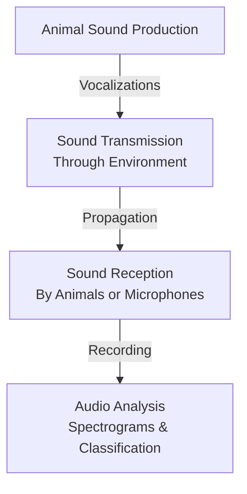

# Bioacoustics Technical Notes
<!-- A rectangular image showing a simplified bioacoustics workflow, with a microphone in a forest recording bird calls, a waveform and spectrogram displayed on a laptop screen, and arrows illustrating sound production by animals, transmission through the environment, and analysis on the computer. -->

## Quick Reference
- **Definition**: Bioacoustics is the scientific study of sound production, dispersion, and reception in animals, including humans.
- **Key Use Cases**: Monitoring wildlife populations, studying animal behavior through vocalizations, and conservation efforts like tracking endangered species.
- **Prerequisites**: Basic knowledge of sound waves and biology, access to a computer with audio recording capabilities, and familiarity with simple software tools.

## Table of Contents
1. Introduction
2. Core Concepts
3. Implementation Details
4. Real-World Applications
5. Tools & Resources
6. References
7. Appendix

## Introduction
### What
Bioacoustics is an interdisciplinary field combining biology and acoustics to investigate how animals produce, transmit, and receive sounds in their environments.

### Why
Bioacoustics helps understand animal communication, behavior, and ecology, enabling non-invasive monitoring of species and ecosystems, which is crucial for conservation and research.

### Where
Bioacoustics is applied in wildlife conservation, marine biology (e.g., whale calls), ornithology (bird songs), and even human-related studies like speech pathology.

## Core Concepts
### Fundamental Understanding
- **Basic Principles**: Animals produce sounds for communication, mating, navigation, or warning; these sounds propagate through air, water, or solids and are received by ears or sensors for analysis.
- **Key Components**:
  - **Sound Production**: Vocalizations created by organs like syrinx in birds or larynx in mammals.
  - **Sound Transmission**: How sounds travel through environments, affected by factors like distance, medium, and obstacles.
  - **Sound Reception**: Detection by animal ears or human recording devices.
  - **Analysis**: Examining frequency, amplitude, and patterns to identify species or behaviors.
- **Common Misconceptions**:
  - Bioacoustics is only about birds: It includes all animals, from insects to whales.
  - Requires expensive equipment: Beginners can start with smartphones or basic microphones.
  - Sounds are always audible: Many involve ultrasound or infrasound beyond human hearing.

### Visual Architecture

- **System Overview**: Sounds are produced by animals, transmitted through the medium, received and recorded, then analyzed to extract biological insights.
- **Component Relationships**: Production leads to transmission, which enables reception; analysis interprets the recorded data for research applications.

## Implementation Details
### Basic Implementation
```python
import librosa
import librosa.display
import matplotlib.pyplot as plt
import numpy as np

# Load a sample audio file (replace with your own recording)
audio_path = 'bird_call.wav'  # Assume a WAV file of a bird call
y, sr = librosa.load(audio_path)

# Generate a spectrogram
S = librosa.feature.melspectrogram(y=y, sr=sr, n_mels=128)
S_dB = librosa.power_to_db(S, ref=np.max)

# Display the spectrogram
plt.figure(figsize=(10, 4))
librosa.display.specshow(S_dB, x_axis='time', y_axis='mel', sr=sr, fmax=8000)
plt.colorbar(format='%+2.0f dB')
plt.title('Mel-frequency spectrogram')
plt.tight_layout()
plt.show()
```
- **Step-by-Step Setup**:
  1. Install librosa and matplotlib: `pip install librosa matplotlib`.
  2. Record or download a sample animal sound (e.g., bird call WAV file).
  3. Load the audio file using librosa.
  4. Compute and display a spectrogram to visualize the sound frequencies over time.
- **Code Walkthrough**:
  - The code loads an audio file, computes a mel-spectrogram (a visual representation of frequencies), and plots it.
  - This helps beginners see patterns in animal sounds.
- **Common Pitfalls**:
  - Incorrect file format: Use WAV or MP3; convert if needed.
  - Missing dependencies: Ensure NumPy and SciPy are installed (librosa requires them).
  - Large files: Start with short recordings to avoid memory issues.

## Real-World Applications
### Industry Examples
- **Use Case**: Monitoring bird populations in a forest to assess biodiversity.
- **Implementation Pattern**: Deploy passive recorders, analyze recordings for species-specific calls.
- **Success Metrics**: Accurate species identification and population estimates.

### Hands-On Project
- **Project Goals**: Record and analyze a local animal sound to identify its characteristics.
- **Implementation Steps**:
  1. Use a smartphone to record a bird or insect sound.
  2. Save as WAV and load into the Python script above.
  3. Generate and interpret the spectrogram (e.g., note frequency ranges).
  4. Compare with online databases for species matching.
- **Validation Methods**: Verify the spectrogram shows expected patterns; listen back to confirm.

## Tools & Resources
### Essential Tools
- **Development Environment**: Python 3.8+, Jupyter Notebook for interactive analysis.
- **Key Frameworks**: Librosa for audio processing, Matplotlib for visualization.
- **Testing Tools**: Audacity for recording and editing audio files.

### Learning Resources
- **Documentation**: Librosa documentation (librosa.org/doc).
- **Tutorials**: "Introduction to Bioacoustics with Python" on Towards Data Science.
- **Community Resources**: Cornell Lab of Ornithology forums, Stack Overflow for audio analysis.

## References
- Wikipedia: Bioacoustics (en.wikipedia.org/wiki/Bioacoustics).
- Cornell Lab: Bioacoustics Tools (birds.cornell.edu/ccb/bioacoustics-tools).
- Earth.fm: What is Bioacoustics? (earth.fm/glossary/what-is-bioacoustics-definition-and-examples).

## Appendix
### Glossary
- **Spectrogram**: Visual representation of sound frequencies over time.
- **Vocalization**: Sounds produced by animals for communication.
- **Passive Acoustic Monitoring**: Using recorders to listen to animal sounds without disturbance.

### Setup Guides
- Install Librosa: `pip install librosa`.
- Record Audio: Use Audacity (free download from audacityteam.org).