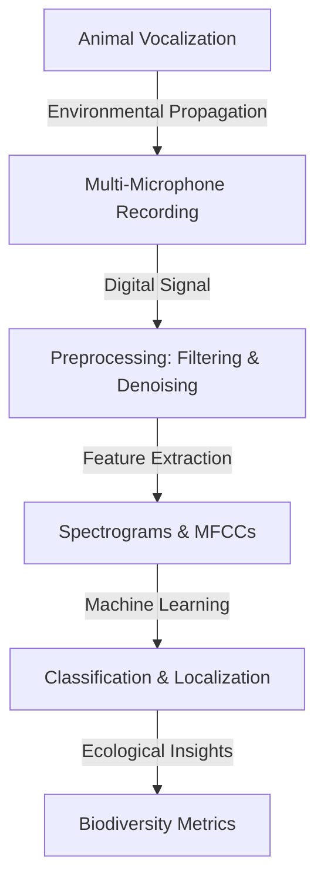

# Bioacoustics Technical Notes
<!-- A rectangular image depicting an intermediate bioacoustics workflow: a field setup with multiple microphones in an array capturing animal sounds in a natural habitat, a computer screen showing spectrograms, feature extraction plots, and classification results, with arrows illustrating signal processing steps from recording to species identification using machine learning models. -->

## Quick Reference
- **Definition**: Bioacoustics is the interdisciplinary study of biological sounds, focusing on animal vocalizations, their production mechanisms, propagation characteristics, and ecological significance.
- **Key Use Cases**: Automated species monitoring in conservation projects, analyzing behavioral patterns through call variations, and assessing environmental impacts on acoustic communities.
- **Prerequisites**: Proficiency in Python, basic signal processing knowledge, experience with audio visualization tools, and understanding of ecological principles.

## Table of Contents
1. Introduction
2. Core Concepts
3. Implementation Details
4. Real-World Applications
5. Tools & Resources
6. References
7. Appendix

## Introduction
### What
Bioacoustics examines the production, transmission, and reception of sounds in biological systems, integrating acoustics, biology, and signal processing to analyze animal communication and behavior.

### Why
Bioacoustics enables non-invasive, large-scale monitoring of biodiversity, detection of cryptic species, and quantification of ecosystem health through acoustic indices, providing insights unattainable through visual surveys.

### Where
Bioacoustics is applied in terrestrial and marine ecology for population monitoring, behavioral studies in ethology, and conservation biology for habitat assessment and threat detection.

## Core Concepts
### Fundamental Understanding
- **Basic Principles**: Animal sounds are characterized by frequency, amplitude, duration, and temporal patterns; environmental factors like attenuation and reverberation affect propagation, while reception involves sensory adaptations or sensor arrays.
- **Key Components**:
  - **Vocalization Types**: Calls (short, functional) vs. songs (complex, learned); frequency ranges (infrasound, audible, ultrasound).
  - **Acoustic Propagation**: Sound absorption in air/water, multipath effects in complex habitats, and source localization using time-of-arrival differences.
  - **Feature Extraction**: Spectro-temporal features like formants, modulation rates, and entropy for classification.
  - **Ecological Metrics**: Acoustic diversity indices (ADI, ACI) measuring community complexity from recordings.
- **Common Misconceptions**:
  - All vocalizations are species-specific: Many overlap, requiring context and multi-feature analysis.
  - Passive recording is bias-free: Sensor placement and environmental noise introduce artifacts.
  - Manual analysis scales: Automated processing is essential for big data from long-term deployments.

### Visual Architecture

- **System Overview**: Vocalizations propagate and are recorded by arrays, preprocessed for quality, features extracted for analysis, classified using ML, yielding ecological metrics.
- **Component Relationships**: Recording captures propagated signals, preprocessing enhances features, extraction feeds ML models, which inform ecological interpretations.

## Implementation Details
### Intermediate Patterns
```python
import librosa
import numpy as np
from sklearn.ensemble import RandomForestClassifier
from sklearn.model_selection import train_test_split
from sklearn.metrics import accuracy_score
import matplotlib.pyplot as plt

# Load multiple audio files (assume dataset of bird calls)
audio_files = ['bird1.wav', 'bird2.wav', 'frog1.wav']  # Replace with your files
labels = [0, 0, 1]  # 0: bird, 1: frog

features = []
for file in audio_files:
    y, sr = librosa.load(file)
    
    # Extract features: MFCCs and spectral contrast
    mfcc = librosa.feature.mfcc(y=y, sr=sr, n_mfcc=13)
    contrast = librosa.feature.spectral_contrast(y=y, sr=sr)
    
    # Mean features for classification
    feature_vec = np.concatenate((np.mean(mfcc, axis=1), np.mean(contrast, axis=1)))
    features.append(feature_vec)

# Prepare dataset
X = np.array(features)
y_labels = np.array(labels)

# Split and train classifier
X_train, X_test, y_train, y_test = train_test_split(X, y_labels, test_size=0.3)
clf = RandomForestClassifier(n_estimators=100)
clf.fit(X_train, y_train)

# Predict and evaluate
preds = clf.predict(X_test)
print(f"Accuracy: {accuracy_score(y_test, preds)}")

# Visualize feature importance
plt.bar(range(len(clf.feature_importances_)), clf.feature_importances_)
plt.title('Feature Importance')
plt.show()
```
- **Design Patterns**:
  - **Feature Engineering**: Combine MFCCs (cepstral coefficients) with spectral features for robust classification.
  - **Supervised Learning**: Use labeled datasets for species identification with ensemble methods.
  - **Acoustic Indices**: Compute entropy-based metrics for community-level analysis.
- **Best Practices**:
  - Normalize audio levels and apply noise reduction before feature extraction.
  - Use cross-validation to handle small datasets common in field recordings.
  - Augment data with time-stretching or pitch-shifting for model robustness.
- **Performance Considerations**:
  - Process long recordings in segments to manage memory.
  - Optimize features for computational efficiency in large-scale analysis.
  - Evaluate models with field-specific metrics like precision-recall for imbalanced classes.

## Real-World Applications
### Industry Examples
- **Use Case**: Automated monitoring of rainforest biodiversity using acoustic sensors.
- **Implementation Pattern**: Deploy microphone arrays, extract features from recordings, classify species with ML models.
- **Success Metrics**: High classification accuracy (>85%) and correlation with visual surveys.

### Hands-On Project
- **Project Goals**: Classify animal calls from a small dataset using machine learning.
- **Implementation Steps**:
  1. Collect or download labeled audio files (e.g., from Xeno-Canto).
  2. Install libraries: `pip install librosa scikit-learn matplotlib`.
  3. Extract features and train a classifier as in the code.
  4. Evaluate accuracy and visualize important features.
- **Validation Methods**: Use confusion matrices to assess misclassifications; test on unseen recordings.

## Tools & Resources
### Essential Tools
- **Development Environment**: Python 3.8+, Jupyter for exploratory analysis.
- **Key Frameworks**: Librosa for audio features, scikit-learn for ML models.
- **Testing Tools**: Audacity for annotation, Praat for manual spectrogram analysis.

### Learning Resources
- **Documentation**: Librosa docs (librosa.org/doc), scikit-learn user guide.
- **Tutorials**: "Bioacoustics with Machine Learning" on Kaggle.
- **Community Resources**: Bioacoustics Stack Exchange, eBird forums.

## References
- Bioacoustics Textbook: "Principles of Bioacoustics" by Sueur (2018).
- Xeno-Canto: xenocanto.org for bird sound database.
- Ecoacoustics Congress: ecoacousticscongress.org.

## Appendix
### Glossary
- **MFCC**: Mel-Frequency Cepstral Coefficients, key features for sound classification.
- **Acoustic Index**: Quantitative measure of soundscape complexity.
- **Passive Monitoring**: Long-term recording without active intervention.

### Setup Guides
- Install Dependencies: `pip install librosa scikit-learn matplotlib numpy`.
- Data Sources: Download from Macaulay Library (macaulaylibrary.org).