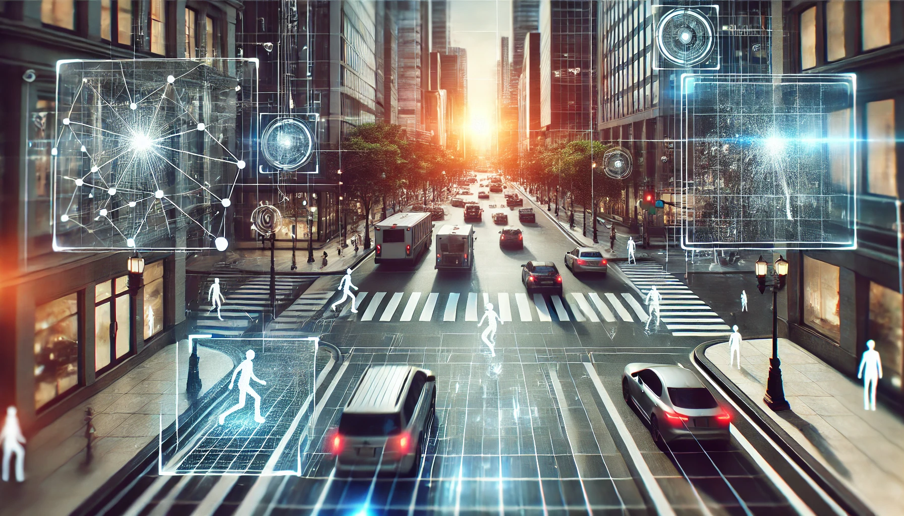
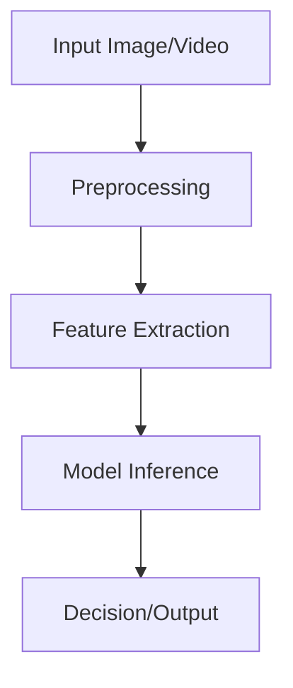

# Computer Vision Technical - [Intermediate] Notes  



## Quick Reference
- **Definition**: Computer vision is a field of artificial intelligence that enables computers to interpret and make decisions based on visual data.  
- **Key Use Cases**: Object detection, image segmentation, face recognition, autonomous driving, and medical imaging.  
- **Prerequisites**: Basic understanding of machine learning, linear algebra, Python programming, and familiarity with libraries like OpenCV or TensorFlow.

## Table of Contents
1. Introduction  
2. Core Concepts  
   - Fundamental Understanding  
   - Visual Architecture  
3. Implementation Details  
   - Basic to Intermediate Patterns  
4. Tools & Resources  
5. References  

## Introduction
- **What**: Computer vision focuses on enabling computers to process, understand, and interpret visual data such as images and videos.  
- **Why**: Solves problems in automation, enhances decision-making capabilities, and improves efficiency in processing visual information.  
- **Where**: Used across healthcare, automotive, agriculture, retail, and security.

## Core Concepts
### Fundamental Understanding
- **Basic Principles**:  
   - Input: Raw visual data (e.g., images, video frames).  
   - Processing: Feature extraction, pattern recognition, and modeling.  
   - Output: Labeled data, visualizations, or decisions.
- **Key Components**:  
   - Convolutional Neural Networks (CNNs)  
   - Feature descriptors (e.g., SIFT, HOG)  
   - Data augmentation techniques.  
- **Common Misconceptions**:  
   - "Computer vision always requires deep learning" – Traditional algorithms like edge detection still have applications.  
   - "High-resolution data is always better" – Often, resized images suffice for many tasks.  

### Visual Architecture


## Implementation Details
### Basic Implementation
```python
# Object Detection with OpenCV and Haar Cascades
import cv2

# Load the cascade
face_cascade = cv2.CascadeClassifier('haarcascade_frontalface_default.xml')
# Read the input image
img = cv2.imread('test.jpg')
# Convert into grayscale
gray = cv2.cvtColor(img, cv2.COLOR_BGR2GRAY)
# Detect faces
faces = face_cascade.detectMultiScale(gray, scaleFactor=1.1, minNeighbors=5)
# Draw rectangles around faces
for (x, y, w, h) in faces:
    cv2.rectangle(img, (x, y), (x+w, y+h), (255, 0, 0), 2)

cv2.imshow('Detected Faces', img)
cv2.waitKey()
cv2.destroyAllWindows()
```

### Intermediate Patterns
- Design patterns: Modular pipelines for preprocessing, model inference, and output.  
- Best practices: Normalize image inputs, monitor overfitting, and use transfer learning when possible.  
- Performance considerations: Optimize models using TensorRT or ONNX Runtime.

## Tools & Resources
### Essential Tools
- Libraries: OpenCV, PyTorch, TensorFlow, scikit-image.  
- Frameworks: Detectron2, YOLOv8.  
- Testing tools: Roboflow, FiftyOne.

### Learning Resources
- Courses: Coursera's "Deep Learning Specialization," Fast.ai's free tutorials.  
- Books: *Deep Learning for Computer Vision* by Rajalingappaa Shanmugamani.  
- Communities: Kaggle, Papers with Code.

## References
- OpenCV Documentation  
- "ImageNet Classification with Deep Convolutional Neural Networks" by Krizhevsky et al.  
- Stanford CS231n Lecture Notes.  
