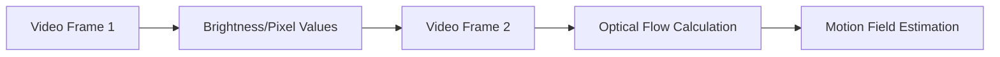

# Motion Field and Optical Flow - Notes

## Table of Contents (ToC)
  - [Introduction](#introduction)
  - [Key Concepts](#key-concepts)
  - [Why It Matters / Relevance](#why-it-matters--relevance)
  - [Learning Map (Architecture Pipeline)](#learning-map-architecture-pipeline)
  - [Framework / Key Theories or Models](#framework--key-theories-or-models)
  - [How Motion Field and Optical Flow Work](#how-motion-field-and-optical-flow-work)
  - [Methods, Types \& Variations](#methods-types--variations)
  - [Self-Practice / Hands-On Examples](#self-practice--hands-on-examples)
  - [Pitfalls \& Challenges](#pitfalls--challenges)
  - [Feedback \& Evaluation](#feedback--evaluation)
  - [Tools, Libraries \& Frameworks](#tools-libraries--frameworks)
  - [Hello World! (Practical Example)](#hello-world-practical-example)
  - [Advanced Exploration](#advanced-exploration)
  - [Zero to Hero Lab Projects](#zero-to-hero-lab-projects)
  - [Continuous Learning Strategy](#continuous-learning-strategy)
  - [References](#references)

## Introduction
- **Motion field** refers to the 3D motion of objects relative to a camera, while **optical flow** is the apparent motion of objects between consecutive frames of a video.

## Key Concepts
- **Motion Field**: The actual movement of objects in the scene, which may differ from what is perceived by the camera.
- **Optical Flow**: The pixel-wise changes in brightness between two consecutive video frames, used to estimate the motion field.
- **Feynman Principle**: Imagine explaining optical flow as tracking how each pixel in a video seems to move from one frame to the next, like observing ripples in a pond.
- **Misconception**: Optical flow is often mistaken as the actual movement of objects, but it only captures perceived motion (e.g., changes in the image), not the true 3D motion.

## Why It Matters / Relevance
- **Autonomous Vehicles**: Optical flow helps vehicles understand how objects, like pedestrians, are moving relative to them.
- **Motion Capture**: Used in animation and sports to analyze and replicate human movement.
- **Robotics**: Essential for robot navigation, enabling them to interpret movement in their environment.
- Mastering motion field and optical flow is key for developing advanced video analytics and real-time applications in AI.

## Learning Map (Architecture Pipeline)

- The process starts with two consecutive video frames, analyzing changes in brightness values to compute optical flow, and then estimating the underlying motion field.

## Framework / Key Theories or Models
- **Horn-Schunck Method**: A global optical flow method that assumes smooth motion across the image, solving for flow by minimizing a cost function.
- **Lucas-Kanade Method**: A local method that computes optical flow in small patches of the image, often faster and better suited for real-time applications.
- **Historical Context**: The concept of optical flow has been foundational in early computer vision research, particularly in fields like motion detection and 3D reconstruction.

## How Motion Field and Optical Flow Work
- **Step 1**: Capture two consecutive frames from a video or camera feed.
- **Step 2**: Compare brightness patterns between the frames to identify pixel movements.
- **Step 3**: Apply optical flow algorithms (e.g., Horn-Schunck or Lucas-Kanade) to estimate the motion of objects based on these pixel changes.
- **Step 4**: Use the optical flow data to infer the motion field, representing how objects actually move in 3D space.

## Methods, Types & Variations
- **Dense Optical Flow**: Estimates the flow at every pixel in the image, providing a full motion field. It is computationally expensive but detailed.
- **Sparse Optical Flow**: Only tracks certain points (e.g., corners) in the image, leading to faster but less detailed motion estimation.
- **Contrasting Example**: Dense optical flow for precise motion tracking vs. sparse optical flow for fast and real-time applications.

## Self-Practice / Hands-On Examples
1. **Exercise 1**: Implement a simple Lucas-Kanade method to track key points in a video using OpenCV.
2. **Exercise 2**: Visualize dense optical flow on a short video clip to see how motion patterns are represented.

## Pitfalls & Challenges
- **Illumination Changes**: Sudden changes in lighting can be misinterpreted as motion by optical flow algorithms.
- **Occlusion**: Objects moving out of view or being blocked can disrupt accurate flow estimation.
- **Suggestions**: Implement pre-processing techniques like image normalization to mitigate lighting issues, and use more sophisticated flow methods to handle occlusions.

## Feedback & Evaluation
- **Self-explanation test**: Explain the difference between motion field and optical flow in your own words, and how they are related but distinct.
- **Peer Review**: Present your optical flow results to peers and discuss how well the flow captures actual movement in the video.
- **Real-world Simulation**: Test your optical flow algorithm on a real video of moving objects, such as pedestrians crossing the street.

## Tools, Libraries & Frameworks
- **OpenCV**: Offers built-in functions for optical flow computation, including Lucas-Kanade and Farneback methods.
- **Pytorch & TensorFlow**: Can be used for deep learning-based flow estimation models for more accurate and robust results.
- **Pros and Cons**: OpenCV is easy to use and offers real-time performance; deep learning models are more accurate but slower and require more resources.

## Hello World! (Practical Example)
```python
import cv2
import numpy as np

# Load video
cap = cv2.VideoCapture('video.mp4')

# Parameters for Lucas-Kanade Optical Flow
lk_params = dict(winSize=(15,15), maxLevel=2, criteria=(cv2.TERM_CRITERIA_EPS | cv2.TERM_CRITERIA_COUNT, 10, 0.03))

# Read first frame and convert to grayscale
ret, old_frame = cap.read()
old_gray = cv2.cvtColor(old_frame, cv2.COLOR_BGR2GRAY)

# Detect corners in the first frame
p0 = cv2.goodFeaturesToTrack(old_gray, mask=None, **dict(maxCorners=100, qualityLevel=0.3, minDistance=7))

while cap.isOpened():
    ret, frame = cap.read()
    if not ret:
        break

    frame_gray = cv2.cvtColor(frame, cv2.COLOR_BGR2GRAY)

    # Calculate optical flow
    p1, st, err = cv2.calcOpticalFlowPyrLK(old_gray, frame_gray, p0, None, **lk_params)

    # Select good points
    good_new = p1[st == 1]
    good_old = p0[st == 1]

    # Draw the tracks
    for i, (new, old) in enumerate(zip(good_new, good_old)):
        a, b = new.ravel()
        c, d = old.ravel()
        cv2.line(frame, (a, b), (c, d), (0, 255, 0), 2)

    # Display the frame
    cv2.imshow('Optical Flow', frame)
    if cv2.waitKey(1) & 0xFF == ord('q'):
        break

    # Update the previous frame and points
    old_gray = frame_gray.copy()
    p0 = good_new.reshape(-1, 1, 2)

cap.release()
cv2.destroyAllWindows()
```
- This script tracks points in a video using the Lucas-Kanade optical flow method.

## Advanced Exploration
- **Papers**: "A Comparison of Dense Optical Flow Methods for Real-Time Applications" (Research Paper)
- **Videos**: In-depth tutorials on implementing optical flow with deep learning techniques.
- **Articles**: Detailed articles on how motion field and optical flow are used in autonomous vehicles and drones.

## Zero to Hero Lab Projects
- **Beginner**: Implement an optical flow-based motion detection system that tracks movements in a room.
- **Intermediate**: Build a traffic flow estimator using optical flow to count cars in a video feed.
- **Expert**: Develop an augmented reality app that uses optical flow to interact with moving objects in the user’s environment.

## Continuous Learning Strategy
- Dive deeper into **time-series analysis** for optical flow over longer sequences, essential for action recognition.
- Explore **3D reconstruction** using motion field data to create 3D models from video footage.

## References
- OpenCV Optical Flow Documentation: https://docs.opencv.org/4.x/d4/dee/tutorial_optical_flow.html
- "Horn-Schunck Optical Flow Algorithm" (Research Paper)
- "Real-Time Motion Detection and Estimation Using Optical Flow" (Article)

