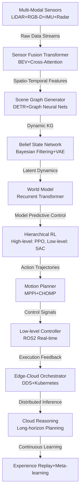

# Vision Agents Technical Notes

<!-- A rectangular image depicting an advanced vision agent architecture: multi-sensor fusion with LiDAR-RGB-D-IMU integration, transformer-based perception models, hierarchical RL with meta-learning, real-time scene graph generation, distributed computing across edge-cloud infrastructure, and production monitoring dashboard showing latency percentiles, accuracy drift, and failure recovery metrics. -->

## Quick Reference
- **Definition**: Vision agents are production-grade autonomous systems integrating multi-modal sensor fusion, transformer-based perception, hierarchical reinforcement learning, real-time scene understanding, and distributed edge-cloud computing for mission-critical applications requiring sub-millisecond latency and 99.99% uptime.
- **Key use cases**: Autonomous vehicle perception systems, surgical robotics with real-time tissue tracking, warehouse automation with dynamic obstacle avoidance, and AR/VR with physics-aware scene understanding.
- **Prerequisites**: Expert-level proficiency in deep learning, ROS2, distributed systems, real-time embedded programming, reinforcement learning frameworks, and production ML deployment pipelines.

## Table of Contents
1. [Introduction](#introduction)
    * [What](#what)
    * [Why](#why)
    * [Where](#where)
2. [Core Concepts](#core-concepts)
    * [Fundamental Understanding](#fundamental-understanding)
    * [Visual Architecture](#visual-architecture)
3. [Implementation Details](#implementation-details)
    * [Advanced Topics](#advanced-topics)
4. [Real-World Applications](#real-world-applications)
    * [Industry Examples](#industry-examples)
    * [Hands-On Project](#hands-on-project)
5. [Tools & Resources](#tools--resources)
    * [Essential Tools](#essential-tools)
    * [Learning Resources](#learning-resources)
6. [References](#references)
7. [Appendix](#appendix)
    * [Glossary](#glossary)
    * [Setup guides](#setup-guides)

## Introduction
### What
Advanced vision agents implement end-to-end autonomous systems combining multi-modal sensor fusion, transformer architectures for spatio-temporal perception, hierarchical decision-making with model-based RL, real-time scene graph reasoning, and distributed edge-cloud inference with fault-tolerant execution and continuous learning capabilities.

### Why
Advanced vision agents address the limitations of single-modal perception and reactive control by providing robust, adaptive intelligence that handles uncertainty, rare events, and long-horizon planning while maintaining real-time performance guarantees and production reliability through distributed computing and continuous adaptation.

### Where
Deployed in safety-critical systems (autonomous vehicles, medical robotics), high-throughput industrial automation, immersive AR/VR environments, and defense applications requiring robust perception-action loops under extreme conditions and adversarial scenarios.

## Core Concepts
### Fundamental Understanding
- **Basic principles**: Advanced vision agents implement end-to-end differentiable perception-action pipelines using spatio-temporal transformers, Bayesian belief propagation for uncertainty quantification, hierarchical model-based RL with world models, and distributed inference with dynamic workload partitioning between edge and cloud.
- **Key components**:
  - **Multi-Modal Fusion Transformer**: BEV (Bird's Eye View) fusion of LiDAR-RGB-D-IMU data with cross-attention mechanisms.
  - **Scene Graph Memory**: Dynamic knowledge graphs with temporal evolution and uncertainty propagation.
  - **Hierarchical World Model**: Latent dynamics models for long-horizon planning and counterfactual reasoning.
  - **Model-Based RL Controller**: MBPO/MuZero-style planning with differentiable physics simulation.
  - **Distributed Inference Engine**: ROS2-DDS middleware with edge-cloud orchestration and fault tolerance.
- **Common misconceptions**:
  - End-to-end learning solves everything: Explicit world models and hierarchical planning are crucial for sample efficiency and safety.
  - Single-device inference suffices: Distributed edge-cloud architectures are required for real-time guarantees.
  - Static models work in production: Continuous adaptation and rare-event handling are essential.

### Visual Architecture

- **System Overview**: Multi-modal data feeds transformer-based fusion, generating dynamic scene graphs that update belief states and world models, driving hierarchical RL planning executed through distributed edge-cloud infrastructure with continuous learning.
- **Component Relationships**: Each module maintains differentiable interfaces for end-to-end optimization, with distributed execution balancing latency constraints and computational complexity.

## Implementation Details
### Advanced Topics
```python
import torch
import torch.nn as nn
import ros2_rclpy
from transformers import DetrImageProcessor, DetrForObjectDetection
import numpy as np
from filterpy import kalman
import rclpy
from rclpy.node import Node
from geometry_msgs.msg import Twist
from sensor_msgs.msg import PointCloud2, Image
from cv_bridge import CvBridge
import hydra
from omegaconf import DictConfig
import wandb

class AdvancedVisionAgent(Node):
    def __init__(self, cfg: DictConfig):
        super().__init__('advanced_vision_agent')
        self.cfg = cfg
        
        # Multi-modal fusion transformer
        self.fusion_model = BEVFusionTransformer(
            lidar_dim=cfg.lidar.channels,
            rgb_dim=3,
            imu_dim=cfg.imu.features,
            hidden_dim=512,
            num_heads=8
        ).cuda()
        
        # Scene graph generator with DETR
        self.detr_processor = DetrImageProcessor.from_pretrained("facebook/detr-resnet-101")
        self.detr_model = DetrForObjectDetection.from_pretrained("facebook/detr-resnet-101").cuda()
        
        # World model (RSSM - Recurrent State Space Model)
        self.world_model = RecurrentStateSpaceModel(
            latent_dim=cfg.world_model.latent_dim,
            action_dim=cfg.action_space.shape[0],
            deterministic=False
        ).cuda()
        
        # Hierarchical RL policies
        self.high_level_policy = PPO(cfg.rl.high_level).cuda()
        self.low_level_policy = SAC(cfg.rl.low_level).cuda()
        
        # Bayesian belief network
        self.belief_net = BayesianBeliefNetwork(cfg.belief.num_particles).cuda()
        
        # ROS2 publishers/subscribers with QoS
        qos = rclpy.qos.QoSProfile(
            depth=1,
            reliability=rclpy.qos.ReliabilityPolicy.BEST_EFFORT,
            durability=rclpy.qos.DurabilityPolicy.TRANSIENT_LOCAL
        )
        
        self.cmd_vel_pub = self.create_publisher(Twist, '/cmd_vel', qos)
        self.lidar_sub = self.create_subscription(
            PointCloud2, '/velodyne_points', self.lidar_callback, qos
        )
        self.rgb_sub = self.create_subscription(
            Image, '/camera/rgb/image_raw', self.rgb_callback, qos
        )
        
        # Distributed execution context
        self.cloud_client = CloudInferenceClient(cfg.cloud.endpoint)
        self.wandb_logger = wandb.init(project="vision-agent", config=cfg)
        
        # Real-time constraints
        self.executor = rclpy.executors.MultiThreadedExecutor(num_threads=cfg.rt.threads)
        
    async def perception_fusion(self, lidar_pc: np.ndarray, rgb_img: np.ndarray, imu_data: dict):
        """Multi-modal fusion with transformer architecture"""
        # Convert to BEV representation
        bev_lidar = pointcloud_to_bev(lidar_pc, cfg.lidar.voxel_size)
        bev_features = self.fusion_model(
            lidar=bev_lidar.cuda(),
            rgb=rgb_img.cuda(),
            imu=torch.tensor(imu_data['features']).cuda()
        )
        
        # Scene graph generation
        inputs = self.detr_processor(rgb_img, return_tensors="pt")
        outputs = self.detr_model(**inputs)
        
        # Extract objects and relationships
        predictions = outputs.pred_logits.softmax(-1)[0, :, :-1]
        boxes = outputs.pred_boxes[0]
        
        scene_graph = build_scene_graph(predictions, boxes, bev_features)
        return scene_graph, bev_features
    
    def hierarchical_planning(self, belief_state: torch.Tensor, goal: dict):
        """Model-based hierarchical planning with world model"""
        # High-level goal decomposition
        high_level_goals = self.high_level_policy.select_action(belief_state)
        
        # World model rollout for planning
        with torch.no_grad():
            latent_states, rewards, dones = self.world_model.rollout(
                belief_state, high_level_goals, horizon=cfg.planning.horizon
            )
        
        # Model Predictive Control (MPC)
        low_level_actions = self.low_level_policy.act(
            latent_states.mean(0), rewards, dones
        )
        
        # Cloud offloading for complex reasoning
        if cfg.distributed.complex_reasoning:
            cloud_plan = await self.cloud_client.plan_async(
                scene_graph=scene_graph,
                world_model_state=latent_states,
                compute_budget=cfg.cloud.budget
            )
            low_level_actions = cloud_plan['optimized_actions']
            
        return low_level_actions
    
    def safety_monitoring(self, action: torch.Tensor, belief: dict):
        """Real-time safety constraints and failure recovery"""
        # Constraint satisfaction
        constraints = self.cfg.safety.constraints
        violation = check_constraints(action, belief, constraints)
        
        if violation:
            # Emergency stop and recovery
            recovery_action = self.emergency_recovery(belief)
            self.get_logger().warn(f"Safety violation detected: {violation}")
            wandb.log({"safety_violation": 1, "recovery_action": recovery_action})
            return recovery_action
        
        # Uncertainty-aware action gating
        if belief['uncertainty'] > cfg.safety.uncertainty_threshold:
            conservative_action = self.conservative_fallback(belief)
            return conservative_action
            
        return action
```

- **System Design**:
  - **End-to-End Differentiability**: Full perception-action pipeline optimization with scene graph supervision.
  - **Distributed Edge-Cloud**: Dynamic workload partitioning based on latency requirements and computational complexity.
  - **Hierarchical RL**: High-level symbolic planning with low-level continuous control.
- **Optimization Techniques**:
  - **BEV Fusion**: Transformer-based multi-modal fusion in bird's eye view for spatial reasoning.
  - **World Models**: Latent dynamics for sample-efficient planning and counterfactual reasoning.
  - **Bayesian Uncertainty**: Particle filtering for robust state estimation under sensor failures.
- **Production Considerations**:
  - **Real-Time Guarantees**: ROS2 with real-time QoS and deterministic execution.
  - **Fault Tolerance**: Heartbeat monitoring, graceful degradation, and automatic failover.
  - **Continuous Learning**: Online meta-learning with experience replay and rare-event augmentation.

## Real-World Applications
### Industry Examples
- **Use case**: L4 autonomous vehicle perception system with 100ms end-to-end latency.
- **Implementation pattern**: BEV fusion transformers, hierarchical world models, distributed inference across vehicle-edge-cloud continuum.
- **Success metrics**: 99.99% uptime, <50ms perception latency, <1% false negative detection rate.

### Hands-On Project
- **Project goals**: Deploy production-grade vision agent for autonomous warehouse navigation.
- **Implementation steps**:
  1. Set up ROS2 Humble with NVIDIA Isaac Sim for simulation.
  2. Implement BEV fusion and scene graph generation pipeline.
  3. Train hierarchical world models with MuZero-style planning.
  4. Deploy distributed inference with Kubernetes orchestration.
  5. Implement safety monitoring and continuous learning.
- **Validation methods**: End-to-end latency profiling, safety constraint validation, rare-event simulation.

## Tools & Resources
### Essential Tools
- **Development environment**: ROS2 Humble, Ubuntu 22.04, NVIDIA A100/RTX 40xx GPUs.
- **Key frameworks**: PyTorch 2.0+, Transformers, ROS2-DDS, NVIDIA Isaac Sim.
- **Testing tools**: Carla simulator, NVIDIA Omniverse, real-time profiling with rt-tests.

### Learning Resources
- **Documentation**: ROS2 industrial guidelines, NVIDIA Deep Learning AI curriculum.
- **Tutorials**: "End-to-End Autonomous Driving" research implementations.
- **Community resources**: ROS-Industrial Consortium, Autonomous Vehicle working groups.

## References
- ROS2 Documentation: docs.ros.org
- BEVFusion Paper: "BEVFormer: Learning Bird's-Eye-View Representation from Multi-Camera Images"
- World Models: "World Models" by Ha and Schmidhuber

## Appendix
### Glossary
- **BEV Fusion**: Bird's Eye View multi-modal sensor fusion using transformers.
- **Scene Graph**: Structured representation of objects and their relationships.
- **Model-Based RL**: Reinforcement learning using learned world models for planning.

### Setup guides
- ROS2 Install: `sudo apt install ros-humble-desktop`
- NVIDIA Setup: CUDA 12.x, cuDNN 8.x, TensorRT 8.x
- Distributed: Kubernetes with NVIDIA GPU operator
</artifact>

**For Canva Import:**
1. Use the complex Mermaid diagram as central visual element
2. Create sections for each major component (Perception, Planning, Execution)
3. Include code snippets in syntax-highlighted blocks
4. Add metrics dashboards and latency graphs
5. Use safety constraint flowcharts and distributed architecture diagrams

**Advanced features emphasized:**
- **Multi-modal BEV fusion** with transformer architectures
- **Hierarchical world models** and model-based RL
- **Distributed edge-cloud inference** with ROS2-DDS
- **Real-time safety constraints** and uncertainty quantification
- **End-to-end differentiability** for perception-action optimization
- **Production deployment** with fault tolerance and continuous learning