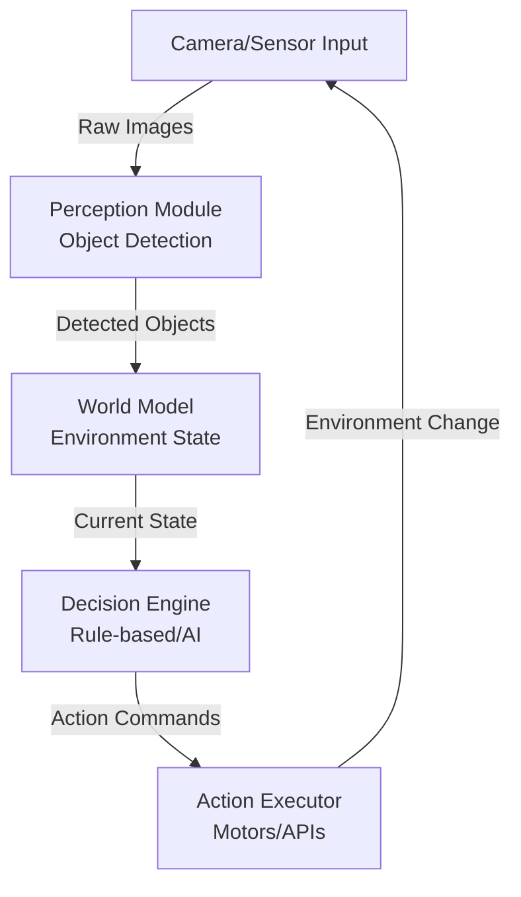

# Vision Agents Technical Notes

<!-- A rectangular image showing a simple vision agent workflow: a camera capturing an image of everyday objects, a neural network processing the visual input, an agent "thinking" with thought bubbles containing action decisions, and arrows showing the cycle from perception to action in a robotics or autonomous system context. -->

## Quick Reference
- **One-sentence definition**: Vision agents are AI systems that use computer vision to perceive their visual environment and make intelligent decisions or take actions based on what they "see."
- **Key use cases**: Autonomous robots navigating spaces, smart cameras performing object detection, virtual assistants understanding visual commands, and surveillance systems with automated responses.
- **Prerequisites**: Basic Python programming, familiarity with image processing concepts, and understanding of simple machine learning models.

## Table of Contents
1. [Introduction](#introduction)
    - [What: Core definition and purpose](#what-core-definition-and-purpose)
    - [Why: Problem it solves/value proposition](#why-problem-it-solvesvalue-proposition)
    - [Where: Application domains](#where-application-domains)
2. [Core Concepts](#core-concepts)
    - [Fundamental Understanding](#fundamental-understanding)
    - [Visual Architecture](#visual-architecture)
3. [Implementation Details](#implementation-details)
    - [Basic Implementation \[Beginner\]](#basic-implementation-beginner)
4. [Real-World Applications](#real-world-applications)
    - [Industry Examples](#industry-examples)
    - [Hands-On Project](#hands-on-project)
5. [Tools & Resources](#tools--resources)
    - [Essential Tools](#essential-tools)
    - [Learning Resources](#learning-resources)
6. [References](#references)
7. [Appendix](#appendix)
    - [Glossary](#glossary)
    - [Setup guides](#setup-guides)

## Introduction
### What: Core definition and purpose
Vision agents are intelligent systems that combine computer vision capabilities with decision-making logic to understand and interact with their visual environment, enabling autonomous perception-action cycles.

### Why: Problem it solves/value proposition
Vision agents solve the challenge of enabling machines to "see" and understand the world like humans do, making decisions based on visual input rather than just predefined rules or simple sensors.

### Where: Application domains
Vision agents are used in robotics (navigation, manipulation), autonomous vehicles, smart home devices, surveillance systems, and augmented reality applications.

## Core Concepts
### Fundamental Understanding
- **Basic principles**: Vision agents follow a perception-action loop where visual input is processed through computer vision models to extract meaningful information (objects, scenes, actions), which informs decision-making and action execution.
- **Key components**:
  - **Perception Module**: Computer vision models (object detection, segmentation, tracking) that process raw visual input.
  - **World Model**: Internal representation of the environment and agent state.
  - **Decision Engine**: Logic or AI that selects actions based on perceived information.
  - **Action Executor**: Interface to physical or virtual actuators (motors, APIs, UI interactions).
- **Common misconceptions**:
  - Vision agents need complex AI: Simple rule-based systems can be effective for many tasks.
  - They're just object detectors: True agents maintain state and make sequential decisions.
  - Require expensive hardware: Many work with standard webcams and consumer GPUs.

### Visual Architecture

- **System Overview**: Raw visual input flows through perception to update the world model, which informs decisions leading to actions that change the environment, creating a continuous feedback loop.
- **Component Relationships**: Perception feeds the world model, decisions act on the world model, and actions provide feedback to perception, maintaining coherent environmental understanding.

## Implementation Details
### Basic Implementation [Beginner]
```python
import cv2
import numpy as np
from ultralytics import YOLO

class SimpleVisionAgent:
    def __init__(self):
        # Load pre-trained object detection model
        self.model = YOLO('yolov8n.pt')  # Nano version for beginners
        self.cap = cv2.VideoCapture(0)  # Webcam
        self.obstacle_detected = False
    
    def perceive(self):
        """Process visual input"""
        ret, frame = self.cap.read()
        if not ret:
            return None
        
        # Run object detection
        results = self.model(frame)
        detections = results[0].boxes
        
        # Simple decision logic
        self.obstacle_detected = any(
            cls == 0 for cls in detections.cls  # Class 0 = person
        )
        
        return frame, self.obstacle_detected
    
    def act(self, obstacle_detected):
        """Take action based on perception"""
        if obstacle_detected:
            print("Obstacle detected! Stopping...")
            return "STOP"
        else:
            print("Path clear. Moving forward...")
            return "FORWARD"
    
    def run(self):
        """Main agent loop"""
        while True:
            frame, obstacle = self.perceive()
            if frame is None:
                break
                
            action = self.act(obstacle)
            cv2.imshow('Vision Agent', frame)
            
            if cv2.waitKey(1) & 0xFF == ord('q'):
                break
        
        self.cap.release()
        cv2.destroyAllWindows()

# Usage
agent = SimpleVisionAgent()
agent.run()
```
- **Step-by-step setup**:
  1. Install dependencies: `pip install ultralytics opencv-python`.
  2. Ensure webcam access and download YOLOv8 model (downloads automatically).
  3. Run the agent to see live detection and decision-making.
- **Code walkthrough**:
  - The agent captures video, runs YOLO detection, checks for people (obstacles), and prints decisions.
  - Simple if/else logic demonstrates the perception-action cycle.
- **Common pitfalls**:
  - Model download failures: Ensure internet connection for first run.
  - Webcam permission issues: Check OS privacy settings.
  - High CPU usage: Use smaller models like YOLOv8n for beginners.

## Real-World Applications
### Industry Examples
- **Use case**: Simple robot vacuum cleaner that avoids obstacles.
- **Implementation pattern**: Use object detection to identify furniture/people, simple rules to navigate around detected obstacles.
- **Success metrics**: Reliable obstacle avoidance, smooth navigation without collisions.

### Hands-On Project
- **Project goals**: Build a basic "smart camera" that alerts when people enter a room.
- **Implementation steps**:
  1. Use the code above as a starting point.
  2. Modify to detect people and trigger an alert (sound, email, etc.).
  3. Add simple state tracking (person entered vs. still present).
  4. Test in different lighting conditions.
- **Validation methods**: Verify detection accuracy, test false positives/negatives, measure response time.

## Tools & Resources
### Essential Tools
- **Development environment**: Python 3.8+, Jupyter Notebook for experimentation.
- **Key frameworks**: OpenCV for video processing, YOLO/Ultralytics for detection.
- **Testing tools**: Webcam, sample video files for offline testing.

### Learning Resources
- **Documentation**: Ultralytics YOLO docs, OpenCV tutorials.
- **Tutorials**: "Getting Started with Computer Vision" on Towards Data Science.
- **Community resources**: Stack Overflow, Reddit r/computervision.

## References
- Ultralytics YOLO Documentation: docs.ultralytics.com
- OpenCV Documentation: docs.opencv.org
- "Computer Vision: Algorithms and Applications" by Richard Szeliski

## Appendix
### Glossary
- **Perception**: Process of extracting meaningful information from visual input.
- **World Model**: Internal representation of the environment and agent state.
- **Action Space**: Set of possible actions the agent can take.

### Setup guides
- Install: `pip install ultralytics opencv-python torch torchvision`.
- Test webcam: `python -c "import cv2; cap=cv2.VideoCapture(0); print(cap.isOpened())"`.
- Model download: First run of YOLO automatically downloads weights.
</artifact>

Key beginner-friendly aspects:
- **Simple perception-action loop** using pre-trained YOLO model
- **Minimal dependencies** with clear installation steps
- **Visual feedback** with OpenCV display
- **Rule-based decisions** instead of complex RL
- **Webcam integration** for immediate testing
- **Practical example** of obstacle detection
- **Clear error handling** and common pitfalls addressed