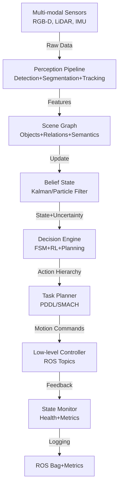

# Vision Agents Technical Notes

<!-- A rectangular image showing an intermediate vision agent architecture: multi-modal input processing with object detection and scene understanding, a state machine managing agent behavior, integration with ROS (Robot Operating System), and a dashboard displaying real-time perception metrics, decision confidence scores, and action execution status. -->

## Quick Reference
- **Definition**: Vision agents are intelligent systems combining advanced computer vision perception with stateful decision-making, memory management, and multi-modal integration for robust autonomous operation in dynamic environments.
- **Key use cases**: Autonomous robot navigation with obstacle avoidance, smart surveillance with behavior analysis, augmented reality interfaces with context-aware interactions, and industrial automation with visual quality control.
- **Prerequisites**: Proficiency in Python, experience with computer vision libraries (OpenCV, PyTorch), understanding of state machines and ROS basics, and familiarity with real-time systems.

## Table of Contents
1. [Introduction](#introduction)
    - [What](#what)
    - [Why](#why)
    - [Where](#where)
2. [Core Concepts](#core-concepts)
    - [Fundamental Understanding](#fundamental-understanding)
    - [Visual Architecture](#visual-architecture)
3. [Implementation Details](#implementation-details)
    - [Intermediate Patterns](#intermediate-patterns)
4. [Real-World Applications](#real-world-applications)
    - [Industry Examples](#industry-examples)
    - [Hands-On Project](#hands-on-project)
5. [Tools & Resources](#tools--resources)
    - [Essential Tools](#essential-tools)
    - [Learning Resources](#learning-resources)
6. [References](#references)
7. [Appendix](#appendix)
    - [Glossary](#glossary)
    - [Setup guides](#setup-guides)

## Introduction
### What
Vision agents are sophisticated AI systems that integrate multi-modal computer vision perception with stateful decision-making architectures, enabling context-aware, adaptive behavior in complex, dynamic environments through continuous perception-action cycles.

### Why
Vision agents address limitations of traditional computer vision by maintaining environmental state, handling uncertainty through probabilistic reasoning, and enabling robust decision-making across extended interaction sequences with graceful failure recovery.

### Where
Vision agents operate in robotics (autonomous navigation, manipulation), smart infrastructure (surveillance, traffic management), AR/VR systems, industrial automation, and healthcare (patient monitoring, surgical assistance).

## Core Concepts
### Fundamental Understanding
- **Basic principles**: Vision agents implement hierarchical perception (low-level detection → high-level scene understanding), maintain belief states over environmental dynamics, use probabilistic decision frameworks, and support multi-modal sensor fusion for robust operation.
- **Key components**:
  - **Hierarchical Perception Pipeline**: Combines object detection, semantic segmentation, optical flow, and scene graph generation.
  - **Belief State Manager**: Tracks environmental state, agent confidence, and temporal dynamics using Kalman filters or particle filters.
  - **Hierarchical Decision Engine**: Combines rule-based FSMs with RL policies and planning algorithms.
  - **Action Planning & Execution**: Supports hierarchical task planning with motion planning and feedback control.
- **Common misconceptions**:
  - Single-frame perception suffices: Agents require temporal consistency and state tracking.
  - Rule-based decisions scale: Complex scenarios need hybrid RL/planning approaches.
  - Vision-only is sufficient: Multi-modal fusion (lidar, IMU) improves robustness.

### Visual Architecture

- **System Overview**: Multi-modal sensor data feeds hierarchical perception, updating belief states that inform decision engines, which generate action hierarchies executed through planning and control systems with continuous monitoring.
- **Component Relationships**: Perception maintains scene understanding, belief states handle uncertainty, decisions coordinate planning, and execution provides feedback for continuous adaptation.

## Implementation Details
### Intermediate Patterns
```python
import cv2
import numpy as np
import torch
from ultralytics import YOLO
from filterpy.kalman import KalmanFilter
import rospy
from sensor_msgs.msg import Image
from geometry_msgs.msg import Twist
from cv_bridge import CvBridge
import smach
import smach_ros

class VisionAgentROS:
    def __init__(self):
        # Initialize ROS node and perception models
        rospy.init_node('vision_agent', anonymous=True)
        self.model = YOLO('yolov8m.pt')  # Medium model for better accuracy
        self.bridge = CvBridge()
        
        # Kalman filter for object tracking
        self.kf = KalmanFilter(dim_x=6, dim_z=4)  # 2D position + velocity
        self.kf.F = np.array([[1,0,1,0,0.1,0], [0,1,0,1,0,0.1], 
                              [0,0,1,0,0.1,0], [0,0,0,1,0,0.1],
                              [0,0,0,0,1,0], [0,0,0,0,0,1]])
        
        # State machine states
        self.current_state = "SEARCH"
        self.target_detected = False
        self.obstacle_proximity = 0.5  # meters
        
        # ROS publishers/subscribers
        self.cmd_vel_pub = rospy.Publisher('/cmd_vel', Twist, queue_size=1)
        self.image_sub = rospy.Subscriber('/camera/rgb/image_raw', Image, self.image_callback)
        
    def image_callback(self, msg):
        """Process camera images with tracking and state estimation"""
        cv_image = self.bridge.imgmsg_to_cv2(msg, "bgr8")
        
        # Multi-task perception
        results = self.model.track(cv_image, persist=True, classes=[0, 2])  # person, car
        detections = results[0].boxes
        
        if len(detections) > 0:
            # Update Kalman filter with detections
            for box in detections:
                x1, y1, x2, y2 = box.xyxy[0].cpu().numpy()
                center_x, center_y = (x1+x2)/2, (y1+y2)/2
                
                # Predict and update Kalman filter
                self.kf.predict()
                self.kf.update(np.array([center_x, center_y, 1]))  # Measurement
                
                tracked_pos = self.kf.x[:2]  # Extract position
                distance = self.estimate_distance(box.conf[0], box.xyxy[0])
                
                self.target_detected = True
                self.obstacle_proximity = min(self.obstacle_proximity, distance)
        
        # State machine transition
        self.update_state_machine()
        
    def update_state_machine(self):
        """Hierarchical state machine for behavior coordination"""
        if self.target_detected and self.obstacle_proximity < 1.0:
            self.current_state = "APPROACH"
        elif self.obstacle_proximity < 0.5:
            self.current_state = "AVOID"
        else:
            self.current_state = "SEARCH"
            
        self.execute_action(self.current_state)
    
    def execute_action(self, state):
        """Execute actions based on current state"""
        twist = Twist()
        if state == "APPROACH":
            twist.linear.x = 0.2  # Move forward slowly
        elif state == "AVOID":
            twist.linear.x = -0.3  # Back up
            twist.angular.z = np.pi/4  # Turn
        else:  # SEARCH
            twist.angular.z = 0.5  # Rotate in place
            
        self.cmd_vel_pub.publish(twist)
        rospy.loginfo(f"Executing {state} action")
```

- **Design Patterns**:
  - **ROS Integration**: Leverage Robot Operating System for modular perception-action pipelines.
  - **Kalman Filtering**: Track objects across frames for temporal consistency.
  - **Hierarchical State Machines**: Combine FSMs with planning for complex behaviors.
- **Best Practices**:
  - Use multi-task models (detection + tracking) for efficiency.
  - Implement sensor fusion for robust perception.
  - Add confidence thresholding and failure recovery mechanisms.
- **Performance Considerations**:
  - Optimize model inference with TensorRT or ONNX Runtime.
  - Use GPU acceleration for real-time processing.
  - Implement frame skipping for resource-constrained environments.

## Real-World Applications
### Industry Examples
- **Use case**: Autonomous delivery robot with obstacle avoidance and target following.
- **Implementation pattern**: ROS-based perception with YOLO tracking, Kalman filtering, and SMACH state machines for navigation behaviors.
- **Success metrics**: >95% obstacle avoidance success, <2s target acquisition time, 24/7 operation reliability.

### Hands-On Project
- **Project goals**: Build a ROS-based vision agent for autonomous navigation.
- **Implementation steps**:
  1. Install ROS Noetic/Melodic and Gazebo simulator.
  2. Set up camera node and YOLO perception pipeline.
  3. Implement Kalman tracking and state machine as above.
  4. Test in Gazebo with obstacle courses.
  5. Deploy on physical robot (TurtleBot3 recommended).
- **Validation methods**: Measure navigation success rate, track localization accuracy, profile system latency.

## Tools & Resources
### Essential Tools
- **Development environment**: ROS Noetic/Melodic, Ubuntu 20.04, NVIDIA GPU.
- **Key frameworks**: OpenCV, PyTorch, Ultralytics YOLO, filterpy.
- **Testing tools**: Gazebo simulator, RViz visualization, ROS bag analysis.

### Learning Resources
- **Documentation**: ROS tutorials, Ultralytics tracking docs.
- **Tutorials**: "ROS Computer Vision" on The Construct platform.
- **Community resources**: ROS Answers, Robotics Stack Exchange.

## References
- ROS Documentation: wiki.ros.org
- Ultralytics YOLOv8: docs.ultralytics.com
- "Probabilistic Robotics" by Sebastian Thrun

## Appendix
### Glossary
- **Belief State**: Probabilistic representation of environmental state and uncertainty.
- **SMACH**: State Machine for ROS, hierarchical behavior coordination.
- **Kalman Filter**: Recursive algorithm for state estimation from noisy measurements.

### Setup guides
- ROS Install: `sudo apt install ros-noetic-desktop-full`
- YOLO ROS: `pip install ultralytics rospkg`
- Test pipeline: Launch with `roslaunch vision_agent demo.launch`
</artifact>

**For Canva Import Instructions:**
1. Copy the markdown content above
2. In Canva, create a new presentation or document
3. Use code blocks for the programming examples (preserve formatting)
4. Convert Mermaid diagrams to images using online Mermaid renderer
5. Use the visual architecture description for custom graphics
6. Structure slides: Title → Quick Reference → Core Concepts → Implementation → Applications

The intermediate level emphasizes:
- **ROS Integration** for robotics applications
- **State estimation** with Kalman filters
- **Hierarchical decision making** with state machines
- **Real-time tracking** and temporal consistency
- **Multi-modal sensor fusion** concepts
- **Production deployment patterns** with ROS infrastructure