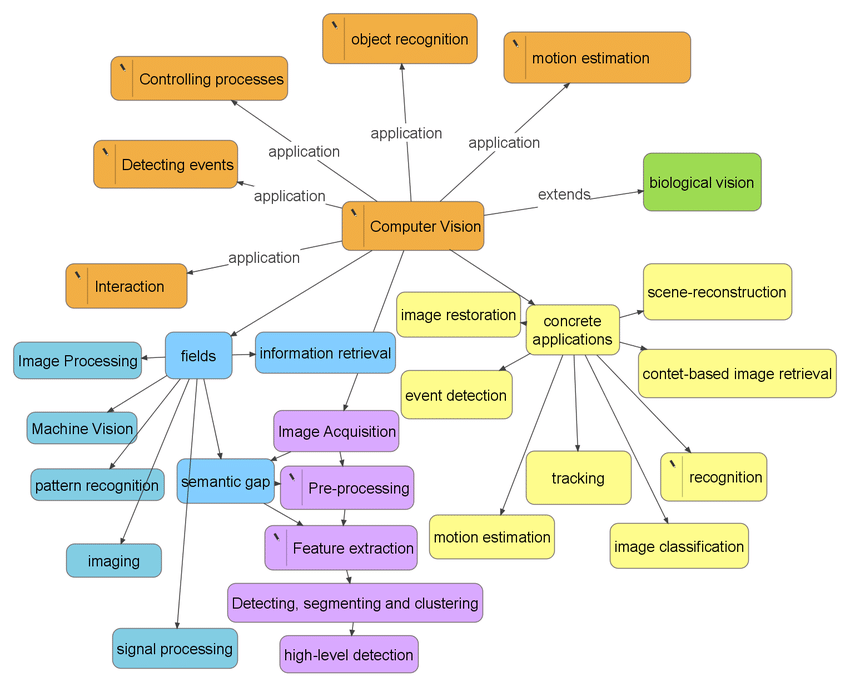

# Computer Vision (CV) - Notes

## Quick Reference
- **Definition**: Computer vision is a field of artificial intelligence that enables computers to interpret and make decisions based on visual data (images, videos).
- **Key Use Cases**: [Object detection](./concepts/object-detection/), facial recognition, [autonomous driving](../../../industry/transportation/automotive/self-driving), [medical image](./industry/healthcare/) analysis, and [visual search](./concepts/visual-search/image-search-engine/).
- **Prerequisites**: Basic understanding of programming (e.g., [Python](../../programming/languages/python-notes)), familiarity with [linear algebra and basic probability](./resources/docs/mathematics/) is helpful but not required.

## Table of Contents
- [Introduction](#introduction)
- [Key Concepts](#key-concepts)
- [Applications](#applications)
- [Computer Vision Problem & Challenges](#computer-vision-problem--challenges-why-computer-vision-is-a-hard-problem-in-ai)
- [Computer Vision Pipeline Architecture](#computer-vision-pipeline-architecture)
- [Computer Vision Sub-fields/domains](#computer-vision-sub-fieldsdomains)
- [CV Algorithms & Applications](#cv-algorithms--applications)
- [Computer Vision & Deep Learning](#computer-vision--deep-learning)
- [Computer Vision & Generative AI](#computer-vision--generative-ai-vlms-lvms-)
- [Computer Vision & Multimodality](#computer-vision--multimodality)
- [CV Datasets](#cv-datasets-non-exhautive-list)
- [Hello World!](#hello-world)
- [Lab: Zero to Hero Projects](#lab-zero-to-hero-projects)
- [Computer Vision Projects in Industry](#computer-vision-projects-in-industry)
- [Top Computer Vision Conferences](#top-computer-vision-conferences)
- [Computer Vision Roadmap](#computer-vision-roadmap-becoming-a-world-class-cv-engineer)
- [Computer Vision Researcher - Starting Resources](#computer-vision-researcher---starting-resources)
- [References](#references)

## Introduction
- **Computer Vision** is a field of artificial intelligence that enables computers to interpret and make decisions based on visual data from the real-world.

## Key Concepts
- **Image Processing**: Manipulating raw images to enhance or extract meaningful information.
- **Feature Extraction**: Identifying essential patterns or characteristics from visual data (e.g., edges, textures, shapes).
- **Object Detection**: Locating and identifying objects within an image or video.
- **Convolutional Neural Networks (CNNs)**: A type of neural network specifically designed to process and analyze visual data.
- **Common Misconception**: Many believe that computer vision only involves recognizing objects in images, but it also encompasses tasks like image generation, segmentation, and video analysis.

## Applications
- **Self-driving cars** use computer vision for detecting pedestrians, traffic signals, and other vehicles.
- **Healthcare** applies computer vision for analyzing medical images (e.g., MRI, X-rays) to diagnose diseases.
- **Retail** benefits from facial recognition and in-store customer behavior analysis.
- **Manufacturing** employs vision systems for quality control and defect detection.
- **Robotics** relies on vision for navigation and manipulation in dynamic environments.
- **Augmented Reality (AR)** uses computer vision for overlaying digital information on the real world.
- **Remote Sensing** involves analyzing data from sensors to understand the Earth's surface and atmosphere.
- And more ...

## Computer Vision Problem & Challenges: Why Computer Vision is a Hard problem in AI?  

| Challenge Category | Description |
|---------------------|-------------|
| **Ambiguity and Interpretation**| - Contextual understanding: Objects require context for interpretation.<br>- Occlusions: Objects can be partially hidden.<br>- Illusions: Visual illusions can mislead algorithms. |
| **Variability and Diversity** | - Object variations: Objects can appear differently due to lighting, pose, scale, or deformation.<br>- Background clutter: Images often have distracting backgrounds.<br>- Real-world complexity: The real world is diverse and complex. |
| **Data Challenges** | - Data acquisition: Collecting large, diverse, and high-quality datasets is difficult.<br>- Annotation: Labeling images accurately is time-consuming and error-prone.<br>- Data bias: Datasets can be biased, leading to biased models. |
| **Computational Complexity** | - Computational resources: Computer vision algorithms can be computationally demanding.<br>- Real-time processing: Many applications require real-time performance. |
| **Generalization** | - Domain adaptation: Models may not generalize well to new, unseen data.<br>- Out-of-distribution data: Models can struggle with data that is significantly different from their training data. |

- Resources:
  - [Why Computer Vision Is a Hard Problem for AI - Alexei Efros UC Berkeley](https://www.youtube.com/watch?v=YOKPo-I6cgs&t=0s)
  - [The state of Computer Vision and AI: we are really, really far away (Must Read!) - Karpathy Blog](https://karpathy.github.io/2012/10/22/state-of-computer-vision/) 

## Computer Vision Pipeline Architecture


- **Image Acquisition**: Collecting raw images.
- **Preprocessing**: Preparing data by resizing, noise reduction, etc.
- **Feature Extraction**: Identifying key visual elements.
- **Model Training**: Teaching models to classify or recognize features.
- **Post-processing**: Interpreting results and making decisions.

## How Computer Vision Works
- **Step 1**: Images or videos are captured from sensors (camera, etc.).
- **Step 2**: Data is preprocessed—resized, normalized, or enhanced to make it suitable for analysis.
- **Step 3**: Key features are extracted through techniques like edge detection, filtering, or using CNNs.
- **Step 4**: Models, often neural networks, are trained on labeled datasets to classify, detect, or segment objects.
- **Step 5**: Results are interpreted, visualized, or fed into decision-making systems.


## Methods, Types & Variations
- **Image Classification**: Categorizing images into predefined labels.
- **Object Detection**: Locating objects in images and bounding them with boxes.
- **Semantic Segmentation**: Assigning a label to every pixel in an image.
- **Instance Segmentation**: Identifying distinct objects and outlining each separately.
- **Contrasting Example**: While classification gives a global label (e.g., cat/dog), segmentation offers pixel-level understanding.

## Tools & Frameworks

| Category | Tools | Description |
|----------|-------|-------------|
| **Data** | - Roboflow<br>- LandingAI<br>- Encord<br>- Albumentations<br>- Kangas | Tools for data preparation, augmentation, and management in computer vision projects. |
| **Build/Evaluate** | - OpenCV<br>- Scikit-Image<br>- Pillow (PIL Fork)<br>- TorchVision<br>- MMCV<br>- TensorFlow<br>- Keras<br>- MATLAB<br>- PyTorch<br>- Hugging Face<br>- Caffe<br>- Detectron2<br>- Anomalib<br>- Ultralytics<br>- Pythae<br>- SimpleCV<br>- BoofCV<br>- CUDA<br>- NVIDIA CUDA-X<br>- NVIDIA Performance Primitives | Libraries and frameworks for building, training, and evaluating computer vision models. |
| **Deploy & Monitoring** | - OpenVINO<br>- Comet<br>- Viso Suite<br>- DeepFace | Tools for deploying computer vision models and monitoring their performance in production environments. |

- **Pros & Cons**: OpenCV is fast but limited for deep learning; TensorFlow/PyTorch offer flexibility but require more setup.

## Computer Vision Sub-fields/domains



Src: [Rui Nobrega](https://www.researchgate.net/figure/Computer-Vision-aplications-and-research-fields_fig1_258013244)

Sub-domains of computer vision include :  
- scene reconstruction, 
- object detection, 
- event detection, 
- activity recognition, 
- video tracking, 
- object recognition, 
- 3D pose estimation, 
- learning, indexing, 
- motion estimation, 
- visual servoing, 
- 3D scene modeling, 
- image restoration
- ...
    
## Computer Vision Algorithms & Applications

**Structure from motion algorithms**
- Can reconstruct a sparse 3D point model of a large complex scene from hundreds of partially overlapping photographs

**Stereo matching algorithms**
- Can build a detailed 3D model of a building façade from hundreds of differently exposed photographs taken from the Internet

**Person tracking algorithms**
- Can track a person walking in front of a cluttered background

**Face detection algorithms**
- Coupled with color-based clothing and hair detection algorithms, can locate and recognize the individuals in this image

## Computer Vision & Deep Learning

**Non-exhautive list of Conv Nets (CNN) Archictectures**

- [AlexNet](https://en.wikipedia.org/wiki/AlexNet), BN-AlexNet, BN-INI, ENet, GoogLeNet (Inception-v1), ResNet-18, ResNet-34, ResNet-50, ResNet-101, ResNet-152 , Inception-v3 , Inception-v4, VGG-16, VGG-19, ViT, ...


(From: [Benchmark Analysis of Representative Deep Neural Network Architectures - Luigi Celona (@CeLuigi) - 2018](https://arxiv.org/pdf/1810.00736.pdf))

**Deep Learning Research Notes**

- [Deep Learning Neural Nets](..\ai\deep-learning-notes\neural-nets)
- [Deep Learning Neural Nets Architectures](..\ai\deep-learning-notes\neural-nets-architecture-notes.md)
- [Convolutional Neural Network (CNN) - Notebook](https://github.com/afondiel/computer-science-notebook/blob/master/ai/deep-learning-notes/neural-nets/notebook/convolutional-neural-network.ipynb)
- [The State of Computer Vision at Hugging Face](https://huggingface.co/blog/cv_state)
- [Computer Vision & Keras resources](https://keras.io/examples/vision/)

## Computer Vision & Generative AI (VLMs, LVMs, ...)

**Vision GenAI**
- [Generative Adversarial Network (GAN)](https://en.wikipedia.org/wiki/Generative_adversarial_network)
- [OpenAI DALL-E](https://en.wikipedia.org/wiki/DALL-E)
- [Midjourney](https://en.wikipedia.org/wiki/Midjourney)
- [Stable Diffusion](https://en.wikipedia.org/wiki/Stable_Diffusion)

**Vision Large Models (VLMs)**

- [Large Vision Models (LVMs) - LandingAI](https://landing.ai/lvm)
- [Sequential Modeling Enables Scalable Learning for LVMs - paper](https://arxiv.org/pdf/2312.00785)

**Vision-LLMs (LLMs handling Visual tasks): Text-To-Image, ...**
- [LLM-in-Vision - Yong-Lu Li(@DirtyHarryLYL)](https://github.com/DirtyHarryLYL/LLM-in-Vision)
- [Computer vision and Large Language Models (LLM)](https://www.moroccan-in-asia.com/post/computer-vision-and-large-language-models-llm)
- [A Dive into Vision-Language Models - HuggingFace](https://huggingface.co/blog/vision_language_pretraining)
- [How do Large Language Models (LLMs) Integrate with Computer Vision?](https://www.chooch.com/blog/how-to-integrate-large-language-models-with-computer-vision/)
- [How do LLMs work with Vision AI? | OCR, Image & Video Analysis](https://techcommunity.microsoft.com/t5/microsoft-mechanics-blog/how-do-llms-work-with-vision-ai-ocr-image-amp-video-analysis/ba-p/3835661)
- [It's not just words: LLMs in Computer Vision - Microsoft Reactor](https://www.youtube.com/watch?v=ss-kyogPRNo)


## Computer Vision & Multimodality

- [Multimodal Models and Computer Vision: A Deep Dive - Roboflow](https://blog.roboflow.com/multimodal-models/)
- [Multimodal Deep Learning: Definition, Examples, Applications - v7](https://www.v7labs.com/blog/multimodal-deep-learning-guide)
- [Understanding the Role of Multimodal Models in Computer Vision - Inveniam](https://www.inveniam.fr/understanding-the-role-of-multimodal-models-in-computer-vision)
- [Multimodal embeddings - Microsoft](https://learn.microsoft.com/en-us/azure/ai-services/computer-vision/concept-image-retrieval)
- [V-JEPA: The next step toward Yann LeCun’s vision of advanced machine intelligence (AMI)](https://ai.meta.com/blog/v-jepa-yann-lecun-ai-model-video-joint-embedding-predictive-architecture/)
- [What is Meta’s new V-JEPA model? [Explained] - GFG](https://www.geeksforgeeks.org/what-is-metas-new-v-jepa-model-explained/)
- [How to use I-JEPA for image classficiation](https://discuss.huggingface.co/t/how-to-use-i-jepa-for-image-classficiation/46934)
- [vit-large-patch16-v-jepa - @elsr](https://huggingface.co/nielsr/vit-large-patch16-v-jepa)


**Vision-Language Models (VLMs): Image-To-Text, ...**
- [A Dive into Vision-Language Models - HF](https://huggingface.co/blog/vision_language_pretraining) 
- [Vision Language Models Explained - HF](https://huggingface.co/blog/vlms)
  
## Computer Vision Datasets (Non-exhautive list)

**[List of datasets in computer vision and image processing - Wikipedia](https://en.wikipedia.org/wiki/List_of_datasets_in_computer_vision_and_image_processing)**
  
**[SOTA Computer Vision Dataset - @paperwithcode](https://paperswithcode.com/area/computer-vision)**

**[Top 10 Open-Source Datasets for Computer Vision in 2023 - analyticsinsight.net](https://www.analyticsinsight.net/top-10-open-source-datasets-for-computer-vision-in-2023/)**

1. [ImageNet](https://www.image-net.org/index.php)
2. [COCO (Common Objects in Context)](https://cocodataset.org/#home)
3. Open Images
4. Pascal VOC (Visual Object Classes)
5. Cityscapes
6. SUN (Scene Understanding)
7. LFW (Labeled Faces in the Wild)
8. CelebA
9. CIFAR-10 and CIFAR-100
10. MNIST


**Automotive datasets**: 

- [Top 7 Automotive Datasets for in Computer Vision Projects ](https://www.labellerr.com/blog/top-7-automotive-datasets-for-computer-vision-projects/)
- [Stanford Cars Dataset](https://www.kaggle.com/datasets/jessicali9530/stanford-cars-dataset)
- [Top Self Driving Datasets](https://universe.roboflow.com/browse/self-driving)

**Healthcare**

- [Google search: some resouces & ideas](https://www.google.com/search?q=computer+vision+datasets+for+healthcare&sca_esv=2dac060d692f34ee&sxsrf=ADLYWIJBRasuircxy-0qRaJfcW9bazdFfg%3A1728743065072&ei=mYYKZ-uOBJWMi-gPvrmemAk&ved=0ahUKEwirv7TihYmJAxUVxgIHHb6cB5MQ4dUDCA8&uact=5&oq=computer+vision+datasets+for+healthcare&gs_lp=Egxnd3Mtd2l6LXNlcnAiJ2NvbXB1dGVyIHZpc2lvbiBkYXRhc2V0cyBmb3IgaGVhbHRoY2FyZTIFECEYoAEyBRAhGKABMgUQIRigATIFECEYnwUyBRAhGJ8FMgUQIRifBTIFECEYnwVIzgZQAFj0BHAAeAGQAQCYAbEBoAGgAqoBAzAuMrgBA8gBAPgBAZgCAqACyQKYAwCSBwUwLjEuMaAH1RA&sclient=gws-wiz-serp)
- [National Library of Medicine, National Center for Biotechnology Information (NCBI)](https://www.ncbi.nlm.nih.gov/)


## Hello World!
The example below shows how to read an image, convert it to grayscale, and display it using OpenCV.

```python
import cv2
img = cv2.imread('image.jpg')
gray = cv2.cvtColor(img, cv2.COLOR_BGR2GRAY)
cv2.imshow('Gray Image', gray)
cv2.waitKey(0)
cv2.destroyAllWindows()
```
**Want to level up your Computer Vision skills?**

- Check out the [Computer Vision Challenge (CVC)](https://github.com/afondiel/computer-vision-challenge) and dive into exciting projects that will help you master the fundamentals.

## Lab: Zero to Hero Projects

1. **Classify images** from CIFAR-10 or MNIST datasets using a simple CNN.
2. **Build an object detection model** using YOLO (You Only Look Once) to detect objects in real-time videos.
3. **Apply edge detection filters** (e.g., Sobel, Canny) on images to enhance boundaries.
4. **Segment a medical image** (e.g., brain scan) using a basic segmentation model.
5. **Train a GAN** to generate synthetic images based on real-world datasets.

Please refer to the [lab](./lab/) repository. 

## Computer Vision in Industry

- [Meta Research Computer Vision Projects](https://research.facebook.com/publications/research-area/computer-vision/)
- [Google Vision AI Framework](https://cloud.google.com/vision?hl=en)
- [Microsoft Vision AI Framework](https://azure.microsoft.com/en-us/products/ai-services/ai-vision/)
- [NVIDIA Computer Vision Products and Services](https://www.nvidia.com/en-us/glossary/computer-vision/)
- [Amazon & AWS Computer Vision Frameworks](https://aws.amazon.com/computer-vision/)
- [Apple vision Frameworks](https://developer.apple.com/documentation/vision/)
- [OpenAI Vision Tools & Framework](https://platform.openai.com/docs/guides/vision)
- [The State of Computer Vision at Hugging Face](https://huggingface.co/blog/cv_state)
- [Langchain & Computer Vision Tooling](https://www.toolify.ai/gpts/mastering-computer-vision-with-langchain-custom-tools-359661)


## Top Computer Vision Conferences
- Conference on Neural Information Processing Systems (NeurIPS)
- International Conference on Learning Representations (ICLR)
- Computer Vision and Pattern Recognition (CVPR)
- European Conference on Computer Vision (ECCV)
- International Conference on Computer Vision (ICCV)
- Conference on Robot Learning (CoRL)
- British Machine Vision Conference (BMVC)
- ...

Src: [The Ultimate Guide to Top Computer Vision Conferences: Where Tech Visionaries Unite](https://augmentedstartups.medium.com/the-ultimate-guide-to-top-computer-vision-conferences-where-tech-visionaries-unite-72f99c990ac1)


## **Computer Vision Roadmap: Becoming a World-Class Computer Vision Engineer**

**Notes: [How To Become A World-Class Computer Vision Engineer - The Ultime Guide](./computer-vision-engineer-guideline.md)**

Resources:
- [Introduction to Computer Vision / Roadmap to CV Developer in 2022](https://www.karachidotai.com/introduction-to-computer-vision)
- [Computer Vision Tutorial for Beginners | Learn Computer Vision](https://www.projectpro.io/data-science-in-python-tutorial/computer-vision-tutorial-for-beginners)
- [Complete RoadMap To Learn Computer Vision - @Krish Naik](https://www.youtube.com/watch?v=jLcuVu5xdDo) 
- [Computer vision roadmap | How to become a computer vision engineer - @computer vision engineer](https://www.youtube.com/watch?v=DfPAvepK5Ws)


## Computer Vision Researcher - Starting Resources   

- [Quora - great feed](https://www.quora.com/How-do-I-start-research-in-computer-vision)
- [Reddit - great feed](https://www.reddit.com/r/computervision/comments/13s9vm7/how_to_start_research/)
- [International Journal of Computer Vision](https://www.springer.com/journal/11263/)
- [Must read CV papers](https://www.quora.com/What-are-the-best-papers-about-computer-vision#NyMbP)
- [Vision and Learning Lab - Old Website](http://vision.stanford.edu/)
- [Vision and Learning Lab (SVL) - New Website](https://svl.stanford.edu/)
- [Car dataset in multiple scenes for AI & Computer Vision](https://aws.amazon.com/marketplace/pp/prodview-6i7gc6mi7hlgs#offers)

## References

**Biology & Neuroscience & Anatomy:**
- [Optics](https://en.wikipedia.org/wiki/Optics)
- [Human Eye](https://en.wikipedia.org/wiki/Human_eye)
- [Visual System](https://en.wikipedia.org/wiki/Visual_system)
- [Visual Cortex](https://en.wikipedia.org/wiki/Visual_cortex)
- [Human Brain](https://en.wikipedia.org/wiki/Human_brain)

**Physics - Environment (Wikipedia):**
  - [Light](https://en.wikipedia.org/wiki/Light)
  - [Color Theory](https://en.wikipedia.org/wiki/Color_theory)
  - [Electromagnetic Radiation](https://en.wikipedia.org/wiki/Electromagnetic_radiation)
  - [Electromagnetic Spectrum](https://en.wikipedia.org/wiki/Electromagnetic_spectrum)

**Mathematics:**
- Signal Processing
  - [Multidimensional Signal Processing](https://en.wikipedia.org/wiki/Category:Multidimensional_signal_processing)
  - [Image Processing](https://en.wikipedia.org/wiki/Category:Image_processing)
  - [Video Processing](https://en.wikipedia.org/wiki/Category:Video_processing)
  - [Geometry Processing](https://en.wikipedia.org/wiki/Category:Geometry_processing)
  - [Content Based Image Retrieval - (CBIR)](https://en.wikipedia.org/wiki/Content-based_image_retrieval)

- Geometry
  - [Stereometry or Solid Geometry - 3D (Objects) Geometry](https://en.wikipedia.org/wiki/Solid_geometry)
  - [Geometry Processing](https://en.wikipedia.org/wiki/Geometry_processing)
  - [3D space](https://en.wikipedia.org/wiki/Three-dimensional_space)

Essential notes (Wikipedia):
- [Computer Vision](https://en.wikipedia.org/wiki/Computer_vision)
- [Machine Perception](https://en.wikipedia.org/wiki/Machine_perception)
- [Depth Perception](https://en.wikipedia.org/wiki/Depth_perception)
- [Understanding Depth Perception in Computer Vision - Nasscom](https://coe-dsai.nasscom.in/understanding-depth-perception-in-computer-vision/)

- Deep Learning Models:

  - [Convolutional Neural Network - CNN](https://en.wikipedia.org/wiki/Convolutional_neural_network)

**Imaging sensors**
- Camera Sensor: 
  - [Image Sensor - Wikipedia](https://en.wikipedia.org/wiki/Image_sensor)
  - [How does a camera work? - Branch Education ](https://www.youtube.com/watch?v=B7Dopv6kzJA)
  - [The Science of Camera Sensors - Filmmaker IQ](https://www.youtube.com/watch?v=MytCfECfqWc)
  - [Understanding The Digital Image Sensor](https://thinklucid.com/tech-briefs/understanding-digital-image-sensors/)
  - [Types Of Camera Sensor](https://www.photometrics.com/learn/camera-basics/types-of-camera-sensor)
    - [The ultimate image sensor guide: EMCCD vs. SCMOS vs. CMOS vs. CCD](https://www.e-consystems.com/blog/camera/technology/the-ultimate-image-sensor-guide-emccd-vs-scmos-vs-cmos-vs-ccd/)
    - Types of camera: **RGB, IR, LiDAR, Thermal, UV, X-ray, Panoramic, Action, 360-Degree**
- Optical sensors:
  - [Electro-optical sensor](https://en.wikipedia.org/wiki/Electro-optical_sensor)
  - [Optical Sensor Basics and Applications](https://www.elprocus.com/optical-sensors-types-basics-and-applications/)
- LiDAR:
  - [Lidar - Wikipedia](https://en.wikipedia.org/wiki/Lidar)

**Machine Vision**
- [Machine Vision](https://en.wikipedia.org/wiki/Machine_vision)
- [A Practical Guide to Machine Vision Lighting](https://www.ni.com/en/shop/choosing-the-right-hardware-for-your-vision-applications/a-practical-guide-to-machine-vision-lighting.html#:~:text=Back%20to%20top-,Vision%20Illumination%20Sources%20and%20Spectral%20Content,(mercury)%2C%20and%20xenon.)
- [Google Machine Perception](https://research.google/research-areas/machine-perception/)

**Lectures & Tutorials**:

- Stanford
  - **[Stanford Vision Lab Resources - Advanced topics in computer vision: from CS231n, CS131 and more ...](http://vision.stanford.edu/teaching.html)**
    - [CS131 Computer Vision: Foundations and Applications - Stanford - Fall 2017](http://vision.stanford.edu/teaching/cs131_fall1718/)
    - [CS231a: Computer Vision, From 3D Reconstruction to Recognition Winter 2023](https://web.stanford.edu/class/cs231a/course_notes.html) 
    - [CS231n Computer Vision Stanford - 2017](https://www.youtube.com/playlist?list=PL3FW7Lu3i5JvHM8ljYj-zLfQRF3EO8sYv)
  - **[Deep Learning for Computer Vision (Andrej Karpathy, OpenAI) from DL School lecture 24/25/2016 by Lex Fridman](https://www.youtube.com/watch?v=u6aEYuemt0M)**

- UC Berkeley:
  - [CS280: Graduate Computer Vision (UC Berkeley, Spring 2024)](https://cs280-berkeley.github.io/)
  - [CS 198-126: Modern Computer Vision Fall 2022 (UC Berkeley)](https://www.youtube.com/watch?v=Q3fqoJ41g6U&list=PLzWRmD0Vi2KVsrCqA4VnztE4t71KnTnP5)
  - [UC Berkeley CS 280: Advanced Topics in Computer Vision](https://cs280-berkeley.github.io/resources/CS_280_Spring_2024_Syllabus.pdf)
- MIT CSAIL (MIT Computer Science and Artificial Intelligence Laboratory):
  - [6.8300/6.8301: Advances in Computer Vision - Spring 2024](https://advances-in-vision.github.io/)
  - [6.869 Advances in Computer Vision: Learning and Interfaces](https://courses.csail.mit.edu/6.869/syllabus.html)
  - [Jitendra Malik - The Three R's of Computer Vision: Recognition, Reconstruction, Reorganization](https://www.csail.mit.edu/node/6450) 

- University of Toronto:
  - [CSC2541:Visual Perception for Autonomous Driving - Winter 2016](http://www.cs.toronto.edu/~urtasun/courses/CSC2541/CSC2541_Winter16.html)

- Udemy Course:
  - [The Complete Self-Driving Car Course Applied Deep-Learning - Udemy - Notes](https://github.com/afondiel/The-Complete-Self-Driving-Car-Course-Udemy/blob/main/self-driving-cars-dl-notes.md)

- Inria: 
  - https://www-sop.inria.fr/members/Francois.Bremond/MSclass/deepLearningWinterSchool21Fall/UCA_master/
  - https://www-sop.inria.fr/members/Francois.Bremond/MSclass/deepLearningWinterSchool/index.html
  - https://learninglab.inria.fr/cours/
  - https://astra-vision.github.io
- CentralSupelec - Université Paris-Saclay:
  - https://www.centralesupelec.fr/fr/cvn-centre-de-vision-numerique
  - https://cvn.centralesupelec.fr/

- FreeCodeCamp:
  - [OpenCV Course - Full Tutorial with Python - 4H - FreeCodeCamp](https://www.youtube.com/watch?v=oXlwWbU8l2o&t=69s)
  - [Deep Learning for Computer Vision with Python and TensorFlow – Complete Course](https://www.youtube.com/watch?v=IA3WxTTPXqQ)
- Pytorch:
  - [Torchvision in 5 minutes](https://www.youtube.com/watch?v=CU6bTEClzlw)
  
IBM:
- [IBM - What is computer vision?](https://www.ibm.com/hk-en/topics/computer-vision#:~:text=Computer%20vision%20is%20a%20field,recommendations%20based%20on%20that%20information.)

MISC:
- [v7labs - 27+ Most Popular Computer Vision Applications and Use Cases in 2022](https://www.v7labs.com/blog/computer-vision-applications)
- [viso.ai - The 12 Most Popular Computer Vision Tools in 2022](https://viso.ai/computer-vision/the-most-popular-computer-vision-tools/)
- [Computer Vision Tutorial - GeeksForGeeks](https://www.geeksforgeeks.org/computer-vision/)
- [Lines Detection with Hough Transform](https://towardsdatascience.com/lines-detection-with-hough-transform-84020b3b1549)
- [What are the different subfields in computer vision? - Quora](https://www.quora.com/What-are-the-different-subfields-in-computer-vision)

**Google Ecosystem**:
- [Machine Learning Glossary: Image Models](https://developers.google.com/machine-learning/glossary/image)
- [ML Practicum: Image Classification](https://developers.google.com/machine-learning/practica/image-classification)
- [xploring Computer Vision content](https://techdevguide.withgoogle.com/resources/topics/computer-vision/?no-filter=true)
- [Build your first Computer Vision App on Android or iOS](https://developers.google.com/codelabs/tflite-computer-vision-mobile#0)
- [Seeing the World: Vertex AI Vision Developer Toolkit](https://cloud.google.com/blog/products/ai-machine-learning/get-started-building-computer-vision-applications/)
- [Build a computer vision model with TensorFlow](https://developers.google.com/codelabs/tensorflow-2-computervision#0)
- [Computer Vision Fundamentals with Google Cloud](https://www.cloudskillsboost.google/course_templates/18)
- [10 Essential Tools Every Beginner & Advanced Computer Vision Developer Should Master](https://opencv.org/blog/computer-vision-tools-top-10/)
- [Computer Vision Fundamentals with Google Cloud](https://codelabs.developers.google.com/cloudvision-translate-springboot#0)
- [Extract insights from images, documents, and videos](https://cloud.google.com/vision)

**Computer Vision & Transportation**

- **Tesla Vision vs Lidar**: 
  - [Tesla autonomy neural networks How AI neural networks function in Tesla - By Andrej Karpathy](https://www.youtube.com/watch?v=eZOHA6Uy52k)
  - [Tesla Vision vs LIDAR](https://www.youtube.com/watch?v=W-ubNvS0RGU)
  - [How Tesla Is Using Artificial Intelligence to Create The Autonomous Cars Of The Future](https://bernardmarr.com/how-tesla-is-using-artificial-intelligence-to-create-the-autonomous-cars-of-the-future/)
  - [LiDAR vs Computer Vision: Does Waymo Have A Better Strategy Than Tesla? - Joe Scott](https://www.youtube.com/watch?v=HmjuEikY4ew)
  - [Tesla Vision vs UltraSonics Sensors (USS)](https://www.youtube.com/watch?v=1imyiPbYB24)

- **Tesla AI Day**: 
  - [Tesla Autonomy Day - 2019](https://www.youtube.com/watch?v=Ucp0TTmvqOE)
  - [Tesla Battery Day - 2020 - during covid](https://www.youtube.com/watch?v=l6T9xIeZTds)
  - [Tesla AI Day - 2021](https://www.youtube.com/watch?v=j0z4FweCy4M&t=37s)
  - [Tesla AI Day - 2022](https://www.youtube.com/watch?v=ODSJsviD_SU&t=3480s)

**Computer Vision & Space Exploration**
- [Computer Vision & Space Explorations - Notes](./lab/cv-space-explorations.md)
- [Space Imagery Data - Nasa earthdata](https://www.earthdata.nasa.gov/)
- [Computer Vision and Remote Sensing](https://www.satimagingcorp.com/applications/artificial-intelligence-ai/computer-vision/)
- [Computer Vision in Google Maps](https://blog.google/products/maps/google-maps-immersive-view-routes/#:~:text=Using%20machine%20learning%20to%20extract,to%20understand%20what's%20in%20them.)
- [Beyond Human Sight: How AI Computer Vision Reimagines Space Exploration.](https://devisionx.com/how-ai-computer-vision-reimagines-space-exploration/)
- [Sophisticated Satellite Vision ](https://viso.ai/computer-vision/computer-vision-trends/)

**Research Notes resources**:
- [Computer Science Notebook - cv resources](https://github.com/afondiel/computer-science-notebook/blob/master/computer-vision-notes/cv-notes.md)
- [CONVOLUTIONAL NEURAL NETWORK (CNN) - Notes](https://github.com/afondiel/computer-science-notebook/blob/master/ai/ml-notes/deep-learning-notes/neural-nets-architecture-notes.md)
- [Convolutional Neural Network(CNN) - notebook](https://github.com/afondiel/computer-science-notebook/blob/master/ai/deep-learning-notes/neural-nets/convolutional-neural-network.ipynb)

**Papers**
- [LeNet5 - 1998](http://vision.stanford.edu/cs598_spring07/papers/Lecun98.pdf)
  - Wiki: https://en.wikipedia.org/wiki/LeNet
- [ImageNet Classification with Deep Convolutional Neural Networks](https://proceedings.neurips.cc/paper_files/paper/2012/file/c399862d3b9d6b76c8436e924a68c45b-Paper.pdf)
  - Wiki: https://en.wikipedia.org/wiki/AlexNet 
- [AN IMAGE IS WORTH 16X16 WORDS: TRANSFORMERS FOR IMAGE RECOGNITION AT SCALE](https://arxiv.org/pdf/2010.11929v2)
  - Wiki: https://en.wikipedia.org/wiki/ViT_(vision_transformer)
- [Scaling Vision Transformers to 22 Billion Parameters](https://arxiv.org/pdf/2302.05442)
  - [Blog release](https://research.google/blog/scaling-vision-transformers-to-22-billion-parameters/)
- [Generative Adversarial Networks (GAN)](https://arxiv.org/abs/1406.2661) 
  - Wiki: https://en.wikipedia.org/wiki/Generative_adversarial_network
- [OpenAI Dall-E](https://openai.com/blog/dall-e-introducing-outpainting/)
  - Wiki: https://en.wikipedia.org/wiki/DALL-E
- [More Research Papers](https://github.com/afondiel/computer-science-notebook/tree/master/computer-vision-notes/research-papers)

**Books** 
- [Computer Vision - Resources](https://github.com/afondiel/cs-books/tree/main/computer-vision)
 

> ## "Vision is a picture of the future that produces passion" ~ Bill Hybels

