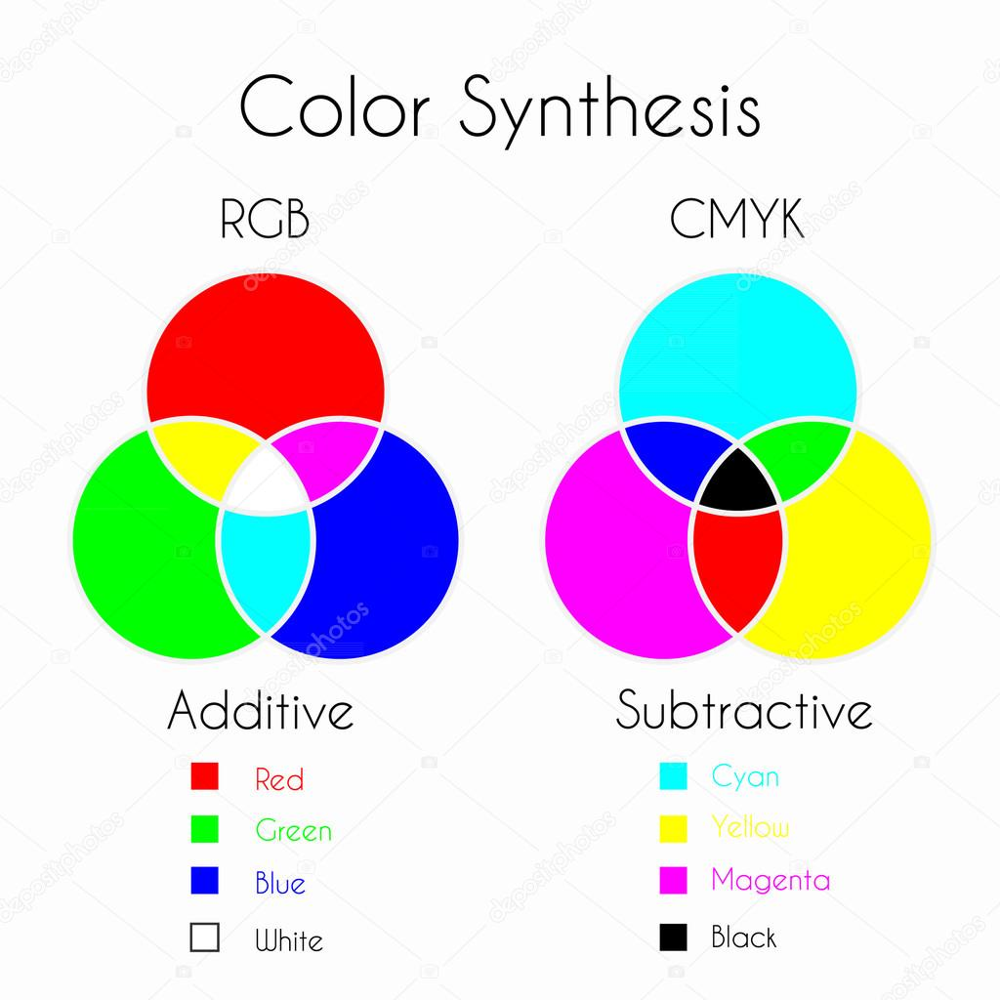

# Color Theory - Notes



## Table of Contents (ToC)
  - [Introduction](#introduction)
    - [What's Color Theory?](#whats-color-theory)
    - [Key Concepts and Terminology](#key-concepts-and-terminology)
    - [Applications](#applications)
  - [Fundamentals](#fundamentals)
    - [Color Theory Principles](#color-theory-principles)
    - [How Color Theory Works?](#how-color-theory-works)
    - [Types of Color Models](#types-of-color-models)
    - [Some Hands-on Examples](#some-hands-on-examples)
  - [Tools \& Frameworks](#tools--frameworks)
  - [Hello World!](#hello-world)
  - [Lab: Zero to Hero Projects](#lab-zero-to-hero-projects)
  - [References](#references)


## Introduction
Color theory is a framework of rules and guidelines used by designers and artists to communicate with users through appealing color schemes.

### What's Color Theory?
- A body of practical guidance on mixing colors and the visual effects of specific color combinations.
- Involves the science and art of using color effectively in design, art, and media.
- Provides tools for creating color harmonies, contrasts, and other visual effects.

### Key Concepts and Terminology
- **Primary Colors**: Red, blue, and yellow; the base colors from which all other colors are derived.
- **Secondary Colors**: Green, orange, and purple; created by mixing primary colors.
- **Complementary Colors**: Colors opposite each other on the color wheel that create high contrast when paired.
- **Color Harmony**: The pleasing arrangement of colors to create balance and interest in visual compositions.

### Applications
- Design and branding (logos, websites, packaging).
- Art and painting (composition, mood setting).
- Interior design and fashion (color coordination, ambiance).
- Digital media and photography (editing, color grading).

## Fundamentals

### Color Theory Principles
- **The Color Wheel**: A circular diagram representing the relationships between colors, typically including primary, secondary, and tertiary colors.
- **Color Relationships**: Concepts like analogous, complementary, and triadic colors that describe how colors interact with each other.
- **Color Psychology**: The study of how different colors influence human emotions and behavior.

### How Color Theory Works?
- **Additive and Subtractive Color Models**:
  - **Additive (RGB)**: Used in digital screens, combining red, green, and blue light to create colors.
  - **Subtractive (CMYK)**: Used in printing, where colors are created by subtracting light using cyan, magenta, yellow, and black inks.
- **Color Mixing**:
  - **Additive Mixing**: Combining light colors to create new hues.
  - **Subtractive Mixing**: Combining paints or pigments, where mixed colors absorb (subtract) certain wavelengths of light.

### Types of Color Models
- **RGB (Red, Green, Blue)**:
  - Used in electronic displays like monitors and televisions.
  - Combines varying intensities of red, green, and blue light to produce colors.
  
- **CMYK (Cyan, Magenta, Yellow, Black)**:
  - Used in color printing processes.
  - Colors are created by layering these four inks in varying densities.

- **HSL/HSV (Hue, Saturation, Lightness/Value)**:
  - Models that define colors in terms of their shade (hue), vividness (saturation), and brightness (lightness/value).
  - Useful for adjusting colors in design software.

### Some Hands-on Examples
- Creating a complementary color scheme for a website design.
- Experimenting with analogous colors to produce harmonious art.
- Using the color wheel to select a triadic color palette for a branding project.

## Tools & Frameworks
- **Adobe Color**: A tool for creating color schemes and experimenting with color harmonies.
- **Coolors**: A web app for generating and exploring color palettes.
- **Canva Color Wheel**: An interactive tool for visualizing color relationships.

## Hello World!

Ex1:

```python
import matplotlib.pyplot as plt

# Example: Displaying a color palette using Python
colors = ['#FF5733', '#33FF57', '#3357FF', '#F333FF', '#FFF333']
labels = ['Red-Orange', 'Green', 'Blue', 'Purple', 'Yellow']

# Create a pie chart to show the colors
plt.figure(figsize=(8, 8))
plt.pie([1]*len(colors), labels=labels, colors=colors, startangle=90)
plt.axis('equal')
plt.show()
```

Ex2: 

```python
import matplotlib.pyplot as plt

# Define a basic color palette
colors = ['#FF5733', '#33FF57', '#3357FF', '#F333FF', '#FF33A8']

# Create a bar chart to display the colors
plt.figure(figsize=(8, 2))
for i, color in enumerate(colors):
    plt.bar(i, 1, color=color)
plt.xticks(range(len(colors)), ['Red-Orange', 'Green', 'Blue', 'Magenta', 'Pink'])
plt.yticks([])
plt.title("Basic Color Palette")
plt.show()
```

## Lab: Zero to Hero Projects
- Designing a brand identity using principles of color theory.
- Creating an artwork series exploring different color harmonies.
- Developing a web application with dynamic color themes based on user preferences.

## References

- Birren, Faber. *Color Psychology and Color Therapy: A Factual Study of the Influence of Color on Human Life*. (1950)
- Itten, Johannes. *The Art of Color: The Subjective Experience and Objective Rationale of Color*. (1961)
- Albers, Josef. "Interaction of Color." (1963)
- [Color Theory - Wikipedia](https://en.wikipedia.org/wiki/Color_theory)
- ["Color Theory: An Essential Guide to Color-from Basic Principles to Practical Applications." - Sessions College](https://www.sessions.edu/color-calculator/color-theory/)

Adobe Color Theory Resources: 
  - [Adobe Color Wheel](https://color.adobe.com/create)
  - Adobe Color Documentation: [https://color.adobe.com/](https://color.adobe.com/)
  
W3schools:
- Colors Tutorial: https://www.w3schools.com/colors/default.asp
- Color Theory: https://www.w3schools.com/colors/colors_theory.asp

Introduction to Color Theory for Artists:
- https://www.serenaarchetti.com/blog/introduction-to-color-theory-for-artists

Color Palette Generators: 
- [Google Color Selector](https://www.google.com/search?q=google+color+selector&oq=google+color+s&gs_lcrp=EgZjaHJvbWUqCAgCEAAYFhgeMgYIABBFGDkyBwgBEAAYgAQyCAgCEAAYFhgeMggIAxAAGBYYHjIICAQQABgWGB4yCAgFEAAYFhgeMggIBhAAGBYYHjIGCAcQRRg80gEINjg2MGowajeoAgCwAgA&sourceid=chrome&ie=UTF-8)