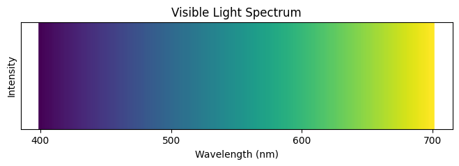

# Light - Notes

## Table of Contents (ToC)

  - [Introduction](#introduction)
    - [What's Light?](#whats-light)
    - [Key Concepts and Terminology](#key-concepts-and-terminology)
    - [Applications](#applications)
  - [Fundamentals](#fundamentals)
    - [Light Propagation and Behavior](#light-propagation-and-behavior)
    - [How Light Works?](#how-light-works)
    - [Types of Light](#types-of-light)
    - [Some Hands-on Examples](#some-hands-on-examples)
  - [Tools \& Frameworks](#tools--frameworks)
  - [Hello World!](#hello-world)
  - [Lab: Zero to Hero Projects](#lab-zero-to-hero-projects)
  - [References](#references)

## Introduction
Light is a form of electromagnetic radiation that is visible to the human eye and is responsible for the sense of sight.

### What's Light?
- A type of electromagnetic radiation that travels in waves.
- Consists of photons, which are particles with no mass and travel at the speed of light.
- Fundamental to numerous natural and technological processes, including vision, photosynthesis, and communication.

### Key Concepts and Terminology
- **Wavelength**: The distance between successive peaks of a wave, determining the color of light.
- **Frequency**: The number of waves that pass a point in one second, inversely related to wavelength.
- **Photon**: A particle representing a quantum of light.
- **Refraction**: The bending of light as it passes through different media.
- **Reflection**: The bouncing of light off a surface.

### Applications
- Vision and optics, enabling sight and optical instruments.
- Photography and imaging technologies.
- Communication technologies, such as fiber optics.
- Solar energy and photosynthesis in plants.
- Spectroscopy for material analysis in science.

## Fundamentals

### Light Propagation and Behavior
- **Speed of Light**: Approximately 299,792 kilometers per second in a vacuum.
- **Refraction**: Light changes direction when it enters a different medium (e.g., from air to water).
- **Reflection**: Light bounces off surfaces, following the law of reflection (angle of incidence equals angle of reflection).
- **Diffraction**: Light bends around obstacles or through small openings, creating patterns of interference.

### How Light Works?
- **Electromagnetic Spectrum**: Light is part of a broader spectrum of electromagnetic radiation, which includes radio waves, microwaves, infrared, ultraviolet, X-rays, and gamma rays.
- **Visible Spectrum**: The range of wavelengths from approximately 400 to 700 nanometers that the human eye can perceive as different colors.
- **Dual Nature**: Light exhibits both wave-like and particle-like properties, as described by wave-particle duality.
- **Interaction with Matter**: Light can be absorbed, transmitted, or reflected by different materials, leading to phenomena such as transparency, color, and brightness.

### Types of Light
- **Natural Light**:
  - Emitted by the sun, stars, and other natural sources.
  - Essential for natural processes like photosynthesis and the circadian rhythm.

- **Artificial Light**:
  - Produced by man-made sources such as incandescent bulbs, LEDs, and lasers.
  - Used in lighting, displays, and various technologies.

- **Monochromatic Light**:
  - Light of a single wavelength, typically produced by lasers.
  - Used in precise scientific measurements and optical devices.

- **Polychromatic Light**:
  - Light that consists of multiple wavelengths, like white light from the sun or bulbs.
  - Can be split into its component colors using a prism.

### Some Hands-on Examples
- **Experimenting with Refraction**: Observing how light bends when passing through water.
- **Prism Experiment**: Splitting white light into its component colors using a glass prism.
- **Measuring Light Intensity**: Using a light meter to measure the intensity of natural vs. artificial light sources.

## Tools & Frameworks
- **Optical Simulation Software**: Tools like OptiSystem and ZEMAX for designing optical systems and simulating light behavior.
- **Spectroscopy Tools**: Instruments for analyzing the spectral properties of light.
- **Arduino and Light Sensors**: For DIY projects involving light detection and measurement.

## Hello World!

```python
import matplotlib.pyplot as plt
import numpy as np

# Simulate the spectrum of visible light (wavelengths 400-700 nm)
wavelengths = np.linspace(400, 700, 300)
colors = plt.cm.viridis((wavelengths - 400) / (700 - 400))

# Create a plot of the visible spectrum
plt.figure(figsize=(8, 2))
for i, color in enumerate(colors):
    plt.axvline(x=wavelengths[i], color=color, linewidth=4)
plt.title("Visible Light Spectrum")
plt.xlabel("Wavelength (nm)")
plt.ylabel("Intensity")
plt.xticks([400, 500, 600, 700])
plt.yticks([])
plt.show()
```

output:



## Lab: Zero to Hero Projects
- Building a simple spectroscope to observe the spectrum of different light sources.
- Creating a solar-powered light sensor to measure light intensity over time.
- Designing an optical communication system using LEDs and light sensors.

## References
- Hecht, Eugene. *Optics*. (2002).
- Feynman, Richard P. *QED: The Strange Theory of Light and Matter*. (1985).
- Born, Max, and Emil Wolf. *Principles of Optics: Electromagnetic Theory of Propagation, Interference and Diffraction of Light*. (1999).
- Wikipedia: [Light](https://en.wikipedia.org/wiki/Light)
- NASA's Science Mission Directorate: [What is Light?](https://science.nasa.gov/ems/02_anatomy)
