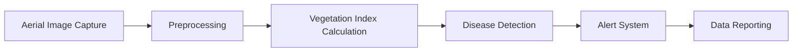

#  **Computer Vision Pipeline for Agriculture**  

## Use case: Plant Health Monitoring

**Problem** : Detecting plant diseases in real-time using aerial imagery from drones.

## **Pipeline Overview**:  



## Description

1. **Aerial Image Capture**: Real-time image capture from drones using multispectral/hyperspectral cameras.  
2. **Preprocessing**: Normalize and enhance images based on spectral information.  
3. **Vegetation Index Calculation**: Calculate NDVI (Normalized Difference Vegetation Index) to assess plant health.  
4. **Disease Detection**: Use a trained convolutional neural network (CNN) to identify patterns indicating disease.  
5. **Alert System**: Trigger alerts when unhealthy areas are detected in crops.  
6. **Data Reporting**: Generate real-time reports for farmers to take immediate action.

## **Implementation (Python): Real-time Plant Disease Detection**  
This Python code processes drone images to detect unhealthy crops based on vegetation indices.

```python
import cv2
import numpy as np
from tensorflow.keras.models import load_model

# Load CNN model for plant disease detection
model = load_model('plant_disease_detection_model.h5')

def calculate_ndvi(image):
    # Split into NIR and Red channels
    nir = image[:, :, 0].astype(float)
    red = image[:, :, 1].astype(float)
    # Compute NDVI
    ndvi = (nir - red) / (nir + red + 1e-10)
    return ndvi

def detect_disease(ndvi):
    # Reshape NDVI image for CNN input
    ndvi_resized = cv2.resize(ndvi, (128, 128))
    ndvi_reshaped = np.expand_dims(ndvi_resized, axis=(0, 3))
    # Predict disease
    prediction = model.predict(ndvi_reshaped)
    return prediction

def monitor_crops(drone_camera_id=0):
    cap = cv2.VideoCapture(drone_camera_id)
    while True:
        ret, frame = cap.read()
        if not ret:
            break
        ndvi = calculate_ndvi(frame)
        disease_prediction = detect_disease(ndvi)
        if disease_prediction[0] > 0.5:
            print("Unhealthy crop detected!")
        cv2.imshow('Drone Monitoring', frame)
        if cv2.waitKey(1) & 0xFF == ord('q'):
            break
    cap.release()
    cv2.destroyAllWindows()

monitor_crops()
```

**Output**

- TBD

## References
- TBD
