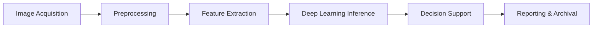

# **Computer Vision Pipeline for Healthcare**  


## Use Case: Medical Image Analysis

**Problem**: Real-time detection of abnormalities (e.g., tumors) in MRI scans.

## **Pipeline Overview** 



### Description

1. **Image Acquisition**: Continuous capture of MRI images or CT scans from imaging machines.  
2. **Preprocessing**: Normalize intensity levels, denoise, and segment regions of interest.  
3. **Feature Extraction**: Extract important features (e.g., tumor edges, texture).  
4. **Deep Learning Inference**: Use a pre-trained 3D CNN model for real-time abnormality detection.  
5. **Decision Support**: Provide instant feedback to radiologists and generate anomaly heatmaps.  
6. **Reporting & Archival**: Store detected abnormalities in the patient's medical record.

## **Implementation (Python): Tumor Detection in MRI Scans**  
This Python code uses a trained 3D CNN model to detect abnormalities in MRI scans.

```python
import nibabel as nib
import numpy as np
from tensorflow.keras.models import load_model
import matplotlib.pyplot as plt

# Load pre-trained 3D CNN model
model = load_model('mri_tumor_detection_model.h5')

def preprocess_mri(scan_path):
    # Load and normalize MRI scan
    img = nib.load(scan_path).get_fdata()
    img_normalized = img / np.max(img)
    return img_normalized

def detect_tumor(mri_scan):
    # Reshape for 3D CNN input
    reshaped_scan = np.expand_dims(mri_scan, axis=0)
    prediction = model.predict(reshaped_scan)
    return prediction

def visualize_tumor_detection(mri_scan, prediction):
    plt.figure(figsize=(10, 10))
    plt.subplot(1, 2, 1)
    plt.imshow(mri_scan[:, :, mri_scan.shape[2]//2], cmap='gray')
    plt.title("MRI Scan")
    plt.subplot(1, 2, 2)
    plt.imshow(prediction[0, :, :, prediction.shape[3]//2], cmap='hot')
    plt.title("Tumor Detection")
    plt.show()

# Example
mri_scan = preprocess_mri('example_mri_scan.nii.gz')
tumor_prediction = detect_tumor(mri_scan)
visualize_tumor_detection(mri_scan, tumor_prediction)
```

**Output**
- TBD


## References
- TBD

