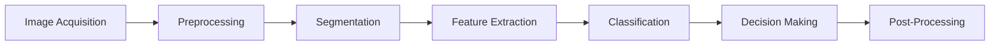

# **Computer Vision Pipeline for Machine Vision (MV)**  


## Use case: Detecting Surface Defects

**Problem**: Detecting defects in real-time on a manufacturing line.

## **Pipeline Overview**:  



### Description

1. **Image Acquisition**: High-resolution camera continuously captures product images.  
2. **Preprocessing**: Image enhancement (noise reduction, contrast adjustment).  
3. **Segmentation**: Identifying regions of interest (ROI) for defect detection.  
4. **Feature Extraction**: Extracting key features like texture, edges, and shape from ROIs.  
5. **Classification**: Real-time defect classification using a pre-trained deep learning model.  
6. **Decision Making**: Trigger alert system or activate reject mechanism if defects are found.  
7. **Post-Processing**: Logging defective instances with metadata for later analysis.

## **Implementation(Python)**

This code processes real-time images from a manufacturing line and flags defects.

```python
import cv2
import numpy as np
from tensorflow.keras.models import load_model

# Load pre-trained model for defect detection
model = load_model('defect_detection_model.h5')

def preprocess_image(image):
    # Convert to grayscale
    gray = cv2.cvtColor(image, cv2.COLOR_BGR2GRAY)
    # Noise reduction and contrast enhancement
    blurred = cv2.GaussianBlur(gray, (5, 5), 0)
    return cv2.equalizeHist(blurred)

def segment_defects(image):
    # Adaptive thresholding to segment ROI
    _, thresholded = cv2.threshold(image, 100, 255, cv2.THRESH_BINARY_INV)
    return thresholded

def classify_defect(image):
    processed = preprocess_image(image)
    segmented = segment_defects(processed)
    # Reshape for the model
    reshaped = segmented.reshape(1, 128, 128, 1)
    prediction = model.predict(reshaped)
    return prediction

def monitor_line(camera_id=0):
    cap = cv2.VideoCapture(camera_id)
    while True:
        ret, frame = cap.read()
        if not ret:
            break
        result = classify_defect(frame)
        if result[0] > 0.5:
            print("Defect Detected!")
            # Trigger alarm or reject system
        cv2.imshow('Real-time Monitoring', frame)
        if cv2.waitKey(1) & 0xFF == ord('q'):
            break
    cap.release()
    cv2.destroyAllWindows()

monitor_line()
```


## Output
- TBD


## References
- TBD
