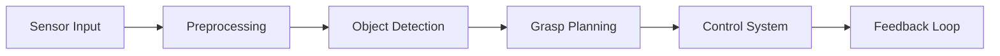

# Computer Vision Pipeline for Robotics  

## Use case: Real-time Object Manipulation

**Problem**: Real-time robotic arm control for grasping and manipulating objects.


## **Pipeline Overview**  



### Description

1. **Sensor Input**: Capture real-time video feed and depth information from sensors.  
2. **Preprocessing**: Filter noise, stabilize feed, and enhance object visibility.  
3. **Object Detection**: Use YOLO/Faster R-CNN to detect objects and estimate their position in 3D space.  
4. **Grasp Planning**: Calculate optimal grasp points based on object shape and position.  
5. **Control System**: Issue real-time commands to the robotic arm for object manipulation.  
6. **Feedback Loop**: Use real-time feedback to adjust the robotic arm’s position and force.


## **Implementation (Python): Real-time Object Grasping**  
This Python code detects an object and controls a robotic arm to grasp it.

```python
import cv2
import numpy as np
from tensorflow.keras.models import load_model

# Load object detection model
model = load_model('object_detection_model.h5')

def preprocess_frame(frame):
    # Convert frame to grayscale and enhance
    gray = cv2.cvtColor(frame, cv2.COLOR_BGR2GRAY)
    return cv2.GaussianBlur(gray, (5, 5), 0)

def detect_object(frame):
    # Detect objects and find coordinates
    processed_frame = preprocess_frame(frame)
    object_coords = model.predict(np.expand_dims(processed_frame, axis=0))
    return object_coords

def grasp_object(coords):
    # Plan grasp based on object position (example for robotic arm control)
    x, y = coords[0], coords[1]
    print(f"Grasping at coordinates: {x}, {y}")
    # Send real-time commands to the robotic arm
    # robotic_arm.move_to(x, y)

def monitor_robotic_arm(camera_id=0):
    cap = cv2.VideoCapture(camera_id)
    while True:
        ret, frame = cap.read()
        if not ret:
            break
        object_coords = detect_object(frame)
        grasp_object(object_coords)
        cv2.imshow('Real-time Object Grasping', frame)
        if cv2.waitKey(1) & 0xFF == ord('q'):
            break
    cap.release()
    cv2.destroyAllWindows()

monitor_robotic_arm()
```

**Output**
- TBD

## References
- TBD

