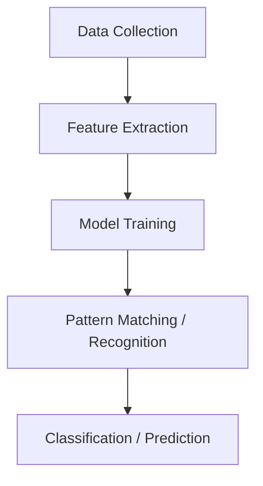

# Pattern Recognition - Notes

## Table of Contents (ToC)
- Introduction
- Key Concepts
- Why It Matters / Relevance
- Learning Map (Architecture Pipeline)
- Framework / Key Theories or Models
- How Pattern Recognition Works
- Methods, Types & Variations
- Self-Practice / Hands-On Examples
- Pitfalls & Challenges
- Feedback & Evaluation
- Tools, Libraries & Frameworks
- Hello World! (Practical Example)
- Advanced Exploration
- Zero to Hero Lab Projects
- Continuous Learning Strategy
- References

---

## Introduction
- **Pattern recognition** is the process of identifying regularities, correlations, or structures in data, helping machines and humans to make predictions, classify objects, or extract meaningful information.

## Key Concepts
- **Features**: The measurable properties or characteristics of data that are used for recognition.
- **Classification**: Assigning input data to one of several predefined categories based on patterns.
- **Supervised Learning**: Training a model using labeled data where the desired output is already known.
- **Unsupervised Learning**: Detecting patterns in data without predefined labels or outcomes.
- **Misconception**: Pattern recognition is not limited to visual data—it applies to any form of structured data (e.g., text, audio, time-series).
  
## Why It Matters / Relevance
- **Computer Vision**: Identifying objects, faces, or activities in images and videos.
- **Natural Language Processing**: Recognizing patterns in text or speech for translation, summarization, or sentiment analysis.
- **Medical Diagnosis**: Using pattern recognition to detect abnormalities in medical imaging or genomics data.
- **Financial Systems**: Detecting fraud by recognizing unusual patterns in transactions or market data.
- **Robotics and Automation**: Enabling machines to recognize environments and perform tasks like autonomous driving or navigation.

## Learning Map (Architecture Pipeline)

- **Data Collection**: Gathering structured or unstructured data (e.g., images, sound, text).
- **Feature Extraction**: Identifying important characteristics of the data, such as edges in an image.
- **Model Training**: Using machine learning algorithms (e.g., neural networks) to teach a system to recognize patterns.
- **Pattern Matching**: The model identifies patterns in new data by comparing them to the learned patterns.
- **Prediction/Classification**: The system outputs the recognized class or prediction based on identified patterns.

## Framework / Key Theories or Models
- **Bayesian Decision Theory**: A probabilistic framework for pattern classification based on prior knowledge and likelihood.
- **Hidden Markov Models (HMMs)**: Used to recognize patterns that evolve over time, common in speech and time-series data.
- **Artificial Neural Networks (ANNs)**: Multi-layered models designed to simulate the way human brains recognize patterns.
- **Support Vector Machines (SVMs)**: Supervised learning models that classify data by finding the optimal decision boundary.
- **K-Nearest Neighbors (KNN)**: A simple algorithm that classifies new data based on the majority vote of its neighbors.

## How Pattern Recognition Works
1. **Data Preprocessing**: Clean and prepare the raw data for analysis (e.g., normalization, removing noise).
2. **Feature Extraction**: Identify key features relevant to the patterns in the data (e.g., edges in an image or keywords in text).
3. **Model Training**: Apply a learning algorithm (e.g., SVM, neural network) to learn the pattern from labeled or unlabeled data.
4. **Pattern Recognition**: Once the model is trained, it is used to recognize patterns in unseen data.
5. **Evaluation**: Assess the accuracy and efficiency of the model using metrics like precision, recall, or F1-score.

## Methods, Types & Variations
- **Template Matching**: Direct comparison of new data with stored templates (e.g., face recognition).
- **Statistical Pattern Recognition**: Using statistical techniques (e.g., decision trees, logistic regression) to classify data.
- **Neural Pattern Recognition**: Leveraging deep learning architectures to recognize complex patterns in large datasets (e.g., convolutional neural networks for images).
- **Clustering (Unsupervised)**: Grouping similar data points into clusters without pre-labeled classes.
  - Example: K-means clustering for image segmentation or customer segmentation.

## Self-Practice / Hands-On Examples
1. **Handwritten Digit Recognition**: Use the MNIST dataset to train a neural network that recognizes digits (0-9).
2. **Face Detection**: Implement a face detection algorithm using Haar cascades in OpenCV.
3. **Speech Pattern Recognition**: Create a model that recognizes spoken words using audio features like Mel Frequency Cepstral Coefficients (MFCCs).
4. **Image Classification**: Build a CNN to classify objects in the CIFAR-10 dataset (e.g., airplane, car, dog).
5. **Text Classification**: Train a natural language processing model to recognize patterns in text (e.g., spam detection).

## Pitfalls & Challenges
- **Overfitting**: The model learns the training data too well and fails to generalize to new data. Regularization and cross-validation can help mitigate this.
- **Curse of Dimensionality**: When there are too many features in the data, making it difficult for models to learn efficiently.
- **Bias-Variance Tradeoff**: Striking the right balance between making the model complex enough to learn patterns without making it too specific to the training data.
- **Data Imbalance**: When certain patterns are underrepresented, it can lead to biased recognition.
- **Suggestion**: Use techniques like data augmentation, regularization, and model validation to avoid these challenges.

## Feedback & Evaluation
1. **Self-Explanation**: Explain how a specific pattern recognition algorithm works (e.g., neural networks) to a beginner, focusing on its basic principles.
2. **Peer Review**: Have a peer review the accuracy and efficiency of your pattern recognition model and suggest improvements.
3. **Real-World Simulation**: Test your model in a real-world environment or dataset (e.g., applying your image classifier to new photographs or images).

## Tools, Libraries & Frameworks
- **OpenCV**: A library for computer vision tasks, including pattern recognition through image processing and machine learning.
  - **Pros**: Large number of pre-built algorithms for pattern recognition.
  - **Cons**: Requires a steep learning curve for beginners.
- **Scikit-learn**: A Python library offering simple and efficient tools for data mining and pattern recognition.
  - **Pros**: Easy to use, wide range of algorithms for beginners.
  - **Cons**: Limited support for large-scale deep learning tasks.
- **TensorFlow/PyTorch**: Popular deep learning frameworks for training complex models for image, text, and audio pattern recognition.
  - **Pros**: Powerful for deep learning tasks; scalable.
  - **Cons**: Requires advanced knowledge of deep learning principles.
- **Keras**: A high-level neural networks API, built on top of TensorFlow.
  - **Pros**: User-friendly interface for deep learning.
  - **Cons**: May not be flexible enough for highly customized models.

## Hello World! (Practical Example)
```python
import tensorflow as tf
from tensorflow.keras import datasets, layers, models

# Load the dataset
(train_images, train_labels), (test_images, test_labels) = datasets.cifar10.load_data()

# Normalize the images
train_images, test_images = train_images / 255.0, test_images / 255.0

# Build a simple CNN model
model = models.Sequential([
    layers.Conv2D(32, (3, 3), activation='relu', input_shape=(32, 32, 3)),
    layers.MaxPooling2D((2, 2)),
    layers.Conv2D(64, (3, 3), activation='relu'),
    layers.MaxPooling2D((2, 2)),
    layers.Flatten(),
    layers.Dense(64, activation='relu'),
    layers.Dense(10)
])

# Compile the model
model.compile(optimizer='adam', loss=tf.keras.losses.SparseCategoricalCrossentropy(from_logits=True), metrics=['accuracy'])

# Train the model
model.fit(train_images, train_labels, epochs=10, validation_data=(test_images, test_labels))
```
- **Explanation**: This simple code trains a CNN to recognize objects in the CIFAR-10 dataset, a popular image classification benchmark.

## Advanced Exploration
- **1. "Pattern Classification" by Richard O. Duda, Peter E. Hart, and David G. Stork**: A comprehensive guide to statistical pattern recognition.
- **2. "Deep Learning" by Ian Goodfellow, Yoshua Bengio, and Aaron Courville**: A deep dive into neural networks and pattern recognition with modern deep learning methods.
- **3. Kaggle Competitions**: Participate in Kaggle's pattern recognition competitions to test and refine your skills on real-world data.

## Zero## Zero to Hero Lab Projects
- **Beginner**: Build a **handwritten digit recognition system** using the MNIST dataset. Utilize simple feedforward neural networks and evaluate your model’s accuracy.
- **Intermediate**: Implement an **image classification model** using a Convolutional Neural Network (CNN) on the CIFAR-10 dataset. Add data augmentation techniques to improve generalization.
- **Advanced**: Create a **speech-to-text system** by training a recurrent neural network (RNN) or transformer model to recognize patterns in audio data. Use open-source datasets like LibriSpeech to evaluate performance.

## Continuous Learning Strategy
- **Next Steps**: 
   - Study **unsupervised pattern recognition** and delve into clustering techniques like Gaussian Mixture Models or DBSCAN.
   - Explore **advanced deep learning models** such as Vision Transformers (ViT) or Generative Adversarial Networks (GANs) for complex pattern generation and recognition tasks.
- **Related Topics**: Machine learning, data mining, anomaly detection, and computer vision are closely related fields to explore next.
  
## References
- **1. Duda, Richard O., Hart, Peter E., and Stork, David G. "Pattern Classification."** Wiley-Interscience, 2000.
- **2. Bishop, Christopher M. "Pattern Recognition and Machine Learning."** Springer, 2006.
- **3. LeCun, Yann, Bengio, Yoshua, and Hinton, Geoffrey. "Deep Learning."** Nature, 2015.
- **4. OpenCV and Scikit-learn Documentation** for hands-on tools and pattern recognition algorithms.
- **5. Goodfellow, Ian, Bengio, Yoshua, and Courville, Aaron. "Deep Learning."** MIT Press, 2016.

This summary of **Pattern Recognition** is designed to guide learners from foundational concepts to practical, hands-on applications while offering pathways for continued exploration.

