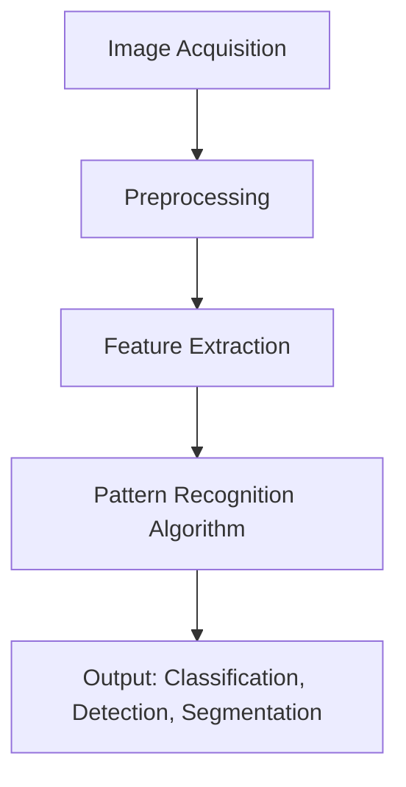

# Visual Pattern Recognition - Notes

## Table of Contents (ToC)
- Introduction
- Key Concepts
- Why It Matters / Relevance
- Learning Map (Architecture Pipeline)
- Framework / Key Theories or Models
- How Visual Pattern Recognition Works
- Methods, Types & Variations
- Self-Practice / Hands-On Examples
- Pitfalls & Challenges
- Feedback & Evaluation
- Tools, Libraries & Frameworks
- Hello World! (Practical Example)
- Advanced Exploration
- Zero to Hero Lab Projects
- Continuous Learning Strategy
- References

---

## Introduction
- **Visual pattern recognition** is the ability of computers or systems to identify patterns, objects, or structures within visual data such as images or videos, often by leveraging machine learning techniques.

## Key Concepts
- **Features**: Specific attributes extracted from images (e.g., edges, corners, textures) that are key to identifying patterns.
- **Convolutional Neural Networks (CNNs)**: A deep learning architecture designed to process grid-like data (e.g., images) by applying convolution operations.
- **Object Detection**: Recognizing and localizing specific objects within an image.
- **Classification**: Assigning a label to an image based on identified patterns.
- **Segmentation**: Dividing an image into meaningful regions or objects.
- **Misconception**: Visual pattern recognition isn’t only about identifying shapes; it also involves recognizing textures, colors, and spatial relationships between objects.

## Why It Matters / Relevance
- **Autonomous Vehicles**: Cars use visual pattern recognition to identify road signs, pedestrians, and other vehicles for safe navigation.
- **Medical Imaging**: Detecting patterns in scans like X-rays or MRIs to diagnose diseases.
- **Security**: Facial recognition systems use visual pattern recognition to identify individuals for security purposes.
- **Augmented Reality (AR)**: Recognizing objects in real-time to overlay digital content.
- **Robotics**: Robots equipped with cameras use visual pattern recognition to understand their surroundings and perform tasks autonomously.

## Learning Map (Architecture Pipeline)

- **Image Acquisition**: Capturing visual data through cameras or sensors.
- **Preprocessing**: Cleaning and normalizing images (e.g., removing noise, resizing, grayscale conversion).
- **Feature Extraction**: Identifying features like edges, corners, and textures that are used for recognition.
- **Pattern Recognition Algorithm**: Applying models such as CNNs or object detection algorithms to learn and recognize patterns.
- **Output**: Producing results such as identifying objects, detecting boundaries, or classifying entire images.

## Framework / Key Theories or Models
- **Convolutional Neural Networks (CNNs)**: A core architecture for recognizing visual patterns, especially effective for object detection and classification tasks.
- **Scale-Invariant Feature Transform (SIFT)**: A traditional algorithm for detecting and describing local features in images, used for object recognition.
- **Histograms of Oriented Gradients (HOG)**: A feature descriptor that counts occurrences of gradient orientation in localized portions of an image, often used for detecting objects like pedestrians.
- **Region-based Convolutional Neural Networks (R-CNN)**: A model for object detection that applies CNNs to region proposals to localize objects.
- **ViT (Vision Transformers)**: A more recent deep learning model for image classification that applies transformer architectures directly to image patches.

## How Visual Pattern Recognition Works
1. **Image Acquisition**: Collect visual data through sensors or cameras.
2. **Preprocessing**: Clean, normalize, and prepare images (e.g., remove noise, apply filters).
3. **Feature Extraction**: Identify key visual elements such as edges, colors, textures, and shapes that help in recognizing patterns.
4. **Recognition**: Use models like CNNs or traditional methods (e.g., SIFT, HOG) to learn and recognize visual patterns.
5. **Post-processing**: Output results like object classification, boundary detection, or segmentations, depending on the task.

## Methods, Types & Variations
- **Object Detection**: Techniques like YOLO (You Only Look Once) and Faster R-CNN for detecting and localizing objects within images in real-time.
- **Image Classification**: CNN-based methods for classifying an entire image into predefined categories (e.g., dogs, cats, cars).
- **Semantic Segmentation**: Techniques like Fully Convolutional Networks (FCNs) to assign a class label to each pixel in an image.
- **Instance Segmentation**: Mask R-CNN is a popular approach that not only detects objects but also segments them at the pixel level.
- **Facial Recognition**: Techniques for recognizing and verifying human faces, using feature vectors to compare facial landmarks.
  - **Contrasting Example**: CNN-based methods for real-time object detection (e.g., YOLO) focus on speed, while R-CNN approaches prioritize accuracy but are slower.

## Self-Practice / Hands-On Examples
1. **Image Classification**: Train a CNN to classify images from the CIFAR-10 dataset, containing 10 different categories of objects.
2. **Object Detection**: Use pre-trained models like YOLOv5 to detect multiple objects in images and videos.
3. **Semantic Segmentation**: Implement a U-Net architecture to perform pixel-level classification on a medical imaging dataset.
4. **Facial Recognition**: Build a simple facial recognition system using OpenCV’s Haar cascades or a pre-trained deep learning model.
5. **Edge Detection**: Use OpenCV to implement Canny edge detection for identifying edges in an image.

## Pitfalls & Challenges
- **Data Quality**: Low-resolution or noisy images can make pattern recognition challenging. Solution: Use preprocessing techniques like denoising filters or data augmentation.
- **Overfitting**: Training on too few examples or overly specific data can cause the model to memorize instead of generalizing. Solution: Regularization techniques and expanding the training dataset.
- **Occlusion**: When objects in images are partially blocked, it becomes difficult to recognize them. Solution: Use robust detection algorithms like Faster R-CNN.
- **Imbalanced Datasets**: Some object classes might be underrepresented in the dataset, leading to poor generalization. Solution: Perform data augmentation or use techniques like SMOTE for balancing.
- **Suggestion**: Use transfer learning from large pre-trained models to avoid some of these pitfalls and fine-tune on your specific dataset.

## Feedback & Evaluation
1. **Self-Explanation**: Describe how CNNs function in image classification, starting from the convolution layer to the fully connected layer, in your own words.
2. **Peer Review**: Have a colleague review your image classifier’s performance and provide feedback on accuracy, precision, and recall.
3. **Real-World Simulation**: Test your object detection model on real-world images, such as live camera feeds, to evaluate performance in dynamic environments.

## Tools, Libraries & Frameworks
- **OpenCV**: A library offering extensive tools for image preprocessing and traditional feature extraction techniques.
  - **Pros**: Simple and widely used in industry; good for small-scale projects.
  - **Cons**: Limited deep learning capabilities without integration with other frameworks.
- **TensorFlow / Keras**: Deep learning frameworks for training CNNs and other neural networks for visual tasks.
  - **Pros**: Powerful and highly scalable for large datasets.
  - **Cons**: Requires advanced knowledge of deep learning principles.
- **PyTorch**: A deep learning library with strong support for CNNs and real-time object detection.
  - **Pros**: More flexible for research and experimentation.
  - **Cons**: Steeper learning curve compared to Keras.
- **Detectron2**: A Facebook AI Research library for object detection, including advanced models like Faster R-CNN and Mask R-CNN.
  - **Pros**: State-of-the-art detection and segmentation tools.
  - **Cons**: Computationally expensive for larger datasets.
- **YOLOv5**: A popular real-time object detection model.
  - **Pros**: Extremely fast; easy to use with pre-trained models.
  - **Cons**: Tradeoff between speed and accuracy compared to slower methods like R-CNN.

## Hello World! (Practical Example)
```python
import tensorflow as tf
from tensorflow.keras import layers, models
from tensorflow.keras.datasets import cifar10

# Load and preprocess the CIFAR-10 dataset
(train_images, train_labels), (test_images, test_labels) = cifar10.load_data()
train_images, test_images = train_images / 255.0, test_images / 255.0

# Build a CNN model
model = models.Sequential([
    layers.Conv2D(32, (3, 3), activation='relu', input_shape=(32, 32, 3)),
    layers.MaxPooling2D((2, 2)),
    layers.Conv2D(64, (3, 3), activation='relu'),
    layers.MaxPooling2D((2, 2)),
    layers.Conv2D(64, (3, 3), activation='relu'),
    layers.Flatten(),
    layers.Dense(64, activation='relu'),
    layers.Dense(10)
])

# Compile the model
model.compile(optimizer='adam', loss='sparse_categorical_crossentropy', metrics=['accuracy'])

# Train the model
model.fit(train_images, train_labels, epochs=10, validation_data=(test_images, test_labels))
```
- **Explanation**: This CNN model classifies images from the CIFAR-10 dataset, a standard benchmark for visual pattern recognition tasks like object classification