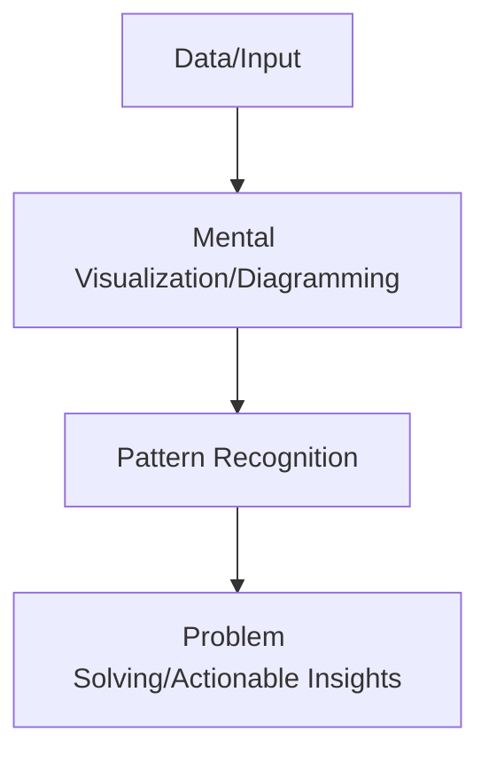

# Visual Thinking and Pattern Recognition - Notes

## Table of Contents (ToC)
- Introduction
- Key Concepts
- Why It Matters / Relevance
- Learning Map (Architecture Pipeline)
- Framework / Key Theories or Models
- How Visual Thinking and Pattern Recognition Works
- Methods, Types & Variations
- Self-Practice / Hands-On Examples
- Pitfalls & Challenges
- Feedback & Evaluation
- Tools, Libraries & Frameworks
- Hello World! (Practical Example)
- Advanced Exploration
- Zero to Hero Lab Projects
- Continuous Learning Strategy
- References

---

## Introduction
- **Visual thinking** refers to the cognitive process of using images, diagrams, or mental visualizations to solve problems and make sense of information, while **pattern recognition** is identifying regularities, structures, or repeated elements in visual input.

## Key Concepts
- **Mental Imagery**: The ability to visualize objects or concepts in the mind, important for problem-solving and creativity.
- **Pattern Recognition**: The process of identifying recurring structures or features in visual input, such as shapes, colors, or objects.
- **Gestalt Principles**: Psychological principles describing how humans perceive visual elements in terms of grouping and patterns, including proximity, similarity, and continuity.
- **Cognitive Load**: Visual thinking reduces the cognitive load by enabling faster recognition of relationships and connections in data.
- **Misconception**: Visual thinking and pattern recognition are not limited to artists or scientists; they are critical in everyday problem-solving and decision-making.

## Why It Matters / Relevance
- **Design Thinking**: Visual thinking helps designers create better user experiences by mapping out concepts and relationships visually.
- **STEM Fields**: Engineers, scientists, and mathematicians use visual thinking for problem-solving, such as in circuit diagrams or molecular structures.
- **Data Science**: Data visualization tools like graphs and heatmaps rely on visual pattern recognition to make sense of large datasets.
- **Education**: Visual aids such as mind maps or concept maps help students understand complex topics more easily.
- **Business Strategy**: Executives and managers use visual thinking to identify patterns in data, map out business models, and solve organizational challenges.

## Learning Map (Architecture Pipeline)

- **Data/Input**: Collect visual input, be it from diagrams, images, or abstract concepts.
- **Mental Visualization/Diagramming**: Use visual thinking techniques like sketching or mental imagery to create representations.
- **Pattern Recognition**: Identify relationships, connections, or patterns in the visualized data.
- **Problem Solving**: Translate recognized patterns into insights or solutions.

## Framework / Key Theories or Models
- **Gestalt Principles**: A psychological theory explaining how we naturally group visual elements into organized patterns and interpret complex images.
- **Dual-Coding Theory**: Suggests that both visual and verbal information are processed differently and stored separately in the brain, enhancing comprehension when combined.
- **Concept Mapping**: A technique where learners organize and represent knowledge visually, linking ideas and concepts with lines or arrows to form networks.
- **Cognitive Load Theory**: Visuals can help in reducing cognitive load when learning new or complex tasks, improving understanding through pattern recognition.
- **Design Thinking Framework**: This framework leverages visual thinking for creative problem-solving in iterative stages, including empathy, ideation, prototyping, and testing.

## How Visual Thinking and Pattern Recognition Works
1. **Perception**: Start by gathering visual information (graphs, diagrams, images) and perceive individual elements like colors, shapes, or lines.
2. **Mental Visualization**: Construct mental images or diagrams to map relationships between the elements.
3. **Pattern Recognition**: Identify structures, trends, or recurring themes in the visual information.
4. **Insight Generation**: Recognize how these patterns lead to insights or solutions to the problem at hand.
5. **Problem-Solving**: Apply the insights gained through pattern recognition to arrive at conclusions or take actions.

## Methods, Types & Variations
- **Mind Mapping**: A diagrammatic method of visually organizing information around a central concept, often used to brainstorm ideas.
- **Concept Mapping**: Organizes and connects ideas visually to show relationships and hierarchies.
- **Flowcharts and Diagrams**: Common in engineering, programming, and business, they show the steps in a process and are ideal for pattern recognition in workflows.
- **Data Visualization**: Heatmaps, bar graphs, and scatter plots are used in fields like data science for recognizing patterns in large datasets.
- **Contrasting Example**: While data visualization focuses on numeric or abstract data, mind mapping emphasizes connecting ideas or concepts for clearer understanding.

## Self-Practice / Hands-On Examples
1. **Mind Map Creation**: Create a mind map for a complex problem you're facing, such as planning a project. Use visual patterns to connect related ideas.
2. **Data Visualization**: Analyze a dataset using tools like Matplotlib or Tableau to recognize visual patterns in the data.
3. **Problem-Solving with Sketches**: Use sketching or diagramming to visualize a solution to an everyday problem (e.g., organizing a workspace).
4. **Concept Map**: Choose a topic you're learning and create a concept map that links key concepts visually.
5. **Pattern Identification**: Look at a piece of abstract art or a dataset and identify the patterns or relationships between the elements.

## Pitfalls & Challenges
- **Oversimplification**: Visual thinking might lead to oversimplifying complex problems. Solution: Supplement visuals with detailed analysis where needed.
- **Bias in Interpretation**: Visual patterns can lead to cognitive biases, such as seeing patterns that aren’t there. Solution: Validate your interpretations with data or feedback.
- **Limited Detail**: Visuals may lack sufficient detail for in-depth analysis. Solution: Combine visual thinking with other methods like verbal reasoning for a complete understanding.
- **Suggestion**: Use multiple representations—visual, verbal, and numerical—to avoid over-reliance on one mode of thinking.

## Feedback & Evaluation
1. **Self-Explanation**: Explain your thought process as you create a visual representation or recognize a pattern.
2. **Peer Review**: Present your mind maps or diagrams to peers and get feedback on their clarity and the patterns you've recognized.
3. **Real-World Simulation**: Apply visual thinking in a real-world context, such as designing a user interface or interpreting a scientific diagram, and evaluate how well you can solve problems through pattern recognition.

## Tools, Libraries & Frameworks
- **Lucidchart**: A visual diagramming tool ideal for creating flowcharts, mind maps, and other visual representations.
  - **Pros**: Easy to use, great for collaborative brainstorming.
  - **Cons**: Limited functionality in free version.
- **Miro**: A collaborative online whiteboard for visual thinking, brainstorming, and problem-solving.
  - **Pros**: Excellent for teamwork and remote collaboration.
  - **Cons**: Can be overwhelming with too many features.
- **Tableau**: A powerful data visualization tool used to discover patterns and trends in large datasets.
  - **Pros**: Great for visual pattern recognition in data science.
  - **Cons**: Requires some learning curve for complex visualizations.
- **MindMeister**: A simple tool for creating mind maps to visualize ideas and relationships.
  - **Pros**: User-friendly and supports collaborative thinking.
  - **Cons**: Limited integration with other tools for complex projects.
- **OpenCV**: For visual pattern recognition tasks, particularly in image processing and object detection.
  - **Pros**: Extensive tools for image analysis and computer vision.
  - **Cons**: More technical, requiring programming knowledge.

## Hello World! (Practical Example)
- **Mind Mapping for Problem-Solving**:
  Create a mind map using a tool like MindMeister or even paper, and solve a practical problem such as planning a research project. Start with a central idea and branch out into sub-ideas that connect to the main topic.

- **Code Example** (Data Visualization with Python):
```python
import matplotlib.pyplot as plt
import seaborn as sns
import pandas as pd

# Load a sample dataset
df = sns.load_dataset('iris')

# Plot a pairplot to visualize patterns in the data
sns.pairplot(df, hue='species')
plt.show()
```
- **Explanation**: This code uses Seaborn to create a pairplot of the Iris dataset, helping you recognize patterns in the data, such as clustering of species based on flower dimensions.

## Advanced Exploration
- **Research Papers**: 
  - "Visual Thinking and Cognitive Psychology" by Stephen Kosslyn for understanding the cognitive underpinnings of visual thinking.
  - "The Gestalt Theory and Visual Design" explores how Gestalt principles can be applied to design and user experience.
- **Videos**: 
  - "The Power of Visual Thinking" (TED Talk) highlights the benefits of visual thinking in problem-solving.
  - "The Science of Pattern Recognition" delves into the brain's natural ability to recognize patterns and how this applies to technology.
- **Articles**: 
  - "Visual Thinking in Data Science" explores how data scientists use visuals to uncover hidden patterns in datasets.

## Zero to Hero Lab Projects
- **Beginner**: Create a **mind map** of a complex topic you're learning, such as computer science fundamentals. Identify key ideas and visualize their relationships.
- **Intermediate**: Build a **data visualization dashboard** using a tool like Tableau or Matplotlib to analyze a real-world dataset and discover hidden patterns.
- **Advanced**: Implement a **pattern recognition system** using computer vision