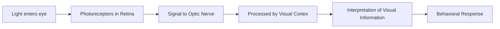

# Animal Visual System - Notes

## Table of Contents (ToC)
  - [1. **Introduction**](#1-introduction)
  - [3. **Functional Overview**](#3-functional-overview)
  - [4. **Process and Mechanisms**](#4-process-and-mechanisms)
  - [5. **Comparison and Types**](#5-comparison-and-types)
  - [6. **Real-world Examples**](#6-real-world-examples)
  - [7. **Practical Exercises**](#7-practical-exercises)
  - [8. **Tools \& Resources**](#8-tools--resources)
  - [9. **Continuous Learning Pathways**](#9-continuous-learning-pathways)
  - [10. **References**](#10-references)

## 1. **Introduction**  
The animal visual system refers to the biological processes and structures that allow animals to perceive and interpret visual information from their environment.

- Visual systems are vital for survival, helping animals navigate, find food, and avoid predators.
- Understanding these systems offers insights into evolution, adaptation, and neuroscience.
- Comparative studies reveal how different species have evolved specialized visual mechanisms.

## 2. **Key Concepts and Terminology**  
Important terms and ideas fundamental to understanding the animal visual system.

- **Photoreceptors**: Cells in the retina that detect light (rods for dim light, cones for color vision).
- **Optic Nerve**: Transmits visual information from the eye to the brain.
- **Fovea**: A small central pit in the retina that provides the sharpest vision.
- **Field of View**: The total area visible to an animal's eye, often different across species.
- **Visual Cortex**: Part of the brain that processes visual information.

## 3. **Functional Overview**  
A high-level explanation of how visual systems work in animals.

- Light enters the eye through the **cornea** and is focused by the **lens** onto the **retina**.
- **Photoreceptors** in the retina convert light into electrical signals.
- The **optic nerve** transmits signals to the **visual cortex** in the brain for interpretation.
- Different species have specialized structures (e.g., tapetum lucidum in nocturnal animals) to adapt to their environments.

## 4. **Process and Mechanisms**  
A step-by-step breakdown of how visual perception happens in animals.

- Light is focused by the **lens** onto the **retina**.
- **Photoreceptors** (rods and cones) detect light and convert it into neural signals.
- **Optic nerve** transmits these signals to the brain's **visual cortex**.
- The `brain` processes these signals to interpret color, depth, and motion.
  

## 5. **Comparison and Types**  
An overview of different visual systems across animal species.

- **Vertebrates** (e.g., humans, birds): Complex visual systems with cones and rods for color and light intensity.
- **Invertebrates** (e.g., insects): Compound eyes that detect motion and provide a wide field of view.
- **Nocturnal animals**: Often have a reflective layer (tapetum lucidum) that enhances night vision.
- **Predators vs. Prey**: Predators typically have binocular vision for depth perception, while prey have wider peripheral vision to detect threats.
  

## 6. **Real-world Examples**  
How the animal visual system operates in nature.

- **Eagles** have highly developed foveas, allowing them to see small prey from great distances.
- **Cats** have a tapetum lucidum, enhancing their night vision for hunting in low light.
- **Bees** can see ultraviolet light, allowing them to detect patterns on flowers invisible to the human eye.
- **Chameleons** can move their eyes independently, giving them a 360-degree field of view.

## 7. **Practical Exercises**  
Interactive tasks to deepen your understanding of the animal visual system.

- Compare how different animals perceive colors by researching their photoreceptor structures.
- Observe an animal's eye movement in relation to its environment (e.g., a bird scanning the horizon).
- Use a simple experiment with mirrors to understand how predators and prey benefit from different visual fields.

## 8. **Tools & Resources**  
Helpful tools and references for further exploration.

- **Books**: "Animal Eyes" by Michael F. Land and Dan-Eric Nilsson.
- **Videos**: YouTube channels such as **Vox Stoica** and **Veritasium** on animal perception.
- **Web Resources**: National Geographic and BBC documentaries on animal vision.
- **Simulators**: Online tools to simulate vision fields of different species (e.g., cats, birds, insects).

## 9. **Continuous Learning Pathways**  
Strategies for advancing your understanding of animal visual systems.

- Study comparative neurobiology to explore how different species process visual stimuli.
- Explore evolutionary biology to understand how visual systems have adapted across species.
- Participate in field studies or observations to see animal vision in action.
  

## 10. **References**  
Citations and additional reading for comprehensive understanding.

- Land, M. F., & Nilsson, D.-E. (2012). *Animal Eyes*. Oxford University Press.
- National Geographic. "Eyes of the Animal Kingdom."
- University of California, Berkeley: "The Evolution of Vision in the Animal Kingdom."
- TEDx Talk by Lila Landowski: "How Animals See the World."

