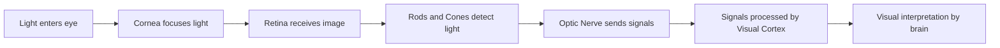

# Human Visual System - Notes

## Table of Contents (ToC)

  - [1. **Introduction**](#1-introduction)
  - [2. **Key Concepts and Terminology**](#2-key-concepts-and-terminology)
  - [3. **Functional Overview**](#3-functional-overview)
  - [4. **Process and Mechanisms**](#4-process-and-mechanisms)
  - [5. **Anatomy and Types**](#5-anatomy-and-types)
  - [6. **Real-world Examples**](#6-real-world-examples)
  - [7. **Practical Exercises**](#7-practical-exercises)
  - [8. **Tools \& Resources**](#8-tools--resources)
  - [9. **Continuous Learning Pathways**](#9-continuous-learning-pathways)
  - [10. **References**](#10-references)

## 1. **Introduction**  
The human visual system is a complex network of structures and processes that allow us to perceive and interpret visual stimuli from our environment.

- It plays a critical role in daily life, enabling us to understand our surroundings and make decisions.
- The system converts light into neural signals that the brain interprets to recognize objects, colors, and movements.
- Understanding this system is key to fields like neuroscience, medicine, and even artificial intelligence.

---

## 2. **Key Concepts and Terminology**  
Important terms that form the foundation for studying the human visual system.

- **Retina**: A light-sensitive layer at the back of the eye that contains photoreceptor cells.
- **Rods and Cones**: Photoreceptors responsible for detecting light intensity and color.
- **Optic Nerve**: A bundle of nerve fibers transmitting visual information from the retina to the brain.
- **Visual Cortex**: The part of the brain that processes visual information.
- **Fovea**: A small depression in the retina where visual acuity is highest.

---

## 3. **Functional Overview**  
A high-level explanation of how the human visual system works.

- Light enters the eye through the **cornea** and is focused by the **lens** onto the **retina**.
- **Photoreceptors** (rods and cones) in the retina detect light and convert it into electrical signals.
- The **optic nerve** transmits these signals to the **visual cortex** in the brain.
- The brain processes these signals to interpret shapes, colors, and motion, enabling us to form a coherent visual experience.

---

## 4. **Process and Mechanisms**  
A detailed explanation of how visual perception occurs in humans.

- **Rods** are responsible for low-light vision, while **cones** detect color.
- Light is focused on the **fovea**, where visual acuity is sharpest.
- Visual signals are sent to the **primary visual cortex** via the **optic nerve** for interpretation.

---

## 5. **Anatomy and Types**  
A deeper dive into the parts and variations of the human visual system.

- **Cornea**: The transparent layer that helps focus light onto the retina.
- **Lens**: Adjusts to focus light properly onto the retina.
- **Retina**: Contains layers of neurons that process visual signals.
- **Rods**: Detect black and white vision, critical for seeing in low light.
- **Cones**: Detect color vision, with three types sensitive to red, green, and blue light.

---

## 6. **Real-world Examples**  
How the human visual system functions in everyday scenarios.

- **Reading a book**: The eye continuously adjusts focus to interpret letters and words, with the fovea responsible for sharp vision.
- **Night vision**: At low light, the rods become more active, allowing us to see in dim conditions.
- **Peripheral vision**: Allows us to detect movement outside our direct line of sight, critical for sensing danger or changes in the environment.
- **Optical illusions**: Occur when the brain misinterprets visual cues, highlighting the complex processes involved in perception.

---

## 7. **Practical Exercises**  
Hands-on tasks to help solidify understanding of the human visual system.

- **Focus experiment**: Hold a small object at arm’s length and gradually move it toward your eyes. Notice how your lens adjusts.
- **Blind spot test**: Hold an image with a small dot on one side, cover one eye, and move the paper until the dot disappears, demonstrating the **optic disc** where no photoreceptors exist.
- **Color vision**: Explore how different wavelengths of light affect color perception by using colored filters or screens.

---

## 8. **Tools & Resources**  
Recommended tools and materials to further explore the human visual system.

- **Books**: "The Eye: Basic Sciences in Practice" by John V. Forrester and Andrew D. Dick.
- **Videos**: YouTube channels like **CrashCourse** and **Khan Academy** have detailed explanations of human biology and vision.
- **Websites**: Interactive simulators such as **Optics4Kids** to explore how light interacts with the eye.
- **Apps**: Augmented reality apps to simulate visual impairments or color blindness for deeper understanding.

---

## 9. **Continuous Learning Pathways**  
Steps to continue advancing knowledge on the human visual system.

- Study the impact of diseases like **glaucoma** or **macular degeneration** on vision.
- Investigate how visual processing changes across different stages of life (e.g., infancy, aging).
- Delve into fields like **neuroscience** and **ophthalmology** to understand how the brain and eyes work together.
  
---

## 10. **References**  
Sources and additional materials for further study.

- Forrester, J. V., & Dick, A. D. (2007). *The Eye: Basic Sciences in Practice*. Elsevier.
- Hubel, D. H., & Wiesel, T. N. (2004). *Brain and Visual Perception: The Story of a 25-Year Collaboration*. Oxford University Press.
- National Institutes of Health: "Understanding the Human Visual System."
- TED-Ed: "How We See: The First Steps of Human Vision."
