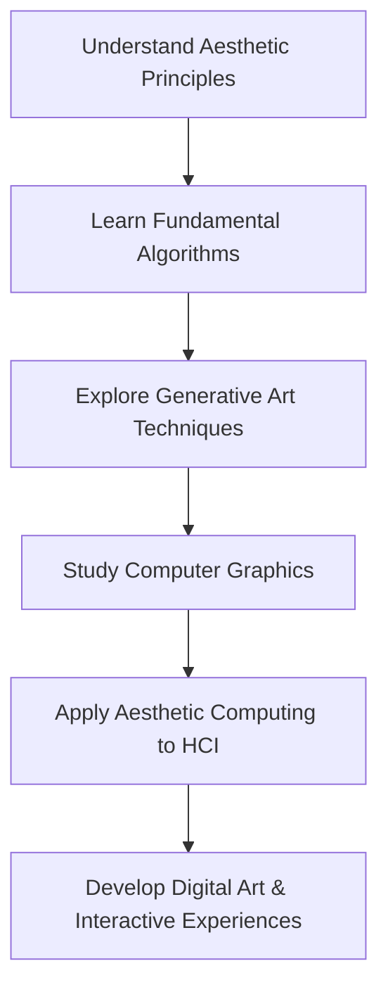

# Computer Science for Aesthetics - Notes

## Table of Contents (ToC)
- Introduction
- Key Concepts
- Why It Matters / Relevance
- Learning Map (Architecture Pipeline)
- Framework / Key Theories or Models
- How Computer Science for Aesthetics Works
- Methods, Types & Variations
- Self-Practice / Hands-On Examples
- Pitfalls & Challenges
- Feedback & Evaluation
- Tools, Libraries & Frameworks
- Hello World! (Practical Example)
- Advanced Exploration
- Zero to Hero Lab Projects
- Continuous Learning Strategy
- References

---

## Introduction
- **Computer science for aesthetics** explores how computational algorithms and technologies can be applied to enhance or create aesthetically pleasing forms, focusing on digital art, visual design, and interactive experiences.

## Key Concepts
- **Aesthetic Computing**: The integration of computational techniques into the design and development of aesthetically oriented digital systems.
- **Generative Art**: Art created using autonomous systems, often powered by algorithms.
- **Digital Aesthetics**: The study of how aesthetic principles apply to digital creations such as websites, applications, and 3D environments.
- **Common Misconception**: Aesthetics in computer science is limited to visuals—it's also about user experience, interaction, and emotional responses.

## Why It Matters / Relevance
- **Art & Creativity**: Expands the boundaries of traditional art, enabling new forms like digital painting, animation, and 3D modeling.
- **User Experience (UX)**: Aesthetic principles are crucial for designing intuitive and enjoyable software interfaces.
- **Human-Computer Interaction (HCI)**: Aesthetics influence how users engage with and interpret digital environments.
- **Gaming Industry**: Aesthetic computing is central to the creation of immersive worlds in video games and virtual reality.
- **Media & Entertainment**: Advances in computer graphics and design tools enable visually stunning media productions.

## Learning Map (Architecture Pipeline)

- **Understand Aesthetic Principles**: Learn how color theory, symmetry, and composition influence digital design.
- **Fundamental Algorithms**: Study the algorithms used in procedural art, graphics, and optimization for visual appeal.
- **Generative Art Techniques**: Explore methods to automate the creation of art using code.
- **Computer Graphics**: Dive into rendering, animation, and 3D modeling.
- **Aesthetic Computing in HCI**: Integrate aesthetics into interfaces for more engaging user experiences.

## Framework / Key Theories or Models
- **Algorithmic Aesthetics**: The study of algorithms that produce aesthetically pleasing results, such as fractals or procedural generation.
- **Gestalt Principles**: Cognitive principles used to create designs that are visually coherent and appealing, focusing on perception.
- **Procedural Generation**: A method used in digital art and game design where content (shapes, textures, landscapes) is generated algorithmically.
- **Interactive Aesthetic Systems**: These systems adapt to user input, creating dynamic and customizable aesthetic experiences in real time.
- **Computational Creativity**: Explores how machines can emulate or enhance creative processes to produce aesthetic works.

## How Computer Science for Aesthetics Works
1. **Step 1**: Understand aesthetic principles like balance, harmony, and color theory.
2. **Step 2**: Use algorithms (e.g., L-systems, cellular automata) to generate aesthetically pleasing forms.
3. **Step 3**: Leverage tools like computer graphics libraries (e.g., OpenGL, Blender) to create and render digital art.
4. **Step 4**: Design interactive environments where aesthetics evolve based on user actions or input.
5. **Step 5**: Test and refine digital creations by evaluating their aesthetic and functional qualities using both automated and user feedback.

## Methods, Types & Variations
- **Generative Art**: Creating art using code, such as fractal art or algorithmically generated landscapes.
  - Example: Processing, p5.js, or Blender for procedural art.
- **Digital Art**: Using software tools like Photoshop, Illustrator, or Krita for drawing and design.
  - Example: Vector-based illustrations or digital painting.
- **Game Design**: Creating aesthetically rich environments using engines like Unity or Unreal Engine.
  - Example: A procedurally generated landscape in a video game.
- **Contrasting Examples**: Static digital art vs. dynamic interactive systems.

## Self-Practice / Hands-On Examples
1. **Create Generative Art**: Use p5.js or Processing to write an algorithm that generates a unique art piece every time it runs.
2. **Optimize a Website's Aesthetic**: Use CSS and HTML to improve the visual appeal of a simple webpage, applying principles like symmetry and color harmony.
3. **Design a 3D Model**: Use Blender to create and render a 3D object or scene with attention to aesthetic details.
4. **Interactive Art**: Build a simple interactive artwork using JavaScript or a game engine that changes based on user input.
5. **Algorithmic Experimentation**: Experiment with fractals (e.g., Mandelbrot set) and see how mathematical equations generate intricate, aesthetically pleasing patterns.

## Pitfalls & Challenges
- **Balancing Aesthetics and Functionality**: Overemphasis on visuals can compromise user experience and usability.
- **Algorithm Complexity**: Creating aesthetically pleasing generative art may require complex algorithms, which can be hard to optimize.
- **Cultural Differences**: Aesthetic preferences vary widely across cultures, making it challenging to design universally appealing systems.
- **Suggestion**: Focus on simplicity and user-centered design, and iterate through user testing to refine your aesthetic approach.

## Feedback & Evaluation
1. **Feynman Test**: Explain how a computer algorithm can create aesthetically pleasing patterns to someone unfamiliar with the topic.
2. **Peer Review**: Share a digital creation (e.g., generative art, interface design) with peers and get feedback on its aesthetic and functional quality.
3. **Real-World Simulation**: Test how users interact with an aesthetic system, and evaluate their emotional and cognitive responses.

## Tools, Libraries & Frameworks
- **Processing/p5.js**: Programming environments for creating visuals and generative art.
  - **Pros**: Beginner-friendly, great for quick visual sketches.
  - **Cons**: Limited in scope for complex applications.
- **Blender**: A powerful open-source tool for 3D modeling and animation.
  - **Pros**: Feature-rich, community-supported.
  - **Cons**: Steep learning curve for beginners.
- **OpenFrameworks**: A C++ toolkit for creative coding and interactive visuals.
  - **Pros**: High performance, flexible.
  - **Cons**: Requires more coding experience.

## Hello World! (Practical Example)
- **Create a Basic Generative Art Program**:
1. Using **p5.js**, write a simple program that generates randomized patterns based on user input.
   - Example: A series of circles that change size and color based on the mouse’s position.
   ```javascript
   function setup() {
       createCanvas(400, 400);
       noLoop();
   }

   function draw() {
       background(220);
       for (let i = 0; i < 10; i++) {
           let x = random(width);
           let y = random(height);
           let diameter = random(10, 100);
           let r = random(255);
           let g = random(255);
           let b = random(255);
           fill(r, g, b);
           noStroke();
           ellipse(x, y, diameter, diameter);
       }
   }

   function mousePressed() {
       redraw();
   }
   ```
   - **Explanation**: This program generates circles of random size and color on the canvas. When the mouse is pressed, a new pattern is generated, introducing interactive aesthetics.

## Advanced Exploration
- **1. "The Algorithmic Beauty of Plants" by Przemyslaw Prusinkiewicz**: Explore how L-systems (a formal grammar) are used to simulate plant growth and other natural forms, commonly used in aesthetic computing.
- **2. "Aesthetic Computing" by Paul A. Fishwick**: This book discusses how aesthetic principles apply to computational design and interactive systems.
- **3. Generative Art Blog by Tyler Hobbs**: A resource for learning about generative art principles and viewing cutting-edge examples.

## Zero to Hero Lab Projects
- **Beginner**: Create a simple interactive generative art piece using p5.js that reacts to user input, such as mouse movement or keyboard presses.
- **Intermediate**: Develop a 3D digital sculpture using Blender that applies aesthetic principles like symmetry and proportion.
- **Advanced**: Build an interactive web-based gallery using WebGL or Three.js where users can navigate through procedurally generated environments, adjusting the aesthetic elements in real-time.

## Continuous Learning Strategy
- **Next Steps**: After grasping the basics of aesthetic computing, explore topics like **procedural generation**, **advanced computer graphics**, and **interactive art installations**.
- **Related Topics**: Dive into fields such as **augmented reality (AR)**, **virtual reality (VR)**, and **UX/UI design**, all of which leverage aesthetic computing to enhance user experiences.

## References
- **Processing Foundation**: [https://processing.org/](https://processing.org/)
- **Blender**: [https://www.blender.org/](https://www.blender.org/)
- **"The Algorithmic Beauty of Plants"**: A foundational resource for understanding the intersection of nature and computational aesthetics.

