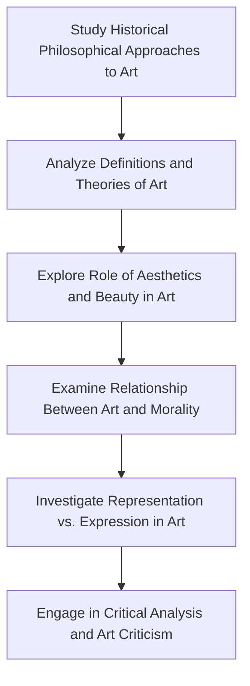

# Philosophy of Art - Notes

## Table of Contents (ToC)
- Introduction
- Key Concepts
- Why It Matters / Relevance
- Learning Map (Architecture Pipeline)
- Framework / Key Theories or Models
- How Philosophy of Art Works
- Methods, Types & Variations
- Self-Practice / Hands-On Examples
- Pitfalls & Challenges
- Feedback & Evaluation
- Tools, Libraries & Frameworks
- Hello World! (Practical Example)
- Advanced Exploration
- Zero to Hero Lab Projects
- Continuous Learning Strategy
- References

---

## Introduction
- **Philosophy of art** explores fundamental questions about the nature of art, beauty, and creative expression, addressing how we define, interpret, and value artistic works.

## Key Concepts
- **Art**: A diverse range of human activities involving creative expression, often associated with visual, auditory, or performative works.
- **Aesthetics**: The study of beauty and taste, central to understanding art.
- **Representation**: How art mimics or interprets reality.
- **Expression**: The emotions or ideas conveyed through art.
- **Common Misconception**: Art is purely subjective—while interpretations vary, philosophical frameworks guide how art is critically evaluated.

## Why It Matters / Relevance
- **Cultural Insight**: Art reflects and shapes cultural values, providing insight into societal changes, beliefs, and histories.
- **Ethical Reflection**: The philosophy of art can challenge moral views and offer new perspectives on ethical dilemmas.
- **Art Criticism**: Enables a deeper, more nuanced approach to evaluating and appreciating artistic works.
- **Art Creation**: Philosophical principles guide artists in developing and refining their creative processes.
- **Museology**: Philosophy of art helps curators and historians preserve, interpret, and display art in ways that respect its cultural significance.

## Learning Map (Architecture Pipeline)

- **Study Historical Approaches**: Learn about classical to modern thinkers on art (Plato, Aristotle, Kant, Hegel).
- **Definitions & Theories**: Understand major philosophical definitions like "art as imitation" and "art as expression."
- **Aesthetics & Beauty**: Investigate how these concepts have evolved over time and their centrality to art.
- **Art and Morality**: Examine how art can challenge or reinforce moral ideas.
- **Representation vs. Expression**: Explore the tension between art as representing reality vs. art as emotional expression.

## Framework / Key Theories or Models
- **Mimesis (Plato, Aristotle)**: Art as imitation of reality. Plato was skeptical, believing art distorts truth, while Aristotle saw it as a medium for catharsis.
- **Art as Expression (Romanticism)**: Emphasizes the artist's emotional output. Artists convey inner experiences and emotions through their works.
- **Formalism (Clive Bell, Roger Fry)**: Focuses on the form and composition of art, rather than its content or emotional effect.
- **Institutional Theory of Art (George Dickie)**: Art is defined by its context within the "artworld" — if experts and institutions deem something art, then it is.
- **Aesthetic Autonomy**: The belief that art should be judged purely on its own terms and not be reduced to moral, political, or utilitarian functions.

## How Philosophy of Art Works
- **Step 1**: Define what constitutes art, considering historical and modern perspectives.
- **Step 2**: Analyze the work using key philosophical frameworks (e.g., mimesis, formalism, expressionism).
- **Step 3**: Examine how the art piece relates to aesthetic principles like beauty, balance, and harmony.
- **Step 4**: Consider the role of the artist's intention and the audience's interpretation.
- **Step 5**: Engage in critique, evaluating the work based on philosophical criteria like form, content, emotional impact, and cultural significance.

## Methods, Types & Variations
- **Representational Art**: Art that aims to depict reality (e.g., realistic paintings, sculptures).
  - Example: **The School of Athens** by Raphael.
- **Abstract Art**: Focuses on form, color, and shapes without direct reference to reality.
  - Example: **Composition VII** by Wassily Kandinsky.
- **Performative Art**: Includes actions or events presented to an audience.
  - Example: Marina Abramović’s **The Artist is Present**.
- **Contrasting Examples**: Classical art (emphasis on realism) vs. Modern art (emphasis on abstraction or innovation).

## Self-Practice / Hands-On Examples
1. **Art Critique**: Visit an art exhibition or museum and write a philosophical critique of one artwork, using theories like mimesis or formalism.
2. **Create a Representation**: Draw or paint a scene, focusing on how your work represents reality or distorts it for emotional effect.
3. **Interpret Abstract Art**: View an abstract piece of art and explain its aesthetic and emotional qualities through the lens of formalism.
4. **Explore Performance Art**: Watch or participate in a performative piece and consider its emotional, ethical, and aesthetic implications.
5. **Write a Manifesto**: Draft a personal philosophy of what art means to you and the principles that guide your creative or evaluative process.

## Pitfalls & Challenges
- **Defining Art**: There is no universally agreed-upon definition of art, making philosophical exploration complex.
- **Subjectivity vs. Objectivity**: Balancing personal taste with philosophical standards can be difficult.
- **Cultural Bias**: Philosophical judgments of art may not always account for cultural diversity in artistic expression.
- **Suggestion**: Engage with art from multiple cultures and eras to expand your understanding and reduce bias.

## Feedback & Evaluation
1. **Feynman Test**: Explain to a friend why an artwork is significant, using a philosophical approach (e.g., mimesis or formalism).
2. **Peer Review**: Present an art critique or artwork and receive feedback from peers on both your philosophical insights and artistic interpretation.
3. **Application in Real Life**: Apply philosophical frameworks to new forms of media, like film or digital art, and assess the impact of those frameworks.

## Tools, Libraries & Frameworks
- **Artstor**: A digital library of images and academic resources that provides access to high-quality art references.
- **JSTOR**: A digital library that includes research papers on art theory and aesthetics.
- **Google Arts & Culture**: Provides virtual museum tours and educational resources about various art forms.
- **Pros & Cons**: Artstor and JSTOR are valuable for academic research, while Google Arts & Culture offers a more casual, visual exploration of art.

## Hello World! (Practical Example)
- **Write an Art Critique**:
1. Choose a well-known painting, such as **Van Gogh’s Starry Night**.
2. Analyze the work using **formalism**, focusing on its use of color, shape, and texture rather than subject matter.
3. Reflect on how this approach impacts your perception of the painting.

## Advanced Exploration
- **Book**: “The Artworld” by Arthur Danto – A seminal text on how the artworld defines what art is.
- **Video**: “Why Beauty Matters” – A documentary exploring the importance of beauty in art and culture.
- **Article**: “What is Art?” by Leo Tolstoy – A famous essay that critiques institutional and elitist definitions of art.

## Zero to Hero Lab Projects
- **Beginner**: Critically analyze a local art exhibit or a piece of street art, using one or more philosophical frameworks.
- **Intermediate**: Curate a virtual art gallery based on a theme (e.g., art as expression) and write an exhibition essay that applies philosophical theories.
- **Advanced**: Produce an artwork (visual, digital, or performative) that intentionally challenges conventional definitions of art, drawing on institutional or modernist theories.

## Continuous Learning Strategy
- Study **aesthetics** more deeply, especially as it relates to non-visual arts like music or literature.
- Investigate **art history** to understand how philosophical debates have shaped the evolution of art.
- Explore **contemporary debates** around digital and AI-generated art, which challenge traditional notions of creativity and artistic value.

## References
- **Book**: “Art and its Objects” by Richard Wollheim – A comprehensive overview of philosophical questions regarding the nature of art.
- **Website**: Stanford Encyclopedia of Philosophy – Detailed entries on aesthetics, art, and related topics.
- **Paper**: “The Work of Art in the Age of Mechanical Reproduction” by Walter Benjamin – A critical examination of art in the context of technological reproduction.