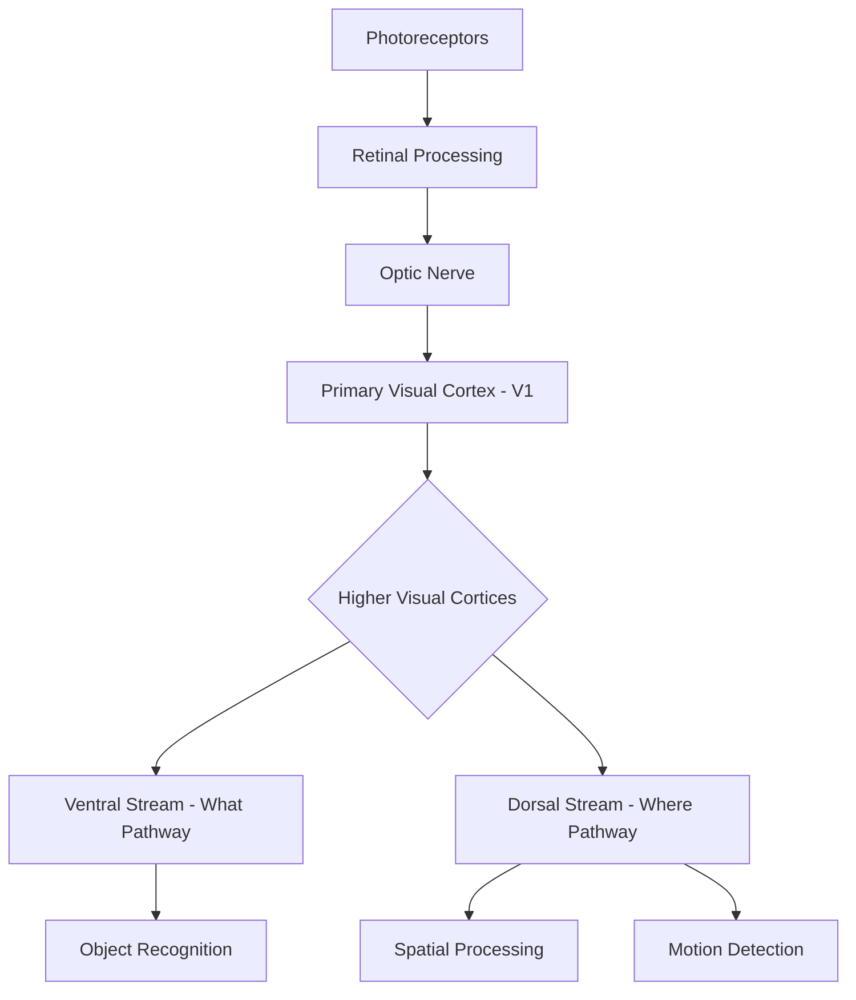

# **Vision Science - Notes**

## **Table of Contents**
- [Introduction](#introduction)
- [Key Concepts](#key-concepts)
- [Applications](#applications)
- [Related Notes](#related-notes)
- [Vision Science Architecture Pipeline](#vision-science-architecture-pipeline)
- [Theories & Models of Vision](#theories--models-of-vision)
- [How Vision Science Works](#how-vision-science-works)
- [Types of Vision Processing](#types-of-vision-processing)
- [Practical Exercises](#practical-exercises)
- [Challenges & Limitations](#challenges--limitations)
- [Key Tools and Techniques](#key-tools-and-techniques)
- [Sample Code for Image Processing](#sample-code-for-image-processing)
- [Advanced Exploration](#advanced-exploration)
- [Zero to Hero Lab Projects](#zero-to-hero-lab-projects)
- [Continuous Learning Strategy](#continuous-learning-strategy)
- [References](#references)

---

## **Introduction**

[Vision Science](https://en.wikipedia.org/wiki/Vision_science) is the interdisciplinary study of how visual systems, particularly human vision, process and interpret visual information to create our perception of the world.

---

### **Key Concepts**
- **Photoreceptors**: Specialized cells in the retina that convert light into electrical signals; include rods (for low-light vision) and cones (for color vision).
- **Visual Cortex**: Brain regions responsible for processing visual information, primarily located in the occipital lobe.
- **Perception and Interpretation**: Processes that allow us to recognize, categorize, and interact with our environment.
- **Top-Down and Bottom-Up Processing**: Bottom-up processes use raw sensory input, while top-down processing incorporates memory and expectations to interpret sensory data.
- **Visual Pathways**: Key pathways like the ventral ("what") and dorsal ("where") streams that facilitate object recognition and spatial awareness.

---

### **Applications**
- **Neuroscience**: Understanding the brain's visual processing mechanisms.
- **Medical Imaging**: Enhancing diagnostic tools in fields like ophthalmology and radiology.
- **Artificial Vision**: Informing computer vision and artificial intelligence for autonomous systems.
- **Rehabilitation**: Aiding in treatment for vision impairments and developing assistive technologies.
- **Psychology and Cognitive Science**: Exploring perception, attention, and visual memory.

---

## Related Notes
- [Cognitive Science](../../ai/cognitive-science/)

## **Vision Science Architecture Pipeline**



---

## **Theories & Models of Vision**
1. **Trichromatic Theory**: Proposes that three types of cones (sensitive to red, green, and blue light) enable color perception.
2. **Opponent Process Theory**: Color vision is processed in opposing pairs (e.g., red-green, blue-yellow).
3. **Gestalt Principles**: Explains how visual elements are grouped for interpretation (e.g., proximity, similarity, closure).
4. **Feature Integration Theory**: Suggests that individual features of objects are first processed separately and then combined for recognition.
5. **Dual Stream Hypothesis**: Describes the dorsal (motion/spatial) and ventral (object recognition) pathways in visual processing.

---

## **How Vision Science Works**
- **Light Detection**: Light enters the eye and strikes photoreceptors in the retina, initiating neural signals.
- **Initial Processing in the Retina**: Signals are processed by retinal cells and passed via the optic nerve.
- **Primary Visual Cortex (V1)**: Receives information from the optic nerve; initial decoding of visual cues like orientation, edges, and contrast.
- **Higher Visual Processing**: Visual information passes through the dorsal and ventral streams for higher-level interpretation (e.g., recognizing faces, tracking movement).

---

## **Types of Vision Processing**
1. **Color Vision**: Uses cone photoreceptors and is explained by trichromatic and opponent-process theories.
2. **Depth Perception**: Combines binocular disparity and monocular cues to perceive spatial depth.
3. **Motion Detection**: Interpreted primarily in the dorsal stream, crucial for perceiving movement in the environment.
4. **Edge Detection**: Processes boundaries and shapes, fundamental for recognizing objects.
5. **Pattern Recognition**: Higher-level processing that allows for identification of complex shapes, faces, and objects.

---

## **Practical Exercises**
1. **Edge Detection**: Implement Sobel filters to detect edges in a grayscale image.
2. **Color Space Conversion**: Convert RGB images to different color spaces (e.g., HSV, Lab) and examine color channel variations.
3. **Depth Perception Simulation**: Use stereoscopic images to create a depth perception effect.
4. **Face Detection**: Train a simple model to detect faces within images.
5. **Motion Tracking**: Use video feed to implement optical flow for tracking moving objects.

---

### **Challenges & Limitations**
- **Complexity of Visual Processing**: Vision involves simultaneous processing of many visual features, challenging to replicate in artificial systems.
- **Lighting and Environmental Variability**: Vision systems are sensitive to light conditions, leading to inconsistent results in different settings.
- **Data Requirements**: Advanced vision models require substantial training data to achieve high accuracy in object and pattern recognition.
- **Computational Resources**: Real-time processing for vision tasks, especially with high-resolution images, demands significant processing power.
- **Perceptual Ambiguity**: The brain interprets incomplete or ambiguous information to create coherent perception, challenging for artificial systems to mimic.

---

## **Key Tools and Techniques**
- **Image Processing Libraries**: OpenCV, scikit-image, and PIL for handling and manipulating images.
- **Computer Vision Frameworks**: TensorFlow, PyTorch, and Keras for developing machine learning-based vision models.
- **Visualization Tools**: Matplotlib and Seaborn for visualizing visual data and image transformations.
- **Depth Sensing Technologies**: LIDAR, stereo cameras, and time-of-flight sensors for depth and spatial analysis.
- **Optical Flow Techniques**: Algorithms like Lucas-Kanade and Farneback for motion tracking.

---

## **Sample Code for Image Processing: Edge Detection Using Sobel Filter**

```python
import cv2
import numpy as np
import matplotlib.pyplot as plt

def apply_sobel_filter(image_path):
    # Load the image in grayscale
    img = cv2.imread(image_path, cv2.IMREAD_GRAYSCALE)
    
    # Apply Sobel filter for edge detection
    sobel_x = cv2.Sobel(img, cv2.CV_64F, 1, 0, ksize=5)
    sobel_y = cv2.Sobel(img, cv2.CV_64F, 0, 1, ksize=5)
    sobel_combined = cv2.sqrt(cv2.addWeighted(sobel_x**2, 0.5, sobel_y**2, 0.5, 0))
    
    # Plotting the result
    plt.figure(figsize=(10,5))
    plt.subplot(1, 2, 1)
    plt.title("Original Image")
    plt.imshow(img, cmap='gray')
    
    plt.subplot(1, 2, 2)
    plt.title("Sobel Edge Detection")
    plt.imshow(sobel_combined, cmap='gray')
    plt.show()

# Test the function
apply_sobel_filter('path_to_image.jpg')
```

---

## **Advanced Exploration**
1. **Hierarchical Vision Models**: Study neural networks designed based on the hierarchical structure of the visual cortex.
2. **Optogenetics**: Explore research on stimulating neurons with light to understand vision pathways.
3. **Comparative Vision Across Species**: Investigate how visual systems differ in animals and what this reveals about human vision.

---

## **Zero to Hero Lab Projects**
1. **Build an Object Recognition Model**: Develop and train a convolutional neural network to classify objects.
2. **Motion Detection and Tracking**: Implement an optical flow-based tracker to detect and follow moving objects.
3. **Color Segmentation Application**: Develop an application that identifies and tracks a specific color in real-time video feeds.

---

## **Continuous Learning Strategy**
- **Engage in Image Processing Challenges**: Platforms like Kaggle have vision-related challenges to improve your practical skills.
- **Study Research Papers**: Reading recent studies in journals like *Vision Research* or *Journal of Vision* can provide insights into the latest developments.
- **Deepen Machine Learning Knowledge**: Many advanced vision models are based on machine learning; expanding your knowledge in this area will enhance your skills in vision science.

---

## **Summary**

This approach to Vision Science provides a detailed pathway for understanding both human visual processing and applications within technology, with practical examples and resources for advanced learners.

## **References**

**Wikipedia**: 
- https://en.wikipedia.org/wiki/Category:Vision
- https://en.wikipedia.org/wiki/Vision_science
- https://en.wikipedia.org/wiki/Category:Vision_scientists


**Vision Journals**: 
- [*Vision Research*](https://www.sciencedirect.com/journal/vision-research)
- [*Journal of Vision*](https://jov.arvojournals.org/)
- [*Current Biology*](https://www.cell.com/current-biology/home)
    - [Vision](https://www.cell.com/action/doSearch?type=quicksearch&text1=vision&field1=AllField&journalCode=curbio&SeriesKey=curbio)   

  
**Vision Science Research Labs**:

- [Harvard - Vision Lab](https://visionlab.harvard.edu/)
- [Stanford - Vision Science](https://psychology.stanford.edu/research/vision-science)
- [Berkeley Vision Science](https://vision.berkeley.edu)
    - [Gerald Westheimer, OD, PhD, FAAO](https://optometry.berkeley.edu/people/gerald-westheimer-od-phd-faao/)
- [MIT CSAIL - Vision Group](https://www.csail.mit.edu/research/vision-group)
- [Oxford - Vision Science](https://www.psy.ox.ac.uk/research/perception-lab/ox/oxvis)
  - [ERGO - Eye Research Group  Oxford](https://eyeresearchoxford.org.uk/)
- [Cambridge - Vision](https://www.cam.ac.uk/topics/vision)
  - Lab:
    - https://vision.psychol.cam.ac.uk/
    - https://cambridgebrc.nihr.ac.uk/expandables/cambridge-clinical-vision-laboratory-ccvl/
    - https://www.bohndieklab.org/
- [University of Toronto - Department of Ophthalmology & Vision Sciences](https://ophthalmology.utoronto.ca/)
- [University of Waterloo - Optometry & Vision Science](https://uwaterloo.ca/optometry-vision-science/)    

**Books**:

- [Animal Eyes: How Creatures See and How Their Eyes Have Adapted to Their World - Francoise Vulpe](https://www.amazon.fr/Animal-Eyes-Creatures-Their-Adapted/dp/0228104130)
- [*Vision Science: Photons to Phenomenology* by Stephen E. Palmer](https://mitpress.mit.edu/9780262161831/vision-science/)
- [*An Introduction to the Visual System* by Martin J. Tovée](https://www.cambridge.org/core/books/an-introduction-to-the-visual-system/2BE67A22586CDC90AF668D67869C63B4)

**Papers**:

- todo